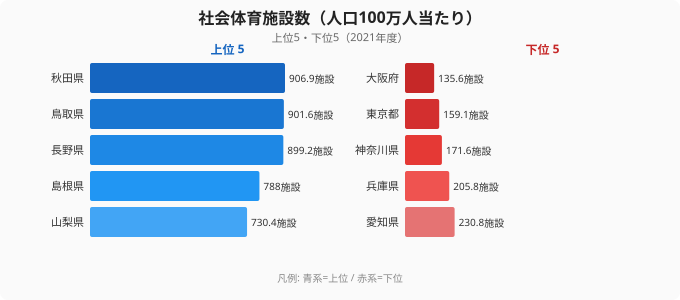
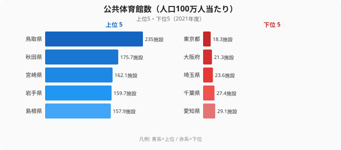
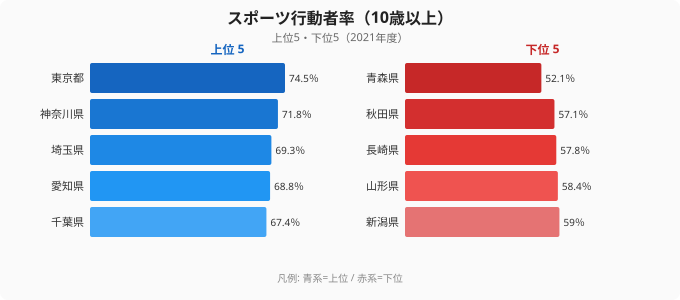

「スポーツ施設が多い県ほど、住民はよく運動しているはず」と思っていませんか。2021年度の社会体育施設数を人口100万人当たりで見ると、秋田県の906.9施設に対し大阪府は135.6施設で、約7倍の開きがあります。ところが実際にスポーツをした人の割合（スポーツ行動者率）は、施設が少ない都市部のほうが高いのです。施設の「量」と運動習慣がなぜ一致しないのか、都道府県データで読み解いていきます。

## 社会体育施設は地方が圧倒的に充実している

人口100万人当たりの社会体育施設数を都道府県でランキングすると、上位には秋田県（906.9施設）、鳥取県（901.6施設）、長野県（899.2施設）、島根県（788施設）、山梨県（730.4施設）と、人口の少ない地方県が並びます。施設の絶対数は多くなくても、分母となる人口が小さいため、1人当たりに直すと環境が充実して見えます。

一方で下位は[大阪府](/areas/27000)（135.6施設）、[東京都](/areas/13000)（159.1施設）、神奈川県（171.6施設）、兵庫県（205.8施設）、愛知県（230.8施設）と大都市圏が占めます。人口密度が高い地域では用地の確保が難しく、人口の増加に施設整備が追いついていないのが実情です。秋田県と大阪府を比べると、人口100万人当たりでは約7倍もの差が生まれています。

> [!NOTE]
> ここでいう「社会体育施設」は、公共が設置・管理するスポーツ施設（体育館・武道場・水泳プール・グラウンド等）を指します。民間フィットネスクラブや民間ゴルフ場は含みません。都市部の数字が小さく見える背景には、民間施設が公共施設を補完している事情がある点に注意してください。

<source-link href="/ranking/community-sports-facility-count-per-million">社会体育施設数（人口100万人当たり）のランキングをもっと見る</source-link>

## 体育館数で見ても同じ顔ぶれが上位に並ぶ

施設種別を絞って公共体育館だけを見ても、地方優位の構図は変わりません。人口100万人当たりの公共体育館数は、鳥取県（235施設）が突出して多く、続いて秋田県（175.7施設）、宮崎県（162.1施設）、岩手県（159.7施設）、島根県（157.9施設）が上位に入ります。社会体育施設全体の上位と顔ぶれが重なり、地方では体育館という基幹施設が人口比で手厚く整備されてきたことがわかります。

下位は東京都（18.3施設）、大阪府（21.3施設）、埼玉県（23.6施設）、千葉県（27.4施設）、愛知県（29.1施設）です。鳥取県と東京都を比べると人口100万人当たりで10倍を超える開きがあり、社会体育施設全体で見たとき以上に、体育館では都市と地方のコントラストがはっきりします。都市部では学校体育館の一般開放や民間施設が役割を担っているため、純粋な公共体育館の数だけでは運動環境の全体像をとらえきれない点には留意が必要です。

> [!WARNING]
> このランキングは「人口100万人当たり」の数値です。施設の絶対数では北海道や東京都が上位に来るため、絶対数の感覚で順位を読むと逆の印象を持ってしまいます。1人当たりで充実している県と、施設の総数が多い県は必ずしも一致しません。

<source-link href="/ranking/public-gymnasium-count-per-million">公共体育館数（人口100万人当たり）のランキングをもっと見る</source-link>

## 施設が多い県ほど運動する、とは限らない

ここで本題です。人口当たりの施設が多い県の住民は、実際によく運動しているのでしょうか。スポーツ行動者率（過去1年間に何らかのスポーツをした10歳以上の人の割合）を見ると、その答えは直感と食い違います。

スポーツ行動者率の上位は[東京都](/areas/13000)（74.5%）、神奈川県（71.8%）、埼玉県（69.3%）、愛知県（68.8%）、千葉県（67.4%）と、いずれも人口当たりの施設数では下位だった都市部が占めます。これらの地域では民間フィットネスクラブや商業スポーツ施設が充実しており、公共施設に頼らずに運動できる環境が整っているためと考えられます。

逆に、施設が人口比で最も充実していた[秋田県](/areas/05000)はスポーツ行動者率57.1%、青森県は52.1%と全国最下位クラスにとどまります。施設の数が多いのに運動する人の割合は低い、という逆転が起きているのです。背景には高齢化率の高さや、冬季の積雪・寒冷といった気候条件が運動習慣を抑えている可能性があります。つまり、社会体育施設の人口比ランキングと、スポーツ行動者率のランキングは、上位と下位がほぼ入れ替わる関係になっています。

> [!TIP]
> 「施設が多い＝運動が盛ん」と読み替えないことが、このデータを正しく使うコツです。人口当たりの施設数は供給側の指標、スポーツ行動者率は需要側（実際の行動）の指標で、両者は別物として見る必要があります。地域の運動環境を評価するなら、施設の量だけでなく行動者率も併せて確認してください。

<source-link href="/ranking/sports-annual-participation-rate-10plus">スポーツ行動者率（10歳以上）のランキングをもっと見る</source-link>

なぜ施設の量と運動の実態がここまでずれるのでしょうか。一つの見方は、運動を後押しするのは施設の「数」ではなく、通いやすさ・プログラム・費用・人口構成といった条件だという考え方です。都市部は施設1つ当たりの利用者が多くても、駅近のアクセスや多様な民間サービス、若い人口構成によって行動者率を押し上げています。地方は施設に恵まれていても、高齢化と移動の負担が利用を抑え、結果として行動者率が伸びにくいのです。

> [!WARNING]
> スポーツ行動者率と人口当たり施設数の間に明確な正の相関が見られないことは、[仮説]「施設の量よりアクセス・プログラム・費用・人口構成が運動行動を規定している」可能性を示唆します。ただしここで示したのは2つの指標の対比であり、因果関係を確定するには年齢構成などを統制した別の検証が必要です。

## まとめ

スポーツ施設と運動環境のデータから見えてきたポイントを整理します。

- 社会体育施設数（人口100万人当たり）の1位は秋田県の906.9施設で、最下位の大阪府135.6施設とは約7倍の開きがあります。
- 公共体育館数（人口100万人当たり）でも鳥取県235施設が突出し、東京都18.3施設との差はさらに大きくなります。
- 上位は秋田・鳥取・長野・島根といった地方県、下位は大阪・東京・神奈川といった大都市圏という構図が、施設全体でも体育館でも共通しています。
- ところがスポーツ行動者率は東京都74.5%が最も高く、施設が充実した秋田県は57.1%にとどまり、施設の量と運動習慣が逆転しています。
- 住民の運動を促すには、施設の「量」を増やすだけでなく、アクセスやプログラムといった「質」と、高齢化など地域の人口構成への対応が欠かせません。

人口減少が進む地方では、人口比で手厚い公共スポーツ施設をどう維持するかが今後の課題になります。一方で、施設を増やせば運動する人が増えるという単純な関係は成り立たないことを、このデータは示しています。運動環境を本当に良くするには、施設の数という一面だけでなく、人々が実際に体を動かせる条件をあわせて考える必要があります。

## データ出典

- 社会生活統計指標・社会教育調査（e-Stat 政府統計の総合窓口、2021年度）
- 本記事の対象カテゴリ: [スポーツ・教育の統計一覧](/category/tourism)
