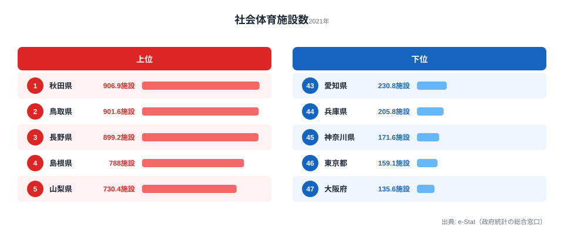
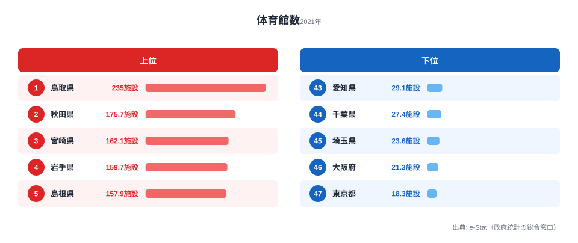
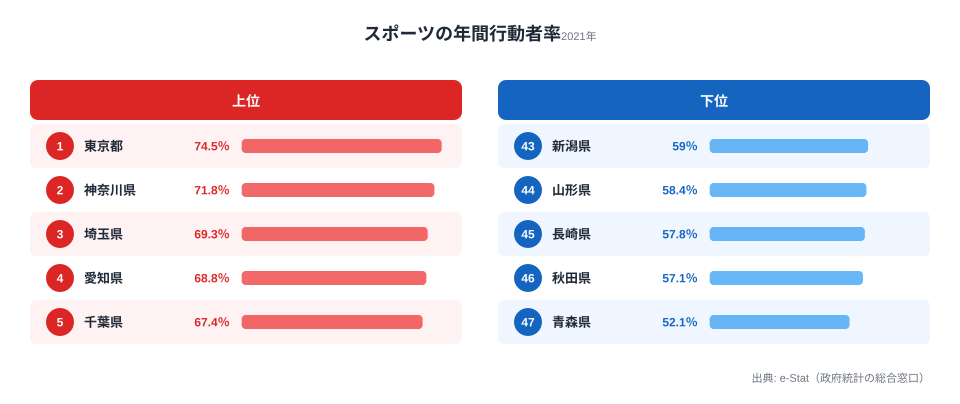

人口100万人あたりの公共スポーツ施設数は、秋田県の906.9に対し大阪府は135.6。約6.7倍の格差があります。住む場所で運動環境はこれほど違います。一方で「施設が多い県ほど運動する」という単純な構図は成り立たず、スポーツ年間行動者率は施設が最も少ない東京都が全国1位です。都道府県別データで、施設の「量」と運動習慣のねじれた関係を明らかにします。

## 公共スポーツ施設ランキング -- 地方が圧倒的に充実、都市部は深刻な不足

人口100万人あたりの社会体育施設数を都道府県別にランキングすると、上位は秋田県（906.9）、鳥取県（901.6）、長野県（899.2）と地方県が占めます。いずれも人口が少ない県で、施設の絶対数は多くなくても人口比では充実しています。

一方、下位は[大阪府](/areas/27000)（135.6）、[東京都](/areas/13000)（159.1）、神奈川県（171.6）と大都市圏が並びます。なぜ大都市ほど少ないのでしょうか。最大の要因は用地確保の難しさです。地価が高く人口が密集する都市部では、体育館やグラウンドを新設するための広い土地を確保しづらく、限られた施設に多くの住民が集中するため人口比では薄まります。逆に地方県では、市町村合併前から各地区に体育館や運動公園が整備されてきた経緯があり、人口が減っても施設は残るため、人口100万人あたりの数値が押し上げられています。秋田と大阪の差が約6.7倍に開くのは、この「分母（人口）の差」と「分子（施設の歴史的蓄積）の差」が同時に効いているためです。

> [!NOTE]
> 「社会体育施設」は公共が設置・管理するスポーツ施設（体育館・武道場・水泳プール・グラウンド等）を指し、民間フィットネスクラブやゴルフ場（民間）は含みません。都市部の施設数が人口比で少なく見える理由の一つは、こうした民間施設が公共施設の役割を補完しているためで、「都市住民の運動環境が乏しい」と単純に読むのは誤りです。

<source-link href="/ranking/community-sports-facility-count-per-million">47都道府県の社会体育施設数（人口100万人あたり）ランキングをもっと見る</source-link>

## 全国分布で見るスポーツ施設の偏在

タイルグリッドマップで社会体育施設の「絶対数」の全国分布を見ると、人口比とは正反対の景色になります。絶対数では北海道（3,728施設）と東京都（2,229施設）が突出し、人口の多い都府県ほど施設数そのものは多いことがわかります。

つまり「施設が多い／少ない」という議論は、絶対数で語るか人口比で語るかで結論が逆転します。報道やランキングで「東京は施設が多い」と言うときは絶対数を、「東京は施設が足りない」と言うときは人口比を見ているのが実態です。住民一人ひとりにとっての使いやすさを問うなら人口比が、自治体の整備総量や維持コストを問うなら絶対数が、それぞれ適した指標になります。本記事では運動環境の格差を扱うため、原則として人口比で比較しています。

<source-link href="/ranking/social-sports-facility">47都道府県の社会体育施設数（総数）ランキングをもっと見る</source-link>

<ad-slot></ad-slot>

## 体育館に絞ると格差はさらに拡大 -- 鳥取は東京の12.8倍

施設種類のなかでも、もっとも基幹的な「体育館」だけを取り出すと、地域格差はさらに鮮明になります。人口100万人あたりの公共体育館数は、鳥取県の235に対し東京都はわずか18.3。その差は約12.8倍で、社会体育施設全体の6.7倍を大きく上回ります。

体育館でとりわけ差が開くのは、体育館が「小学校区や旧町村単位で1つ」という形で整備されてきた歴史を持つためです。市町村合併で行政区域が広がっても建物は残り、人口の少ない鳥取・秋田・宮崎では人口比の数値が極端に高くなります。対照的に大阪（21.3）や東京（18.3）では、巨大な人口を相対的に少数の大型体育館でカバーするため人口比が下がります。同じ「スポーツ施設」でも、体育館のように箱物の性格が強い施設ほど、過去の整備単位の名残が人口比に色濃く反映されるのです。

> [!TIP]
> ランキングを読むときは、施設の「種類」によって偏在のパターンが変わる点に注目してください。体育館のように箱物の性格が強い施設は旧町村単位の整備履歴が効いて地方が極端に有利になり、プールや運動公園など用地を要する施設では事情がやや異なります。一つの指標だけで「運動環境の良し悪し」を断じず、複数の施設種を併せて見るのが実態に近づくコツです。

<source-link href="/ranking/public-gymnasium-count-per-million">47都道府県の体育館数（人口100万人あたり）ランキングをもっと見る</source-link>

## 施設が多い県は本当に運動する？ -- スポーツ行動者率ランキング

人口あたり施設数が多い県の住民は、実際に運動しているのでしょうか。スポーツ年間行動者率（過去1年間にスポーツをした人の割合）を都道府県別に見ると、結果は施設数ランキングをほぼ裏返したものになります。

行動者率の上位は[東京都](/areas/13000)（74.5%）、神奈川県（71.8%）、[埼玉県](/areas/11000)（69.3%）と、人口比の施設数では下位に沈んでいた大都市圏が占めます。これらの地域では民間フィットネスクラブや商業スポーツ施設が充実しており、公共施設に頼らない運動環境が形成されています。逆に、人口比の施設数で全国トップだった秋田県（57.1%）や青森県（52.1%）は行動者率が最下位グループに沈みました。高齢化率の高さや冬季の厳しい気候条件が、せっかくの施設の利用を妨げている可能性があります。

施設数（人口比）と行動者率を散布図にすると、明確な正の相関はなく、むしろ右下がり（施設が多い県ほど行動者率がやや低い）の傾向すら読み取れます。施設を増やせば運動する人が増える、という直感に反する結果です。

> [!WARNING]
> スポーツ行動者率と施設数の間に正の相関がないことは、[仮説] 施設の「量」よりも、アクセスの良さ・プログラムの充実・利用しやすい料金といった「質」が運動行動を規定している可能性を示唆します。ただしこの散布図が示すのは相関であり因果ではありません。高齢化率や気候、民間施設の有無といった交絡要因の影響を切り分けるには別途の検証が必要で、「施設を減らしてよい」という結論には直結しません。

<source-link href="/ranking/sports-annual-participation-rate-10plus">47都道府県のスポーツ年間行動者率ランキングをもっと見る</source-link>

<ad-slot></ad-slot>

## まとめ

スポーツ施設と運動環境のデータから見えてくるポイントを整理します。

人口減少が進む地方では公共スポーツ施設の維持コストが課題となり、統廃合の議論が避けられません。一方で、施設数を増やせば運動する人が増えるという単純な構図ではないことを、行動者率のデータははっきり示しています。施設の量で全国トップの秋田が行動者率では最下位グループ、量で最下位の東京が行動者率では全国1位という「ねじれ」は、運動習慣を左右するのが施設の数そのものではないことの何よりの証拠です。住民の運動を促すには、箱物の数だけでなく、プログラムの充実・アクセスの改善・利用料金の見直しといった「質」の向上が求められます。さらに地域別の運動習慣を知りたい方は、[スポーツ・娯楽の関連ランキング](/category/educationsports)も併せてご覧ください。

## データ出典

本記事のデータはe-Stat（政府統計の総合窓口）の社会生活統計指標（2021年度）を基に作成しています。施設数・体育館数は人口100万人あたりの値、スポーツ年間行動者率は過去1年間に該当の活動をした人の割合です。
