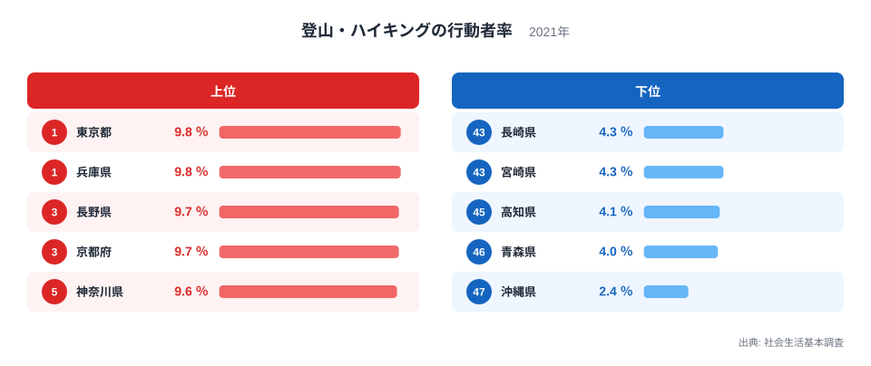
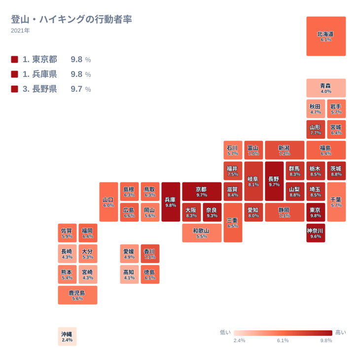

## 山の少ない都市が意外な1位

登山・ハイキングの行動者率とは、社会生活基本調査で過去1年間に登山やハイキングをしたことがある人の割合を指す統計です。この記事で使う数値は2021年に実施された調査によるもので、単位はすべてパーセントです。

全国の値を見比べると、意外な事実が浮かび上がります。豊かな山岳地帯を抱える県よりも、東京都や兵庫県、京都府、神奈川県といった大都市圏の府県が上位を占めているのです。逆に、亜熱帯の島々からなる沖縄県は全国で最も行動者率が低く、都市部と地方、そして地形の関係が単純ではないことを示しています。この記事では、上位と下位のそれぞれの顔ぶれを確認しながら、なぜこのような分布になるのかを探っていきます。

> [!NOTE]
> 「行動者率」とは、社会生活基本調査で過去1年間にその活動をしたことがある10歳以上の人の割合を指します。毎年ではなく、5年に一度実施される調査に基づく数値である点をおさえておくと読み違いを防げます。

## 登山・ハイキングの行動者率、上位と下位

<source-link href="/ranking/sports-participation-rate-hiking">登山・ハイキングの行動者率ランキングをもっと見る</source-link>

最も行動者率が高いのは東京都で、9.8%です。僅差の2位は兵庫県で、同じく9.8%を記録しています。3位は長野県の9.7%、4位は京都府も9.7%と続き、5位は神奈川県の9.6%です。上位5都府県のうち、本格的な山岳県といえるのは長野県だけで、残りの4都府県はいずれも人口の多い都市圏に属しています。首都圏と近畿圏の主要な都府県が、山岳県を抑えて上位に並んでいる点がこのランキングの大きな特徴です。

一方、下位に目を向けると、43位は長崎県で4.3%、44位は宮崎県も同じく4.3%です。45位は高知県の4.1%、46位は青森県の4.0%、そして47位は沖縄県の2.4%と、全国で最も低い数値になっています。下位には九州や四国、東北の県が並び、山が身近にないわけではない地域も含まれている点が目を引きます。とりわけ沖縄県は他の県と比べて突出して数値が低く、この指標の地理的な偏りを象徴する結果になっています。

> [!WARNING]
> この統計は「登山」と「ハイキング」をひとつの区分としてまとめて集計しているため、本格的な登山と近郊のレジャー目的のハイキングを区別できません。数値の高さがそのまま本格的な登山人口の多さを意味するわけではない点に注意が必要です。

## 地理でみる行動者率の分布

タイルマップで全国を見渡すと、関東から近畿にかけての一帯で値が高く、九州や沖縄、東北北部で値が低いという傾向がはっきりと見えます。関東地方では東京都に加えて神奈川県、埼玉県、茨城県、栃木県が比較的高い水準にあり、近畿地方でも兵庫県や京都府、奈良県、滋賀県、大阪府がまとまって上位のかたまりを作っています。この2つの地域が全国平均を押し上げている構図です。

その一方で、九州は福岡県が26位にとどまるほかは、佐賀県、熊本県、大分県、長崎県、宮崎県のいずれも下位に沈んでいます。四国も高知県が45位と低迷し、東北も青森県や秋田県が下位に入っています。地図全体としては、大都市圏とその他の地域とのあいだで明確な差が生まれていることが読み取れます。

> [!TIP]
> 行動者率は「経験の有無」を測る指標であり、年に何回出かけたか、どれくらいの規模の山に登ったかは反映されません。単純な「登山が盛んな県ランキング」ではなく、「1年間に一度でも山やハイキングコースに出かけた人の割合」として読むと、実態に近づきます。

## なぜ都市部の都府県が上位にくるのか

登山・ハイキングは、その名前から山がちな地域ほど盛んだと考えられがちですが、実際の数値はそれとは異なる傾向を示しています。この背景には、いくつかの要因が重なっていると考えられます。

まず、登山やハイキングの主な行き先となる著名な山や自然公園は、必ずしも山岳県だけに立地しているわけではありません。東京都には高尾山や奥多摩といった、都心から日帰りで訪れやすい山地があります。神奈川県には丹沢、埼玉県には秩父、兵庫県には六甲山、京都府や奈良県には比叡山や大峰山系があり、いずれも大都市圏から公共交通機関で日帰りアクセスできる範囲に登山口を持っています。[仮説] こうしたアクセスの良さが、都市圏に住む人の行動者率を押し上げている可能性があります。

もう一つの要因として考えられるのが、都市部に住む人ほど余暇に自然志向のレジャーを求める傾向があるという点です。都市生活者は日常的に自然と接する機会が少ないぶん、休日には意識的に山や森へ出かける動機を持ちやすいと考えられます。[仮説] これに対して、地方の中でも自然環境が身近にある地域では、あえて登山・ハイキングという形でレジャー行動として数えられにくいという見方もできます。

沖縄県が全国最下位となっている点については、地形の違いが大きく関わっていると考えられます。沖縄県は本島をはじめとする島々からなる地域で、標高の高い山地が少なく、亜熱帯の気候から登山という余暇行動そのものが根づきにくい環境にあります。[仮説] 気候や地形の条件が、この指標において沖縄県を他の46都道府県から際立たせている一因といえそうです。

なお、この指標が属する[同じカテゴリの統計一覧](/category/educationsports)を見ると、教育やスポーツに関連する他の指標でも都市圏と地方のあいだで似た傾向がみられるものがあります。上位に位置する[東京都のデータ](/areas/13000)や[兵庫県のデータ](/areas/28000)を個別に確認すると、それぞれの都府県が持つ統計的な特徴をより詳しく知ることができます。

## まとめ

- 登山・ハイキングの行動者率の1位は東京都で9.8%、2位は兵庫県で同じく9.8%です
- 3位は長野県の9.7%、4位は京都府の9.7%、5位は神奈川県の9.6%です
- 47位は沖縄県の2.4%で、全国で最も行動者率が低い結果になっています
- 上位は関東と近畿の大都市圏に集中し、下位は九州・四国・東北北部に多く見られます
- 山岳地帯の広さよりも、著名な山へのアクセスの良さや気候条件が行動者率に関わっていると考えられます

## データ出典

この記事で使用した登山・ハイキングの行動者率は、社会生活基本調査の2021年調査による数値です。
