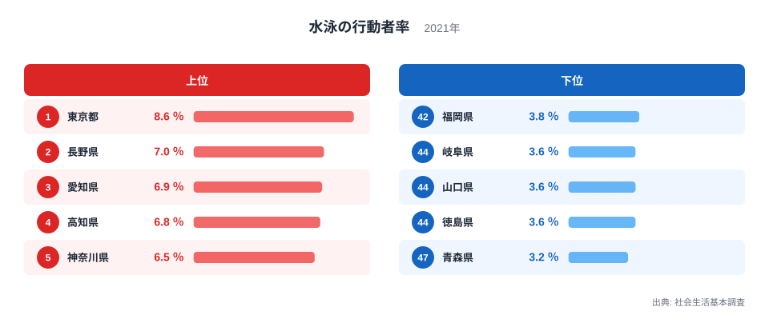
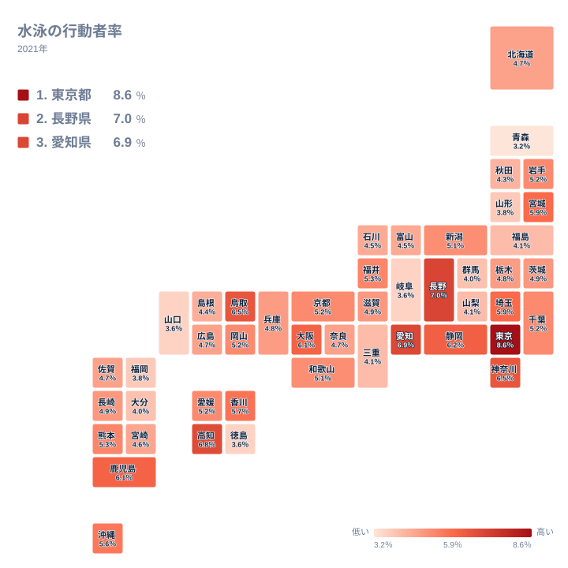

過去1年間に水泳をしたことがある人の割合を示す指標が、社会生活基本調査の水泳の行動者率です。ジョギングや筋力トレーニングと違い、専用のプールが必要な水泳は、施設へのアクセスのしやすさが行動者率を左右しやすいスポーツだといわれています。

2021年の社会生活基本調査によると、水泳の行動者率が最も高いのは東京都で8.6パーセント、続いて長野県が7パーセント、愛知県が6.9パーセントとなっています。最も低いのは青森県の3.2パーセントで、山口県、徳島県、岐阜県が3.6パーセントで並んでいます。都会と山あいの県が両方とも上位に入るという、一見すると意外な分布になっています。この記事では、なぜこのような組み合わせで上位が形づくられているのかを探ります。

## 水泳の行動者率が高い県、低い県

<source-link href="/ranking/sports-participation-rate-swimming">水泳の行動者率ランキングをもっと見る</source-link>

上位を見ると、東京都が8.6パーセントで首位に立ち、長野県が7パーセントで2位、愛知県が6.9パーセントで3位、高知県が6.8パーセントで4位、神奈川県が6.5パーセントで5位と続きます。東京都や神奈川県、愛知県のような大都市圏は、屋内プールを備えたスポーツクラブや区市町村の温水プールが数多く整備されており、天候や季節に左右されずに泳げる環境が身近にあります。人口が多いぶん施設あたりの利用者数を確保しやすく、民間のスイミングスクールも成り立ちやすいという事情も上位入りを後押ししていると考えられます。

一方で長野県や高知県のような都市圏以外の県が上位に食い込んでいる点は目を引きます。長野県は学校教育の一環として水泳指導に力を入れてきた歴史があり、公営プールの整備率も比較的高い地域です。高知県は温暖な気候を生かして海水浴やマリンレジャーが盛んな土地柄で、学校のプールに加えて自然の海で泳ぐ機会が日常に根づいていることが、行動者率を押し上げている一因と考えられます。

下位に目を移すと、青森県が3.2パーセントで最も低く、山口県、徳島県、岐阜県が3.6パーセントで続き、福岡県が3.8パーセントで並びます。青森県をはじめとする東北や日本海側の県では、冬場に屋外プールが使えない期間が長く、屋内温水プールの数も大都市圏ほど多くないため、水泳という選択肢そのものが日常生活の中で選びにくい状況にあると考えられます。

> [!NOTE]
> 行動者率は「過去1年間に該当する活動を一度でも行った人」の割合を示す指標です。週に何度も泳ぐ人と年に一度だけ泳いだ人が同じ1人として数えられるため、頻度や熱心さの違いまでは分かりません。

## 地理分布から見える傾向

タイルマップで全国を見渡すと、水泳の行動者率が高い県は太平洋側や都市部に散らばっており、日本海側や東北の内陸部は総じて低い値にとどまっていることが分かります。ただし完全に地域でまとまっているわけではなく、同じ関東でも東京都と埼玉県では差があり、同じ四国でも高知県と徳島県では正反対の結果になっています。これは、気候だけでなく、各自治体がどれだけプールなどのスポーツ施設に投資してきたかという地域ごとの政策の違いが色濃く反映されているためだと考えられます。

高知県が四国の中で唯一上位に入っている点は特に興味深いところです。同じ四国でも徳島県は下位グループに入っており、隣接する県でここまで差が出るのは、気候条件だけでは説明しきれません。学校でのプール授業の位置づけや、海水浴場へのアクセスのしやすさといった、より細かい地域事情が影響していると見るのが自然です。

> [!WARNING]
> 社会生活基本調査は標本調査であり、都道府県ごとの回答者数には差があります。人口の少ない県では標本数が限られるため、行動者率の値が年によって振れやすい点に注意してください。

## 東京都と長野県、それぞれの上位入りの理由

[東京都のデータ](/areas/13000)と[長野県のデータ](/areas/20000)を見比べると、どちらも水泳の行動者率で上位に入っていますが、その理由はまったく異なります。東京都は人口密度の高さゆえに民間スポーツクラブや区営プールが充実しており、通いやすい距離に施設がある人の割合が高いことが強みです。長野県は学校体育での水泳指導の伝統に加え、公営プールの整備が進んでいることが行動者率を押し上げていると考えられます。

こうした違いは、[同じカテゴリの統計一覧](/category/educationsports)にある他のスポーツ指標と見比べることでさらにはっきりします。ジョギングやウォーキングのような屋外で完結する活動と、水泳のように専用施設が必要な活動とでは、都市部と地方部のどちらが有利になるかの傾向が変わってくるためです。

> [!TIP]
> 水泳の行動者率を見るときは、その県の気候だけでなく、公営プールや温水施設の整備状況もあわせて確認すると、順位の背景がより立体的に見えてきます。

## 倍率で見るか、差で見るか

この指標は倍率と実数の差で印象が大きく変わります。首位の東京都は8.6％、最下位の青森県は3.2％で、比にすれば2.7倍という大きな開きです。しかし差として見ればわずか5.4ポイントで、しかも最も高い東京都ですら、水泳をした人は10人に1人に届いていません。上位県を「水泳が盛んな県」と呼ぶと、実態より広く行われているように聞こえてしまいます。

順位の並び方にも注意が必要です。2位の長野県は7％、3位の愛知県は6.9％、4位の高知県は6.8％と、上位陣は0.1ポイント刻みで並んでいます。下位も39位の三重県が4.1％、40位の群馬県と41位の大分県がともに4％と密集しており、順位が1つ違っても実質的な差はほとんどありません。社会生活基本調査は標本調査なので、この程度の差は誤差の範囲に収まる可能性があります。順位そのものより、上位群と下位群という大きなまとまりで捉えるほうが安全な読み方です。

## 上位と下位の差をどう読むか

東京都の8.6パーセントと青森県の3.2パーセントを比べると、差はおよそ2.7倍にのぼります。これだけを見ると青森県の環境が極端に不利であるように映りますが、実際には社会生活基本調査の水泳という区分に含まれるのは、プールでの遊泳や競泳といった活動に限られており、冬場に長く雪に覆われる地域では、そもそも水泳という選択肢を検討する期間そのものが短いという事情も反映されています。単純な施設不足だけでなく、季節ごとの気候条件も行動者率の差を生む一因だといえます。

## まとめ

水泳の行動者率は、都市部の施設充実度と、地方部の教育や気候による下支えという、2つの異なる要因が上位を形づくっている指標です。東京都や神奈川県のような大都市圏は屋内施設の豊富さで、長野県や高知県は学校教育や気候風土でそれぞれ上位に入っており、単純な都市対地方の構図には収まりません。下位の東北や日本海側の県も、施設不足というより気候的な制約が大きく影響していると考えられます。順位だけでなく、その背景にある施設整備や気候の条件まで見ることで、この指標の意味がより深く理解できます。

## データ出典

- 社会生活基本調査(2021年)
