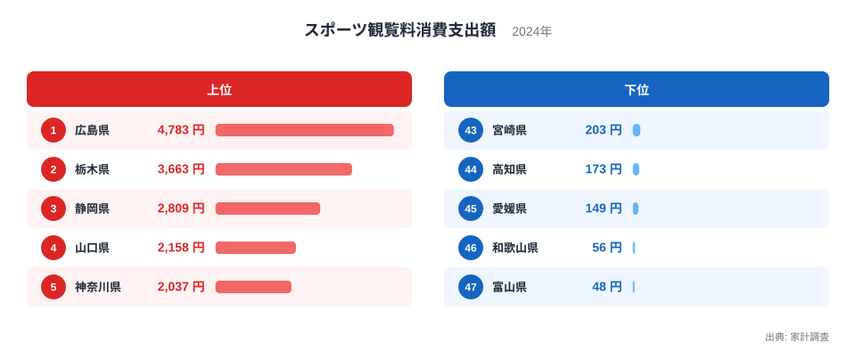
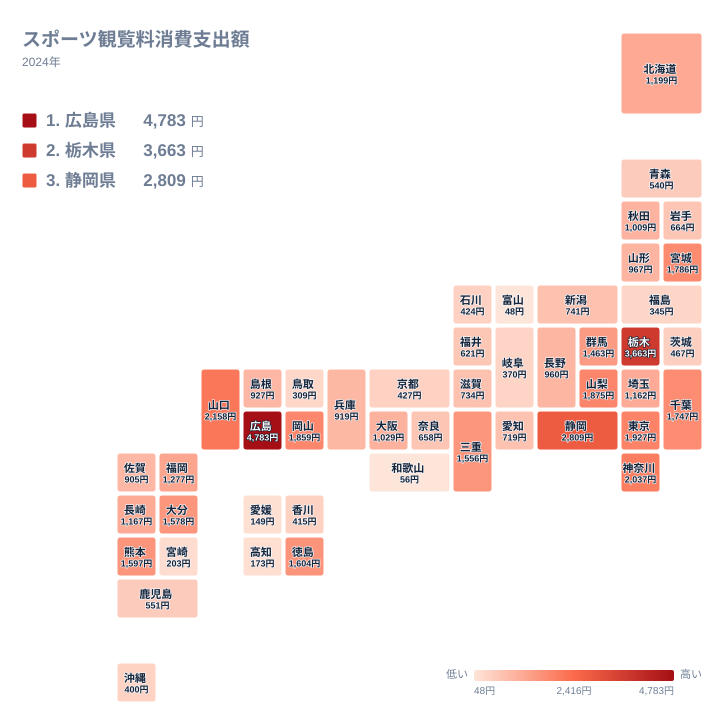

家計調査のスポーツ観覧料消費支出額は、1世帯が1年間にスタジアムや競技場でスポーツを観戦するために支払った金額を示す指標です。2024年のデータを見ると、1位の広島県は4,783円で、47位の富山県は48円にとどまり、両者の間には100倍近い開きがあります。同じ国内で暮らしていても、これほど支出額に差が生まれるのはなぜでしょうか。この記事では、上位県と下位県の顔ぶれを手がかりに、プロスポーツの本拠地や競技場の立地が支出額にどう影響しているのかを読み解きます。

> [!NOTE]
> スポーツ観覧料消費支出額は、家計調査の「教養娯楽サービス」に分類される支出項目の一つで、野球場やサッカースタジアムなどでの観戦チケット代を家計が実際に支払った金額の平均です。プロ野球やJリーグ、Bリーグの試合が地元で開催される機会が多い県ほど、観戦のきっかけそのものが増えやすい点に注意が必要です。

## 上位5県と下位5県の開き

<source-link href="/ranking/sports-spectating-consumption-expenditure">スポーツ観覧料消費支出額ランキングをもっと見る</source-link>

上位5県を見ると、広島県が4,783円で1位、栃木県が3,663円で2位、静岡県が2,809円で3位、山口県が2,158円で4位、神奈川県が2,037円で5位となっています。上位5県のうち4県は本拠地を置くプロスポーツ球団を持つ県で、広島県には広島東洋カープとサンフレッチェ広島、栃木県には栃木SCに加えてBリーグの宇都宮ブレックスが本拠地を構えています。静岡県はサッカー王国と呼ばれるほど地域リーグが根付いており、清水エスパルスとジュビロ磐田という2つのJリーグクラブを抱えている県です。[仮説] こうした本拠地球団の存在が、観戦チケットへの支出を押し上げている可能性があります。

一方の下位5県は、宮崎県が203円で43位、高知県が173円で44位、愛媛県が149円で45位、和歌山県が56円で46位、富山県が48円で47位です。宮崎県と高知県はプロ野球の春季キャンプ地として知られていますが、球団の本拠地そのものは他県にあり、観戦料が家計の支出として計上されにくい構造があると考えられます。[仮説] 富山県には富山グラウジーズというBリーグのクラブがありますが、それでも47位にとどまっている点は、球団の有無だけでは説明しきれない差があることを示しています。[広島県のデータ](/areas/34000)や[栃木県のデータ](/areas/09000)を見ると、それぞれの県が持つ他の指標でも独自の傾向が確認できます。

## 地理的分布から見える偏り

地図で見ると、支出額が高い県は関東の一部と中国地方の一部に散らばっており、四国や北陸、東北の一部で低くなる傾向が読み取れます。ただし同じ中国地方でも、広島県は4,783円で1位、山口県は2,158円で4位という高さですが、島根県は927円で24位にとどまっており、地域全体が一様に高いわけではありません。関東地方も同様で、栃木県は3,663円で2位、神奈川県は2,037円で5位、東京都は1,927円で6位と上位に並ぶ一方、埼玉県は1,162円で19位にとどまっています。

四国地方に目を向けると、徳島県は1,604円で11位と健闘していますが、愛媛県は149円で45位、高知県は173円で44位と大きく差があります。徳島県には徳島インディゴソックスという独立リーグの球団があり、地域密着の観戦文化が根付いている可能性があります。[仮説] 同じブロックの中でも支出額に大きな開きがあることから、地域ブロック単位の傾向よりも、県ごとに本拠地球団や競技場が存在するかどうかが支出額を左右していると考えられます。

## なぜ広島県や栃木県で支出が突出するのか

広島県が突出して高い理由として、広島東洋カープの人気の高さと、2009年に開業したMAZDA Zoom-Zoom スタジアム広島の存在が挙げられます。[仮説] 新しいスタジアムの開業をきっかけに観客動員数が伸び、チケット購入が家計支出として定着した可能性があります。栃木県については、宇都宮ブレックスがBリーグで安定した成績を残していることに加え、宇都宮市が「ジャパンカップサイクルロードレース」の開催地として自転車競技の観戦文化を持つ地域である点が特徴です。[仮説] 野球やサッカーだけでなく、自転車競技のような観戦機会の多様さが支出額を押し上げているとも考えられます。

興味深いのは、大都市を抱える県でも支出額が必ずしも高くない点です。愛知県には中日ドラゴンズと名古屋グランパスという2つの人気球団がありますが、719円で29位にとどまっています。京都府にも京都サンガF.C.という球団がありますが、427円で36位です。[仮説] 人口が多い県では、スポーツ観覧以外の娯楽選択肢が豊富であるために、1世帯あたりの平均支出が相対的に薄まっている可能性があります。逆に広島県や栃木県のように、地域を代表する球団が明確な県ほど、観戦への支出が集中しやすいのかもしれません。

> [!WARNING]
> スポーツ観覧料消費支出額は家計調査という標本調査にもとづく平均値です。観戦チケットの購入は毎月発生する支出ではないため、調査対象となった世帯にたまたま大きな支出があったかどうかで年ごとの数値が変動しやすい項目です。1年分の数値だけで、その県の恒常的なスポーツ観戦熱を断定しないよう注意してください。

## 他の娯楽支出と比べて見える特徴

スポーツ観覧料は、家計調査の中では「教養娯楽サービス」という大きな分類に含まれる支出項目の一つです。月謝やレッスン代のように毎月継続的に発生する支出とは異なり、観戦チケットの購入は特定の試合や季節に集中しやすく、都道府県ごとの差が大きく出やすい性質を持っています。[仮説] このため、他の教養娯楽サービスの支出と比べても、スポーツ観覧料は本拠地球団や競技場の有無といった地域固有の条件に、より強く左右されると考えられます。[同じカテゴリの統計一覧](/category/economy)を確認すると、教養娯楽サービスに分類される他の支出項目との比較ができ、スポーツ観覧料が持つ変動の大きさを相対的に把握する手がかりになります。

> [!TIP]
> この指標を読み解くときは、単に金額の大小だけでなく、その県にプロ野球・Jリーグ・Bリーグなどの本拠地球団があるかどうかを重ねて見ると理解が深まります。球団があっても支出額が低い県や、球団が無くても健闘している県を探すと、支出額を左右する要因が球団の有無だけではないことが見えてきます。

## まとめ

- 1位は広島県で4,783円です。
- 最下位は富山県で48円です。
- 1位と最下位の差はおよそ100倍にのぼります。
- 関東の一部と中国地方の一部で高く、四国や北陸で低い傾向がみられますが、同じ地域ブロックの中でも大きな差があります。
- プロ野球・Jリーグ・Bリーグなど本拠地球団の存在や新しい競技場の開業が、支出額の差に関わっている可能性があります。

## データ出典

本記事のデータは総務省統計局「家計調査」（2024年）にもとづいています。
