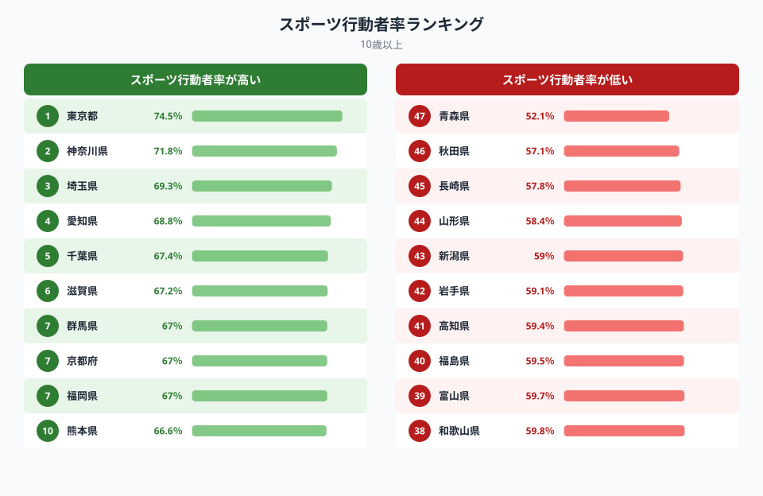
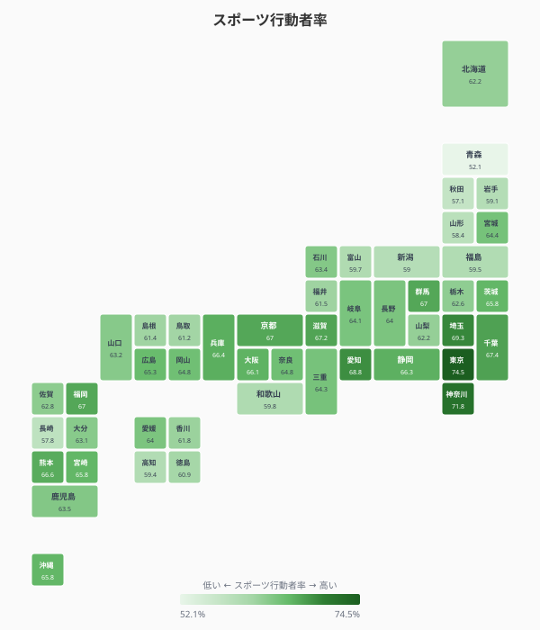
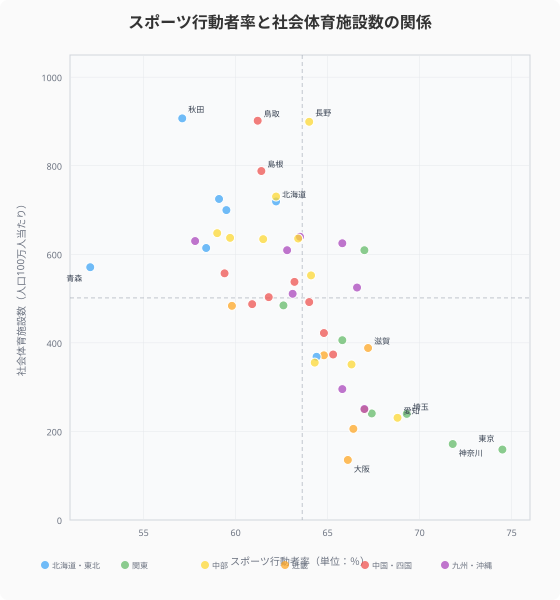
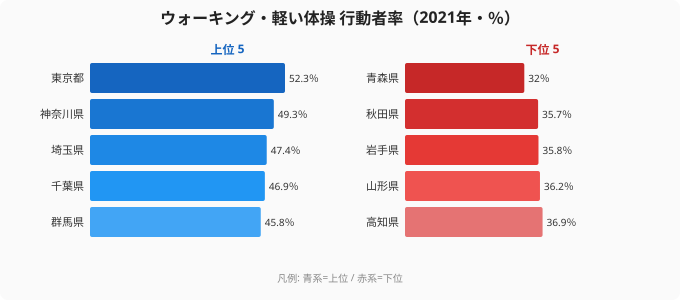
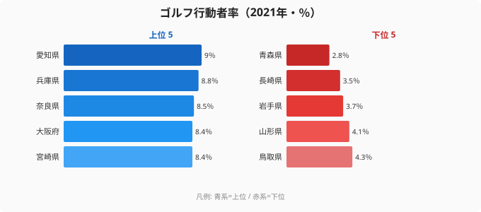

「スポーツ施設が多い県ほどスポーツをしている」──この直感は、データを見ると完全に裏切られます。

この記事では、総務省「社会生活基本調査」（2021年）のデータをもとに、**スポーツの年間行動者率**（10歳以上）を47都道府県で比較します。ランキング・タイルマップ・散布図の3つの視点から、スポーツ実施率の地域差とその背景にある構造を読み解きます。

## スポーツ行動者率ランキング（2021年）

<data-source url="https://www.e-stat.go.jp/dbview?sid=0000010207" label="e-Stat 社会・人口統計体系"></data-source>

**スポーツ行動者率が最も高いのは東京都**（74.5%）。2位の神奈川県（71.8%）、3位の埼玉県（69.3%）と続き、トップ5は東京・神奈川・埼玉・愛知・千葉と**首都圏＋愛知の大都市圏**が独占しています。6位の滋賀県（67.2%）、7位タイの群馬県・京都府・福岡県（67.0%）まで含めると、上位は都市部に集中する傾向が鮮明です。

一方、**最も低いのは青森県**（52.1%）。秋田県（57.1%）、長崎県（57.8%）、山形県（58.4%）と**東北地方が下位に集中**しています。1位の東京都と47位の青森県では**22.4ポイントの差**、比率にして**1.43倍**の開きがあります。

> [!NOTE]
> スポーツの行動者率とは、過去1年間に何らかのスポーツを行った人の割合です。ウォーキング・軽い体操からゴルフ・水泳まで、あらゆるスポーツ種目が対象に含まれます。

<source-link href="/ranking/sports-annual-participation-rate-10plus">スポーツの年間行動者率ランキング</source-link>

## 都道府県マップ──スポーツ実施率の地域構造

<data-source url="https://www.e-stat.go.jp/dbview?sid=0000010207" label="e-Stat 社会・人口統計体系"></data-source>

タイルマップで全体像を見ると、**大都市圏が濃い緑、地方が薄い緑**というパターンが浮かび上がります。

- **首都圏ベルトが最も濃い**──東京（74.5%）・神奈川（71.8%）・埼玉（69.3%）・千葉（67.4%）・群馬（67.0%）が軒並み65%超
- **中京圏・関西圏も高い**──愛知（68.8%）・滋賀（67.2%）・京都（67.0%）・兵庫（66.4%）・大阪（66.1%）
- **東北地方が明確に薄い**──青森（52.1%）・秋田（57.1%）・山形（58.4%）・岩手（59.1%）・新潟（59.0%）と日本海側を中心に低い
- **九州は二極化**──福岡（67.0%）・熊本（66.6%）は高いが、長崎（57.8%）は低い

注目すべきは**沖縄県が14位タイ**（65.8%）と比較的高い点です。温暖な気候で屋外スポーツが年間を通して可能なことが寄与していると考えられます。

<ad-slot></ad-slot>

## スポーツ行動者率と社会体育施設数の関係

<data-source url="https://www.e-stat.go.jp/dbview?sid=0000010207" label="e-Stat 社会・人口統計体系"></data-source>

横軸にスポーツ行動者率、縦軸に社会体育施設数（人口100万人当たり）をとると、**明確な逆相関**が現れます。施設が多い県ほどスポーツをしていないという、直感に反する結果です。

散布図の4象限で都道府県を分類すると：

- **左上**（実施率低い×施設多い）: 秋田（施設907、行動者率57.1%）・鳥取（902、61.2%）・長野（899、64.0%）・島根（788、61.4%）──人口が少なく1人当たり施設数が多いが、冬季の気候条件や高齢化が実施率を抑制
- **右下**（実施率高い×施設少ない）: 東京（159、74.5%）・神奈川（172、71.8%）・大阪（136、66.1%）──民間のスポーツジムやフィットネスクラブが充実し、公共施設に依存しない
- **右上**（実施率高い×施設多い）: 群馬（609、67.0%）──公共施設も充実し実施率も高い稀有な例
- **左下**（実施率低い×施設少ない）: 沖縄（296、65.8%）は中間的な位置

**秋田県は社会体育施設数全国1位**（907施設/100万人）でありながら、**スポーツ行動者率は46位**（57.1%）。これは「施設があればスポーツをする」わけではないことを明確に示しています。人口減少で1人当たりの施設数が増える一方、利用者の高齢化や冬季の降雪による活動制限が背景にあります。

> [!WARNING]
> 「施設数と実施率の逆相関」は因果関係ではありません。施設が多いから運動しなくなるのではなく、人口の少ない地方ほど1人当たり施設数が機械的に大きくなる一方、高齢化や気候で実施率が下がる、という別々の要因が同時に効いた結果です。「施設を減らせば運動が増える」と読み違えないよう注意が必要です。

<source-link href="/ranking/community-sports-facility-count-per-million">社会体育施設数ランキング</source-link>

## 種目別に見るスポーツの地域差

### ウォーキング・軽い体操──最もポピュラーなスポーツ

ウォーキング・軽い体操の行動者率は、スポーツ全体の行動者率と非常に強い相関を持ちます。

東京都の52.3%と青森県の32.0%で**20.3ポイントの差**。上位は東京・神奈川・埼玉・千葉・群馬と首都圏が占め、下位は青森・秋田・岩手と東北が並びます。この顔ぶれはスポーツ全体のランキングとほぼ一致しており、**ウォーキングの実施率がスポーツ全体の実施率を左右する最大の要因**であることがわかります。特別な施設を必要としないウォーキングは、都市の「歩く生活」がそのまま実施率に表れる種目です。

<source-link href="/ranking/sports-participation-rate-walking">ウォーキング・軽い体操 行動者率ランキング</source-link>

### ゴルフ──経済力との相関が見える種目

ゴルフは愛知県が9.0%でトップ。兵庫（8.8%）・奈良（8.5%）・大阪（8.4%）と近畿が続きます。製造業を中心とした企業の接待・レクリエーション文化や、ゴルフ場へのアクセスの良さが影響しています。一方、最下位の青森県は2.8%で、首位の愛知の3分の1以下にとどまります。冬季のプレー制限が大きく、ウォーキングとは逆に「気候とお金」が効く種目であることが、上位・下位の顔ぶれの違いに表れています。

> [!TIP]
> スポーツ行動者率を高めるには、特別な施設よりも「歩く習慣」の定着が効果的です。ウォーキングの実施率がスポーツ全体を底上げする最大のレバーとなっています。

<source-link href="/ranking/sports-participation-rate-golf">ゴルフ行動者率ランキング</source-link>

<ad-slot></ad-slot>

## 体育館数と実施率──公共施設の「量」は関係ない

体育館数（公共、人口100万人当たり）のデータも、施設数と実施率の逆相関を裏付けます。両極端の2県を並べると逆転が鮮明です。

- **体育館数 全国1位の鳥取県**（235施設/100万人）：スポーツ行動者率は **61.2%で36位**
- **体育館数 全国最少の東京都**（18.3施設/100万人）：スポーツ行動者率は **74.5%で1位**

**体育館数で全国1位の鳥取県のスポーツ行動者率は36位、全国最少の東京都が行動者率1位**という完全な逆転が起きています。東京では民間のフィットネスクラブ、ジム、ヨガスタジオなどが高密度に存在し、公共体育館に頼らずともスポーツにアクセスできる環境が整っているためです。

<source-link href="/ranking/public-gymnasium-count-per-million">体育館数（公共）ランキング</source-link>

## まとめ

ランキングデータから見えてきたスポーツ実施率の地域構造を整理します。

- **実施率は都市が高い**：東京74.5% vs 青森52.1%で22.4pt差。首都圏＋愛知が上位、東北が下位。
- **施設の量とは逆相関**：体育館数1位の鳥取が実施率36位、施設最少の東京が実施率1位。
- **効くのはウォーキング**：特別な施設より「歩く習慣」が実施率全体を底上げする最大のレバー。
- **ゴルフは気候とお金**：愛知が1位、冬季制限の青森が最下位と、種目で地域差の要因が変わる。

スポーツ行動者率の地域差は、「施設の量」ではなく「都市のライフスタイル」が決定要因であることを浮き彫りにしています。大都市では通勤・買い物での歩行、フィットネスジムの充実、健康意識の高さが複合的にスポーツ実施率を押し上げています。健康の地域差をさらに掘るなら[中学生の身長は県で4cm違う](/blog/child-height-regional-gap)も合わせて読むと、生活環境が体に与える影響が見えてきます。

地方自治体がスポーツ振興を目指すなら、体育館や競技場の建設よりも、**ウォーキングコースの整備や日常的に歩ける環境づくり**が、データが示すより効果的な戦略かもしれません。最下位の[青森県のプロフィール](/areas/02000)を気候・高齢化と重ねると、実施率を抑える構造的要因が読み取れます。[教育・スポーツカテゴリのランキング一覧](/category/educationsports)では他の関連指標も比較できます。

## データ出典

- 総務省「社会生活基本調査」（2021年）── スポーツ・ウォーキング・ゴルフの年間行動者率
- e-Stat 社会・人口統計体系（社会体育施設数・体育館数）
