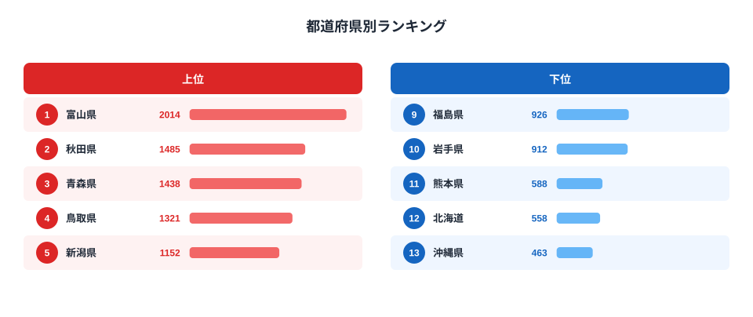

「いかといえば函館、北海道」というイメージを持っている方は多いのではないでしょうか。しかし、家計調査のデータを見ると、この「常識」が大きく覆されます。

2024年の都道府県庁所在市別いか消費量ランキングで1位に輝いたのは、富山県（2,014g）です。2位の秋田県（1,485g）、3位の青森県（1,438g）を大きく引き離しています。そして驚くべきことに、漁業のイメージが強い北海道は46位（558g）と下位に沈んでいます。

この「見えている産地と食べている地域がズレる」という現象には、日本の食文化と流通構造を読み解くヒントが詰まっています。

## いか消費量の全国ランキング (2024年)

2024年の家計調査によると、47都道府県のいか消費量には最大4.3倍もの開きがあります。1位の富山県が2,014g（年間一世帯あたり）であるのに対し、最下位の沖縄県は463gです。

上位には北陸・東北の県が顔を揃えます。富山（1位）、秋田（2位）、青森（3位）、新潟（5位）、山形（6位）、福井（7位）と、日本海側の県が上位に集中しています。一方で下位には、沖縄（47位）、北海道（46位）、熊本（45位）などが並んでいます。

<source-link href="/ranking/squid-consumption-quantity">いか消費量ランキングの詳細を見る</source-link>

> [!NOTE]
> このデータは総務省「家計調査」に基づく「都道府県庁所在市の二人以上世帯の年間いか消費量」です。調査対象は各県の県庁所在市のみであり、県全体の平均ではありません。例えば富山県であれば富山市の家庭の消費量を代表しています。また、「いか」には生鮮・冷凍・加工品が含まれます。

## なぜ富山が1位なのか

富山県が1位となった背景には、独自の食文化と日本海の豊かな漁場があります。

富山湾は「天然のいけす」とも呼ばれ、ホタルイカの名産地として有名です。春のホタルイカは富山の食卓に欠かせない存在で、年間を通じてイカ料理が食生活に根付いています。また、富山は「寿司文化」が発達した地域でもあり、ネタとしてのいかへの需要も高い水準を維持しています。

さらに注目すべきは、2位以下との差の大きさです。1位の富山（2,014g）と2位の秋田（1,485g）の差は529g。これは3位の青森（1,438g）と10位の岩手（912g）の差（526g）とほぼ同じです。富山がいかに突出した消費地であるかがわかります。

2位・3位を占める秋田と青森も、日本海・太平洋両面の漁業に恵まれた東北の県です。イカ漁が盛んなことで知られる青森の八戸近海は、スルメイカの主要漁場の一つです。ただし、今回のデータは青森市（太平洋側ではなく県庁所在地）の家庭の消費量を反映している点に注意が必要です。

4位には鳥取県（1,321g）が入っています。山陰地方の食文化にはイカが欠かせません。境港を中心とした日本海漁業の影響が県内の食生活に色濃く残っています。

## 北海道はなぜ46位と低いのか

北海道が46位（558g）という結果は、多くの方の直感に反するかもしれません。函館のイカは全国的に有名であり、北海道はスルメイカの主要な産地です。

しかし、この「逆説」を読み解く鍵は「産地と消費地は必ずしも一致しない」という流通の原理にあります。

北海道のイカは、その多くが道外に出荷されます。特に東北・北陸地方への流通が多く、産地の北海道よりも消費地の富山や秋田のほうが家庭でイカを食べる機会が多いという皮肉な構図が生まれています。

また、北海道の食文化は肉食の傾向が比較的強い面もあります。広大な牧畜地帯を持つ北海道では、牛肉や羊肉（ジンギスカン）が食文化の中心を占め、魚介類の中でもサーモン・カニ・ウニなどが優先される傾向があります。家計調査のデータでも、北海道はいかよりも他の魚介類の消費が相対的に多いと考えられます。

> [!WARNING]
> 家計調査は都道府県庁所在市のみを対象とした標本調査です。函館市や旭川市などのデータは直接含まれず、あくまで北海道を代表する都市として「札幌市」の家庭の消費が反映されます。函館のイカ消費量が多いことは別途確認が必要です。また、年によって順位は変動するため、単年のデータだけで長期的なトレンドを判断するのは避けてください。

## 下位に並ぶ九州・関東の県

最下位の沖縄県（463g）については、食文化の独自性が大きな要因です。沖縄は豚肉文化が発達しており、魚介類よりも豚肉を中心とした食文化が根付いています。また、沖縄近海の漁業事情や食材の多様性も影響していると考えられます。

下位にはほかに、北海道（46位、558g）、熊本（45位、588g）、茨城・鹿児島（共に43位、606g）、福岡（42位、608g）などが並びます。

九州勢が概して下位に集まっているのも興味深い点です。福岡（42位）、熊本（45位）、鹿児島（43位）と、九州各県がいか消費量では低水準にとどまっています。九州の食文化では、さば・あじなどの青魚や、ブリ・マグロなどの大型魚の消費が多い傾向があり、イカはそれほど主役ではないと解釈できます。

関東も全体的に中位から下位に集まっています。神奈川（40位、618g）、茨城（43位、606g）、栃木（41位、612g）、埼玉（31位、740g）など。東京は25位（785g）と中位です。都市圏では食の選択肢が多く、特定の食材への偏りが生まれにくい傾向があります。

> [!TIP]
> いか消費量と合わせて[まぐろ消費量ランキング](/ranking/tuna-consumption-quantity)や[こんぶ消費量ランキング](/ranking/konbu-consumption-quantity)を参照すると、地域の「海産物文化」の全体像が見えてきます。いかが多い北陸・東北の県が、こんぶや他の海産物でも高い消費量を示すかどうかを比較するのも面白い視点です。

## 大阪が8位に入る理由

上位10県の中で一つだけ「異色」の存在があります。それが大阪府（8位、1,018g）です。

北陸・東北勢が上位を独占する中、大阪だけが都市部として上位に食い込んでいます。この背景には、大阪の「食文化の多様性」と「たこ焼き文化に象徴される粉もの・海産物文化」が関係していると考えられます。

大阪では、たこや海産物が日常食に溶け込んでいます。天ぷら、寿司、お好み焼きなど、海産物を使った料理が豊富で、イカリングや沖漬けなど多様なイカ料理が家庭でも親しまれています。大阪の食文化の奥深さを示す数字ともいえます。

[農林水産業を俯瞰するカテゴリ](/category/agriculture)でも、地域ごとの産業と食文化の関係を確認できます。

## まとめ

2024年のいか消費量ランキングで明らかになった主なポイントをまとめます。

- **1位は富山県（2,014g）**で、2位の秋田（1,485g）を大きく引き離す。「日本海の恵み」と「ホタルイカ文化」が背景
- **最下位は沖縄県（463g）**で、1位富山との差は4.3倍。豚肉中心の食文化と地理的条件が影響
- **北海道は46位（558g）**と低水準。「産地と消費地は別」という流通の原理が典型的に現れている
- **上位は北陸・東北に集中**。日本海側の食文化において、いかは欠かせない存在
- **大阪（8位、1,018g）**が都市部で唯一の上位圏入り。海産物文化の豊かさを反映

いか消費量のデータは、日本の「海産物文化マップ」の一断面を見せてくれます。産地のイメージと実際の消費地が大きく異なるケースは、食品流通と食文化の関係を考えるうえで興味深い視点を提供しています。

富山の[地域プロフィール](/areas/16000)では、食文化以外の経済・社会指標も確認できます。ほかにも[青森の地域データ](/areas/02000)などを参照することで、上位県の特徴をより深く理解できます。

## データ出典

総務省「家計調査」（家計収支編・都道府県庁所在市別一世帯あたり品目別支出金額及び購入数量）より集計。e-Stat 経由で整備。対象は二人以上の世帯、2024年の年間消費量（g）。都道府県庁所在市のみを対象とした標本調査であり、県全体の平均ではありません。
