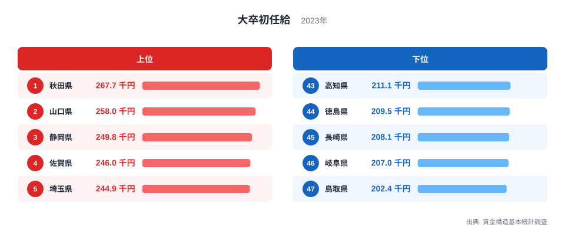
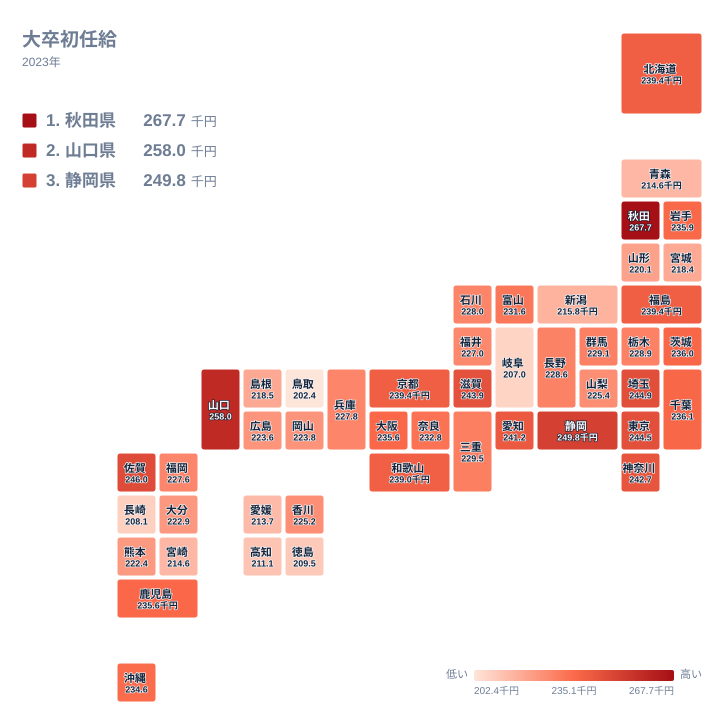

大卒初任給とは、大学を卒業してその年に企業へ新しく採用された人が最初に受け取る給与のことです。賃金構造基本統計調査の2023年データを見ると、全国でもっとも高いのは秋田県で267.7千円、もっとも低いのは鳥取県で202.4千円でした。その差は65.3千円で、秋田県は鳥取県のおよそ1.3倍にあたります。

意外に感じる読者も多いはずです。多くの人は初任給が高い県として真っ先に東京都を思い浮かべます。しかし東京都は244.5千円で6位にとどまり、1位の座を秋田県に譲っています。この記事では、なぜ大都市ではなく秋田県や山口県、佐賀県が上位に来るのか、そして下位に沈む県にはどのような共通点があるのかを、地理と産業構造の観点から掘り下げます。

## 上位と下位の初任給

<source-link href="/ranking/starting-salary-university">大卒初任給ランキングをもっと見る</source-link>

上位5県は秋田県267.7千円、山口県258千円、静岡県249.8千円、佐賀県246千円、埼玉県244.9千円という顔ぶれです。この5県には、東京や大阪のような巨大都市圏の中心地はひとつも含まれていません。

秋田県が1位になっている背景には、少子高齢化と若年人口の流出が進む地域特有の事情があると考えられます。地方から東京圏へ大学進学とともに人材が流れ出てしまう県では、卒業後も地元に残ってもらうために、企業側が初任給を引き上げて採用競争力を高める必要が生じます。これは検証が必要な仮説ですが、秋田県や佐賀県のように人口減少が進む県が上位に並ぶ傾向とは整合的です。

一方の山口県と静岡県は、性格の異なる理由で高い水準にあると考えられます。山口県には瀬戸内海沿岸に石油化学や鉄鋼の大規模なコンビナートが立地しており、静岡県には自動車部品や医薬品などの製造業が集積しています。こうした付加価値の高い製造業を抱える県では、企業が新卒採用に振り向けられる原資が大きく、初任給の水準を押し上げやすいと言えます。埼玉県が上位に入っているのは、東京都に隣接する首都圏の一角として、東京の労働市場と直接競合しているためでしょう。通勤圏が重なる埼玉県の企業が東京都より低い初任給しか出せなければ、新卒者は東京の企業を選んでしまいます。

## 地理分布で見る大卒初任給

タイルマップで全国を見渡すと、初任給の高さは単純に「都市か地方か」だけでは説明できないことがわかります。東京都や神奈川県、愛知県といった三大都市圏の県は241千円台から244千円台に集まっており、決して突出して高いわけではありません。むしろ最上位は秋田県という日本海側の地方県であり、次点も瀬戸内海に面した山口県です。

四国や九州、そして中部地方の内陸県や山陰に低い値が目立つ点も特徴です。高知県、徳島県、長崎県、岐阜県、鳥取県といった下位5県は、いずれも全国トップクラスの大企業の本社が集中しているわけではなく、中小規模の事業所の比率が相対的に高い地域です。人口規模が小さく、地元での新卒採用の競争そのものが激しくないと、企業が初任給を引き上げてまで人材を確保する動機は生まれにくくなります。この点も検証が必要な仮説ですが、地図全体の分布傾向とは矛盾しません。

## 下位グループに見える構造

下位5県は高知県211.1千円、徳島県209.5千円、長崎県208.1千円、岐阜県207千円、鳥取県202.4千円です。四国の高知県と徳島県、九州の長崎県、中部地方の岐阜県、そして中国地方の鳥取県という、地理的にも離れた4つの地域にまたがっています。

このうち岐阜県は少し特殊な立地にあります。岐阜県は自動車産業の集積地である愛知県に隣接しており、多くの県民が愛知県の企業へ通勤しています。愛知県は241.2千円で9位と高い水準にあるため、賃金水準の高い愛知県へ人材が流出しやすく、岐阜県の企業は無理に初任給を引き上げなくても、愛知県まで通わない層の採用でまかなえてしまう構造があるのかもしれません。これも仮説の域を出ませんが、大都市圏に隣接しながら順位が低い県には、こうした通勤圏の吸収という要因が働いている可能性があります。鳥取県は都道府県の中でもっとも人口が少なく、大企業の本社や工場の集積が薄いことが、初任給の低さにつながっていると考えられます。

## 意外な発見

このランキングから見えてくるのは、「都市圏だから初任給が高い」とは限らないという事実です。東京都は6位、神奈川県は8位、大阪府は17位、福岡県は28位です。三大都市圏の中心県であっても、上位5県の水準には届いていません。

代わりに上位を占めるのは、人口減少に直面する地方県と、重厚長大型の製造業を抱える県という、一見すると対照的な2つのグループです。この2つに共通するのは、企業が新卒採用の場面で強い競争圧力にさらされているという点です。人口減少県では採用できる母数そのものが少なく、製造業集積県では高い付加価値を新卒の給与に還元できる余地が大きいという、異なる理由から同じ「初任給を上げる」という結果にたどり着いていると読むことができます。

## まとめ

- 大卒初任給の1位は秋田県で267.7千円、最下位は鳥取県で202.4千円です
- 上位5県の順は秋田県、山口県、静岡県、佐賀県、埼玉県です
- 下位5県の順は高知県、徳島県、長崎県、岐阜県、鳥取県です
- 1位と最下位の差は65.3千円で、秋田県は鳥取県のおよそ1.3倍です
- 東京都や大阪府といった大都市圏の中心県は上位5県には入っておらず、初任給の高さは都市規模だけでは決まりません

> [!NOTE]
> 大卒初任給は、時間外手当や賞与を含まない所定内給与を基準とした金額です。実際に手取りとして受け取る額とは異なる点に注意してください。[同じカテゴリの統計一覧](/category/laborwage)でも、賃金に関する他の指標を確認できます。

> [!WARNING]
> 初任給の統計は、その県内で新卒者を採用した事業所の給与をもとに集計されています。本社が別の都道府県にある企業が地方に事業所を置いている場合、初任給の水準は本社側の給与体系に合わせられることがあり、必ずしもその県の物価水準や地元企業の実力そのものを表しているとは限りません。

> [!TIP]
> 上位県を読むときは、[秋田県のデータ](/areas/05000)や[山口県のデータ](/areas/35000)のように、人口動態が似た県どうし、あるいは同じ産業構造を持つ県どうしを見比べると、単なる順位表以上の地域の姿が見えてきます。

## データ出典

賃金構造基本統計調査(2023年)をもとに作成しています。
