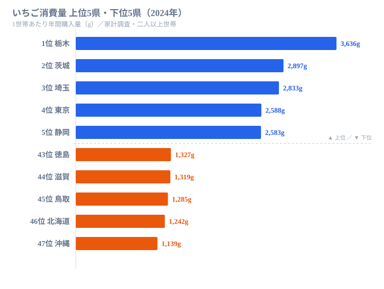

「いちごの名産地ほど、たくさん食べているはず」——直感的にはそう思える。だがデータを開くと、その直感は半分しか当たっていない。

総務省の家計調査（2024年）でいちご消費量（二人以上世帯・1世帯あたり年間、都道府県庁所在地・政令市）を見ると、1位は**栃木の3,636g**。これは「とちおとめ」を生んだ日本一の産地なので順当だ。ところが、同じく全国有数の生産県である**福岡は34位（1,574g）**、**長崎は27位（1,860g）**、さらに**熊本は39位、宮崎は41位**と、九州のいちご王国がそろって下位に沈む。最下位は**沖縄の1,139g**で、1位との差は**3.19倍**。

この記事では、いちごの「作る県」と「食べる県」がどこまで一致し、どこからズレるのかを47都道府県のデータで読み解く。

> [!NOTE]
> 本データは家計調査の「二人以上世帯」を対象とし、調査地点は各都道府県庁所在地および政令指定都市です。県全域の平均ではなく、県庁所在地等の世帯の購入量である点に注意してください（自家消費・贈答は反映されにくい）。

## いちご消費量 TOP10 と最下位

トップ層を見ると、1位の栃木（とちおとめ）を除けば、産地というより**東日本・関東圏の人口集中地域**が並ぶ。2位の茨城、3位の埼玉、4位の東京、5位の静岡、9位の群馬、10位の千葉——関東とその周辺が上位を占める。九州の有名産地が見当たらないのが、このランキングの最初の違和感だ。

<source-link href="/ranking/strawberry-consumption-quantity">いちごの消費量ランキングをもっと見る</source-link>

## 最下位グループ

上のチャート右側に並ぶ下位5県は、徳島1,327g（43位）・滋賀1,319g（44位）・鳥取1,285g（45位）・北海道1,242g（46位）、そして最下位の沖縄1,139g（47位）だ。最下位は沖縄の1,139g、次いで北海道（1,242g）、鳥取（1,285g）が続く。下位グループには、いちごの旬（冬〜春）に別の地元産フルーツやスイーツへ需要が向かいやすい地域が含まれる。果物カテゴリ全体を食べないのではなく、**いちご以外の選択肢が豊富な地域ほど、いちごへの支出が相対的に小さくなる**置き換えの構図が読み取れる。

> [!TIP]
> 「いちごをあまり食べない県」は、果物を食べない県とイコールではありません。果物カテゴリ内での"競合"を意識すると、下位の顔ぶれが読み解けます。

## 発見1：九州の有名産地がそろって下位

生産で名高い県（いずれも生産上位）の消費順位を並べると、一致とズレの両方がはっきり見えてくる。

- 栃木：消費1位（3,636g）
- 茨城：消費2位（2,897g）
- 静岡：消費5位（2,583g）
- 長崎：消費27位（1,860g）
- 福岡：消費34位（1,574g）
- 佐賀：消費36位（1,523g）
- 熊本：消費39位（1,409g）
- 宮崎：消費41位（1,385g）

栃木（1位）・茨城（2位）のように「作る県＝食べる県」が一致する関東勢に対し、ブランドいちご「あまおう」で知られる**福岡は34位（1,574g）**、生産上位の**長崎は27位（1,860g）・熊本は39位（1,409g）・宮崎は41位（1,385g）**と、九州のいちご王国がそろって消費の下位に並ぶ。「産地だからよく食べる」だけでは、この逆転は説明できない。

> [!WARNING]
> ここで使っているのは「県庁所在地等の世帯の購入量（家計調査）」です。福岡・長崎・熊本のような生産県では、出荷の多くが県外（首都圏など）へ向かい、地元では直売・自家消費・もらい物が購入額に表れにくい可能性があります。「地元で食べていない」と断定はできません。

[仮説] 産地でありながら購入量が伸びない県は、生産が「域外出荷型（首都圏向け）」に寄っているためかもしれない。検証するには各県の出荷量に占める県内向け比率と家計調査の購入量を突き合わせる必要があり、本データだけでは確定できない。

## 発見2：1位と最下位の差は3.19倍

このランキングのもう一つの読みどころは、**1位（栃木3,636g）と最下位（沖縄1,139g）の差が3.19倍**である点だ。栃木のいちご消費は最下位沖縄の3.19倍にのぼり、関東を中心とした「いちごをよく買う地域」と、そうでない地域の差がくっきり出ている。

東日本・関東圏で消費が厚く、九州の産地で薄いという分布は、「産地＝消費地」ではなく「大消費地＝消費地」という構図を示している。いちごは全国共通の春の定番でありながら、どれだけ厚く食卓に乗るかには明確な地域差があるといえる。

## まとめ

- いちご消費量1位は**栃木の3,636g**（家計調査・2024年）。生産・消費ともに日本一の王道だった
- 最下位は**沖縄の1,139g**で、1位との差は**3.19倍**
- 有名産地の**福岡は34位（1,574g）・長崎は27位（1,860g）・熊本は39位・宮崎は41位**と、九州のいちご王国がそろって下位
- 上位は栃木以外、茨城・埼玉・東京など**関東圏の大消費地**が占めた
- 「産地＝消費地」ではなく「大消費地＝消費地」という構図が見える

## データ出典

総務省統計局「家計調査」（2024年、二人以上世帯・都道府県庁所在地および政令指定都市）をもとに、e-Stat 経由で整備したデータを使用しています。値は1世帯あたりの年間いちご購入数量（g）です。

本記事の対象データ: [関連カテゴリ](/category/economy)・[栃木県](/areas/09000)・[沖縄県](/areas/47000)
