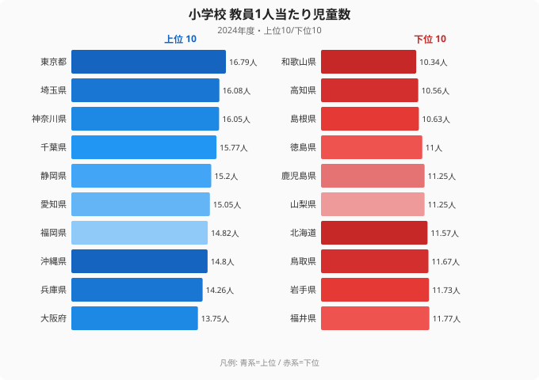
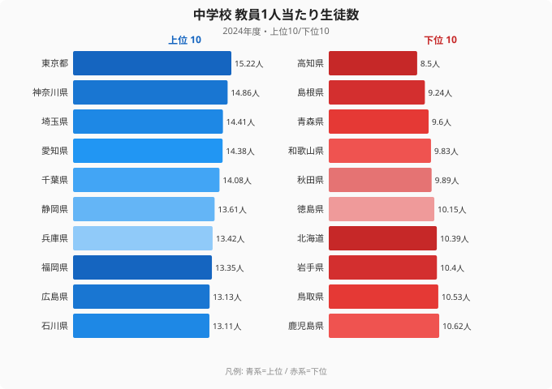

「都会の学校はお金も先生も揃っていて手厚い」──多くの人がそう思っている。だが、教員1人が受け持つ子どもの数で見ると、その直感はきれいに裏返る。

総務省「社会・人口統計体系」の2024年度データによると、小学校で教員1人当たりの児童数が最も多いのは**[東京都](/areas/13000)の16.79人**。最も少ないのは**[和歌山県](/areas/30000)の10.34人**で、その差は約**1.62倍**。中学校になると差はさらに開き、**東京15.22人 vs 高知8.50人で1.79倍**に達する。

つまり、教育資源が集まっているはずの大都市ほど、先生1人が向き合う子どもの数は多い。「手厚さ」の実態は、進学校の数や塾の多さとは別の軸で測らなければならない。本記事では、この逆説がなぜ起きるのかを47都道府県のデータで解き明かす。

> [!NOTE]
> 「教員1人当たり児童・生徒数」は、児童・生徒の総数を教員数で割った値です。学級の平均人数そのものではありませんが、教員1人がどれだけの子どもを見ているかの目安になります。値が小さいほど、1人ひとりに目が届きやすい「手厚い」環境といえます。

## 小学校：教員1人当たり児童数ランキング（2024年度）

上位を占めるのは首都圏と大都市圏です。東京（16.79人）、埼玉（16.08人）、神奈川（16.05人）、千葉（15.77人）と、人口が密集する地域が並びます。静岡、愛知、福岡、沖縄、兵庫、大阪と続き、上位10位はほぼすべて人口の多い都府県です。

一方、下位（=手厚い）には和歌山（10.34人）、高知（10.56人）、島根（10.63人）、徳島（11.00人）など、人口減少が進む地方が並びます。同じ公立小学校でも、和歌山と東京では教員1人が見る児童数に6人以上の開きがあります。

<source-link href="/ranking/elementary-school-students-per-teacher">小学校 教員1人当たり児童数ランキングをもっと見る</source-link>

> [!TIP]
> 上位の都府県は、子どもの数も学校の数も多い「マスの教育」、下位の県は学校あたりの子どもが少ない「小規模・少人数の教育」と整理できます。どちらが良いかは一概に言えず、過疎地では複式学級（複数学年を1クラスにまとめる）が増えるという別の課題も抱えています。

## 中学校：差はさらに開く（2024年度）

中学校では地域差がさらに鮮明になります。最多は東京の15.22人、最少は高知の8.50人で、その差は**1.79倍**。小学校（1.62倍）より格差が広がります。

特徴的なのは下位の顔ぶれです。高知（8.50人）、島根（9.24人）、青森（9.60人）、和歌山（9.83人）、秋田（9.89人）と、東北・四国・山陰の県が並びます。教員1人が10人未満を担当する県が複数あり、これらの地域では1人ひとりに極めて手厚く目が届く環境が成立しています。

<source-link href="/ranking/junior-high-school-students-per-teacher">中学校 教員1人当たり生徒数ランキングをもっと見る</source-link>

## なぜ「都会ほど多い」のか──構造を読み解く

このランキングの上位と下位がきれいに「都市 vs 地方」で分かれるのは、教員配置の仕組みに理由があります。

公立小中学校の教員数は、国の標準（学級数に応じて教員数が決まる「義務標準法」の枠組み）をベースに各自治体が配置します。学級は児童・生徒数を一定の上限で割って編成されるため、子どもが多い大都市では学級も教員も増えますが、**1学級あたりの人数は上限近くまで埋まりやすい**。結果として教員1人当たりの児童・生徒数も多くなります。

逆に地方では、1学年の子どもが少ないため、1学級が上限よりずっと小さい人数で編成されます。極端な例では学年が1クラスしかなく、その1クラスに10数人しかいないという状況も生じます。こうして教員1人当たりの担当人数は自然と少なくなります。

> [!WARNING]
> 「教員1人当たり児童数が少ない=教育環境が優れている」と単純に結論づけるのは危険です。地方の少人数は、子どもの絶対数の減少という人口問題の裏返しでもあります。学校統廃合・複式学級・部活動の選択肢の少なさなど、少人数ならではの課題も併存します。逆に都市部の「多さ」は、教員の多忙化や個別対応の難しさに直結する可能性があります。本データだけで教育の質を評価することはできません。

**[仮説]** 教員1人当たり児童・生徒数が少ない県ほど、不登校への早期対応や個別支援がしやすい可能性があります。ただし本データだけでは因果は確認できません。検証するには、各県の不登校比率や学力テスト結果と突き合わせる必要があります（検証コマンド: `/ranking/elementary-school-long-absence-ratio-nonattendance-over-30days-per-1000` の県別値と本ランキングを散布図で比較）。

<source-link href="/ranking/elementary-school-long-absence-ratio-nonattendance-over-30days-per-1000">小学校 不登校比率ランキングを見る</source-link>

## 進学率・教育費との関係

「手厚さ」を別の角度から見るために、関連指標も押さえておきましょう。教員1人当たりの児童数が少ない地方が、必ずしも高校・大学進学率で上位というわけではありません。進学率には塾・予備校の密度、地元の大学の有無、家庭の所得水準など別の要因が強く効くためです。

教育費の地域差については、児童1人当たりの公立学校費が離島・過疎県で高くなる傾向があり、これは少人数ゆえに「割り算の分母」が小さくなる構造と表裏一体です。手厚さと効率は、しばしばトレードオフの関係にあります。

<source-link href="/ranking/high-school-advancement-rate">高校進学率ランキングを見る</source-link>

## まとめ

- 2024年度、小学校の教員1人当たり児童数は**1位 東京 16.79人**、**最下位 和歌山 10.34人**で約**1.62倍**の差。
- 中学校では**1位 東京 15.22人 vs 最下位 高知 8.50人**で約**1.79倍**と、小学校より格差が拡大。
- 上位は首都圏・大都市圏（東京・埼玉・神奈川・千葉・愛知・大阪）、下位は東北・四国・山陰の人口減少地域が占める。
- 「都会＝手厚い」という直感とは逆に、**教員1人が見る子どもの数は大都市ほど多い**。学級編成の仕組みと子どもの絶対数が背景にある。
- ただし少人数=好環境とは限らず、地方は統廃合・複式学級・選択肢の少なさという別の課題を抱える。

> [!NOTE]
> **データ出典**: 総務省統計局「社会・人口統計体系（社会生活統計指標）」。e-Stat 経由で整備した2024年度値（教員1人当たり児童数・生徒数、公立小中学校）を使用。

## データ出典

本記事のデータはe-Stat（政府統計の総合窓口）を基に作成しています。

本記事の対象データ: [関連カテゴリ](/category/educationsports)
