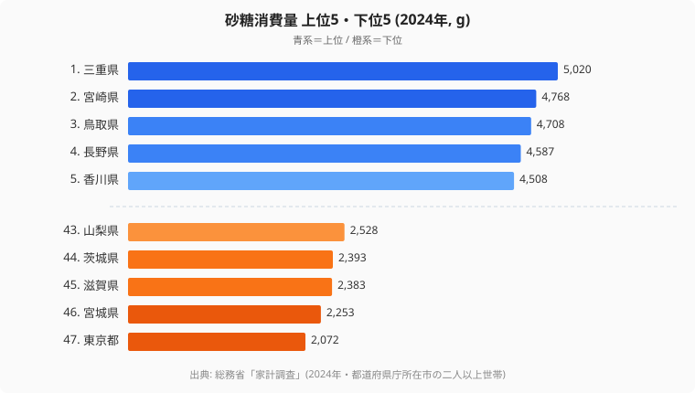

[三重県](/areas/24000)民は、年間でおよそ5kgの砂糖を家庭で購入しています。[東京都](/areas/13000)民の2,072gと比べると、その差は**2.4倍以上**です。同じ日本に暮らしながら、家庭の「甘さ」はこれほどまでに違います。

なぜ三重が突出しているのでしょうか。「郷土食が甘いから」という説はよく聞きますが、三重に特有の砂糖を多用する料理を思い浮かべられる人は、実は多くありません。上位に並ぶ三重・宮崎・鳥取にはそれぞれ別の背景があり、単純に「甘い食文化の県」とひと括りにはできない構造があります。この記事では、砂糖消費量の地域差が「味の好み」ではなく「調理という行動」を映していることを、データから読み解いていきます。

> [!NOTE]
> 総務省「家計調査」の砂糖消費量は、**都道府県庁所在市の二人以上世帯**がスーパーなどで購入した砂糖そのものの量を集計したものです。砂糖入りの加工食品や、外食・中食で口にする砂糖は捕捉されません。つまりこのデータは「甘いものを食べる量」ではなく、**家庭で砂糖を使った料理をどれだけ作るか**を映す指標として読む必要があります。

## 砂糖消費量ランキング 上位5・下位5（2024年）

<source-link href="/ranking/sugar-consumption-quantity">砂糖消費量ランキングをもっと見る</source-link>

上位は三重（5,020g）・宮崎（4,768g）・鳥取（4,708g）・長野（4,587g）・香川（4,508g）と続きます。6位以降も佐賀（4,507g）・山形（4,240g）・島根（4,231g）・新潟（4,179g）・長崎（4,148g）が並び、東海・九州・山陰・四国・東北・甲信越と、**地方の県が広い地域にまたがって上位を占めています**。特定の一地方だけが甘党なのではなく、共通して言えるのは「大都市圏から外れた、家庭で料理を作る習慣が濃い地域」という点です。

一方で下位5県は山梨（2,528g）・茨城（2,393g）・滋賀（2,383g）・宮城（2,253g）・東京（2,072g）。最下位の東京は1位の三重のわずか41%にとどまります。下位には首都圏の近郊県や近畿圏の県が目立ち、上位とは対照的に都市化が進んだ地域が並んでいます。この上位と下位のコントラストこそが、砂糖消費量の地図を理解する出発点になります。

## なぜ三重が1位なのか ── 「煮る文化」と砂糖

三重県が砂糖消費量で突出する理由として、考えられる要因が2つあります。

第1に、伊勢志摩や三重内陸部に根付いた**煮魚・煮物の文化**です。三重は伊勢湾・熊野灘の海産物が豊富で、魚の煮付けや佃煮に砂糖・みりんを多めに使う料理が広く家庭に残っています。甘めの醤油味付けは、薄口を好む関西と甘辛を好む東海の境界に位置する三重の特徴とも重なります。

第2に、**家庭で料理を作る習慣の濃さ**です。家計調査が捕捉するのは「家庭で砂糖を買う」という行動そのものなので、外食産業が発展した地域ほど家庭内の砂糖消費は数字として下がります。三重は東京ほど外食が日常化していない都市規模のため、家庭料理で使う砂糖が高めに出やすいと考えられます。

> [!TIP]
> 砂糖消費量の県差は「甘い食文化かどうか」よりも「家庭で砂糖を使った料理を作る頻度」の差として読むと、上位・下位の顔ぶれがすっきり理解できます。砂糖の消費支出額（金額ベース）のランキングと並べて見ると、量だけでなく精製度の高い砂糖を選ぶ地域かどうかという別の側面も浮かび上がります。

## 最下位グループ ── 外食化と都市部効果

下位5県は山梨（43位・2,528g）・茨城（44位・2,393g）・滋賀（45位・2,383g）・宮城（46位・2,253g）・東京（47位・2,072g）です。最下位の**東京（2,072g）は1位三重の41%**にすぎません。下位に並ぶのは首都圏近郊や近畿圏といった、都市化が進んだ地域が中心です。

ここで主因として挙げられるのが外食化です。都市部では加工食品・外食・コンビニスイーツなどで糖質を摂る機会が多く、わざわざ家庭で砂糖を買って料理に使う頻度が相対的に低くなります。東京都民が砂糖を嫌っているわけではなく、砂糖は「すでに料理や菓子に入った状態」で口に入っているだけなのです。つまり下位県の数字が低いのは、甘いものを避けているからではなく、砂糖の摂取経路が家庭の外へ移っているからだと解釈できます。

> [!WARNING]
> このデータでは「砂糖消費量が少ない＝糖分摂取が少ない」とは言えません。家計調査は家庭内で購入した砂糖だけを集計するため、外食産業が発達した都市部ほど数字が低く出る構造的なバイアスがあります。順位の低さを「健康的」「甘いもの離れ」と短絡しないよう注意してください。

## 上位に共通する「家庭で甘辛く煮る」食文化

上位10県を見渡すと、地理的にはバラバラでも、共通する一本の軸が浮かびます。それは**家庭で煮物・甘辛系の料理を作る文化**が色濃く残っているという点です。

砂糖を多用する郷土食――味噌仕立ての煮物、甘味噌だれ、あんこを使った菓子、甘めの醤油で炊く煮付けなど――が日常に根付いている地域ほど、家計調査の砂糖消費量は高く出る傾向があります。東海の三重、九州の宮崎・佐賀・長崎、山陰の鳥取・島根、四国の香川、そして東北・甲信越の山形・新潟・長野。地方ごとに料理は違っても、「家庭で砂糖を使って甘く煮る」という調理行動が共通の背景にあります。逆に言えば、その調理行動が外食やレトルトに置き換わった都市部では、砂糖を買う量が静かに減っていくということです。

> [!NOTE]
> 上位に長野・山形・新潟といった甲信越・東北の県が含まれる点は見落とされがちです。これらは「甘い郷土食」のイメージが薄い地域ですが、保存食としての煮物・漬物・味噌づくりなど、砂糖を使う家庭内調理が今も残っていることが数字に表れていると考えられます。

## まとめ ── 「砂糖を買う」行動が映す食生活の地域差

砂糖消費量の地域差は、「甘い食べ物が好きか嫌いか」の差ではなく、**家庭で砂糖を使った料理を作るか、それとも外食・加工食品で甘味を摂るか**という行動の差を映しています。

- 1位の三重（5,020g）と最下位の東京（2,072g）で2.4倍以上の開きがあります
- 上位は地方の郷土食文化（煮物・甘辛醤油）が残る地域が中心です
- 下位は外食・加工食品への代替が進んだ都市部・近郊県が並びます
- 「砂糖を買わない都市部」は糖分が減ったのではなく、摂取経路が家庭の外へ変わっただけです

家計調査の食材データを「調理という行動のアーカイブ」として読むと、都市化と郷土食の消長が見えてきます。砂糖消費量は、その最もわかりやすい指標の一つだと言えるでしょう。[economyカテゴリ](/category/economy)の他の家計指標と合わせて見ると、暮らしの地域差がさらに立体的に見えてきます。

## データ出典

- 総務省「家計調査」（2024年・都道府県庁所在市の二人以上世帯）
- e-Stat 経由で都道府県別に整備
