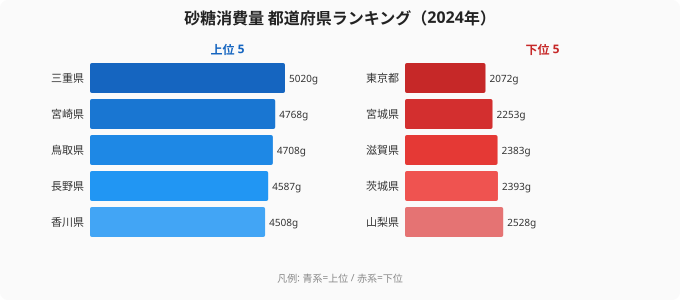
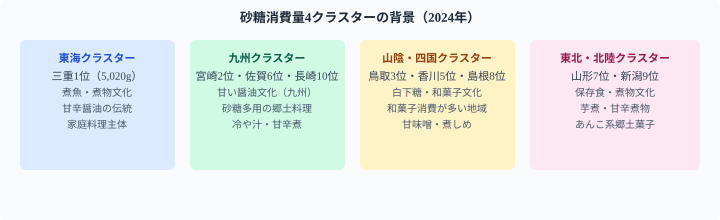

[三重県](/areas/24000)民は年間5kgの砂糖を家庭で購入している。[東京都](/areas/13000)民の2,072gと比べると**2.4倍以上**だ。同じ日本に暮らしながら、家庭の「甘さ」はこれほど違う。

なぜ三重が突出するのか。「郷土食が甘い」という説はあるが、三重に特有の砂糖多用料理が思い当たらない人は多いだろう。実は、1位の三重・2位の宮崎・3位の鳥取にはそれぞれ異なる背景があり、単純に「甘い食文化の県」では括れない構造がある。

> [!NOTE]
> 総務省「家計調査」のデータは**都道府県庁所在市の二人以上世帯**が家庭で購入した砂糖量を集計したもの。スーパーなどで購入した砂糖・砂糖入り調味料が主な対象で、外食・加工食品に含まれる砂糖は捕捉されない。家庭での手作り料理の頻度と「家庭用砂糖を買う習慣」を反映するデータとして解釈する必要がある。

## 砂糖消費量ランキング TOP10（2024年）

<source-link href="/ranking/sugar-consumption-quantity">砂糖消費量ランキングをもっと見る</source-link>

上位は三重（5,020g）・宮崎（4,768g）・鳥取（4,708g）・長野（4,587g）・香川（4,508g）と続き、6位以降も佐賀（4,507g）・山形（4,240g）・島根（4,231g）・新潟（4,179g）・長崎（4,148g）が並ぶ。東海地方の三重、九州の宮崎・佐賀・長崎、山陰の鳥取・島根、四国の香川、東北の山形・新潟と、**全国の地方都市が幅広く上位**に並ぶ。

## なぜ三重が1位なのか ── 「煮る文化」と砂糖

三重県が砂糖消費量で突出する理由として考えられる要因が2つある。

**第1に、伊勢志摩・三重内陸部の煮魚・煮物文化**。三重は伊勢湾・熊野灘の海産物が豊富で、魚の煮付けや佃煮に砂糖・みりんを多用する料理が根付いている。特に甘めの醤油味付けは「関西の薄口vs東海の甘辛」の境界に位置する三重の特徴とも重なる。

**第2に、「家庭で料理を作る」習慣の濃さ**。家計調査は「家庭で砂糖を買う」行動を捕捉する。外食産業が発展するほど家庭内砂糖消費は下がる構造があり、三重は東京ほど外食が日常化していない都市規模のため、家庭料理での砂糖消費が高く出やすい。

> [!TIP]
> 砂糖消費量の都道府県差は、「甘い食文化」の差というより「家庭で砂糖を使った料理を作る頻度」の差とも解釈できる。砂糖消費支出額ランキングと合わせて見ると、単価の高い砂糖（精製度別）を使う地域かどうかも確認できる。

## 最下位グループ ── 外食化と都市部効果

下位5県は山梨（43位・2,528g）・茨城（44位・2,393g）・滋賀（45位・2,383g）・宮城（46位・2,253g）・東京（47位・2,072g）。最下位の**東京（2,072g）は1位三重の41%**にすぎない。東京・宮城・滋賀・茨城・山梨と、**首都圏・近畿圏の県**が下位を占める。

「都市部では加工食品・外食での糖質摂取が多く、家庭で砂糖を買う頻度が低い」という外食化仮説が主因として挙げられる。東京都民が砂糖を使わない甘味嫌いというわけではなく、砂糖が「すでに入った状態のもの」で摂取されているだけだ。

> [!WARNING]
> 家計調査は家庭内購入を集計するため、外食産業が発達した都市部では家庭内消費が低めに出る構造がある。「砂糖消費量が少ない = 糖分摂取量が少ない」ではない点に注意。都市部では加工食品・コンビニスイーツ・外食からの糖分摂取が多い可能性が高い。

## 4つのクラスター構造 ── 甘党地図の背景

砂糖消費量の上位10県を地図上でまとめると、4つのクラスターが見える。

4つのクラスターに共通するのは「家庭で煮物・甘辛系料理を作る文化」の強さだ。砂糖を多用する郷土食（味噌・煮物・甘味噌だれ・あんこ系）が残存している地域ほど家計調査に高く出る傾向がある。

## まとめ ── 「砂糖を買う」行動が映す食生活の地域差

砂糖消費量の地域差は「甘い食べ物が好きか嫌いか」の差ではなく、**「家庭で砂糖を使った料理を作るか、外食・加工食品で摂取するか」の差**を反映している。

- **1位三重（5,020g）・最下位東京（2,072g）で2.4倍差**
- 上位は地方の郷土食文化（煮物・甘辛醤油）が残存する地域
- 下位は外食・加工食品への代替が進んだ都市部・近郊県
- 「砂糖を買わない都市部」は糖分が減ったのではなく、摂取経路が変わっただけ

家計調査の食材データを「調理行動のアーカイブ」として読むと、都市化と郷土食の消長が見えてくる。砂糖消費量は、その最もわかりやすい指標の一つだ。

## データ出典

- 総務省「家計調査」（2024年・都道府県庁所在市の二人以上世帯）
- e-Stat 経由で都道府県別に整備

本記事の対象データ: [関連カテゴリ](/category/economy)
