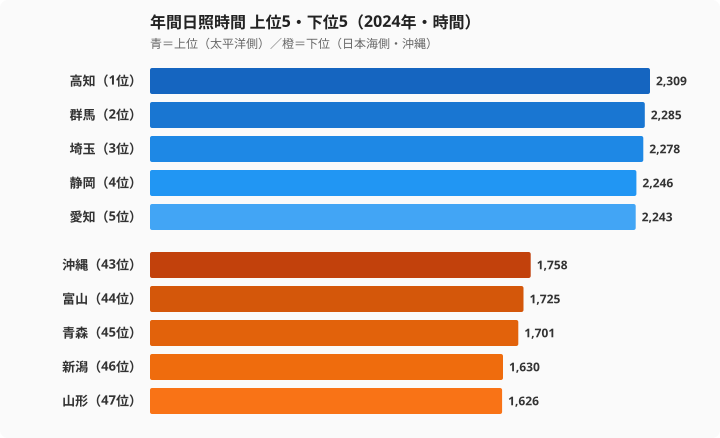

「晴れの国・岡山」というキャッチフレーズを聞いたことがある人は多いはずです。ですが、年間日照時間で本当の「晴れ王国」はどこなのでしょうか。気象庁の2024年データを見ると、岡山は15位にとどまり、1位は[高知県](/areas/39000)（2,309時間）、そして下位には「南国＝晴れ」というイメージに反して[沖縄県](/areas/47000)が沈んでいます。この順位は偶然ではなく、日本列島の地形と季節風が決めた必然の構造です。

この記事では、47都道府県の年間日照時間を「なぜそこが長い（短い）のか」という気象メカニズムから解き明かしていきます。先に結論を言えば、日照の地域差を決めているのは「冬に季節風が山脈のどちら側に当たるか」という一点に尽きます。

## 上位5県と下位5県──太平洋側と日本海側で683時間の差

<data-source url="https://www.e-stat.go.jp/dbview?sid=0000010102" label="e-Stat 社会・人口統計体系"></data-source>

1位は高知県（2,309時間）です。2位の群馬県（2,285時間）、3位の埼玉県（2,278時間）と続きます。トップ10には静岡・愛知・茨城・三重・神奈川・岐阜・山梨が入り、その多くを太平洋側と内陸の県が占めています。

一方、下位5県は沖縄・富山・青森・新潟・山形で、最も短いのは山形県（1,626時間）です。新潟・富山・青森と日本海側が下位に集中しています。最長の高知と最短の山形を比べると、その開きは683時間にのぼります。

上位に並ぶのは、いずれも冬に乾いた晴天が続く地域です。高知は太平洋に面し、冬の季節風が四国山地で遮られて乾いた空気が降りてきます。群馬・埼玉が高知に肉薄するのは「からっ風」の恩恵で、関東平野は西側の山地が日本海側の湿気を遮るため、冬の晴天日数が全国でも屈指になります。対して下位5県のうち富山・青森・新潟・山形は、冬に季節風が直接当たる日本海側です。山を越える前の湿った空気がそのまま雪雲となり、年間の日照を大きく押し下げています。同じ日本でも、太陽が届く時間が1日あたり1.8時間以上違う計算になります。

> [!NOTE]
> このデータは各都道府県庁所在地の気象台で観測された値です。同じ県でも山間部と沿岸部で大きく異なる場合があり、たとえば内陸の盆地と沿岸では日照傾向が逆になることもあります。また複数年の平均値ではなく単年（2024年）のため、その年の気象条件の偶然も含まれている点に注意してください。

<source-link href="/ranking/annual-sunshine-duration">年間日照時間ランキング全47県をもっと見る</source-link>

## なぜ太平洋側は晴れるのか──季節風を遮る山脈の構造

太平洋側と日本海側の日照格差をつくる主因は、冬の季節風です。

冬になると、シベリア高気圧から吹く北西の季節風が、日本海を渡る間に大量の水蒸気を含みます。この湿った空気は中央脊梁山脈（奥羽・越後・飛騨山脈）にぶつかって上昇し、日本海側に大量の雪と曇天をもたらします。山を越えたあと、太平洋側には乾いた空気が降りてきて晴天をつくる──これが「太平洋側の冬晴れ」の正体です。

仕組みを整理すると、次のようになります。

- 日本海側：季節風が直接当たり、雲と降雪が発生して日照時間が短くなります
- 太平洋側：山脈が季節風を遮断し、乾燥した下降気流によって晴天が続きます

群馬県（2位）・埼玉県（3位）が上位に入るのも、この構造で説明できます。関東平野は西側に赤城山・榛名山・秩父山地を持ち、冬の「からっ風」が日本海側からの湿気を遮ります。関東の冬は、日照時間を延ばす絶好の地形条件を備えているのです。高知が1位になるのも同じ理屈で、四国山地が冬の季節風を堰き止め、太平洋側の高知平野には乾いた晴天が広がります。

## 日本海側が沈む理由──北陸・東北が抱える構造的な不利

下位に並ぶ富山・青森・新潟・山形は、すべて日本海側です。冬季の曇天と降雪が、年間日照時間を押し下げる構造を持っています。

- 富山県（44位・1,725時間）：北アルプス北西側にあたり、冬は鉛色の空が続く豪雪地です
- 青森県（45位・1,701時間）：奥羽山脈の西側で季節風の影響を強く受けます
- 新潟県（46位・1,630時間）：越後山脈の西側に広がる豪雪地帯で、年間雪日数が多い地域です
- 山形県（47位・1,626時間）：奥羽山脈西側の季節風直撃地で、47都道府県で最も日照が短い県です

日本海側の不利は冬だけにとどまりません。梅雨や秋雨の時期も日本海側は曇天が長く続き、夏の日照時間でも太平洋側に及ばないことが多い地域です。1年を通じて、構造的に太陽光が届きにくい土地だといえます。

> [!WARNING]
> 「日本海側＝雪が多いから日照が短い」と単純化しすぎないよう注意が必要です。日照時間ランキングと雪日数ランキングは順位が完全には一致しません。標高や盆地地形によって、同じ日本海側でも晴れやすい地点が存在します。日照の長短を語るときは、雪日数や降水日数といった別指標と必ず突き合わせて読むことをおすすめします。

<source-link href="/ranking/annual-snow-days">年間雪日数ランキングをもっと見る</source-link>

<source-link href="/ranking/annual-precipitation-days">年間降水日数ランキングをもっと見る</source-link>

## 沖縄が下位に沈む理由──南国イメージと日照データの乖離

「南国＝晴れ」というイメージに反して、沖縄県は下位グループ（1,758時間）に入っています。この「意外な事実」には、明確な気象的理由があります。

沖縄は海洋性気候で、1年を通じて気温が高く湿度も高い土地です。春から夏にかけての長い梅雨（沖縄の梅雨入りは5月上旬）、台風の多い夏から秋、そして冬も北から下りてくる曇天──いずれも日照を妨げる要素になります。日差しが強いという印象と、年間を通した日照時間の長さは別物だということです。

一方、「晴れの国・岡山」のキャッチフレーズで知られる[岡山県](/areas/33000)は15位（2,189時間）です。実際に高い水準にあるのは事実ですが、1位ではありません。岡山の強みは「日照時間」よりも「降水日数が全国最少クラス」にあります。雨の日が少ない一方で、晴れ間の長さでいえば高知や群馬に及ばない──これが正確な姿です。「晴れの国」というより「雨の降らない国」と呼ぶほうが、データ的には実態に近いといえます。

> [!TIP]
> 太陽光発電の設置を検討する場合は、「年間日照時間」だけでなく「冬季（12月〜2月）の日照時間」も確認することが重要です。日本海側は冬に発電量が落ち込み、パネルが積雪に覆われるリスクもあります。年間の発電量を安定させたいなら、冬も晴天が続く太平洋側のほうが有利になります。

<source-link href="/ranking/annual-clear-days">年間快晴日数ランキングをもっと見る</source-link>

## 日照時間と降水日数の関係──晴れる県・降らない県の地図

日照時間が長い県ほど降水日数が少ない傾向があり、両者は強い逆相関を示します。タイプ別に整理すると、地域の個性が見えてきます。

- 「晴れの優等生」：岡山・香川・山梨・広島──瀬戸内と甲府盆地は降水日数が少なく、日照も長い地域です
- 「多雨多照」：宮崎・高知──台風や梅雨で雨は多いものの、それ以外の晴天で年間日照時間が伸びます
- 「多雨寡照」：富山・新潟──北陸は冬の降雪で、降水日数も日照時間も両方が不利になります

岡山の「降水日数が全国最少クラス」という強みは、降水日数ランキングで見るほうが正確に評価できます。日照時間で15位という結果は、岡山が「晴れている県」というより「雨が少ない県」であることを示しているのです。雨の少なさと日照の長さは似て非なる指標であり、両方を並べて初めて県の気候像が立体的に見えてきます。

<source-link href="/ranking/annual-precipitation">年間降水量ランキングをもっと見る</source-link>

## 日照時間が左右する生活・産業への影響

日照時間の地域差は、いくつかの分野で実際の影響を与えています。

太陽光発電では、発電量が日照時間にほぼ比例します。九州・四国・東海が有利で、北陸・東北は不利になります。日本海側で太陽光を導入する際は、冬季の発電量低下と積雪リスクを前提にした設計が欠かせません。

農業では、日照時間が長い地域ほど果物や野菜の糖度が上がる傾向があります。高知のショウガ・柚子・なす、群馬のキャベツ・こんにゃく芋の品質は、豊富な日照量と温度条件の恩恵を受けています。

健康面でも、日照不足が続く地域ではビタミンDの合成が減りやすく、骨の健康に影響する可能性が指摘されています。日本海側の冬季日照不足は、住む人の健康にとっても無視できない構造的な課題だといえます。移住先を「晴れの多さ」で選ぶなら、高知・群馬・埼玉・山梨のような太平洋側の県が有力な候補になります。

## まとめ

日照時間の地域差は「たまたま」ではなく、日本列島の地形と季節風が決める構造的な必然です。最後に要点を整理します。

- 太平洋側：中央山脈が季節風を遮断し、冬の晴天が年間値を押し上げます（1位は高知の2,309時間）
- 日本海側：季節風が直撃し、冬の曇天と降雪が年間値を押し下げます（最下位は山形の1,626時間）
- 1位と最下位の開きは683時間で、1日あたり約1.8時間の差に相当します
- 沖縄：海洋性気候の梅雨と台風が日照を妨げ、南国イメージほど日照は長くありません
- 岡山：降水日数は全国最少クラスですが日照時間は15位で、「晴れ」より「雨なし」が正確な強みです

移住や太陽光発電を検討する際は、単年の日照時間だけでなく、複数年平均・冬季の日照パターン・降水日数を合わせて確認することをおすすめします。

## データ出典

- 気象庁「気象観測統計」（2024年）
- [e-Stat 政府統計の総合窓口](https://www.e-stat.go.jp/)（統計体系コード: 0000010102）
- 観測地点：各都道府県庁所在地の気象台
