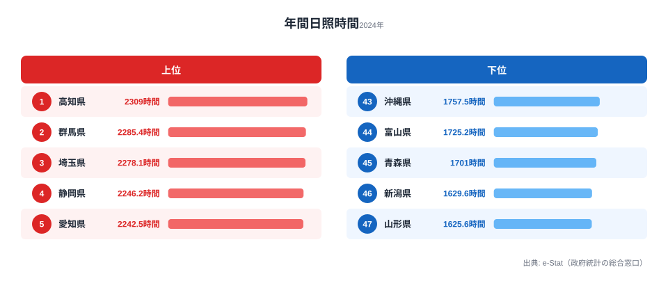

「晴れの国・岡山」というキャッチフレーズを聞いたことがある人は多いでしょう。しかし、年間日照時間で本当の「晴れ王国」はどこなのか──気象庁の2024年データを見ると、岡山は15位にすぎず、1位は[高知県](/areas/39000)（2,309時間）、43位には意外にも[沖縄県](/areas/47000)（1,758時間）が沈んでいます。この順位は偶然ではなく、日本列島の地形と季節風が決めた必然の構造なのです。

この記事では、47都道府県の年間日照時間を「なぜそこが長い（短い）のか」という気象メカニズムから解き明かします。先に結論を言えば、日照を左右しているのは「夏に晴れるかどうか」ではなく「冬に季節風を山脈が遮れるかどうか」です。

## 年間日照時間ランキング（2024年）

<data-source url="https://www.e-stat.go.jp/dbview?sid=0000010102" label="e-Stat 社会・人口統計体系"></data-source>

**1位は高知県**（2,309時間）。2位の群馬県（2,285時間）、3位の埼玉県（2,278時間）と続きます。4位以下は静岡・愛知・茨城・三重・神奈川・岐阜・山梨で、**トップ10はすべて太平洋側または内陸の関東甲信**が占めます。

一方、**最下位は山形県（1,626時間）**。新潟・青森・富山と日本海側が下位に集中し、43位には沖縄も顔を出します。1位高知と47位山形の差は**683時間**にのぼります。

> [!NOTE]
> データは各都道府県庁所在地の気象台で観測された値です。同じ県でも山間部・沿岸部で大きく異なる場合があります。複数年の平均値でなく単年（2024年）のため、気象条件の偶然も含まれます。

<source-link href="/ranking/annual-sunshine-duration">年間日照時間ランキング全47県を見る</source-link>

## なぜ太平洋側は晴れるのか──季節風の遮断構造

太平洋側と日本海側の日照格差の主因は**冬の季節風**にあります。

冬、シベリア高気圧から吹く北西の季節風は、日本海を渡る間に大量の水蒸気を含みます。この湿った空気は**中央脊梁山脈（奥羽・越後・飛騨山脈）にぶつかって上昇し、日本海側に大量の雪と曇天をもたらします**。山を越えた後、太平洋側には乾いた空気が降りてきて晴天をもたらす──これが「太平洋側の冬晴れ」の正体です。

具体的な仕組みを整理すると：

- **日本海側**: 季節風が直接当たる → 雲・降雪 → 日照時間が短い
- **太平洋側**: 山脈が季節風を遮断 → 乾燥した下降気流 → 晴天が続く

群馬県（2位）・埼玉県（3位）が上位に入るのも、この構造で説明できます。関東平野は西側に赤城山・榛名山・秩父山地を持ち、冬の「からっ風」が日本海側からの湿気を遮断します。関東の冬は日照時間を延ばす絶好の地形条件を備えています。

## 日本海側が沈む理由──北陸・東北の構造的不利

最下位の山形（47位・1,626時間）から新潟（46位・1,630時間）、青森（45位・1,701時間）、富山（44位・1,725時間）まで、下位を占めるのはいずれも日本海側の豪雪地帯です。**冬季の曇天・降雪が年間日照時間を押し下げる構造**を共有しています。

- **山形（47位・1,626時間）**: 奥羽山脈の西側に位置し、冬の季節風が直撃する豪雪地帯です。
- **新潟（46位・1,630時間）**: 越後山脈の西側で、世界有数の豪雪地として知られます。
- **青森（45位・1,701時間）**: 日本海と津軽海峡に挟まれ、冬は雪雲が常駐します。
- **富山（44位・1,725時間）**: 北アルプス北西側で、立山連峰が湿った季節風を受け止めます。

日本海側の問題は冬だけではありません。梅雨・秋雨の時期も日本海側は曇天が長く続き、夏の日照時間でも太平洋側に劣る傾向があります。1年を通じて構造的に太陽光が届きにくい地域といえます。

<source-link href="/ranking/annual-snow-days">年間雪日数ランキング</source-link>

<source-link href="/ranking/annual-precipitation-days">年間降水日数ランキング</source-link>

## 沖縄が43位の理由──南国イメージと日照データの乖離

「南国＝晴れ」というイメージに反して、**沖縄県は43位（1,758時間）**です。この「意外な事実」には明確な気象的理由があります。

沖縄は**海洋性気候**で、1年を通じて気温が高く湿度も高いのが特徴です。春から夏にかけての長い梅雨（沖縄の梅雨入りは5月上旬）、台風が多い夏秋、冬も北から下りてくる曇天──いずれも日照を妨げる要素です。

一方、「晴れの国・岡山」のキャッチフレーズで知られる**[岡山県](/areas/33000)は15位（2,189時間）**です。実際に高い水準にあるのは事実ですが、1位ではありません。岡山の強みは「日照時間」よりも**「降水日数が全国最少クラス（86日）」**にあります。雨の日は少ないものの、晴れ間の量でいえば高知や群馬に届かない──これが正確な姿だといえます。

> [!TIP]
> 太陽光発電の設置を検討する場合、「年間日照時間」だけでなく「冬季（12月〜2月）の日照時間」も確認することが重要です。日本海側は冬に発電量が落ち込み、パネルが積雪に覆われるリスクもあります。発電量の年間安定性は太平洋側が有利です。

<source-link href="/ranking/annual-clear-days">年間快晴日数ランキング</source-link>

## 日照時間と降水日数──晴れと雨は別物

日照時間と降水日数を突き合わせると、「日照時間が長い県ほど降水日数が少ない」という大まかな傾向が見えてきます。ただし両者は完全には一致せず、県ごとに4つのタイプに分かれます。

- **「晴れの優等生」**: 岡山・香川・山梨・広島──瀬戸内と甲府盆地は降水日数が少なく日照も長いタイプです。
- **「多雨多照」**: 宮崎・高知──台風・梅雨で雨は多いものの、それ以外の季節の晴天で年間日照時間が伸びるタイプです。
- **「少雨少照」**: 宮城──雨は少ないが曇天日が多く、日照は伸び悩む北東型です。
- **「多雨寡照」**: 富山・石川・福井──北陸は冬の降雪で降水日数も多く日照時間も短い、両方不利なタイプです。

なかでも**岡山は降水日数86日で全国最少**（年間降水日数ランキング47位）です。岡山のキャッチフレーズは「晴れの国」よりも「雨の降らない国」のほうが、データ的には正確なのかもしれません。

> [!TIP]
> 「降水日数が少ない＝日照時間が長い」とは限りません。岡山のように雨の日が少なくても、曇りの日が多ければ日照時間は伸びません。住む場所の天気を評価するなら、日照時間（晴れ間の量）と降水日数（雨の頻度）の両方を別々に確認するのがおすすめです。

<source-link href="/ranking/annual-precipitation">年間降水量ランキング</source-link>

## 単年データの落とし穴──順位は毎年入れ替わる

本記事で扱っているのは2024年の単年データです。日照時間は梅雨明けの時期や台風の進路といった、その年限りの気象条件に大きく左右されます。同じ県でも、晴天に恵まれた年と曇天が続いた年では年間値が数百時間も振れることがあり、順位は毎年のように入れ替わります。

そのため「この県は日照時間が長い」という評価を下すときは、単年の順位だけを根拠にしないことが大切です。地形と季節風という**構造的な要因**（太平洋側か日本海側か、山脈の風下に当たるか）は年によらず安定していますが、最終的な順位の上下数位は気象の偶然で動きます。本記事が「1位は高知」よりも「なぜ太平洋側が有利なのか」という構造を主題に据えているのは、このためです。

> [!WARNING]
> 「日照時間が増えた／減った」という長期トレンドの主張には、複数年の平均値と統計的な検定が必要です。単年の前年比増減を「気候変動の証拠」として解釈するのは不正確で、本記事の2024年データもあくまで一断面として読むべきものです。

## 日照時間が左右する生活・産業への影響

日照時間の地域差は、以下の分野に実際の影響を与えます。

**太陽光発電**: 発電量は日照時間に比例します。九州・四国・東海が有利で、北陸・東北は不利。日本海側で太陽光を導入する際は、冬季の発電量低下と積雪リスクを前提にした設計が必要です。

**農業（光合成と積算温度）**: 日照時間が長い地域は果物・野菜の糖度が上がる傾向があります。高知のショウガ・柚子・なす、群馬のキャベツ・こんにゃく芋の品質は、日照量と温度条件の恩恵を受けています。

**健康・ビタミンD**: 日照不足が続く地域ではビタミンD合成が減少し、骨粗鬆症リスクに影響する可能性があります。日本海側の冬季日照不足は、健康面でも注意が必要な構造的課題です。

**移住・住環境**: 「晴れが多い場所に住みたい」というニーズに対し、高知・[群馬](/areas/10000)・埼玉・山梨のような太平洋側の県が有利な条件を持っています。気温・降水量・積雪といった他の気候指標も合わせて見たい場合は、[気候・地理カテゴリ](/category/landweather)のランキング一覧が参考になります。

## まとめ

日照時間の地域差は「たまたま」ではなく、日本列島の地形と季節風が決める**構造的必然**です。

- 太平洋側：中央山脈が季節風を遮断 → 冬の晴天が年間値を押し上げる
- 日本海側：季節風が直撃 → 冬の曇天・降雪が年間値を押し下げる
- 沖縄：海洋性気候の梅雨・台風が日照を妨げる（南国イメージは不正確）
- 岡山：降水日数最少だが日照時間は15位（「晴れ」より「雨なし」が正確な強み）

移住や太陽光発電の検討では、単年の日照時間より複数年平均・冬季の日照パターン・降水日数を合わせて確認することをおすすめします。

## データ出典

- 気象庁「気象観測統計」(2024年)
- [e-Stat 政府統計の総合窓口](https://www.e-stat.go.jp/) (統計体系コード: 0000010102)
- 観測地点：各都道府県庁所在地の気象台
