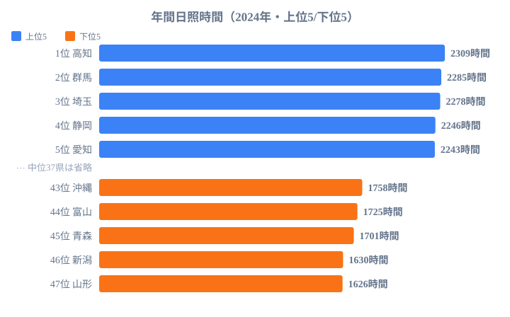
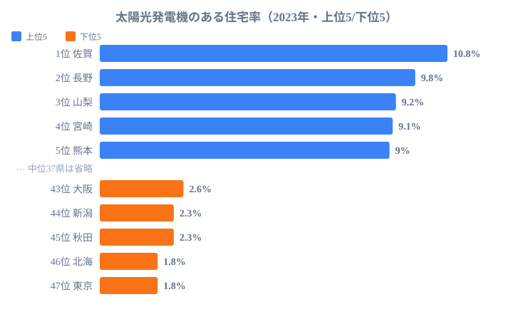
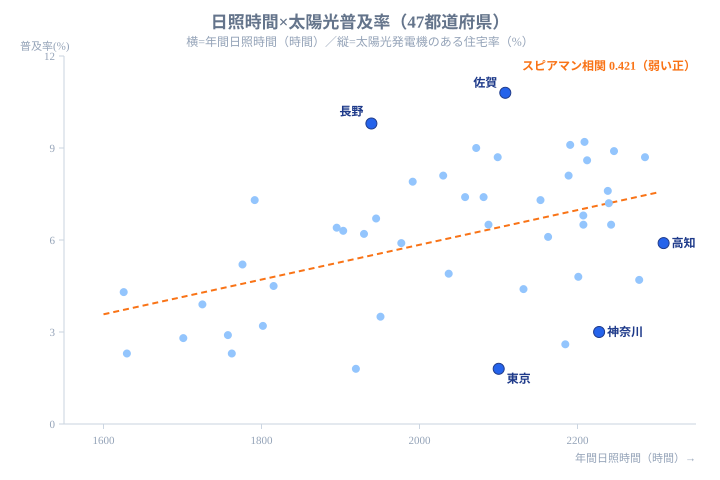

「日が照る県ほど、屋根に太陽光パネルが載っているはずだ」──太陽光発電は太陽の光で発電する以上、これはごく自然な予想に思えます。年間日照時間が日本一の高知県では、さぞパネルだらけになっているのではないか、と。

ところが、データはこの直感をあっさり裏切ります。年間日照時間が全国1位の**高知県の住宅太陽光普及率は5.9%で、47都道府県中29位**。一方、普及率トップは日照20位の佐賀県（10.8%）、2位は日照33位の長野県（9.8%）です。日照ランキングと普及率ランキングは、見事なまでにかみ合っていません。先に結論を言えば、太陽光パネルが載るかどうかを最初に決めているのは、空から降る光の量ではなく、地上にある屋根の形なのです。

> [!NOTE]
> 本記事で扱う2つの指標は次のとおりです。
> **年間日照時間**：気象庁の観測値をもとにした2024年の都道府県別データ（単位：時間）。
> **住宅太陽光普及率**：総務省「住宅・土地統計調査」（2023年）による「太陽光発電機のある住宅の割合」（単位：%）。これは**全住宅に対する割合**であり、発電容量やパネルの枚数ではない点に注意。

## 日照ランキングと普及率ランキングは一致しない

まず2つのランキングを並べてみます。最初に、年間日照時間の上下を確認します。

**年間日照時間の上位**は、高知（2309時間）・群馬（2285時間）・埼玉（2278時間）・静岡（2246時間）・愛知（2243時間）と続きます。太平洋側の県が目立ちます。逆に下位は山形（1626時間）・新潟（1630時間）・青森（1701時間）と、日本海側や東北の雪国が並びます。日照の多寡そのものは、太平洋側か日本海側かという地理でほぼ説明できる素直な分布をしています。

<source-link href="/ranking/annual-sunshine-duration">年間日照時間ランキングをもっと見る</source-link>

ここで重要なのは、この素直な日照の分布と、次に見る普及率の分布が**まったく揃っていない**ことです。普及率の上下を見てみます。

**住宅太陽光普及率の上位**は、佐賀（10.8%）・長野（9.8%）・山梨（9.2%）・宮崎（9.1%）・熊本（9.0%）。九州・中部の県が並びます。日照上位の常連だった群馬・埼玉・静岡・愛知のうち、普及率トップ5に残ったのは1県もありません。象徴的なのが[高知県](/areas/39000)です。日照は全国1位なのに普及率は29位。逆に[長野県](/areas/20000)は日照が33位と中位以下にもかかわらず、普及率は2位の9.8%に達しています。日照8位の神奈川県は普及率40位（3.0%）、日照16位の大阪府は普及率43位（2.6%）。日が比較的よく照る都市部の県が、普及率では軒並み下位に沈んでいます。「日照が普及率を決めている」とは、とても言えない並びです。むしろ、日照とは別の何かが普及率を強く左右している、と考えるほうが自然でしょう。

<source-link href="/ranking/solar-panel-housing-rate">太陽光発電機のある住宅率ランキングをもっと見る</source-link>

## 都市部が軒並み低い──集合住宅という構造

普及率の下位を見ると、傾向はもっとはっきりします。

最下位は**東京都の1.8%**。北海道（1.8%）、秋田（2.3%）、新潟（2.3%）、大阪（2.6%）、青森（2.8%）、沖縄（2.9%）、神奈川（3.0%）と続きます。この中で東京・大阪・神奈川は三大都市圏の中心です。日照で見ると東京は21位、大阪は16位、神奈川は8位と、いずれも下位ではありません。それでも普及率は全国でも最低レベルにとどまっています。

都市部の普及率が低い理由は、日照ではなく**住まいの形**にあります。東京・大阪・神奈川のような人口密集地はマンションやアパートなどの集合住宅が中心で、世帯あたりの「屋根」が少なくなります。太陽光パネルを載せるには日当たりのよい屋根面積が必要ですが、集合住宅に住む世帯は屋根を専有していません。

ここで思い出したいのが、この指標が**全住宅に対する割合**だという点です。集合住宅の多い都市は、分母にパネルを載せにくい住宅が大量に含まれます。つまり都市部の低い数値は、住民が太陽光に消極的だからというより、**住宅ストックの構成上、構造的に低くなる**面が大きいのです。神奈川県が日照8位でありながら普及率40位という落差は、その典型といえます。日照という「資源」は十分にあるのに、それを受け止める屋根が足りない、という状態です。

> [!WARNING]
> 下位に並ぶ都市部の数値を「環境意識が低い」と読むのは適切ではありません。これは全住宅に対する割合なので、集合住宅の多い都市は住民の意欲とは無関係に分母が膨らみ、割合が低く出ます。逆順位（日照は高いのに普及率は低い県）が現れるのは、この分母効果が主な原因です。

## 普及率上位は地方の戸建て中心県

逆に普及率の上位に並ぶのは、佐賀・長野・山梨・宮崎・熊本・静岡・栃木・群馬・岐阜といった県です。

これらに共通するのは、人口密集地の大都市を抱えず、**戸建て住宅が住宅ストックの中心を占める地域**だという点です。戸建て住宅は世帯ごとに屋根を専有しているため、太陽光パネルを設置する物理的な余地があります。分母に占める「載せられる屋根」の比率が高いぶん、割合としての普及率も上がりやすくなります。

普及率2位の長野県は、日照では33位（1939時間）と決して恵まれているわけではありません。それでも9.8%という高い普及率を示すのは、戸建て中心の住宅事情が後押ししていると読むのが自然です。日照1位の高知県（普及率29位）と長野県（普及率2位）の対比は、「日照の多さ」より「戸建ての屋根があるかどうか」が普及率を左右していることを示しています。日照ではほぼ正反対の位置にいる2県が、普及率ではこれだけ逆転するのですから、日照以外の要因の大きさがうかがえます。

ここで一点、慎重に言葉を選んでおきます。「戸建て率が主因だ」と言い切るには、戸建て比率の指標と突き合わせたさらなる検証が必要です。本記事で確かなのは、**普及率上位は大都市を持たない地方県、下位は都市部の県**という観測事実です。その背景に住宅構成の違いがある、という説明は妥当ですが、断定はしすぎないでおきます。

<ad-slot></ad-slot>

## 相関は「弱い正」──日照は効くが主因ではない

では日照はまったく無関係なのでしょうか。それも違います。

日照時間と住宅太陽光普及率の**スピアマン順位相関係数は0.421**。これは「弱い正の相関」にあたる数値です。無相関（0付近）でもなければ、強い相関（0.7以上）でもありません。

47都道府県を、横軸に年間日照時間、縦軸に普及率をとって1枚に重ねると、この「弱い正」の正体が一目で見えてきます。

点はゆるやかに右上がりに散らばっており、傾向としては「日照が多い県ほど普及率がやや高い」ことが読み取れます。しかし点のばらつきは大きく、回帰線（オレンジ）から大きく外れる県が目立ちます。とりわけ右下の[高知県](/areas/39000)は、日照が全国最右端（1位・2309時間）にありながら普及率は5.9%と中位以下で、トレンドから大きく下振れしています。逆に左上の[長野県](/areas/20000)は日照が中位より下（33位）なのに普及率9.8%まで上振れし、外れ値として浮かび上がります。日が照る量で素直に並ぶなら高知は右上、長野は左下にあるはずですが、実際はその逆。散布図はこの2県の「逆転」を、回帰線からの距離としてはっきり示しています。

加えて、右下に沈む点の多くは[東京](/areas/13000)（日照21位・普及率最下位1.8%）や[神奈川](/areas/14000)（日照8位・普及率40位・3.0%）といった都市部です。日照は十分なのに普及率が低い――これらが回帰線を下に引っ張り、相関を弱めています。散布図全体は「右上がりだが点が縦に大きく散る」形で、日照だけでは普及率の高低を当てられないことを視覚的に裏づけています。

<source-link href="/ranking/solar-panel-housing-rate">太陽光発電機のある住宅率ランキングをもっと見る</source-link>

この0.421という値の読み方は、次のように整理できます。

- 日照が多いほど普及率が高くなる**ゆるやかな傾向はある**
- しかしその傾向は弱く、**日照だけで普及率は説明できない**
- 高知（日照1位・普及29位）や長野（日照33位・普及2位）のような大きな例外が多数存在する

つまり、日照は太陽光普及に「多少は効く」要因ではあるものの、**主因ではない**というのが正確な結論です。日が照る量よりも、その県の住宅が戸建て中心か集合住宅中心か──都市度のほうが、ランキングを大きく動かしています。日照という「見かけの相関」の裏にあるのは、戸建て中心の地方県ほど日照にも恵まれやすいという、ゆるい地理的な重なりにすぎないとも読めます。

「太陽光パネルは"日が照る場所"ではなく"戸建ての屋根がある場所"に載る」。0.421という相関係数は、この見方を裏づける数字です。

> [!TIP]
> 相関係数0.421は「相関はあるが因果ではない」典型例です。日照の多い太平洋側にはたまたま戸建て中心の県も多く、両者がゆるく重なって弱い正の相関を生んでいます。普及率を本気で読むなら、日照ではなく戸建て比率・補助金・住宅メーカーの営業エリアといった指標と並べて見るのが近道です。

## この指標を読むときの注意点

最後に、この比較を読むうえでの限界を整理しておきます。

**1. 「住宅の割合」であって発電量ではない**
今回の普及率は「太陽光発電機のある住宅の割合」です。1軒あたりのパネル容量や、メガソーラーなど住宅以外の発電設備は含まれていません。発電容量で比べれば、広い土地に大規模設備を持つ県のランキングは別の姿になります。

**2. 集合住宅の多さが分母を押し下げる**
繰り返しになりますが、これは全住宅に対する割合です。集合住宅が多い都市部は、住民の意識に関わらず数値が低く出ます。低い県を「環境意識が低い」と読むのは適切ではありません。

**3. 制度・補助金・電力事情の影響**
住宅太陽光の普及には、自治体ごとの補助金、住宅メーカーの営業エリア、電力会社の買い取り条件なども関わります。本記事の2指標だけで普及率のすべては説明できません。

それでも、日照ランキングと普及率ランキングの不一致、そして相関係数0.421という数字は、私たちの素朴な予想を見直させてくれます。太陽光パネルが載るかどうかを最初に決めているのは、空から降る光の量ではなく、地上にある屋根の形なのです。エネルギー全般の地域差は[エネルギーカテゴリ](/category/energy)からも確認できます。

## データ出典

- 年間日照時間：気象庁観測値（2024年）。e-Stat 経由で整備
- 住宅太陽光普及率：総務省「住宅・土地統計調査」（2023年）「太陽光発電機のある住宅の割合」

<data-source url="https://www.stat.go.jp/data/jyutaku/" label="総務省 住宅・土地統計調査"></data-source>
