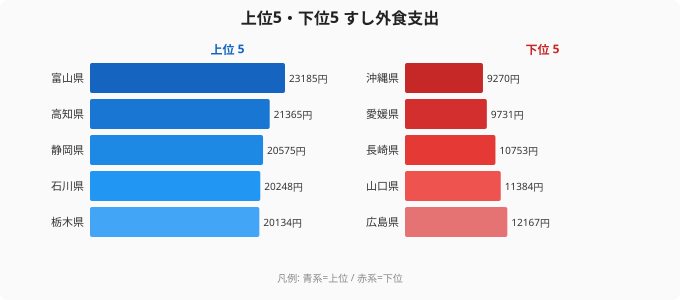
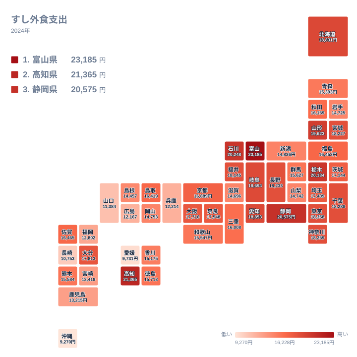

「寿司といえば東京、築地、高級店」——そんなイメージで首位を予想すると、データは意外な答えを返してきます。総務省「家計調査」2024年の**すし外食支出**で全国トップに立ったのは富山県で、1世帯あたり年間23,185円でした。2位は高知県21,365円、3位は静岡県20,575円と、地理的にはまったく離れた3県が表彰台を占めています。寿司店の数が全国最多の東京都は18,358円で10位にとどまり、最下位は沖縄県の9,270円。首位富山との差は2.5倍にのぼります。

なぜ寿司の「聖地」とされる東京や大阪をしのいで、富山や高知がすし外食支出の上位に並ぶのでしょうか。そしてなぜ沖縄は最下位なのでしょうか。この記事では、地理・食文化・産業構造の3軸からその理由を読み解いていきます。

## 上位と下位の分布——上位は地理がバラバラ、下位は西日本に集中

<source-link href="/ranking/sushi-dining-consumption-expenditure">すし外食支出ランキングの全件データを見る</source-link>

上位5県は富山・高知・静岡・石川・栃木です。日本海沿岸の富山・石川、太平洋沿岸の高知・静岡、海のない内陸県である栃木と、地理的なまとまりがありません。「日本海側だから高い」「漁港が近いから高い」といった単純な説明では届かない、ばらけた顔ぶれになっています。これがこのランキングの最初の意外性です。

一方、下位5県は広島・山口・長崎・愛媛・沖縄と、瀬戸内・西日本・島嶼部に偏っています。広島12,167円、山口11,384円、長崎10,753円、愛媛9,731円、そして沖縄9,270円という並びです。上位の散らばりとは対照的に、下位は地理的なまとまりを持っているのが特徴です。

富山県の23,185円という数字を細分化すると、月換算で約1,932円になります。すしを外食として食べる代金だけで毎月2,000円近くを使っている計算で、これは単なる「ぜいたく」というより、すしが日常の外食として根付いていることを示しています。最下位の沖縄9,270円は富山の約4割で、ほぼ月800円弱。同じすし外食でも、暮らしへの入り込み方が県によってこれだけ違うわけです。

> [!NOTE]
> 「すし外食支出」は総務省「家計調査」における外食費の内訳項目の一つで、**外食として食べたすし**の支出額を集計したものです。スーパーの寿司パックや出前・テイクアウトは「すし（中食）」として別計上されるため、本データには含まれません。回転寿司・カウンター寿司・持ち帰り寿司チェーンのイートインなど、外食店で飲食したすし代が対象です。「すしをどれだけ食べるか」ではなく「すしを外で食べるか／家で食べるか」の習慣差が色濃く出る指標である点に注意してください。

## なぜ富山が突出するのか——日本海の鮮魚と回転寿司の集積

首位の富山県が突出する背景には、地元の鮮魚資源と外食インフラの両方があります。

富山湾は「天然のいけす」と称され、白えび・ほたるいか・ぶり・甘えびなど高価値の魚介が水揚げされます。こうした地元産の良質な素材が中価格帯の回転寿司にも流通するため、「地元でしか食べられないネタ」が外食の動機になりやすい環境です。隣接する石川県は4位・20,248円で、加能ガニやのどぐろの産地でもあり、富山と並んで日本海の鮮魚文化を共有しています。

ここで重要なのは、高級店よりも回転寿司を含む中価格帯の利用頻度です。高単価の板前寿司に月1回行くより、回転寿司に月4回行くほうが年間支出は高くなります。地元産の鮮魚が日常的に手の届く価格で並ぶ富山・石川では、家族で気軽にすし店へ向かう生活パターンが定着しやすく、これが「量」となって支出を押し上げていると考えられます。[富山県エリア詳細](/areas/16000)では、食関連の指標とあわせて地域の特性を確認できます。

> [!WARNING]
> 家計調査は都道府県庁所在地の市区町村を調査地点とするため、**県全体の実態と一部乖離がある場合があります**。富山市・金沢市など県庁所在地の外食習慣が県全体の数値を代表している点に注意してください。また調査対象は「二人以上世帯」であるため、単身世帯比率が高い大都市圏では単身者の外食支出が反映されず、東京・大阪が相対的に低く出る一因にもなっています。

## なぜ高知や栃木が上位に入るのか——「海あり」「海なし」で割れない理由

上位の意外さは、2位の高知県と5位の栃木県に集約されています。

高知県は21,365円で、かつお文化・皿鉢料理という独自の魚食文化を持つ県です（[高知県エリア詳細](/areas/39000)）。かつおのたたきに代表される「魚を生・半生で外食する」習慣が強く、すしもその延長線上の外食として選ばれやすい土壌があります。海が近く鮮魚が豊富という点では富山と共通しますが、地理的には太平洋側で、日本海要因では説明できません。

さらに説明を難しくするのが、海に面していない内陸県・栃木が20,134円で5位に入っていることです。栃木は宇都宮を中心に外食産業が発達した地域で、すしが「ハレの日の外食」として根強く選ばれてきた背景があります。海産物の地の利がなくても、外食でのすし選好が高ければ支出は上がるわけです。静岡は20,575円で3位、焼津・沼津など全国有数の漁港を抱え、こちらは鮮魚要因が効きます。

つまり上位5県は、(1) 地元鮮魚が回転寿司に流れ込む県（富山・石川・静岡）、(2) 魚を生で外食する文化が濃い県（高知）、(3) 鮮魚の地の利はないが外食すし選好が高い県（栃木）という、**異なる経路で同じ「すし外食が多い」結果に達している**集まりだと読めます。「上位＝鮮魚県」という一本の説明が効かないのが、この指標の面白さです。

> [!TIP]
> すし外食支出と並行して[食・商業カテゴリのランキング一覧](/category/commercial)で外食費全体の順位を見ると、すしへの「総支出」はまた違う姿になります。とくにスーパーの寿司パックや出前を含む「すし中食」を合わせて見ると、外食では中位だった都市部が浮上してくる可能性があります。「どこで食べるか（外食か中食か）」の習慣差を切り分けると、地域ごとのすしとの付き合い方がより立体的に見えてきます。

## なぜ東京は上位に入らないのか——選択肢の豊富さが逆説的に支出を分散させる

東京には全国最多の寿司店が集まります。しかし家計調査のすし外食支出で東京都は18,358円・10位にとどまり、富山に約5,000円差をつけられています。この「逆説」には複数の理由が重なっています。

第一に、東京の外食選択肢は極めて多様です。すし・ラーメン・焼肉・エスニック・イタリアン・居酒屋が徒歩圏に並ぶ環境では、外食費がすしに集中しにくくなります。第二に、東京のすし店は高単価の店が多く、「気軽にすし」という利用動機が生まれにくい面があります。単価が高ければ回数は減り、年間支出は富山型の「中価格・高頻度」モデルに届きにくくなります。

第三に、家計調査の「二人以上世帯」という対象絞り込みが、都市部に多い単身世帯を統計から除外します。東京は単身世帯比率が全国最高水準にあり、単身者の外食行動が数値に映りません。大阪府は17,716円で17位、兵庫県は12,214円で42位と、大都市圏が中位以下に沈むのも、同じ構造が働いていると考えられます。

## 最下位グループの構造——沖縄・西日本がなぜ低いのか

最下位の沖縄県は9,270円で、富山県の約4割という水準です。沖縄の低さには、食文化の固有性が深く関わっています。

沖縄の食文化は刺身・すしよりも、豚肉料理・ゴーヤチャンプルー・沖縄そばを中心とした独自の系統を持ちます。海に囲まれた島嶼県でありながら、「魚を生で食べる」刺身・すし文化の浸透度が本州と異なり、歴史的に保存技術の制約から火を通した魚料理が発達した背景もあります。回転寿司チェーンの展開密度が本土より低く、気軽にすし外食ができる環境そのものが整っていない点も影響していると見られます。

下位には沖縄のほか、愛媛9,731円・長崎10,753円・山口11,384円・広島12,167円と西日本の県が並びます。これらの県は鯛めし・ふぐ・牡蠣・ちゃんぽんなど、すし以外の郷土の外食メニューが豊富で、外食の選択肢が分散しやすい土地柄です。福岡県は12,802円で41位と下位寄りなのも、外食の選択肢の多さという点で東京と似た事情が考えられます。

下位グループのいずれも「魚を食べない」わけではありません。「魚をすしの形で外食する」習慣が定着しにくい食文化的背景がある点が共通しています。[食・商業カテゴリのランキング一覧](/category/commercial)では、外食・食文化に関連する他の指標も確認できます。

## まとめ——すし外食支出が映す食文化の地理

- **首位は富山県23,185円**です。日本海の鮮魚と回転寿司の集積が支える、突出した1位となっています
- **2位高知21,365円・3位静岡20,575円・4位石川20,248円・5位栃木20,134円**と、上位5県は地理的にばらけており、「日本海だから」「海が近いから」では説明しきれません
- **最下位は沖縄県9,270円**で、富山との差は2.5倍です。下位は愛媛・長崎・山口・広島と西日本に偏っています
- **東京は18,358円・10位にとどまります**。外食選択肢の多様性・高単価・単身世帯の非計上という3点が重なった結果と考えられます
- 上位は鮮魚県・魚食文化県・外食すし選好県という**異なる経路**で高支出に達しており、単一の要因では割り切れません

すし外食支出は単なる「寿司好き度」を測る指標ではありません。地域の漁業・食文化・外食インフラ・世帯構成が複合的に絡み合った指標です。地図の上では散らばって見える上位県も、それぞれの理由をたどると「外で、すしを、よく食べる」という同じ結果に行き着いています。

## データ出典

総務省「家計調査」2024年（二人以上世帯・品目別支出金額）。都道府県庁所在地市を調査地点とし集計。e-Stat 経由で整備。
