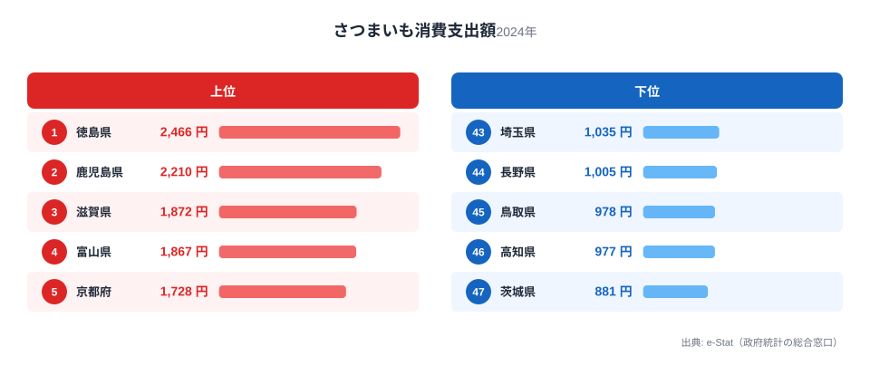
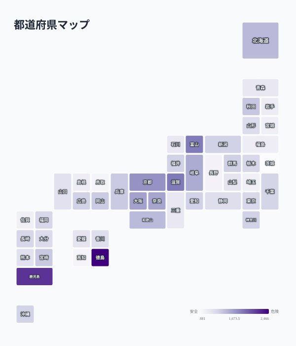

さつまいもの消費支出額は、1世帯あたりが1年間にさつまいもの購入に使った金額を示す指標です。総務省の家計調査によると、2024年の全国データでは1位の徳島県が2,466円、最下位の茨城県が881円で、その差は約2.8倍にのぼります。

産地として知られる鹿児島県や徳島県が上位に来るのは想像しやすいところですが、実際のランキングを見ると、滋賀県や富山県、京都府といった関西・北陸の県も軒並み上位に並んでいます。さつまいもの一大産地ではないこれらの地域で、なぜ支出額が伸びているのでしょうか。

この記事では、上位・下位それぞれの顔ぶれを地図で確認しながら、焼き芋文化や気候条件がどのように消費量へ結びついているのかを探ります。

> [!NOTE]
> 家計調査の「消費支出額」は世帯が実際に購入した金額の平均で、消費量そのものではありません。単価が高い高級さつまいも（紅はるか等のブランド品種）を買う地域は、消費量が同じでも支出額が押し上げられる点に注意が必要です。

## 上位と下位

<source-link href="/ranking/sweet-potato-consumption-expenditure">さつまいも消費支出額ランキングをもっと見る</source-link>

1位は[徳島県](/areas/36000)の2,466円です。徳島県は「なると金時」というブランドさつまいもの産地で、鳴門市周辺の砂地栽培で知られています。地元での消費が多いのは、産地ならではの入手のしやすさと、なると金時を使った焼き芋・大学いもなどの郷土的な食習慣が背景にあると考えられます。

2位の[鹿児島県](/areas/46000)2,210円も、さつまいもの作付面積・収穫量で全国トップクラスを誇る産地です。鹿児島では「安納いも」をはじめとする多品種が栽培され、焼酎の原料としても利用されるほど生活に根づいた作物です。家庭での消費頻度が高く、金額に反映されていると見られます。

一方で3位の滋賀県1,872円、4位の富山県1,867円、5位の京都府1,728円は、さつまいもの主要産地ではありません。これらの地域が上位に入る理由として、冬場の気温が低く「焼き芋」を温かい食べ物として求める需要が強いことが挙げられます。特に関西圏（滋賀・京都・大阪・奈良）が6位の大阪府1,637円、7位の奈良県1,613円まで含めて上位に集中しているのは、関西の冬の食文化として焼き芋やふかし芋が定着している可能性を示しています。これらの県は[滋賀県](/areas/25000)や[京都府](/areas/26000)のように、盆地特有の底冷えする気候を持つ点も共通しています。

## 最下位グループの傾向

<source-link href="/ranking/sweet-potato-consumption-expenditure">さつまいも消費支出額の全47都道府県を見る</source-link>

最下位は茨城県の881円です。茨城県は実は「べにはるか」などさつまいもの主要産地の一つで、鹿児島県に次ぐ収穫量を誇ります。産地であるにもかかわらず家計での購入額が低いのは、自家消費・親戚や知人からのやり取り・直売所での購入など、家計調査の「購入」に計上されにくい形での入手経路が多いためと考えられます。統計上の「支出額」は、贈答や自家栽培分を捉えられない点に注意が必要です。

46位の高知県977円、45位の鳥取県978円も同様の傾向がうかがえます。これらの地域は温暖な気候で他の野菜や果物の選択肢が豊富なため、さつまいもへの支出配分が相対的に小さくなっている可能性があります。埼玉県（43位）や長野県（44位）など関東・中部の内陸県も下位に集まっており、関西圏との対比が際立ちます。

> [!WARNING]
> 家計調査は抽出調査のため、年ごとのサンプル世帯構成によって数値が変動します。単年の順位だけで「この県はさつまいもをあまり食べない」と断定するのではなく、複数年の傾向と合わせて見ることをおすすめします。

## 発見：焼き芋文化と産地は必ずしも一致しない

今回のデータで最も興味深いのは、産地（鹿児島・茨城）と消費支出額の高い地域が一致しない点です。産地としての出荷は加工用・他県への出荷が中心となり、地元の家計消費とは別の経路をたどります。一方で、消費支出額の上位には気候が寒冷な内陸・盆地地域（滋賀・富山・京都）が目立ち、これは焼き芋という「温かいおやつ」を求める気候的な需要と結びついていると考えられます。

[仮説] 焼き芋文化の強さは、冬季の寒さと石焼き芋の移動販売・スーパーの焼き芋コーナーの普及度に左右されている可能性があります。検証には都道府県別の焼き芋専門店舗数や移動販売台数のデータが必要で、現時点では家計調査の支出額から推測できる範囲にとどまります。

> [!TIP]
> さつまいもと同じ根菜類でも、じゃがいもや里芋は産地と消費量がより一致する傾向があります。関連するランキングと合わせて見ると、根菜類ごとの消費文化の違いが見えてきます。

## まとめ

- 1位は徳島県2,466円、産地「なると金時」の地元消費が支出を押し上げている
- 最下位は茨城県881円、産地であっても家計調査の購入額には反映されにくい
- 1位と最下位の差は約2.8倍
- 滋賀・富山・京都など関西・北陸の非産地県が上位に集中し、焼き芋文化の存在を示唆する
- 産地（鹿児島・茨城）と消費支出額上位は必ずしも一致しない

他の食品の家計消費支出も、[家計・経済カテゴリ](/category/economy)で都道府県別に比較できます。

## データ出典

総務省統計局「家計調査」（2024年）のデータをもとに作成しています。e-Stat（政府統計の総合窓口）経由で取得した品目別支出額を都道府県別に集計・整備しました。
