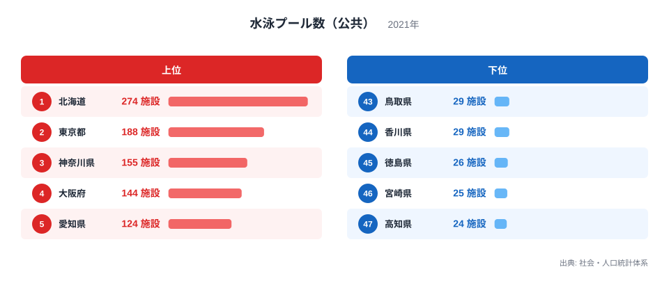
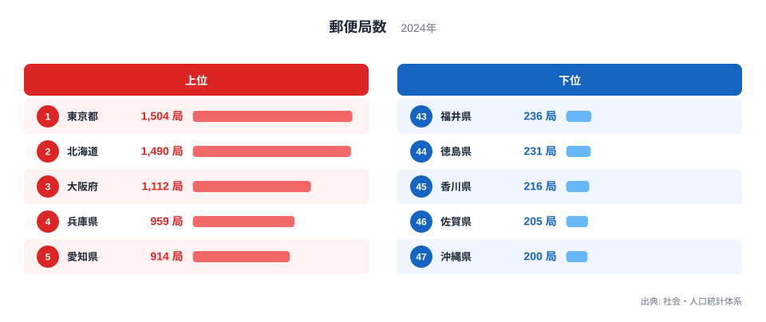
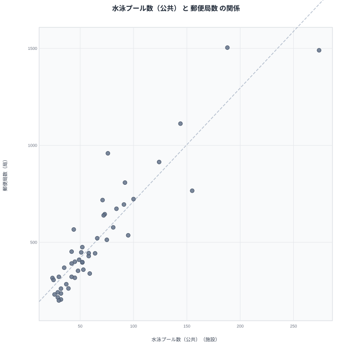

## 公共プールが多い県は郵便局も多いのか

水泳プール（公共）の数のランキングを見ると、1位は北海道で274施設、2位は東京都で188施設、3位は神奈川県で155施設です。一方で郵便局数のランキングを見ると、1位は東京都、2位は北海道、3位は大阪府となっています。順位はぴったり一致しているわけではありませんが、上位に来る顔ぶれには重なりが目立ちます。

公共プールも郵便局も、性質としてはまったく異なる公共施設です。娯楽・スポーツ施設であるプールと、生活インフラである郵便局が、なぜ似たような顔ぶれで上位に並ぶのでしょうか。この記事では、両者のランキングを詳しく見比べながら、見かけの相関の背後にある本当の理由を探ります。

## 水泳プール（公共）のランキングを見る

<source-link href="/ranking/swimming-pool-public">水泳プール数（公共）ランキングをもっと見る</source-link>

水泳プール（公共）の1位は北海道で274施設です。2位の東京都は188施設、3位の神奈川県は155施設、4位の大阪府は144施設、5位の愛知県は124施設と続きます。北海道が2位の東京都を大きく引き離している点が目を引きます。

下位を見ると、最も少ないのは高知県で24施設、次いで宮崎県が25施設、徳島県が26施設、香川県と鳥取県が29施設で並んでいます。四国や九州南部の県が下位に集中しています。

この施設数は都道府県が持つ絶対数であり、人口や面積で割った値ではありません。北海道が1位に立っているのは、日本の都道府県の中でも圧倒的に広い面積を持ち、市町村の数も多いため、各地域に公共プールが整備されやすい構造があるためだと考えられます。東京都や神奈川県、大阪府といった人口の多い都市部の県が上位に続くのは、人口が多い分だけ利用需要が見込まれ、施設の絶対数も増えやすいことを示しています。

## 郵便局数のランキングを見る

郵便局数の1位は東京都で1,504局、2位は北海道で1,490局、3位は大阪府で1,112局、4位は兵庫県で959局、5位は愛知県で914局です。上位5県は人口の多い都市部の県と、面積が広い北海道で占められています。

下位を見ると、最も少ないのは沖縄県で200局、次いで佐賀県が205局、香川県が216局、徳島県が231局、福井県が236局と続きます。四国や九州の一部の県が下位に集まっている様子がうかがえます。

郵便局は全国津々浦々にネットワークを張り巡らせる生活インフラであり、人口の多い地域では利用者数に応じて局数が増え、面積の広い地域では集落ごとの利便性を保つために局数が増えるという、2つの要因の両方から影響を受ける施設です。東京都や大阪府のように人口が集中する都市部と、北海道のように面積が広大な地域が、それぞれ異なる理由で上位に並んでいるのがこの指標の特徴です。

## 散布図で相関を確かめる

散布図を見ると、水泳プール（公共）の数が多い県ほど郵便局数も多くなる、右肩上がりの傾向が確認できます。北海道と東京都は両方の指標で突出して高い値を示しており、点は右上に大きく離れて位置しています。神奈川県や大阪府、愛知県といった県も両方の指標で上位に位置し、高知県や宮崎県、徳島県といった県は両方の指標で下位に位置しています。

この相関を「公共プールが多いから郵便局も多い」という因果関係として読むのは正しくありません。プールの整備計画と郵便局の設置計画は、まったく別の主体がまったく別の目的でおこなうものであり、直接に結び付く理由はありません。両者が似た並びになっているのは、どちらの施設数も同じ第三の要因、すなわち人口の規模と都道府県の面積という土台に強く影響されているためです。

北海道が両方の指標で上位に来ているのは、その広大な面積のためです。面積が広ければ、住民の生活圏をカバーするために、プールも郵便局も多くの地点に配置する必要が生じます。東京都や大阪府が両方の指標で上位に来ているのは、人口が多いためです。人口が多ければ、利用者数に応じて施設の絶対数も増えていきます。この2つの要因のどちらか、あるいは両方を強く持つ都道府県が、公共プールと郵便局の両方で上位に来やすい構造になっているのです。

## なぜ2種類の公共施設が同じ動きをするのか

公共プールと郵便局という性質の異なる施設が同じように動く理由を、もう少し掘り下げてみます。この記事で扱っている水泳プール（公共）と郵便局数は、いずれも都道府県単位の絶対数として集計された指標です。人口1人あたりや面積あたりに変換された指標ではないため、そもそも「規模が大きい都道府県ほど数値が大きくなりやすい」という性質を、両方の指標が共通して持っています。

北海道のように面積が広大な都道府県では、住民が広い範囲に分散して暮らしています。そうした地域で生活インフラを維持しようとすれば、郵便局のような窓口サービスも、プールのような公共施設も、それぞれ複数の地点に分散して設置する必要が生まれます。結果として、施設の絶対数は面積の広さに比例して増えやすくなります。

一方、東京都や大阪府のように人口が集中する都市部では、限られた面積に多くの住民が暮らしています。利用者の絶対数が多ければ、それに応じて施設の数も増えるのが自然な帰結です。郵便局は住民の郵便・金融ニーズに応えるために、公共プールは住民の運動・レジャーニーズに応えるために、それぞれ人口規模に見合った施設数が確保されやすくなります。

つまり、面積の広さと人口の多さという、都道府県が持つ2つの基礎的な規模要因が、性質の異なる公共プールと郵便局という2つの指標の両方を、それぞれ別の経路で押し上げているのです。見かけ上は強い相関があるように見えても、その中身は「規模が大きい都道府県ほど、あらゆる施設の絶対数が多くなりやすい」という、統計上よくある構造にすぎません。

> [!NOTE]
> この記事で扱う水泳プール（公共）と郵便局数は、いずれも都道府県が持つ施設の絶対数であり、人口1人あたりや面積あたりに換算した値ではありません。人口や面積が大きい都道府県ほど数値が大きくなりやすい点に注意して読んでください。

> [!WARNING]
> 公共プールの整備は市町村ごとのスポーツ振興計画、郵便局の設置は日本郵便のネットワーク計画と、まったく別の主体・別の目的で決められています。両者の数値が似た並びになるのは制度上の結び付きではなく、人口規模と面積という共通の土台が表れているにすぎません。また、水泳プール（公共）は2021年、郵便局数は2024年のデータであり、集計年が異なる点にも留意してください。

> [!TIP]
> 絶対数のランキングを見るときは、常に「人口や面積の大きさがそのまま数値に反映されていないか」を確認する習慣を持つと、見かけの相関に惑わされにくくなります。人口あたりや面積あたりに換算した指標と見比べると、その県が本当に施設の充実度で優れているのかどうかがより正確に見えてきます。

## まとめ

水泳プール（公共）の数は北海道、東京都、神奈川県の順に多く、郵便局数は東京都、北海道、大阪府の順に多いという結果でした。どちらの指標でも北海道と東京都が突出して高い数値を示し、高知県や宮崎県、徳島県といった県は両方の指標で下位に位置していました。

散布図では両者に明確な相関が見られましたが、これは公共プールと郵便局の整備計画が直接に結び付いているからではありません。どちらも都道府県が持つ施設の絶対数であり、面積が広い地域や人口が多い地域ほど数値が大きくなりやすいという共通の性質を持っています。北海道は広大な面積のために、東京都は多い人口のために、それぞれ別の理由で両方の指標を押し上げており、見かけの相関の正体は「規模の大きさ」という共通の土台にあると考えられます。

## データ出典

水泳プール（公共）は社会・人口統計体系の2021年データ、郵便局数は社会・人口統計体系の2024年データをもとにしています。

あわせて見る: [郵便局数ランキング](/ranking/post-office-count) / [同じカテゴリの統計一覧](/category/educationsports) / [北海道のデータ](/areas/01000) / [東京都のデータ](/areas/13000)
