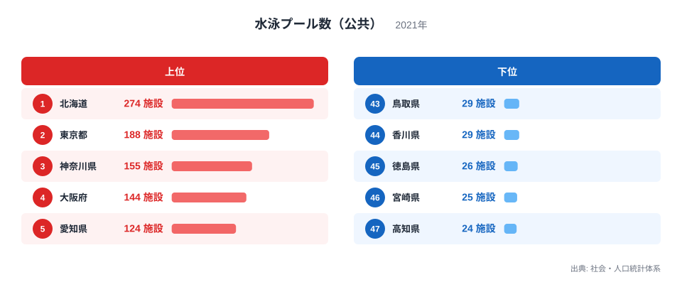
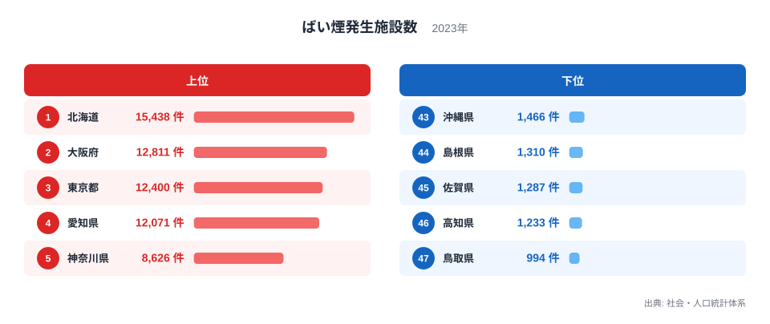
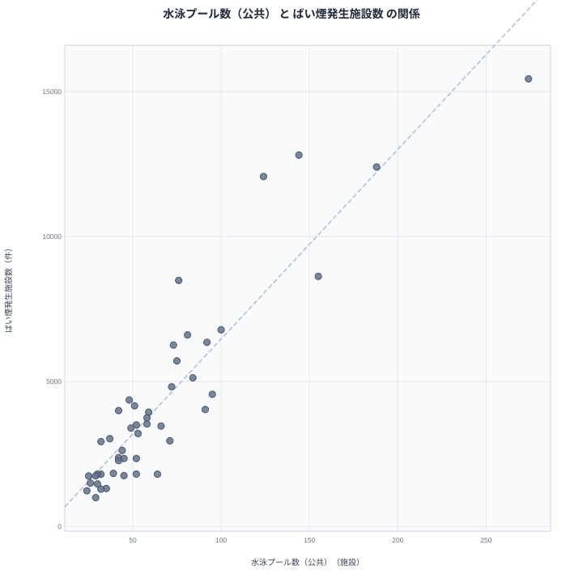

公共の水泳プール数が最も多いのは北海道で274施設です。そしてばい煙発生施設数でも北海道は15,438件で全国1位となっています。レジャー施設である水泳プールと、工場などから排出されるばい煙を規制対象とするばい煙発生施設という、まったく分野の異なる2つの指標が、なぜ同じ道県で1位になるのでしょうか。この記事では、都道府県別データからその背景を探っていきます。

## 水泳プール数（公共）の上位と下位

<source-link href="/ranking/swimming-pool-public">水泳プール数（公共）ランキングをもっと見る</source-link>

水泳プール数（公共）は北海道が274施設で全国1位です。2位は東京都で188施設、3位は神奈川県で155施設、4位は大阪府で144施設、5位は愛知県で124施設となっています。上位には人口の多い都道府県が並んでおり、面積の広い北海道と大都市圏を抱える都府県がともに上位を占めています。

一方で下位を見ると、高知県が24施設で最下位です。46位は宮崎県で25施設、45位は徳島県で26施設、44位は香川県で29施設、43位は鳥取県も29施設となっています。四国や九州の一部の県が下位に集まっている傾向が見られます。

水泳プール数（公共）は自治体が整備する公共施設の数であるため、人口規模が大きい都道府県ほど整備される施設の絶対数も多くなる傾向があります。北海道は人口自体は東京都や大阪府より少ないものの、広い面積の中に多くの市町村を抱えており、それぞれの自治体が公共施設を整備してきた結果として施設数が積み上がっていると考えられます。

## ばい煙発生施設数の上位と下位

あわせて見る: [ばい煙発生施設数ランキング](/ranking/smoke-emission-facility-count)

ばい煙発生施設数も北海道が15,438件で全国1位です。2位は大阪府で12,811件、3位は東京都で12,400件、4位は愛知県で12,071件、5位は神奈川県で8,626件となっています。水泳プール数の上位県とほぼ同じ顔ぶれが、ばい煙発生施設数でも上位を占めていることが分かります。

下位を見ると、鳥取県が994件で最下位です。46位は高知県で1,233件、45位は佐賀県で1,287件、44位は島根県で1,310件、43位は沖縄県で1,466件となっています。水泳プール数で下位だった高知県が、ばい煙発生施設数でも下位に位置しています。

水泳プール数の上位に並んだ北海道、東京都、神奈川県、大阪府、愛知県という顔ぶれは、ばい煙発生施設数の上位に並んだ北海道、大阪府、東京都、愛知県、神奈川県という顔ぶれとまったく同じ5道都府県です。この重なりが、次に見る相関の背景にあります。

## 2つの指標の相関を見る

散布図では、水泳プール数が多い道府県ほどばい煙発生施設数も多いという強い傾向が確認できます。北海道は両指標とも突出した値を持ち、右上の離れた位置に単独でプロットされています。東京都、大阪府、愛知県、神奈川県も両指標でともに上位に位置し、右上方向に集まっています。

一方で高知県、宮崎県、徳島県、香川県、鳥取県のように水泳プール数が少ない県は、ばい煙発生施設数でも少ない側に位置する傾向が見られます。

> [!WARNING]
> この相関は「水泳プールを増やせばばい煙発生施設が増える」という因果関係を示すものではありません。両指標は全く異なる行政分野の統計であり、直接の結びつきはありません。両者が連動しているように見える背景には、人口規模や事業所数といった別の要因が存在すると考えられます。

水泳プールについては、多くの市町村が学校水泳や地域スポーツの拠点として公共プールを1施設以上整備してきた経緯があるため、市町村の数そのものが施設数の下限を押し上げます。一方のばい煙発生施設は、ボイラーを使う工場や食品加工施設、農業関連施設などが届出対象になるため、産業の集積度が数を左右します。北海道は市町村数が多く公共プールが分散して整備されてきたことに加え、農業や食品加工、製造業などの事業所も多く立地しており、性質の異なる2つの要因がたまたま同じ道県で高い水準になっていると考えられます。

## なぜこの相関が生まれるのか

水泳プール数とばい煙発生施設数という一見無関係な2つの指標が連動して見える最大の理由は、どちらも都道府県の規模、つまり人口や事業所の数と結びついているためです。人口が多く経済活動が活発な都道府県では、住民サービスとしての公共施設も、産業活動に伴う施設もともに数が多くなります。

ただし、単純な人口規模だけでは説明しきれない部分もあります。北海道は人口自体では東京都や大阪府に及ばないにもかかわらず、水泳プール数とばい煙発生施設数のどちらでも他を大きく引き離す1位です。これは、広い面積の中に多くの市町村が分散して存在し、それぞれが公共施設を整備してきたという北海道特有の地理的・行政的な事情が、単純な人口の多さ以上に効いている可能性を示しています。人口1人当たりや市町村1つ当たりに換算すると、また違った順位が見えてくるかもしれません。

> [!TIP]
> このように分野の異なる2つの指標が連動して見えるときは、両者に共通する第三の要因（この場合は都道府県の人口規模や事業所数）を考えてみると、単純な相関を因果関係と誤解せずに読み解くことができます。

## まとめ

水泳プール数（公共）とばい煙発生施設数は、都道府県別に見ると強い相関を示す2つの指標です。北海道は水泳プール数で274施設の全国1位、ばい煙発生施設数でも15,438件の全国1位となっています。一方で高知県は水泳プール数が24施設で最下位、ばい煙発生施設数も1,233件で下位に位置しています。

> [!NOTE]
> 水泳プール数（公共）は地方自治体が設置・運営する公共のプールが対象で、民間スポーツクラブやホテルが所有するプールは含まれていません。ばい煙発生施設数は大気汚染防止法に基づき届出が義務付けられているボイラーなどの設備数を集計したもので、工場の数そのものを表す指標ではありません。両指標は調査年（2021年と2023年）も異なるため、厳密な同時点比較ではない点にもご留意ください。

人口規模と事業所数という共通の要因が、この2つの指標を連動させていると考えられます。娯楽施設と産業施設という異なる文脈のデータですが、都道府県の規模というつながりを通じて重なって見えることが分かります。

より詳しいデータを確認したい場合は、[ばい煙発生施設数ランキング](/ranking/smoke-emission-facility-count)や[同じカテゴリの統計一覧](/category/educationsports)もあわせてご覧ください。両指標でともに1位となった[北海道のデータ](/areas/01000)や、上位に入った[東京都のデータ](/areas/13000)では、他の統計との関係もさらに詳しく見ることができます。

## データ出典

水泳プール数（公共）は社会・人口統計体系の2021年データ、ばい煙発生施設数は社会・人口統計体系の2023年データを使用しています。
