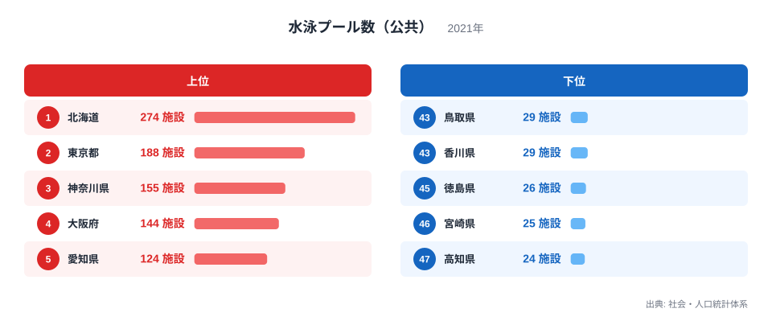
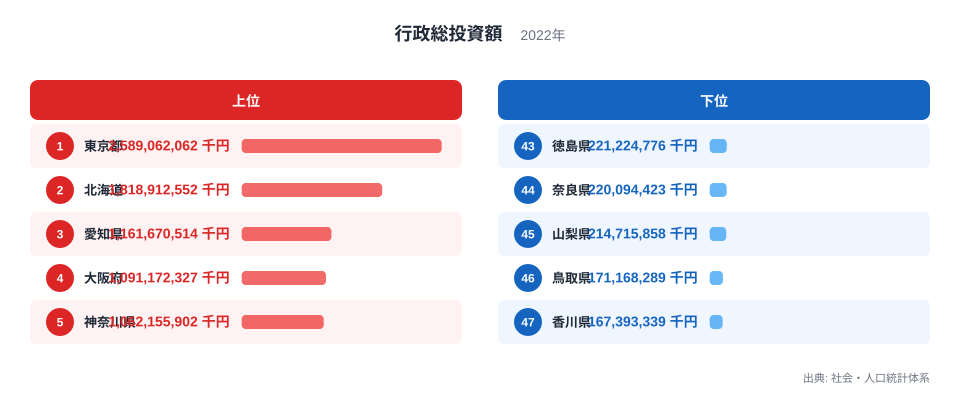
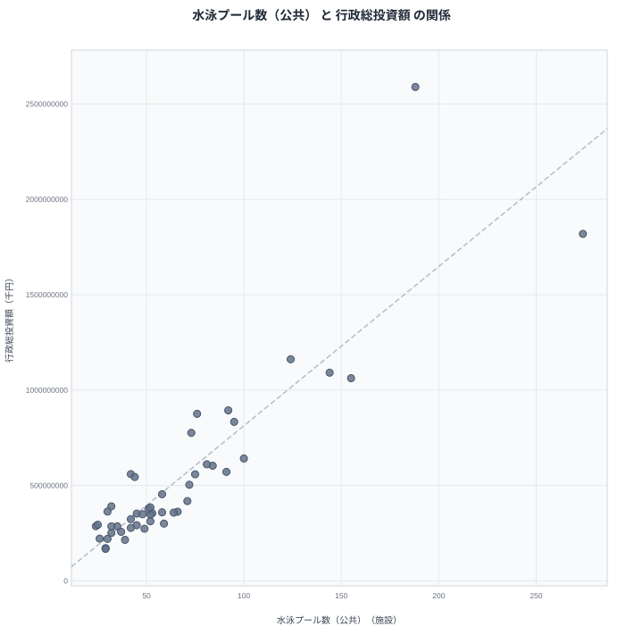

公共の水泳プールがどれだけ整備されているかは、その地域が公共施設にどれだけ投資してきたかを映す一例だと考えられがちです。一方で、行政総投資額は道路や学校、上下水道なども含めた自治体の投資規模全体を示す数字であり、プールだけを見て投資姿勢を語るのは早計かもしれません。この記事では、社会・人口統計体系にまとめられた水泳プール数（公共）と行政総投資額という2つの指標を重ね合わせ、両者がどのように関係しているのかを確かめます。

2021年のデータによると、公共の水泳プール数は北海道が274施設で最も多く、東京都が188施設で2位、神奈川県が155施設で3位です。最も少ないのは高知県の24施設で、宮崎県が25施設、徳島県が26施設と続きます。2022年の行政総投資額では東京都が2兆5890億6206万2000円で最多、北海道が1兆8189億1255万2000円で2位、愛知県が1兆1616億7051万4000円で3位です。最も少ないのは香川県の1673億9333万9000円で、鳥取県が1711億6828万9000円で続きます。

## 公共の水泳プール数の上位と下位

<source-link href="/ranking/swimming-pool-public">水泳プール数（公共）ランキングをもっと見る</source-link>

北海道が274施設で首位に立ち、東京都が188施設で2位、神奈川県が155施設で3位、大阪府が144施設で4位、愛知県が124施設で5位と続きます。上位には人口の多い都府県と、面積の広い北海道が並んでいます。北海道は市町村の数が多く、各自治体が住民サービスとして公共プールを整備してきた歴史が積み重なった結果、施設数そのものが多くなっていると考えられます。東京都や神奈川県、大阪府、愛知県のような大都市圏は、区市町村ごとに公共プールを備える傾向が強く、人口規模に応じて自治体数も多いことが施設数を押し上げています。

下位に目を移すと、高知県が24施設で最も少なく、宮崎県が25施設、徳島県が26施設、鳥取県が29施設、香川県が29施設と続きます。これらの県は人口が少なく市町村の数自体も限られているため、公共プールの絶対数が少なくなりやすい構造にあります。施設あたりの整備水準が低いというより、そもそも自治体の数が少ないことが施設数の少なさに直結していると見るべきでしょう。

> [!NOTE]
> このランキングは公共プールの「施設数」であり、人口あたりの充実度を示す指標ではありません。人口の多い都府県ほど絶対数で有利になりやすい点に注意してください。

## 行政総投資額の上位と下位

行政総投資額でも東京都が2兆5890億6206万2000円で首位を守り、北海道が1兆8189億1255万2000円で2位、愛知県が1兆1616億7051万4000円で3位、大阪府が1兆911億7232万7000円で4位、神奈川県が1兆621億5590万2000円で5位と続きます。ここでもプール数の上位県とかなり重なった顔ぶれになっていることが分かります。行政総投資額は道路や学校施設、上下水道、庁舎の整備なども含む幅広い投資の合計なので、人口や経済規模が大きい自治体ほど総額も大きくなる傾向があります。

下位に目を移すと、香川県が1673億9333万9000円で最も少なく、鳥取県が1711億6828万9000円、山梨県が2147億1585万8000円と続きます。面積が小さく人口も少ない県では、そもそも投資を必要とするインフラの規模自体が小さいため、総投資額も抑えられる傾向にあります。

[行政総投資額ランキング](/ranking/total-administrative-investment)を見ると、この総投資額が県の経済規模や人口規模とおおむね連動していることが分かります。

## 2つの指標の関係を散布図で確かめる

散布図では、行政総投資額が大きい県ほど公共プール数も多い傾向が見て取れます。ただし、点のばらつきはそれなりに大きく、投資額が同程度でもプール数が大きく異なる県のペアも存在しています。これは、投資の中身が県によって異なるためだと考えられます。同じ総投資額でも、道路整備を優先してきた県と、住民の福祉施設に振り向けてきた県とでは、プールという一つの施設数への現れ方が変わってきます。

見かけ上の相関がどこまで人口規模の影響で説明できるかを確かめるため、人口を統制した偏相関を計算すると、単純な相関よりも数値がはっきり弱まります。つまり、公共プールが多い県ほど行政総投資額も多いという関係のかなりの部分は、人口が多い自治体ほど施設数も投資額も大きくなるという、両方に共通する背景から生まれているとみられます。行政投資が直接プールの数を増やしているという単純な因果関係だと決めつけることはできません。

> [!WARNING]
> この散布図の相関は、人口規模という共通の要因を通じた見かけの関係である可能性が高いです。行政総投資額を増やせば公共プールも増えるという単純な因果関係として読まないでください。

人口を統制してもなお残る関係の部分については、自治体の政策方針の違いが影響していると考えられます。同じ人口規模の県であっても、公共施設の整備を福祉やスポーツ振興に重点的に振り向けてきた自治体と、道路や産業基盤に重点を置いてきた自治体とでは、プールという一つの施設数への反映のされ方が変わってきます。散布図の点のばらつきは、こうした自治体ごとの投資の優先順位の違いを表していると見ることができます。

## 数字が測っているものの違い

[北海道のデータ](/areas/01000)と[東京都のデータ](/areas/13000)を見比べると、どちらも公共プール数と行政総投資額の両方で上位に入っていますが、その理由は対照的です。北海道は市町村数の多さと面積の広さから施設数が積み上がっており、東京都は人口密度と経済規模の大きさから投資額が積み上がっています。同じ「上位県」というくくりでも、その背景にある地域構造はまったく異なります。

数字を比べるときは、絶対数どうしの比較が何によって左右されているのかを意識することが欠かせません。プール数のような施設数の指標は、自治体の数や人口規模の影響を強く受けるため、単純な順位だけで「投資に熱心な県」と「そうでない県」を分けることはできません。

> [!TIP]
> 施設数のような絶対数の指標を比べるときは、人口や自治体数の違いも頭に入れておくと、順位の差が何を意味しているのかをより正確に読み取れます。

## 施設数という指標の限界

施設数という数字は、その施設がどれだけ利用されているか、老朽化していないかといった質の面をまったく反映しません。北海道のように広い面積に施設が分散している場合、1施設あたりの利用者数は都市部より少なくなりやすく、維持管理のコストも面積に比例して重くのしかかります。逆に東京都のように人口密度が高い地域では、少ない施設数でも利用者一人あたりのアクセスは良好に保たれている可能性があります。単純な施設数の比較だけでは、住民にとっての利便性まで測ることはできません。

## データ出典

- 社会・人口統計体系(2021年、2022年)
