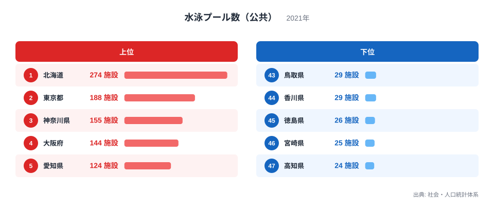
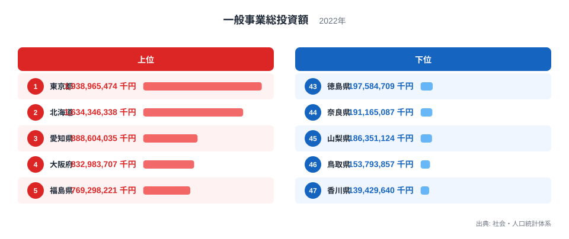
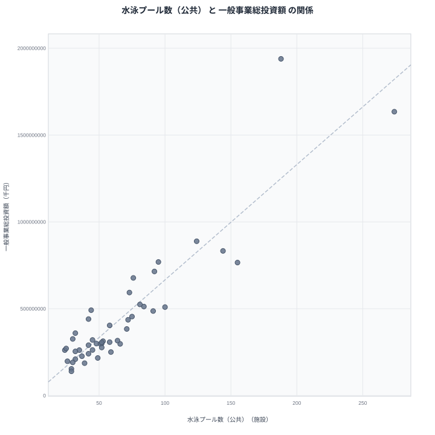

公共の水泳プールが多い都道府県と、一般事業総投資額が多い都道府県には、重なりが見られます。社会・人口統計体系のデータを突き合わせると、両方の指標で1位に立つのは北海道です。この記事では2つのランキングを比べながら、なぜこうした重なりが生まれるのかを整理します。

## 公共水泳プール数が多い県、少ない県

<source-link href="/ranking/swimming-pool-public">水泳プール数（公共）ランキングをもっと見る</source-link>

2021年の公共水泳プール数を見ると、北海道は274施設で1位です。2位は東京都で188施設、3位は神奈川県で155施設、4位は大阪府で144施設、5位は愛知県で124施設と続きます。上位には人口規模が大きい道府県が並んでいます。

下位を見ると、高知県は24施設で47位です。46位は宮崎県で25施設、45位は徳島県で26施設、44位は香川県で29施設、43位は鳥取県も同じく29施設となっています。四国と九州の一部の県が下位に集中している点が目を引きます。

続く順位も見ておきます。千葉県は100施設で6位、福島県は95施設で7位、福岡県は92施設で8位、広島県は91施設で9位、新潟県は84施設で10位です。これらの県には、人口規模の大きい道府県だけでなく、福島県のように面積が広い県も含まれています。

> [!NOTE]
> この指標は「公共」の水泳プール数に限定した集計です。民間のスイミングスクールやフィットネスクラブが運営するプールは含まれておらず、自治体が整備した施設の数を表しています。

## 一般事業総投資額が多い県、少ない県

続いて、2022年の一般事業総投資額を見てみます。東京都は1兆9389億6547万4千円で1位です。2位は北海道で1兆6343億4633万8千円、3位は愛知県で8886億403万5千円、4位は大阪府で8329億8370万7千円、5位は福島県で7692億9822万1千円と続きます。

下位に目を移すと、香川県は1394億2964万円で47位です。46位は鳥取県で1537億9385万7千円、45位は山梨県で1863億5112万4千円、44位は奈良県で1911億6508万7千円、43位は徳島県で1975億8470万9千円となっています。

> [!WARNING]
> 一般事業総投資額は民間企業や公的機関による設備投資などを幅広く含む指標です。単年の大型プロジェクトの有無によって数値が大きく変動するため、その年だけの数字で地域の経済力を断定するのは適切ではありません。

## 2つの指標の関係を散布図で見る

散布図を見ると、右肩上がりの緩やかな傾向が見て取れます。公共水泳プール数が多い県ほど一般事業総投資額も多い傾向がありますが、ばらつきも大きく、強い相関とまでは言えません。いずれにしても、これは相関であって因果関係ではありません。

この緩やかな相関の背景には、人口規模と自治体の財政力という共通の要因があると考えられます。人口の多い道府県は、税収や交付金の基盤が大きく、公共施設としての水泳プールを複数整備する余力を持ちやすくなります。同時に、人口規模が大きい地域には企業の拠点や工場も集まりやすく、それが一般事業総投資額を押し上げる要因になっていると考えられます。つまり、プールが投資を呼び込んでいるのではなく、両者はいずれも人口と経済規模という共通の土台の上に成り立っている数字だと考えるほうが自然です。

> [!TIP]
> 相関が緩やかで散らばりが大きい散布図を見たときは、強い関係があると決めつけず、あくまで傾向として捉えることが大切です。今回のケースも「必ず比例する」わけではなく、あくまで緩やかな傾向にとどまります。

散布図の右上には北海道と東京都が位置しており、公共水泳プール数と一般事業総投資額のどちらでも他の道府県から離れた水準にあります。一方で高知県や香川県、鳥取県のように両方の指標で下位に位置する県も一定数あり、散らばりの大きさが今回の相関を緩やかなものにとどめている一因になっています。

## 投資余力と公共施設の広がり

[一般事業総投資額ランキング](/ranking/total-general-project-investment)を単独で見ると、東京都・北海道・愛知県・大阪府・福島県という顔ぶれが並び、必ずしも人口規模だけで決まっているわけではないことがわかります。[北海道のデータ](/areas/01000)を確認すると、広大な面積を背景に各地域に分散して公共施設が整備されてきた経緯があり、水泳プール数でも投資額でも全国1位という結果につながっていると考えられます。同様に[東京都のデータ](/areas/13000)でも、人口集中に加えて企業活動の中心地であることが、投資額を押し上げる要因になっていると考えられます。[同じカテゴリの統計一覧](/category/educationsports)から関連するスポーツ施設系の指標もあわせて確認すると、地域ごとの公共施設整備の違いがより具体的に見えてきます。

公共水泳プール数と一般事業総投資額は、単位も出典も異なる指標ですが、いずれも自治体や企業の投資余力を映す面を持っています。緩やかな相関にとどまる背景には、施設整備の方針や産業構造の違いなど、指標だけでは見えない個別の事情も影響していると考えられます。

福島県が投資額で5位に入っている点は、単純な人口規模の順位とは異なる動きです。県内の産業基盤やインフラ整備の状況によって、人口規模だけでは説明できない投資額の変動が生じることを示す一例と言えます。こうした例外的な順位の背景を探るには、産業別の統計とあわせて確認する必要があります。

このように、2つの指標を単純に足し合わせて「総合力」を測るのではなく、それぞれの数字が何を反映しているのかを分けて考えることが、地域統計を読み解くうえで欠かせない視点になります。

## データ出典

出典: 社会・人口統計体系（総務省統計局）
水泳プール数（公共）: 2021年
一般事業総投資額: 2022年
