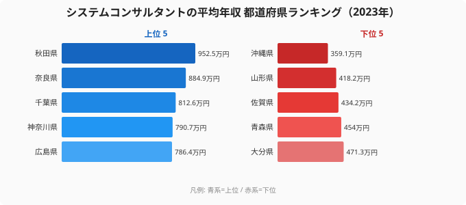

「ITコンサルタントの高年収は、結局のところ東京に集中しているのだろう」──多くの人がそう想像する。だが2023年の賃金構造基本統計調査をもとにシステムコンサルタント（情報処理・通信技術者のうちコンサル職）の都道府県別平均年収を並べると、その直感はあっさり裏切られる。

東京都は **705.8万円で12位**。1位は意外にも **[秋田県](/areas/05000)の952.5万円**で、首位と東京の差はおよそ247万円にのぼる。最下位の[沖縄県](/areas/47000)は359.1万円。トップとボトムの差は **2.7倍**にひらく。

> [!NOTE]
> ここで扱う「システムコンサルタントの平均年収」は、厚生労働省「賃金構造基本統計調査」の職種別データから、きまって支給する現金給与額×12＋年間賞与で算出した推計値です。単位は万円。2023年は46都道府県分のデータがあり、群馬県は当該職種の集計対象が得られず欠測です。

この記事では「東京一極」という思い込みがなぜ崩れるのか、その背景にあるサンプル構成のからくりを、47都道府県（46県分）のデータから読み解きます。

## TOP10と最下位｜秋田が東京を大きく上回る

まず上位10県と最下位を見てみます。

上位を眺めると、秋田・奈良・長野・栃木・鹿児島といった、いわゆる大都市圏「以外」の県がいくつも顔を出します。首都圏で名を連ねるのは千葉（3位）と神奈川（4位）で、東京（12位）はむしろこの2県の後塵を拝しています。

<source-link href="/ranking/system-consultant-annual-income">システムコンサルタントの平均年収ランキングをもっと見る</source-link>

> [!WARNING]
> この職種の都道府県別データは、各県でサンプル数が少なく年ごとの振れが大きい点に注意が必要です。秋田県は2020年586.6万円・2021年490.5万円だったのが2023年に952.5万円へ急伸しており、少数の高給人材がサンプルに入ると平均が大きく動く構造的な揺らぎがあります。単年の順位は「県の実力」よりも「サンプル構成」を反映している可能性があります。

## 最下位グループ｜地方圏でも沈む県がある

次に下位5県です。上位に地方県が並ぶ一方、下位にも地方県が混在しているのが特徴です。下位5県は大分（471.3万円）・青森（454.0万円）・佐賀（434.2万円）・山形（418.2万円）・沖縄（359.1万円）でした。

最下位は沖縄県の359.1万円。トップの秋田（952.5万円）とは2.7倍の開きがあります。下位には沖縄・佐賀・青森・山形といった県が並びますが、これらは「地方だから低い」という単純な図式では説明できません。なぜなら同じ地方圏の秋田・奈良・長野は最上位だからです。

つまり、この指標の県差を生んでいるのは「大都市か地方か」という軸ではなく、**各県でたまたま集計対象となった少人数のITコンサル職の給与水準**だと考えるのが自然です。

## 発見1｜「東京一極」が成り立たない構造

一般的な賃金統計では、東京が突出して高く出ることが多い職種が珍しくありません。ところがシステムコンサルタントでは、2023年の東京は705.8万円で12位にとどまります。首都圏で見ても、千葉812.6万円（3位）・神奈川790.7万円（4位）が東京を上回りました。

> [!TIP]
> なぜ大都市が必ずしも上位にならないのか。一つの読み方は「ITコンサル人材の絶対数」です。東京には膨大な数のコンサル職が在籍するため、若手から管理職まで幅広い年収層が平均に混ざり、突出した高値になりにくい。一方、地方県では母数が小さく、高給のシニア人材が数人入るだけで平均が跳ね上がる──このサンプル構成の違いが順位を左右していると考えられます。

**[仮説]** 秋田・奈良・鹿児島のような県の高順位は、県全体の賃金水準というより、少数の高給ITコンサル人材がサンプルに含まれた結果である可能性が高い。検証には、各県の集計対象人数（労働者数）と分散を確認する必要があります（賃金構造基本統計調査の職種別・地域別の労働者数で確認可能）。

## 発見2｜年ごとに大きく動く順位

この指標は年による振れが大きく、特定の県が安定して上位にいるわけではありません。実データで主要県の推移を見ると次の通りです。

- **秋田県**: 2020年 586.6 → 2021年 490.5 → 2023年 952.5（急伸して1位へ）
- **神奈川県**: 2020年 1051.6 → 2021年 980.9 → 2023年 790.7（高水準を保ちつつ低下）
- **沖縄県**: 2020年 383.6 → 2021年 617.3 → 2023年 359.1（乱高下のすえ最下位へ）

神奈川は3年連続で上位を維持しており、首都圏の中では比較的安定して高い水準にあります。一方、秋田や沖縄の大きな変動は、前掲の「サンプル数が少ない職種ゆえの揺らぎ」を裏づけます。順位を1年だけで断定せず、複数年で傾向を見ることが欠かせません。

## まとめ

- 2023年のシステムコンサルタント平均年収1位は **秋田県の952.5万円**。
- 最下位は **沖縄県の359.1万円**で、トップとの差は **2.7倍**。
- **東京都は705.8万円で12位**にとどまり、首都圏では千葉（3位・812.6万円）・神奈川（4位・790.7万円）が東京を上回った。
- 上位にも下位にも地方県が混在し、「大都市が高い／地方が低い」という単純な構図は成立しない。
- この職種は県ごとのサンプル数が少なく年変動が大きいため、単年の順位は県の実力より集計構成を反映しやすい点に注意。

## データ出典

- 厚生労働省「賃金構造基本統計調査」（2023年）。職種別データから、きまって支給する現金給与額×12＋年間賞与で平均年収を推計（単位：万円）。e-Stat 経由で整備（statsDataId: 0003445758）。
- 2023年は46都道府県分のデータを使用。群馬県は当該職種の集計対象が得られず欠測。

本記事の対象データ: [関連カテゴリ](/category/laborwage)
