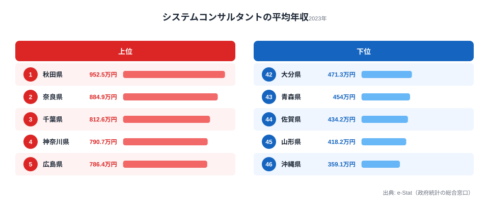
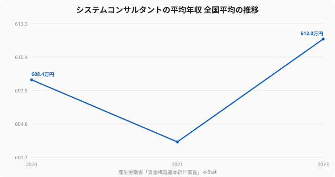

システムコンサルタントは、要件定義やシステム企画など、ソフトウェア開発よりも上流に位置する高年収のIT職だ。「そうした仕事で最も稼げるのは、当然ながら東京だろう」——そう考えるのが自然だが、厚生労働省「賃金構造基本統計調査」の2023年データは、その常識を揺さぶる。システムコンサルタントの平均年収が最も高いのは、意外にも秋田県の952.5万円。一方、東京都は705.8万円で12位にとどまる。

最下位の沖縄県は359.1万円で、トップの秋田とは約2.6倍の開きがある。同じ職種でも、これほど地域差が出るのはなぜか。本記事では、2023年のシステムコンサルタント年収を47都道府県で読み解き、上流IT職の年収格差の構造と、そこから見えるキャリア戦略を考える。

> [!NOTE]
> データは厚生労働省「賃金構造基本統計調査」のシステムコンサルタント職区分の平均年収（推計値、企業規模10人以上）です。サンプル数の少ない県では数値が振れやすく、上位・下位の順位は年によって入れ替わります。県の平均値は傾向を示すものとして読んでください。

## システムコンサルタント年収ランキングの全体像 — 秋田と沖縄で約2.6倍

まず全体像を押さえる。上位は秋田県（952.5万円）、奈良県（884.9万円）、千葉県（812.6万円）、神奈川県（790.7万円）、広島県（786.4万円）。一方、下位は沖縄県（359.1万円）、山形県（418.2万円）、佐賀県（434.2万円）と続く。全国平均は612.0万円で、上位と下位では約2.6倍の差がある。分布の中位（23位前後）は大阪府の620.5万円で、上位・下位の極端さに比べ、多くの県は中央付近に集まっている。上位の地方県が目を引く一方で、全国の多くの県は600万円前後に収まる。地域の振れ幅よりも、ソフトウェア開発職（約508万円）から上流のコンサル職へ移ること自体が、年収帯を一段押し上げる確実なレバーになる。

<source-link href="/ranking/system-consultant-annual-income">システムコンサルタントの平均年収ランキングを詳しく見る</source-link>

## なぜ秋田がトップで東京が中位なのか — 少数精鋭と平均の罠

秋田県が首位という結果は、データの性質を理解すると見えてくる。地方では、システムコンサルタントとして集計される人材が、特定の大手企業・公共系プロジェクトの少数の高給人材に偏りやすい。母数が小さいほど、一部の高年収者が平均を大きく押し上げる。

> [!WARNING]
> 「秋田に行けば年収が上がる」という話ではない。サンプル数の少ない県では平均値が振れやすく、東京には平均を超える高年収コンサルタントが多数存在する。重要なのは順位そのものではなく、「システムコンサルタントという職種が、ソフトウェア開発職より高い年収帯にある」という構造的事実だ。

実際、東京都は12位（705.8万円）と中位だが、これは賃金水準の異なる事業所が大量にあるため平均が中位に引き寄せられるからだ。京都府は32位（531.5万円）で、観光・サービス業中心の経済構造を反映している。

## 全国平均は横ばい、だが職種選択で年収は変わる

システムコンサルタントの全国平均年収は、2020年の608.4万円から2023年の612.0万円とほぼ横ばいで推移している。

注目すべきは水準そのものだ。ソフトウェア作成者の全国平均が約508万円であるのに対し、システムコンサルタントは約612万円。同じIT領域でも、より上流の職種に移るだけで年収帯が100万円以上変わる。

<source-link href="/ranking/software-engineer-annual-income">ソフトウェア作成者の年収ランキングと比べてみる</source-link>

> [!TIP]
> エンジニアの年収を引き上げる王道のひとつが、開発職から要件定義・コンサルティングといった上流職へのシフトだ。地域や現職の給与テーブルに縛られず、上流ポジションの求人に挑戦することで、年収帯そのものを引き上げられる。

## 「職種の階段」を上るという発想

システムコンサルタントの年収データが示すのは、IT領域の中にも明確な「年収の階段」があるということだ。地域差（秋田と沖縄で2.6倍）以上に、開発職から上流職への移行が年収を左右する。

自分のスキルが上流職で評価されるかどうかは、市場に当ててみないとわからない。エンジニア・IT職に特化した転職エージェントを使えば、上流ポジションの求人や想定年収レンジを具体的に把握できる。まずは「いまの自分が次に狙えるポジション」を知ることが、年収アップの第一歩になる。

## サンプル数の少なさをどう割り引くか

地方県が上位に来るこのランキングを読むときは、サンプル数の少なさを割り引いて考える必要がある。システムコンサルタントは母数の小さい職種で、地方県では集計対象が一部の大手・公共系プロジェクトの高給人材に偏りやすい。少数のサンプルでは、一人の高年収者が県全体の平均を大きく引き上げてしまう。

したがって、このデータから読み取るべきは「秋田に住めば年収が上がる」という短絡的な結論ではない。重要なのは順位の細部ではなく、(1) システムコンサルタントという職種が開発職より高い年収帯にあること、(2) その年収帯は大都市の専売特許ではないこと、という2つの構造的事実だ。

この2点は、エンジニアのキャリア設計に直接効いてくる。年収を上げる手段は「年収の高い県に引っ越す」ことではなく、「より上流の職種・ポジションに移る」ことだ。地域というノイズの大きい変数より、職種という再現性の高い変数に注目する方が、年収アップの戦略としては確実性が高い。

## 開発職から上流へ — 何が評価されるのか

開発職から上流のコンサル職へ移ると年収帯が一段上がるが、そこで評価されるのはコードを書く速さだけではない。顧客の課題を定義し、関係者の合意を形成し、業務全体を設計する力だ。重要なのは、これらの力が転職してから身につくものではなく、いまの現場でも意識的に積める経験だという点である。要件定義の打ち合わせに同席する、仕様の背景にある業務を理解する、見積もりや折衝に関わる——こうした一歩を実績として言語化しておけば、上流職への移行はぐっと現実的になる。年収の階段を上る準備は、転職を決める前から始められる。逆に言えば、コードを書く力だけを磨き続けても、上流職の年収帯には届きにくい。技術力と、業務理解・折衝・合意形成の力を両輪で育てることが、年収の階段を一段上がるための条件になる。そしてその経験は、地方にいてもリモートの上流案件を通じて積める機会が年々増えている。

### 関連記事・次に読むデータ

- [ソフトウェアエンジニアの年収は県で何倍違うか](/ranking/software-engineer-annual-income) — 開発職の年収格差
- [主要職種の平均年収比較](/ranking/doctor-annual-income) — 職種による年収帯の違い
- [秋田県のエリアプロフィール](/areas/05000) — 1位の秋田の経済構造
- [労働・賃金カテゴリの統計一覧](/category/laborwage) — 賃金・雇用の関連ランキング

## データ出典

- 厚生労働省「賃金構造基本統計調査」（e-Stat 統計データ、2020〜2023年）
- システムコンサルタントの平均年収は、きまって支給する現金給与額×12＋年間賞与から算出した推計値（企業規模10人以上）
