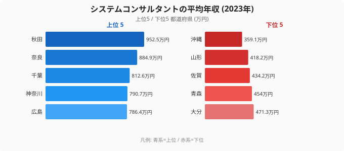

システムコンサルタントは、要件定義やシステム企画など、ソフトウェア開発よりも上流に位置する高年収のIT職です。「そうした仕事で最も稼げるのは、当然ながら東京だろう」——そう考えるのが自然ですが、厚生労働省「賃金構造基本統計調査」の2023年データは、その常識を揺さぶります。システムコンサルタントの平均年収が最も高いのは、意外にも[秋田県](/areas/05000)の952.5万円でした。一方、東京都は705.8万円で、上位どころか中位にとどまっています。

最下位の[沖縄県](/areas/47000)は359.1万円で、トップの秋田とは約2.6倍の開きがあります。同じ職種でも、これほど地域差が出るのはなぜでしょうか。本記事では、2023年のシステムコンサルタント年収を47都道府県で読み解き、上流IT職の年収格差の構造と、そこから見えるキャリア戦略を考えます。

> [!NOTE]
> データは厚生労働省「賃金構造基本統計調査」のシステムコンサルタント職区分の平均年収（推計値、企業規模10人以上）。サンプル数の少ない県では数値が振れやすく、上位・下位の順位は年によって入れ替わる。県の平均値は傾向を示すものとして読むこと。

## システムコンサルタント年収ランキングの全体像 — 秋田と沖縄で約2.6倍

上位は秋田県（952.5万円）、奈良県（884.9万円）、千葉県（812.6万円）、神奈川県（790.7万円）、広島県（786.4万円）と並びます。一方、下位は沖縄県（359.1万円）、山形県（418.2万円）、佐賀県（434.2万円）、青森県（454.0万円）、大分県（471.3万円）と続きます。全国平均は612.0万円で、上位と下位では約2.6倍の差があります。

注目したいのは、秋田・奈良という地方県が上位を占める一方で、東京（705.8万円）・大阪（620.5万円）・京都（531.5万円）といった三大都市圏が軒並み中位に沈んでいる点です。多くの県が500〜700万円台に収まるなかで、秋田だけが952.5万円と頭ひとつ抜けています。この突出は「秋田が豊かだから」ではなく、次の章で見るサンプルの性質で説明がつきます。上位5県のうち4県（秋田・奈良・千葉・神奈川）が800万円前後に集中している一方、6位以下は700万円台に下がるため、トップ層はごく薄い高給人材の層で決まっていることがうかがえます。下位の沖縄から大分までの5県はいずれも500万円を下回り、全国平均との差がはっきりしています。

<source-link href="/ranking/system-consultant-annual-income">システムコンサルタントの平均年収ランキングを詳しく見る</source-link>

## なぜ秋田がトップで東京が中位なのか — 少数精鋭と平均の罠

システムコンサルタントは、IT職のなかでも母数の小さい職種です。地方県では、この区分に集計される人材が、特定の大手企業や公共系プロジェクトに従事する少数の高給人材に偏りやすくなります。母数が小さいほど、一握りの高年収者が県全体の平均を大きく押し上げます。秋田の952.5万円は、まさにこの「少数精鋭が平均を引き上げる」効果が極端に出た数字と読めます。2位の奈良884.9万円、3位の千葉812.6万円が秋田に近い水準で並ぶことも、上位が分厚い高年収層ではなく、一部のサンプルで決まっていることをうかがわせます。

逆に東京の705.8万円は、賃金水準の異なる事業所が大量にあるため、高年収層と中堅層が混ざって平均が中位に引き寄せられた結果です。東京には平均を超える高年収コンサルタントが多数いますが、母数が大きいぶん平均値は「ならされ」ます。京都の531.5万円も、観光・サービス業中心の経済構造のなかで、IT上流人材の母数が限られることを映しています。大阪の620.5万円が全国平均をわずかに超える程度にとどまるのも、同じく母数の大きさが平均を中央に引き戻すためと考えられます。

だからこのランキングで読み取るべきは、順位の細部ではなく構造です。すなわち、(1) システムコンサルタントが開発職より明確に高い年収帯にあること、(2) その年収帯は大都市の専売特許ではないこと——この2点です。下位の沖縄359.1万円や山形418.2万円も「その県のIT職全体が低い」と決めつけるのではなく、母数の少なさと集計対象の偏りが平均を押し下げている可能性を念頭に置いて読むのが妥当です。

> [!WARNING]
> このランキングは「秋田に住めば年収が上がる」ことを意味しない。サンプル数の少ない県では平均が振れやすく、順位は年によって入れ替わる。とくに上位・下位の地方県は集計対象の人数が少なく、一握りの高給者・低給者で平均が動く。県別の順位そのものに一喜一憂せず、職種ごとの年収帯の違いという、より安定した傾向に注目するのが正しい読み方。

## 地域より「職種の階段」を上る — 開発職から上流への移行

このデータが示す最大の発見は、地域差（秋田と沖縄で約2.6倍）以上に、職種の違いが年収を左右するという点です。ソフトウェア作成者の全国平均が約508万円であるのに対し、システムコンサルタントは全国平均612.0万円。同じIT領域でも、より上流の職種に移るだけで年収帯が100万円以上変わります。しかもこの差は、住む県を選ぶ場合と違って、本人の経験で再現的に動かせる変数です。

ただし上流職で評価されるのは、コードを書く速さではありません。顧客の課題を定義し、関係者の合意を形成し、業務全体を設計する力です。重要なのは、これらが転職後に身につくものではなく、いまの現場でも積める経験だという点です。要件定義の打ち合わせに同席する、仕様の背景にある業務を理解する、見積もりや折衝に関わる——こうした一歩を実績として言語化しておけば、上流職への移行はぐっと現実的になります。自分のスキルが上流職でどう評価されるかは市場に当ててみないとわからないため、[エンジニア・IT職に特化した職種別の年収レンジ](/ranking/software-engineer-annual-income)を把握しておくと、次に狙える一段が具体的に見えてきます。秋田の952.5万円という最上位の数字も、「住む場所」より「どの職種帯にいるか」で年収が決まることを示す象徴と捉えるのが実用的です。

> [!TIP]
> 開発職（約508万円）と上流職（約612万円）の年収帯の差は、おおよそ100万円。住む県を変えるより、いまの現場で上流の経験を積み、それを言語化するほうが、再現性の高い年収アップ戦略になる。ランキング上位の県名そのものより、職種間の100万円差に注目したい。

## データ出典

- 厚生労働省「賃金構造基本統計調査」（e-Stat 統計データ、2023年）
- システムコンサルタントの平均年収は、きまって支給する現金給与額×12＋年間賞与から算出した推計値（企業規模10人以上）
