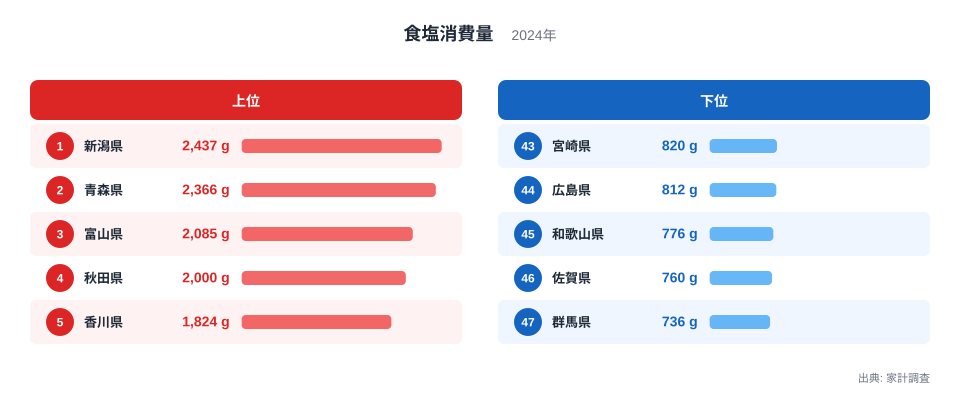
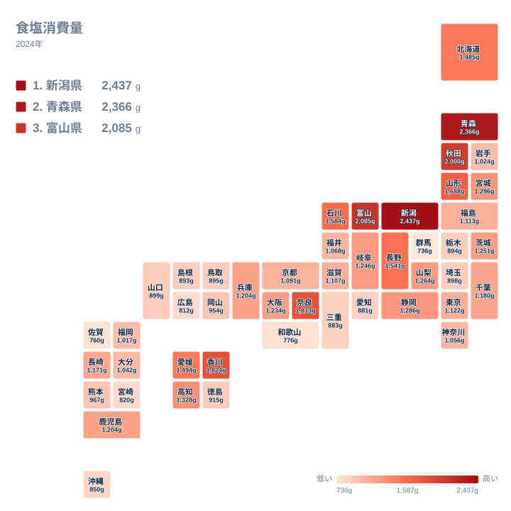

## 食塩消費量にみる都道府県の差

家庭の食卓に並ぶ塩の量は、住んでいる都道府県によって大きく違います。総務省の家計調査による2024年のデータでは、食塩消費量の全国1位は新潟県で2,437グラム、最下位は群馬県で736グラムでした。両者を比べると約3.3倍の開きがあり、同じ国内でもこれほど食生活に差があることに驚かされます。この記事では、都道府県別の食塩消費量ランキングとその地理的な広がりから、なぜこれほど大きな差が生まれるのかを考えていきます。

> [!NOTE]
> ここでいう食塩消費量は、家計調査で家庭が購入した食塩そのものの量を指します。しょうゆやみそ、加工食品に含まれる塩分は含まれていません。塩そのものをどれだけ買っているかを示す数値であり、食塩全体の摂取量とは別物として読む必要があります。また、家計調査の都道府県別の値は都道府県庁所在市に住む二人以上の世帯の平均であり、県内全域の平均ではない点にも注意してください。

## 食塩消費量の上位と下位

上のグラフの通り、食塩消費量の上位は新潟県、青森県、富山県、秋田県、香川県の5県です。新潟県は2,437グラムで全国1位となっており、2位の青森県は2,366グラム、3位の富山県は2,085グラム、4位の秋田県は2,000グラム、5位の香川県は1,824グラムと続きます。上位5県はいずれも1,800グラムを超えており、全国的に見てかなり多い水準にあります。

<source-link href="/ranking/table-salt-consumption-quantity">食塩消費量ランキングをもっと見る</source-link>

一方、下位に目を向けると、43位の宮崎県が820グラム、44位の広島県が812グラム、45位の和歌山県が776グラム、46位の佐賀県が760グラム、47位の群馬県が736グラムとなっています。下位5県は九州、中国、近畿、関東と地方がばらけており、特定の地方だけに偏っているわけではないことがわかります。1位の新潟県と47位の群馬県を比べると、消費量には約3.3倍もの差が生まれています。上位10県まで範囲を広げると、新潟県、青森県、富山県、秋田県、山形県、石川県の6県が日本海側に位置しており、日本海側の県に食塩消費量の多い県が集まっている様子が見えてきます。

## 地図で見る食塩消費量の地理的な広がり

このタイルマップからは、食塩消費量の多い県が本州の日本海側から北陸にかけて連なっている様子が読み取れます。新潟県、富山県、石川県といった北陸の県と、青森県、秋田県、山形県といった東北の日本海側の県が濃い色で示されており、面としてのまとまりが見えてきます。一方、香川県や奈良県のように、日本海側から離れた場所でも食塩消費量が多い県が点在しており、地理的な条件だけでは説明がつかない部分も残ります。

> [!WARNING]
> このデータは家庭が食塩を購入した量であり、実際に体に取り込まれる摂取量そのものではありません。漬物や保存食を家庭でよく作る地域では購入量が多くなりますが、それがそのまま個人の塩分摂取量の多さを意味するとは限りません。健康面の指標として読む場合は注意が必要です。

## なぜ日本海側で食塩消費量が多いのか

食塩消費量の背景には、冬の気候と保存食の文化が関係している可能性があります。積雪の多い地域では、野菜や魚を長期間保存するために塩を使った漬物や塩蔵品を作る習慣が根付いてきました。新潟県の野沢菜漬けや、秋田県のいぶりがっこ、青森県のねぶた漬けなど、日本海側の県には塩を多く使う保存食が数多く伝わっています。[仮説] こうした保存食づくりの習慣が、家庭での食塩の購入量を押し上げている可能性があります。ただし、これはあくまで一つの見方であり、今回の統計データだけからこの因果関係を確定させることはできません。

一方で、日本海に面していない香川県が5位に入っている点は、この仮説だけでは説明がつきません。[仮説] 香川県はうどん文化で知られる県であり、うどんのつゆやゆで汁に使う塩の量が家庭での消費量を押し上げている可能性も考えられますが、これも一つの見方にすぎません。奈良県が6位に入っている理由についても、今回のデータからは明確な要因を読み取ることができず、今後の検証が必要です。

[新潟県のデータ](/areas/15000)を見ると、食塩消費量以外の食品消費についても地域の傾向を確認できます。同様に、[青森県のデータ](/areas/02000)からも、県の食文化を別の角度からたどることができます。

## 関連する調味料との関係を考える

食塩は単独で使われるだけでなく、しょうゆやみそといった発酵調味料にも塩分が含まれています。もし食塩消費量が多い県で、しょうゆやみその消費量にも同じような傾向が見られれば、その地域全体で塩分を多く使う食文化が根付いているという見方ができますし、逆に食塩だけが突出していれば、漬物などの塩そのものを使う用途に特化しているという見方もできます。[仮説] ですが、今回のデータだけではしょうゆやみその消費量との関係を確認することはできません。同じ家計調査には食料品ごとの消費量データが数多く整備されているため、[同じカテゴリの統計一覧](/category/economy)から関連する指標もあわせて確認してみることをおすすめします。

> [!TIP]
> 食塩消費量だけを見て「塩分の摂りすぎ」を判断するのは早計です。しょうゆやみそなど、他の調味料の消費量ランキングとあわせて見比べることで、その地域の食生活における塩分の使われ方をより立体的に読み解くことができます。

## まとめ

都道府県別の食塩消費量は、1位の新潟県が2,437グラム、47位の群馬県が736グラムで、その差は約3.3倍にのぼります。上位10県のうち6県が日本海側に位置しており、積雪地域に伝わる保存食の文化との結びつきがうかがえます。一方で、日本海に面していない香川県や奈良県が上位に入っている点は、気候や地形だけでは説明しきれない食文化の存在を示しています。下位の県は九州、中国、近畿、関東と地方が分かれており、特定の地域だけが少ないわけではありません。数字の裏にある食文化の違いに目を向けると、同じ日本の中にも多様な食のかたちがあることが見えてきます。

## データ出典

本記事のデータは、総務省統計局が実施する家計調査の2024年の結果に基づいています。家計調査は全国の家庭を対象とした調査であり、食塩をはじめとする各種食料品の購入量を都道府県別に把握できる統計です。
