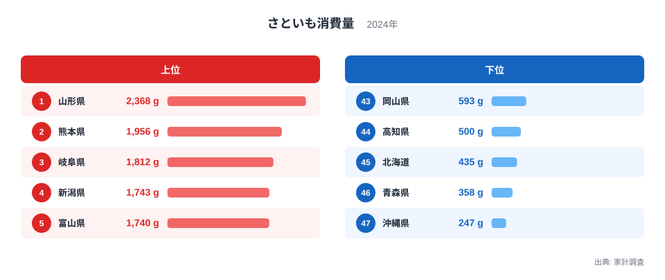
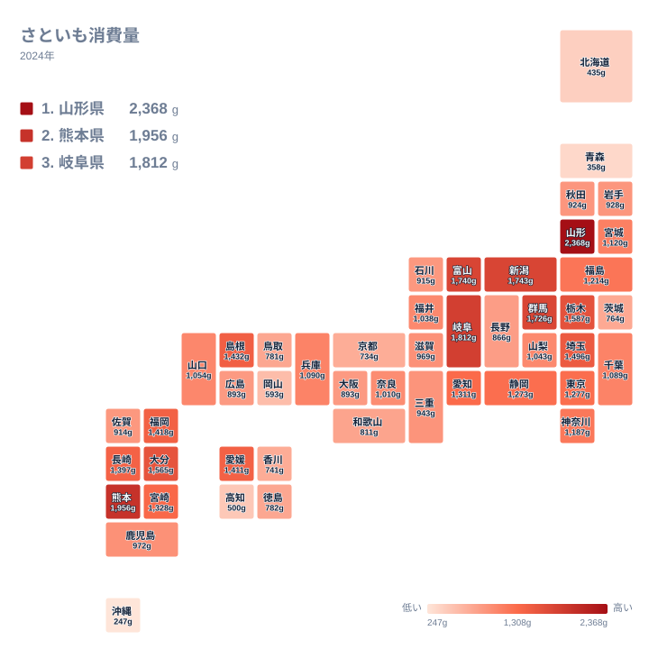

さといもは、秋から冬にかけて全国の食卓に並ぶ身近な根菜です。汁物や煮物に使われることが多く、地域の郷土料理とも結びつきの深い食材です。そんなさといもですが、実際にどれだけ食べられているかは都道府県ごとに大きな差があります。

総務省の家計調査による2024年のデータでは、さといもの消費量は1位の山形県が2,368グラムでした。これに対して最下位の沖縄県はわずか247グラムで、両者の差は9.6倍に達します。同じ日本に住んでいても、さといもとの距離はこれほど違うのです。

この記事では、47都道府県のさといも消費量を上位と下位に分けて確認したあと、地理的な分布を地図で見渡し、なぜ東北や北陸、九州の一部で消費量が多いのかを食文化と気候の観点から考えていきます。

## 上位と下位、どの県が並んでいるか

<source-link href="/ranking/taro-consumption-quantity">さといも消費量ランキングをもっと見る</source-link>

上位を見ると、山形県が2,368グラムで1位、熊本県が1,956グラムで2位、岐阜県が1,812グラムで3位と続きます。4位は新潟県で1,743グラム、5位は富山県で1,740グラムです。上位5県のうち3県が東北・北陸の日本海側に位置しており、残る2県も九州と中部の内陸に位置する県で占められています。沿岸の大都市圏よりも、山間部や豪雪地帯を抱える県が上位に集まっている点が特徴です。

一方の下位を見ると、43位は岡山県で593グラム、44位は高知県で500グラム、45位は北海道で435グラム、46位は青森県で358グラム、そして47位は沖縄県で247グラムという結果になりました。青森県は東北地方に属しますが、上位に並ぶ山形県や新潟県とは対照的に消費量が少なく、東北だから一律に多いというわけではないことが分かります。北海道と沖縄という日本列島の南北両端が下位に並んでいるのも興味深い点です。

上位と下位の顔ぶれを比べると、単純な地方区分だけでは説明できない差があることが見えてきます。次に地図で全体の分布を確認し、地域的なまとまりがあるのかを見ていきます。

## 地理的な分布を地図で見る

タイルマップで色の濃さを追うと、東北南部から北陸、そして九州にかけて濃い色のまとまりが浮かび上がります。山形県、新潟県、富山県、群馬県、栃木県といった内陸の県が濃い色で連なっており、これらの地域では気候や地形が共通していることが見て取れます。一方で、沖縄県や北海道といった南北の端の地域、そして関西の一部は薄い色になっており、消費量の少なさが地図上でもはっきり分かります。

九州では熊本県と大分県が濃い色を示す一方、同じ九州の他県はそこまで濃くありません。同じ地方の中でも県ごとの差があることが、地図の色の濃淡から読み取れます。地方単位ではなく県単位で消費行動が形づくられている様子がうかがえます。

関東地方に目を移すと、群馬県と栃木県、埼玉県が比較的濃い色を示すのに対し、東京都や神奈川県、千葉県は中位から下位寄りの色合いです。都市部よりも内陸の県で消費量が多い傾向は、東北や北陸で見られた傾向と重なります。

## なぜ東北・北陸・九州の一部で消費量が多いのか

上位に並ぶ山形県、新潟県、富山県といった日本海側の県では、里芋を使った郷土料理が古くから親しまれてきました。中でも山形県の芋煮会は広く知られた秋の風物詩で、里芋と牛肉、こんにゃくなどを大鍋で煮込み、河原などの屋外で楽しむ行事として県内外に定着しています。こうした行事食としての位置づけが、家庭での購入量を押し上げている一因だと考えられます。

[仮説] 上位県には、日照時間が短く冬が長い日本海側の気候や、里芋の栽培に適した土壌を持つ地域が多く含まれています。里芋は水はけのよい土壌と適度な湿度を好む作物とされており、こうした自然条件が古くからの産地形成につながり、地元での消費習慣が根づいた可能性があります。ただし、この記事のデータには県別の生産量は含まれていないため、生産地であることと消費量の多さが直接結びつくかどうかは、別の統計で確認する必要があります。

九州の熊本県や大分県が上位に入っている点も見逃せません。九州は温暖な気候のイメージが強い一方、山間部を中心に里芋の栽培が盛んな地域を抱えています。煮物や汁物といった和食の副菜として里芋を使う食習慣が根強く残っていることが、消費量の高さにつながっていると見られます。

対照的に、沖縄県では里芋よりも紅芋や田芋といった別の芋類が食文化の中心にあります。田芋は沖縄の伝統的な行事食にも使われる食材で、里芋の代わりにこうした地元の芋類が食卓に上る機会が多いことが、里芋の消費量が全国最下位となっている背景にあると考えられます。北海道についても、寒冷な気候の中でじゃがいもの生産と消費が突出して多く、根菜としての立ち位置を里芋ではなくじゃがいもが占めていることが影響していそうです。

## 里芋以外の芋類との対比から見えること

さといもの消費量が多い県が、必ずしも他の芋類の消費量でも上位に来るとは限りません。北海道はじゃがいもの大産地として知られており、根菜の消費という点では里芋ではなくじゃがいもに需要が向いている可能性があります。同様に、鹿児島県や宮崎県はさつまいもの産地として有名で、家庭での芋料理の選択肢が里芋以外に広がっていることも考えられます。

このように、ある地域で根菜全体の消費が多いか少ないかを見るだけでは、里芋固有の地域差は説明できません。里芋という個別の品目に絞って比較して初めて、日本海側や東北南部での突出、そして沖縄や北海道での落ち込みという構図が見えてきます。他の芋類のランキングと合わせて見比べることで、それぞれの地域が根菜の中でどれを選んでいるのかという、より立体的な理解につながります。

こうした地域差を統計から読み解くことは、県民性を単純に決めつけるためではなく、気候や農業、行事食といった背景を知る手がかりになります。[同じカテゴリの統計一覧](/category/economy)では、さといも以外の家計消費に関する指標もあわせて確認できます。上位に入った[山形県のデータ](/areas/06000)や[熊本県のデータ](/areas/43000)を見ると、他の食品の消費傾向とあわせて地域の食文化をより詳しく知ることができます。

> [!NOTE]
> 家計調査でいう「消費量」は、県庁所在市などに住む世帯が実際に購入した量を集計したものです。県全体の実態調査ではなく、都市部の世帯の購入量を都道府県の代表値として扱っている点に注意してください。

> [!WARNING]
> ここで扱う数値は2024年単年の家計調査データです。里芋は天候によって収穫量が変動しやすい作物のため、年によって順位が入れ替わる可能性があります。複数年の推移まではこの記事のデータからは分かりません。

> [!TIP]
> 消費量は市場での購入量がもとになっているため、家庭菜園で自家栽培した分や、親戚などから直接もらった分は含まれていません。自家消費や物々交換が多い地域では、ランキングの数値が実際の食生活より低く出ている可能性がある点を踏まえて読むと、より実態に近い解釈ができます。

## まとめ

- 1位は山形県で2,368グラム、最下位は沖縄県で247グラムと、その差は9.6倍にのぼります
- 上位5県は山形県、熊本県、岐阜県、新潟県、富山県で、日本海側と内陸の県が目立ちます
- 下位5県は岡山県、高知県、北海道、青森県、沖縄県で、南北両端の地域が並びました
- 地図で見ると、東北南部から北陸、九州の一部にかけて消費量の多い地域がまとまって分布しています
- 山形県の芋煮会のような行事食の存在や、地域ごとの主要な芋類の違いが、消費量の差の背景にあると考えられます

## データ出典

総務省統計局「家計調査」（2024年）のデータをもとに作成しています。
