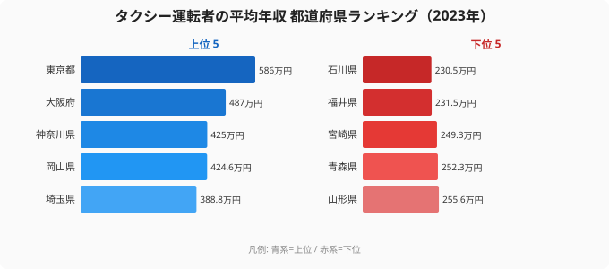

「同じタクシー運転手でも、住む県で年収が2.5倍変わる」──そう聞くと驚かれるでしょうか。タクシー運転者の平均年収（推計）は、運転技術や勤務時間で決まる以上に、**働く場所**に左右される職業です。

2023年の賃金構造基本統計調査をもとに都道府県別の平均年収を算出すると、最高の[東京都](/areas/13000)が586万円なのに対し、最低の[石川県](/areas/17000)は230.5万円でした。その差は約2.5倍に達します。同じ車に乗り、同じメーターを回しているのに、なぜここまで開くのでしょうか。

> [!NOTE]
> 本記事の「年収」は賃金構造基本統計調査の「きまって支給する現金給与額×12＋年間賞与」で推計した値です。実額の手取りや個人差ではなく、都道府県ごとの平均水準の比較として読んでください。2023年調査では一部の県で対象事業所が抽出されず、**42都道府県**のデータになっています（宮城・茨城・栃木・群馬・奈良は欠測）。

この記事では、上位・下位の顔ぶれと、その背後にある「乗客が多い場所ほど稼げる」という構造を読み解いていきます。

## タクシー運転手の年収トップ10と最下位

まず2023年の上位5県と最下位5県を見てみましょう。

トップは東京都の586万円で、大阪府（487万円）に約100万円の差をつけて独走しています。神奈川県（425万円）・岡山県（424.6万円）・埼玉県（388.8万円）と続き、上位は首都圏・近畿の大都市が占めています。さらに千葉県（380万円）・北海道（366.4万円）・岐阜県（365.4万円）・福岡県（359.1万円）・愛知県（358.8万円）と、上位10県はこちらも都市圏が中心です。これらの地域は人口が密集し、深夜・早朝やビジネス需要、空港・繁華街からの長距離乗車が多く、1台あたりの売上が大きくなりやすい傾向があります。歩合給の比率が高いタクシー業界では、この「乗客量」がそのまま年収に効いてきます。なぜ大都市が上位を占めるのかというと、需要が厚いほど1乗車あたりの単価と1日の実車回数が同時に伸び、歩合がそのまま積み上がるからです。逆に言えば、運転手個人の腕よりも「どこで営業するか」が年収の大半を決めてしまうということでもあります。

<source-link href="/ranking/taxi-driver-annual-income">タクシー運転者の平均年収ランキングをもっと見る</source-link>

> [!TIP]
> 4位に岡山県（424.6万円）が入っているのは意外に映ります。これはサンプル数が限られる年に上位の事業所が抽出されると平均が押し上げられるためで、地方県でも単年では大都市に並ぶことがあります。地方県の順位は年によって振れ幅が大きい点に注意して読んでください。

## 年収が低い下位5県

次に最下位グループを見てみましょう。

最下位は石川県の230.5万円、下から2番目は福井県（231.5万円）と、北陸の2県が並んで底にあります。続く下から3〜5番目は宮崎県（249.3万円）、青森県（252.3万円）、山形県（255.6万円）です。下位には人口密度が低く、鉄道やマイカー移動が中心で日常的なタクシー利用が少ない地域が並んでいます。

タクシーは「乗客がいて初めて稼げる」装置です。人口が少なく観光・ビジネスの集客装置が弱い県では、1日の実車回数が伸びず、歩合が積み上がりません。最低の石川県は新幹線延伸前のデータでもあり、金沢の観光需要が必ずしもタクシー賃金に直結していなかったことがうかがえます。北陸2県がそろって底にあるのは、冬季の積雪で営業時間が削られやすく、観光客もマイカーや鉄道に流れやすいという地理的な事情も重なっているとみられます。下位の5県を見ると、いずれも県庁所在地の人口規模が小さく、繁華街での深夜需要や空港発の長距離乗車が乏しい点で共通しています。

> [!WARNING]
> 下位県の数値は調査対象事業所の規模・抽出の影響を受けやすく、年ごとの変動が大きい点に注意してください。2010〜2023年の推移を見ると、同じ県でも年により100万円近く動く年があり、単年の順位だけで「この県は稼げない」と断定するのは早計です。

## 発見1: 上位は大都市、下位は地方──「乗客量」が分ける

上位10と下位5を並べると、構造はくっきりしています。上位は東京都・大阪府・神奈川県・埼玉県・千葉県・愛知県・福岡県と、三大都市圏＋政令市を抱える県が中心です。下位は北陸・東北・南九州の人口希薄な県が並んでいます。

タクシー運転手の年収は、本人の努力よりも**営業エリアの乗客密度**で大半が決まります。大都市では深夜割増・長距離・法人需要が重なり、1乗車あたりの単価も実車率も高くなります。一方、地方では空車で流す時間が長くなり、同じ労働時間でも売上が伸びにくくなります。この「需要の薄さ」が、地方県の年収を構造的に押し下げているのです。

[仮説] 上位に北海道（7位・366.4万円）が入るのは、札幌の都市需要に加え、広大なエリアでの長距離・観光乗車が単価を押し上げている可能性があります。ただしこれは単年データからの推測であり、実車率や走行距離のデータと突き合わせた検証が必要です。

<source-link href="/ranking/taxi-driver-annual-income">タクシー運転者の平均年収ランキングで全42県を見る</source-link>

## 発見2: 2.5倍差は「同一職種・地域差」の典型例

東京都586万円と石川県230.5万円の差は355.5万円、倍率にして約2.5倍です。これは「同じ職種でも住む場所で待遇が変わる」という、地域間賃金格差の典型的なパターンです。

製造業やオフィスワークと違い、タクシーは生産物（=移動サービス）を他地域へ運べません。乗客がいる場所でしか稼げないため、需要の地域差がそのまま所得差に転写されます。同じ免許・同じ車両でも、東京で働くか石川で働くかで年収が2倍以上変わる──この事実は、職業選択や移住を考えるうえで見過ごせない論点です。賃金構造の全体像をつかむには、同じ[労働・賃金カテゴリ](/category/laborwage)の他職種と並べて、地域差が大きい職業・小さい職業を見比べてみるのも有効です。

> [!NOTE]
> ここでの倍率は「平均年収の最高値÷最低値」で計算しています（586 ÷ 230.5 ≒ 2.54）。中央値ではなく平均のため、突出した高単価事業所の影響を含む点に留意してください。

## まとめ

- 2023年のタクシー運転者の平均年収（推計）は1位**東京都の586万円**、最下位**石川県の230.5万円**。
- その差は約**2.5倍**（355.5万円）で、同一職種としては大きな地域格差。
- 上位は東京・大阪・神奈川・埼玉・千葉・愛知・福岡など三大都市圏＋政令市が中心。
- 下位は石川・福井・宮崎・青森・山形など、人口密度が低くタクシー需要の薄い地方県。
- 年収を分ける最大要因は**営業エリアの乗客量（乗客密度・単価・実車率）**であり、本人の努力より働く場所の影響が大きく出ます。

## データ出典

- 厚生労働省「賃金構造基本統計調査」（2023年）。e-Stat を経由して整備し、「きまって支給する現金給与額×12＋年間賞与」で年収を推計しています。
- 2023年調査では一部県で対象事業所が抽出されず、42都道府県のデータとなっています。

本記事の対象データ: [関連カテゴリ](/category/laborwage)
