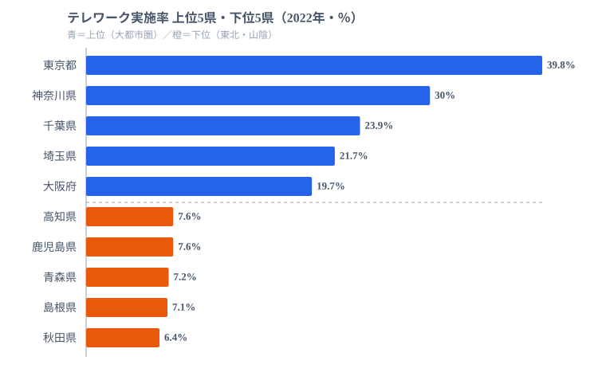

[東京都](/areas/13000)のテレワーク実施率は**39.8%**。一方、秋田県はわずか**6.4%**です。同じ日本で働いていても、テレワークできるかどうかは住む場所によって**6倍以上**の差があります。

コロナ禍を経て定着したはずのテレワークですが、その恩恵は全国に均等には広がっていません。47都道府県のデータから、なぜこれほどの格差が生まれるのか、そしてそれが働き方全体にどう波及しているのかを読み解きます。

## テレワーク実施率ランキング──上位は大都市圏が独占

<data-source url="https://www.e-stat.go.jp/dbview?sid=0004008436" label="e-Stat 就業構造基本調査"></data-source>

1位は東京都（39.8%）です。2位の神奈川県（30.0%）に約10ポイントの差をつけて突出しています。続く千葉県（23.9%）・埼玉県（21.7%）と首都圏の4都県が上位を独占し、5位の大阪府（19.7%）以下は20%を下回ります。

一方、下位は秋田県（6.4%）・島根県（7.1%）・青森県（7.2%）と東北・山陰が並びます。鹿児島県・高知県も7%台で、これら下位5県はいずれも人口規模が小さく第一次・第二次産業の比率が高い地域です。10%未満の県は20県にのぼり、全体の4割を超えます。テレワークが普及していない地域のほうが、むしろ多数派なのです。

<source-link href="/ranking/telework-rate">テレワーク実施率ランキングをもっと見る</source-link>

上位5県と下位5県を比べると、明確な傾向が見えてきます。上位は三大都市圏（東京・大阪・名古屋）とその周辺、下位は東北・四国・山陰に集中しています。トップの東京都とワーストの秋田県の差は6.2倍にのぼり、この差は通勤の有無や雇用環境の違いをそのまま映し出しています。

> [!NOTE]
> テレワーク実施率は「ふだんの仕事でテレワークをしている」と回答した雇用者の割合です（2022年就業構造基本調査）。自営業者や、在宅勤務以外のモバイルワーク等も含みます。「会社に制度があるか」ではなく「実際にやっているか」を測る指標である点に注意してください。

## なぜ大都市が高く地方が低いのか──産業構造が格差を決める

テレワーク格差の最大の要因は**産業構造**にあります。「テレワークできる仕事がその地域にどれだけあるか」が、そのまま実施率の差として現れているのです。

情報通信業や金融・保険業、専門・技術サービス業はテレワークに適した業種であり、これらの産業が集積する都市部ほど実施率が高くなります。東京都は情報通信業の事業所数が全国の約3割を占めており、テレワーク率が突出する構造的な背景があります。机に向かって完結する仕事の絶対量が、地方とは桁違いに多いのです。

反対に、農林漁業・製造業・建設業・医療福祉といった現場作業が不可欠な業種が中心の地域では、テレワーク実施率は必然的に低くなります。秋田県の第一次産業就業者比率は全国平均の約2倍であり、これが6.4%という低い実施率に直結しています。畑や工場、介護の現場は、自宅からは動かせません。

首都圏の4都県（東京・神奈川・千葉・埼玉）がいずれも上位にあるのは、東京に本社を置く企業のテレワーク制度が近隣県の通勤者にも適用されるためです。通勤圏という観点では、テレワークの恩恵は「東京経済圏」に集中しているといえます。つまりこの格差は、県境ではなく経済圏の境界に沿って引かれているのです。

> [!WARNING]
> この実施率は「自宅のある県」を基準に集計されています。東京の企業に勤めながら千葉や埼玉から通う人もテレワークすれば居住県の値に加算されるため、首都圏の周辺県は実際の「東京勤務者の働き方」を一部反映しています。下位県の低さを「制度がない」と短絡せず、そもそもテレワーク可能な仕事の絶対量が少ない点に注意してください。

<ad-slot></ad-slot>

## 副業率・転職率との関係──テレワーク可能な県ほど働き方が柔軟

テレワーク実施率と他の「働き方の柔軟性」指標を並べると、興味深いパターンが見えてきます。テレワーク実施率の1位・最下位の格差は**6.2倍**ですが、副業率は**2.3倍**（[京都府](/areas/26000)7.8%〜宮崎県3.4%）、転職率は**1.6倍**（東京都5.4%〜[愛媛県](/areas/38000)3.3%）と、テレワークの地域差だけが突出しています。働き方の柔軟性のなかでも、テレワークは最も住む場所に左右される要素なのです。

<data-source url="https://www.e-stat.go.jp/dbview?sid=0004008436" label="e-Stat 就業構造基本調査"></data-source>

上位県の顔ぶれを見ると、傾向として大都市圏がテレワーク率・副業率・転職率のいずれでも上位に入りやすいことがわかります。東京都はテレワーク率1位（39.8%）でありながら、副業率でも6.6%と上位に並びます。テレワークで通勤時間が浮けば、副業に充てる時間も生まれやすくなる可能性があります。

転職率も東京都（5.4%）と福岡県（5.4%）が高い水準で並んでいます。テレワークが普及した都市部では、地理的制約が緩和されるため求人の選択肢が広がりやすくなります。一方、テレワーク率が低い地方では「この地域で働ける仕事」が限られるため、転職も副業も選択肢が狭まります。テレワーク格差は単なる勤務形態の違いにとどまらず、**キャリアの選択肢の格差**にもつながっている可能性があります。

<source-link href="/ranking/side-job-rate">副業率ランキングをもっと見る</source-link>

<source-link href="/ranking/job-change-rate">転職率ランキングをもっと見る</source-link>

> [!TIP]
> 副業率トップの京都府（7.8%）は大学・研究機関の集積が背景にあり、テレワーク率（17.5%）とは異なる要因が働いています。「テレワークが高い県＝副業も高い」とは単純に言い切れません。3つの指標を重ねて読むと、その県の労働市場が「柔軟さ」のどの側面で強いのかが見えてきます。相関はあっても因果ではない点を意識して読み比べてみてください。

## まとめ

この記事で明らかになったテレワーク格差の構造を整理します。

テレワーク実施率は東京都39.8%に対し秋田県6.4%と、6倍以上の格差があります。上位は首都圏・大都市圏が独占し、下位は東北・四国・山陰に集中しています。10%未満の県は20県にのぼり、普及していない地域のほうがむしろ多数派です。産業構造の違いがこの格差の主因であり、情報通信業が集積する都市部ほど実施率が高くなります。

テレワーク可能な地域では副業率や転職率も高い傾向にあり、テレワーク格差は働き方全体の柔軟性の格差と連動しています。地方創生の観点では、テレワーク可能な仕事を地方に誘致することが、単なる勤務形態の改善にとどまらず、地域の労働市場全体の活性化につながる可能性を示唆しています。

この格差は自然に縮まるものではありません。産業誘致・関係人口の拡大・デジタル専門職の地方移住支援のいずれも「テレワーク可能な仕事を地域に増やすこと」が前提条件になっており、どの政策が最も効果的かはこれからの実証が待たれます。働く場所の自由は、まだ住む場所に縛られているのが現状です。

## データ出典

本記事のデータはe-Stat（政府統計の総合窓口）を基に作成しています。

- 総務省「就業構造基本調査」（2022年）
