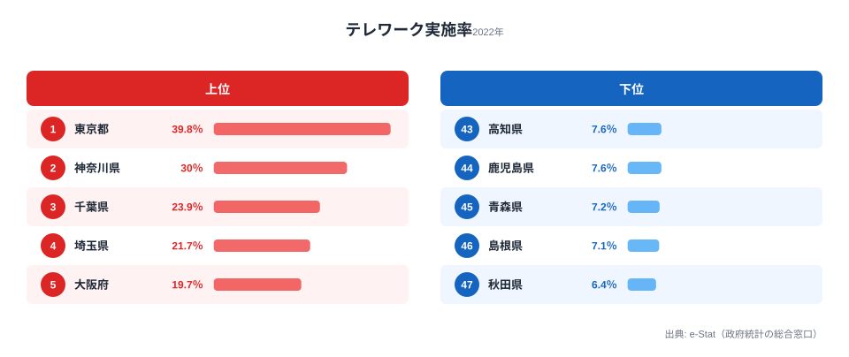
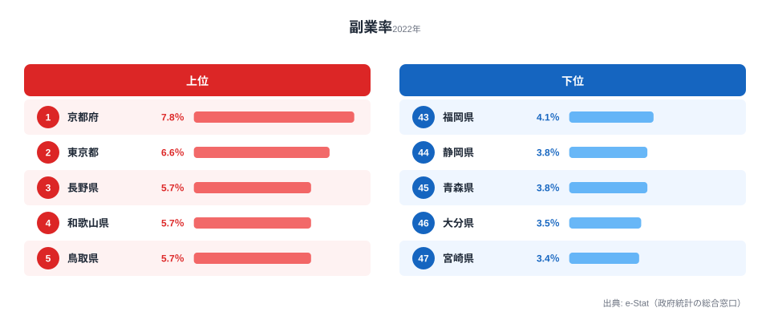
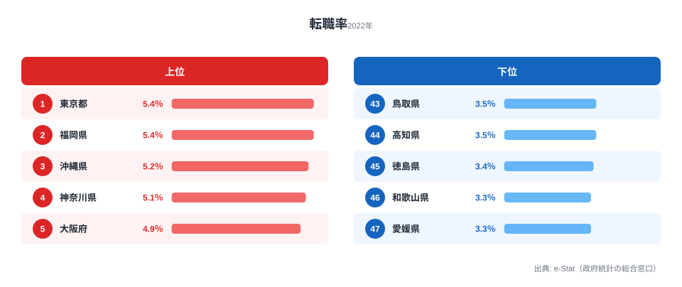

[東京都](/areas/13000)のテレワーク実施率は**39.8%**。一方、秋田県はわずか**6.4%**です。同じ日本で働いていても、テレワークできるかどうかは住む場所によって**6倍以上**の差があります。

コロナ禍を経て定着したはずのテレワークですが、その恩恵は全国に均等には広がっていません。しかも、この格差は単なる勤務形態の違いにとどまらず、副業率・転職率といった「働き方の柔軟性」全体の格差と連動しています。47都道府県のデータから、テレワーク格差の実態と構造を分析します。

## テレワーク実施率ランキング──上位は大都市圏が独占

**1位は東京都**（39.8%）です。2位の神奈川県（30.0%）に約10ポイントの差をつけて突出しています。千葉県（23.9%）・埼玉県（21.7%）と首都圏の4都県が上位を独占し、5位の大阪府（19.7%）以下は20%を下回ります。

一方、下位は秋田県（6.4%）・島根県（7.1%）・青森県（7.2%）と東北・山陰が並びます。10%未満の県は10県にのぼり、いずれも人口規模が小さく第一次・第二次産業の比率が高い地域です。最大値と最小値の比は6.2倍に達します。

<source-link href="/ranking/telework-rate">テレワーク実施率ランキングをもっと見る</source-link>

上位と下位を比べると、明確な傾向があります。上位は三大都市圏（東京・大阪・名古屋）とその周辺、下位は東北・四国・山陰に集中しています。

> [!NOTE]
> テレワーク実施率は「ふだんの仕事でテレワークをしている」と回答した雇用者の割合（2022年就業構造基本調査）。自営業者や、在宅勤務以外のモバイルワーク等も含みます。事業所単位ではなく雇用者の居住地ベースなので、東京の企業に勤める近隣県の通勤者は居住県側にカウントされる点に注意して読んでください。

## 地域パターン分析──産業構造が格差を決める

テレワーク格差の最大の要因は**産業構造**です。

情報通信業や金融・保険業、専門・技術サービス業はテレワークに適した業種であり、これらの産業が集積する都市部ほど実施率が高くなります。東京都は情報通信業の事業所数が全国の約3割を占めており、テレワーク率が突出する構造的な背景があります。

反対に、農林漁業・製造業・建設業・医療福祉といった現場作業が不可欠な業種が中心の地域では、テレワーク実施率は必然的に低くなります。秋田県の第一次産業就業者比率は全国平均の約2倍であり、これが6.4%という低い実施率に直結しています。

首都圏の4都県（東京・神奈川・千葉・埼玉）がいずれも上位にあるのは、東京に本社を置く企業のテレワーク制度が近隣県の通勤者にも適用されるためです。通勤圏という観点では、テレワークの恩恵は「東京経済圏」に集中しているといえます。

> [!WARNING]
> このランキングは「テレワークできる人がどこに住んでいるか」を示すもので、「どの県の産業が遅れているか」を示すものではありません。下位県には製造業や農業など、そもそもテレワークになじまない基幹産業が多く、実施率の低さは産業の性質を反映した結果です。実施率が低い＝デジタル化が遅れている、と短絡しないよう注意してください。

<ad-slot></ad-slot>

## 副業率・転職率との関係──テレワーク可能な県ほど働き方が柔軟

テレワーク実施率と他の「働き方の柔軟性」指標を並べると、興味深いパターンが見えてきます。テレワーク実施率の1位・最下位の格差は**6.2倍**ですが、副業率は**2.3倍**、転職率は**1.6倍**にとどまり、テレワークの地域差が突出しています。

まず副業率を見てみます。

副業率の1位は[京都府](/areas/26000)（7.8%）、最下位は宮崎県（3.4%）で、その差は2.3倍です。東京都は副業率でも2位（6.6%）に入ります。テレワークで通勤時間が浮けば、副業に充てる時間も生まれやすくなる可能性があります。

<source-link href="/ranking/side-job-rate">副業率ランキングをもっと見る</source-link>

次に転職率です。

転職率は東京都（5.4%）と福岡県（5.4%）が同率1位で、最下位は和歌山県・[愛媛県](/areas/38000)（ともに3.3%）です。テレワークが普及した都市部では地理的制約が緩和されるため、求人の選択肢が広がりやすくなります。

<source-link href="/ranking/job-change-rate">転職率ランキングをもっと見る</source-link>

上位県の顔ぶれを見ると、大都市圏がテレワーク率・副業率・転職率のいずれでも上位に入りやすい傾向があります。一方、テレワーク率が低い地方では「この地域で働ける仕事」が限られるため、転職も副業も選択肢が狭まります。テレワーク格差は単なる勤務形態の違いにとどまらず、**キャリアの選択肢の格差**にもつながっている可能性があります。

> [!TIP]
> 3指標は完全には一致しません。副業率1位の京都府（7.8%）はテレワーク率では8位（17.5%）で、大学・研究機関の集積という別の要因が働いています。3つを重ねて見ると、「テレワークが柔軟性を底上げする力」と「地域固有の事情が作る例外」の両方が読み取れます。1指標だけで地域の働き方を判断しないのが読み解くコツです。

## まとめ

この記事で明らかになったテレワーク格差の構造を整理します。

テレワーク実施率は東京都39.8%に対し秋田県6.4%と、6倍以上の格差があります。上位は首都圏・大都市圏が独占し、下位は東北・四国・山陰に集中しています。産業構造の違いがこの格差の主因であり、情報通信業が集積する都市部ほど実施率が高くなります。

テレワーク可能な地域では副業率や転職率も高い傾向にあり、テレワーク格差は働き方全体の柔軟性の格差と連動しています。地方創生の観点では、テレワーク可能な仕事を地方に誘致することが、単なる勤務形態の改善にとどまらず、地域の労働市場全体の活性化につながる可能性を示唆しています。

この格差は自然に縮まるものではありません。産業誘致・関係人口の拡大・デジタル専門職の地方移住支援のいずれも「テレワーク可能な仕事を地域に増やすこと」が前提条件になっており、どの政策が最も効果的かはこれからの実証が待たれます。

## データ出典

本記事のデータはe-Stat（政府統計の総合窓口）の就業構造基本調査（2022年）を基に作成しています。

<data-source url="https://www.e-stat.go.jp/dbview?sid=0004008436" label="e-Stat 就業構造基本調査"></data-source>
