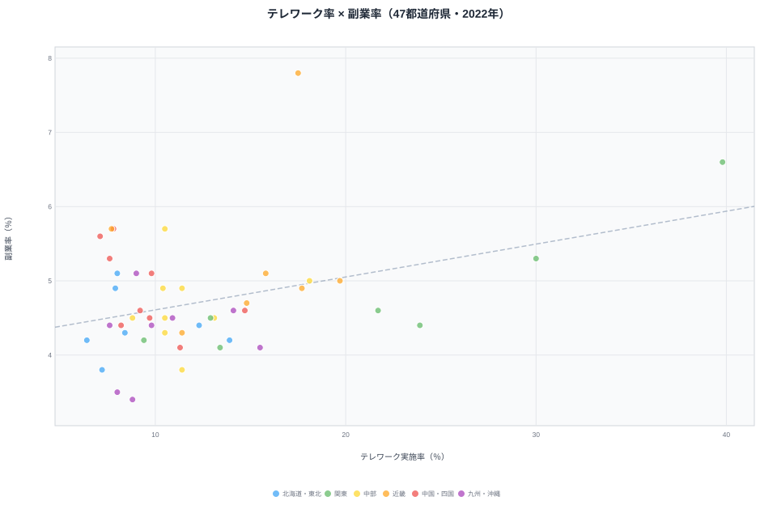
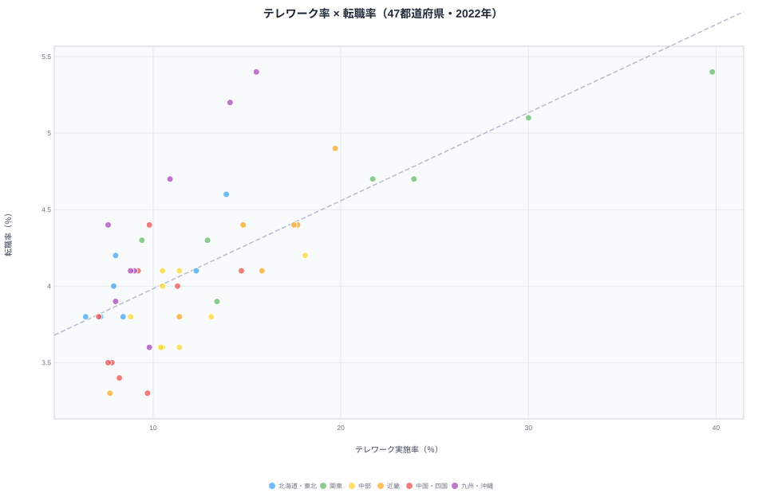

[東京都](/areas/13000)のテレワーク実施率は**39.8%**。一方、秋田県はわずか**6.4%**です。同じ日本で働いていても、テレワークできるかどうかは住む場所によって**6倍以上**の差があります。

コロナ禍を経て定着したはずのテレワークですが、その恩恵は全国に均等には広がっていません。しかも、この格差は単なる勤務形態の違いにとどまらず、副業率・転職率といった「働き方の柔軟性」全体の格差と連動しています。47都道府県のデータから、テレワーク格差の実態と構造を分析します。

## テレワーク実施率ランキング──上位は大都市圏が独占

**1位は東京都**（39.8%）です。2位の神奈川県（30.0%）に約10ポイントの差をつけて突出しています。千葉県（23.9%）・埼玉県（21.7%）と首都圏の4都県が上位を独占し、5位の大阪府（19.7%）以下は20%を下回ります。

一方、下位は秋田県（6.4%）・島根県（7.1%）・青森県（7.2%）と東北・山陰が並びます。10%未満の県は20県にのぼり、全体の4割を超えます。いずれも人口規模が小さく第一次・第二次産業の比率が高い地域です。最大値と最小値の比は6.2倍に達します。

<source-link href="/ranking/telework-rate">テレワーク実施率ランキングをもっと見る</source-link>

上位と下位を比べると、明確な傾向があります。上位5位は東京・神奈川・千葉・埼玉・大阪と、三大都市圏とその周辺、とりわけ首都圏に集中しています（愛知は6位）。下位は東北・四国・山陰に集中しています。

> [!NOTE]
> テレワーク実施率は「ふだんの仕事でテレワークをしている」と回答した雇用者の割合（2022年就業構造基本調査）。自営業者や、在宅勤務以外のモバイルワーク等も含みます。事業所単位ではなく雇用者の居住地ベースなので、東京の企業に勤める近隣県の通勤者は居住県側にカウントされる点に注意して読んでください。

## 地域パターン分析──産業構造が格差を決める

テレワーク格差の最大の要因は**産業構造**です。

情報通信業や金融・保険業、専門・技術サービス業はテレワークに適した業種であり、これらの産業が集積する都市部ほど実施率が高くなります。東京都は情報通信業の事業所数が全国の約3割を占めており、テレワーク率が突出する構造的な背景があります。

反対に、農林漁業・製造業・建設業・医療福祉といった現場作業が不可欠な業種が中心の地域では、テレワーク実施率は必然的に低くなります。秋田県の第一次産業就業者比率は全国平均の約2倍であり、これが6.4%という低い実施率に直結しています。

首都圏の4都県（東京・神奈川・千葉・埼玉）がいずれも上位にあるのは、東京に本社を置く企業のテレワーク制度が近隣県の通勤者にも適用されるためです。通勤圏という観点では、テレワークの恩恵は「東京経済圏」に集中しているといえます。

> [!WARNING]
> このランキングは「テレワークできる人がどこに住んでいるか」を示すもので、「どの県の産業が遅れているか」を示すものではありません。下位県には製造業や農業など、そもそもテレワークになじまない基幹産業が多く、実施率の低さは産業の性質を反映した結果です。実施率が低い＝デジタル化が遅れている、と短絡しないよう注意してください。

<ad-slot></ad-slot>

## 副業率・転職率との関係──テレワーク可能な県ほど働き方が柔軟

テレワーク実施率と他の「働き方の柔軟性」指標を並べると、興味深いパターンが見えてきます。テレワーク実施率の1位・最下位の格差は**6.2倍**ですが、副業率は**2.3倍**、転職率は**1.6倍**にとどまり、テレワークの地域差が突出しています。

では、テレワーク率が高い県は副業率・転職率も高いのでしょうか。47都道府県を散布図に置いて、両者がどれだけ連動しているかを確かめます。

まず副業率です。

副業率の1位は[京都府](/areas/26000)（7.8%）、最下位は宮崎県（3.4%）で、その差は2.3倍です。東京都は副業率でも2位（6.6%）に入ります。

<source-link href="/ranking/side-job-rate">副業率ランキングをもっと見る</source-link>

横軸にテレワーク率、縦軸に副業率を取った散布図を見ると、両者の連動は実は弱めです（相関係数は約0.37）。

右上にはテレワーク率・副業率がともに高い東京（39.8%・6.6%）が位置しますが、副業率1位の京都（17.5%・7.8%）はテレワーク率では8位どまりで、図の左寄り上方にぽつんと外れています。逆に、テレワーク率は中位でも副業率が高い長野・鳥取・島根といった地方県が左上に散らばっており、点全体は緩やかに右肩上がりになるものの、ばらつきは大きいです。副業はテレワーク以外の事情（自営・農業の兼業、地域の労働慣行など）にも左右されるため、テレワーク率だけでは説明しきれないことが読み取れます。

次に転職率です。

転職率は東京都（5.4%）と福岡県（5.4%）が同率1位で、最下位は和歌山県・[愛媛県](/areas/38000)（ともに3.3%）です。

<source-link href="/ranking/job-change-rate">転職率ランキングをもっと見る</source-link>

転職率との散布図は、副業率よりもはっきりした右肩上がりの傾向を示します（相関係数は約0.70）。

テレワーク率が高い東京・神奈川・大阪・福岡は転職率でも上位に並び、点はおおむね回帰直線に沿って分布します。テレワーク率が高い都市圏ほど求人の選択肢が多く、転職市場も活発である傾向が見て取れます。一方、テレワーク率が10%を切る東北・四国・山陰の県は左下にかたまり、転職率も低い水準にとどまっています。

3指標を重ねると、大都市圏がテレワーク率・副業率・転職率のいずれでも上位に入りやすい傾向は確かにあります。ただし副業率との連動は弱く（0.37）、転職率との連動は比較的強い（0.70）と、指標ごとに結びつきの強さは異なります。テレワーク格差は単なる勤務形態の違いにとどまらず、**キャリアの選択肢の格差**とも重なっている可能性があります。

> [!WARNING]
> 3指標がいずれも大都市圏で高いのは、産業集積や人口規模という**共通の背景**が同時に押し上げている「見かけの相関」であり、テレワークが直接ほかの指標を引き上げているという因果関係を示すものではありません。本データからは「同じ県で同時に高くなりやすい」ことまでしか言えず、テレワークを増やせば副業・転職が増えると読むのは行き過ぎです。実際、副業率との連動（0.37）は転職率との連動（0.70）よりずっと弱く、別々の要因が働いていることがうかがえます。

> [!TIP]
> 3指標は完全には一致しません。副業率1位の京都府（7.8%）はテレワーク率では8位（17.5%）で、大学・研究機関の集積という別の要因が働いています。1指標だけで地域の働き方を判断せず、散布図で「全体の傾向」と「外れ値」を分けて見るのが読み解くコツです。

## まとめ

この記事で明らかになったテレワーク格差の構造を整理します。

産業構造の違いがこの格差の主因であり、情報通信業が集積する都市部ほど実施率が高くなります。だからこそ、テレワーク格差は「県のデジタル化の遅れ」ではなく、その地域に根づいた基幹産業の性質を映したものとして読む必要があります。

テレワーク率が高い県は転職率も高めという連動（相関0.70）は見られますが、副業率との連動は弱く（0.37）、3指標が大都市圏で同時に高くなるのは共通の背景による見かけの相関です。テレワークを増やせば自動的に柔軟な労働市場が育つわけではない、という点には注意が必要です。地方創生の観点では、テレワーク可能な仕事を地方に誘致することが、勤務形態の改善にとどまらず地域の労働市場の活性化につながりうる一方で、その効果は産業誘致や人材の受け皿づくりとセットでなければ限定的にとどまる可能性があります。

この格差は自然に縮まるものではありません。産業誘致・関係人口の拡大・デジタル専門職の地方移住支援のいずれも「テレワーク可能な仕事を地域に増やすこと」が前提条件になっており、どの政策が最も効果的かはこれからの実証が待たれます。

## データ出典

本記事のデータはe-Stat（政府統計の総合窓口）の就業構造基本調査（2022年）を基に作成しています。

<data-source url="https://www.e-stat.go.jp/dbview?sid=0004008436" label="e-Stat 就業構造基本調査"></data-source>
