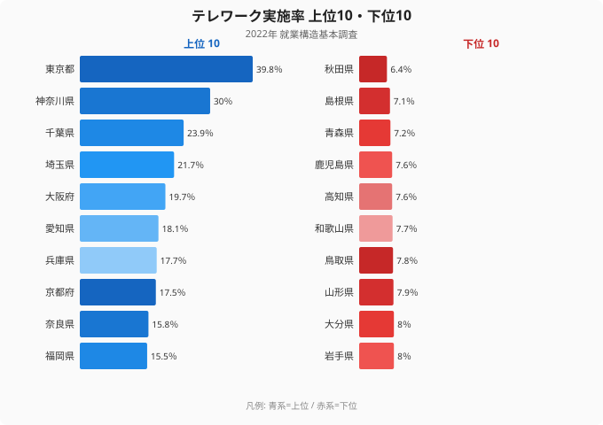
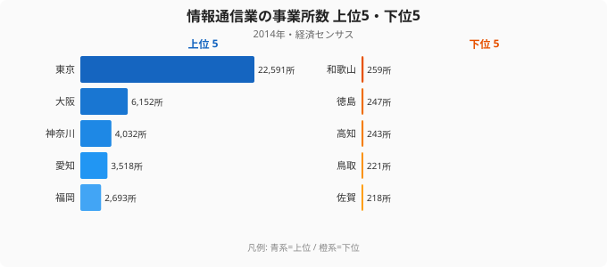
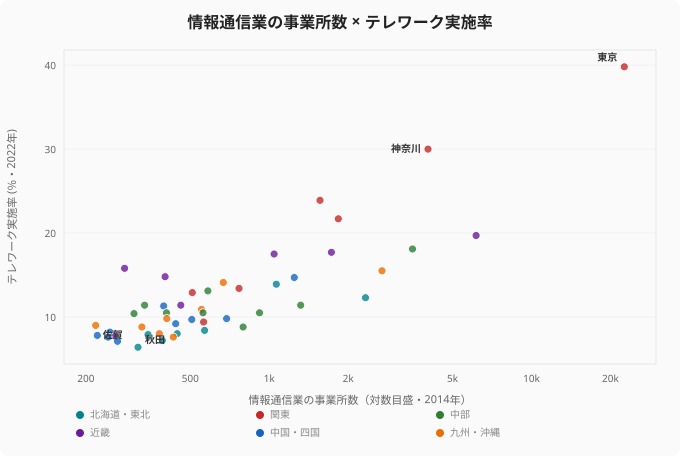
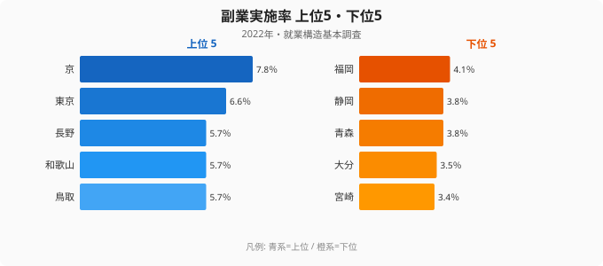

「在宅で働くのが当たり前になった」と感じている人と、「うちの地域にそんな働き方はない」と感じている人がいます。この感覚の差は、気のせいではなく、データにはっきり出ています。

2022年の就業構造基本調査によると、テレワークを実施した人の割合は、**東京都で39.8%**でした。働く人のおよそ4割が在宅勤務を経験しています。一方、最も低い**秋田県は6.4%**にとどまります。その差は**約6.2倍**で、同じ国の同じ時期の調査とは思えないほど開いています。

この記事では、テレワーク実施率が6倍も違う理由を、単なる「都会と地方」では片付けずに掘り下げていきます。鍵を握るのは**情報通信業がどこに集まっているか**であり、さらに「テレワークが進んだ県は副業も盛んなのか?」という直感を、データは意外な形で裏切ります。

> [!NOTE]
> ここでいうテレワーク実施率は、有業者のうち2022年にテレワーク(在宅勤務・モバイルワーク等)を実施した人の割合。総務省「就業構造基本調査」(2022年)に基づく。コロナ禍を経た直後の調査であり、その後の出社回帰の動きは反映していない点に注意。

## テレワーク率ランキング：上位は首都圏、下位は東北・南九州

上位の顔ぶれは予想どおりで、**東京39.8%・神奈川30.0%・千葉23.9%・埼玉21.7%**と、首都圏4都県が一気に並びます。5位は**大阪19.7%**、6位**愛知18.1%**と三大都市圏が続きます。

注目したいのは「上位グループのなかでの落差」です。1位東京の39.8%と2位神奈川の30.0%だけで約10ポイントの差があり、3位以下は20%台前半に急落します。**テレワークは大都市圏のなかでも東京だけが突出している**構造が見えてきます。

一方、下位は東北と南九州に集中しています。最下位の**秋田6.4%**を筆頭に、**島根7.1%・青森7.2%・鹿児島7.6%・高知7.6%**と、7%前後の県が固まっています。上位の東京と比べると、在宅で働ける人の割合は7分の1以下です。なぜこれほど明確に「上は首都圏、下は東北・南九州」と分かれるのか。次の章で産業構造から読み解いていきます。

<source-link href="/ranking/telework-rate">テレワーク実施率の47都道府県ランキングをもっと見る</source-link>

## 6倍差の真因は「情報通信業がどこにあるか」

なぜここまで差がつくのでしょうか。最も説明力が高いのは、**テレワークしやすい仕事そのものが、どこに存在するか**という産業構造の問題です。

在宅で完結しやすい代表格はIT・情報通信業ですが、この業種は極端に東京へ集中しています。経済センサスによる情報通信業の事業所数を見ると、**東京都は22,591所で全国1位**です。2位の**大阪府6,152所**、3位の**神奈川県4,032所**を大きく引き離しています。

対して下位県では、事業所そのものが極端に少なくなっています。テレワーク最下位の**秋田県は情報通信業の事業所が316所(39位)**、テレワーク46位の**島根県も264所(42位)**しかありません。事業所数の最下位は**[佐賀県](/areas/41000)の218所**で、東京とは実に100倍を超える開きがあります。テレワーク率の上位・下位が、そのまま情報通信業の集積の上位・下位とほぼ重なるのです。

<source-link href="/ranking/number-of-establishments-information-communication">情報通信業の事業所数ランキングを見る</source-link>

この「ほぼ重なる」を散文だけで語ると印象論に見えてしまうので、47都道府県を1枚の散布図にして確かめます。横軸に情報通信業の事業所数(対数目盛)、縦軸にテレワーク実施率をとると、点群は左下から右上へきれいに伸びていきます。両者の相関係数(対数変換後)は**約0.84**で、統計的にはかなり強い正の相関です。

図の右上に1点だけ離れて位置するのが**東京都**です。事業所数22,591所・テレワーク率39.8%と、両軸ともに突き抜けた外れ値で、東京が「テレワーク先進」というより「情報通信業の一極集中」の帰結であることが視覚的にわかります。一方、左下に固まる**秋田・島根・佐賀**などの点は、事業所数が少ないほどテレワーク率も低いという関係をそのまま描いています。点の散らばりが直線状に並ぶほど、「在宅でできる仕事が地域にどれだけあるか」がテレワーク率をほぼ説明していることになります。

> [!TIP]
> 「テレワークできるかどうか」は本人の意欲より、勤務先の業種と、その業種が地域に存在するかどうかでほぼ決まる。情報通信業の集積マップとテレワーク率のマップは、上位・下位ともにほぼ重なる。在宅勤務を前提に移住先を選ぶなら、まず狙う県にどんな産業があるかを確認したい。

つまり「東北の人は在宅勤務をしたがらない」のではなく、**在宅で完結する仕事の受け皿が地域にほとんどない**のです。これが6倍差の構造的な背景です。逆に言えば、テレワーク率は「その県のホワイトカラー・IT産業の厚み」を映す鏡でもあります。

> [!WARNING]
> 情報通信業の事業所数とテレワーク率は強く重なるが、これは「相関」であって因果の証明ではない。事業所数は2014年の経済センサス、テレワーク率は2022年と調査年が8年離れている。年次差と、事業所数(規模を問わない件数)という指標の性質を踏まえると、両者の重なりは「テレワーク可能な仕事の地理的偏り」を示す傍証として読むのが妥当。

## 「テレワーク先進県は副業も盛ん」は本当か：データが裏切る直感

ここで一つの仮説が浮かびます。「在宅で柔軟に働ける県では、副業に取り組む人も多いのではないか」──時間と場所の自由が副業を後押しする、という直感です。ところが、データはこの直感をきれいには支持しません。

副業実施率の1位は、テレワーク率では8位の**京都府で7.8%**でした。テレワーク1位の**東京都は副業では2位の6.6%**で、首位を譲っています。一方で、テレワーク46位の**島根県は副業率では6位(5.6%)**と上位に食い込んでいます。

この副業率の上位5県を見ると、京都・東京こそ並ぶものの、**長野・和歌山・鳥取**といった、テレワーク率では中位以下の県が顔を出します。テレワーク率の上位を首都圏が独占していたのとは、明らかに違う顔ぶれです。下位5県も**宮崎・大分・青森・静岡・福岡**と、テレワーク下位とは一致しません。同じ「柔軟な働き方」でも、上位・下位の地図がここまでずれること自体が、両者を別の現象として扱うべき証拠になっています。

> [!WARNING]
> テレワーク率と副業率の順位は一致しない。テレワーク最下位の秋田県は副業率でも39位(4.2%)と低いが、テレワーク下位の島根県は副業率が上位というねじれが起きている。両者を単純に「柔軟な働き方」として束ねると実態を見誤る。**[仮説]** 副業率の高さは在宅勤務よりも、農業・自営業など兼業しやすい産業構造を反映している可能性がある。検証するには産業別就業者構成との突き合わせが必要で、本記事のデータだけでは断定できない。

副業率の最下位は**宮崎県の3.4%**で、テレワーク率(34位8.8%)と同様に下位ではあるものの、順位はずれています。テレワークと副業は「柔軟な働き方」という言葉でまとめられがちですが、**駆動する要因が異なる別々の現象**と見たほうが実態に近いといえます。在宅勤務はその業種が地域にあるかどうかで決まり、副業は兼業しやすい産業構造に左右される、という別々の論理で動いているのです。

<source-link href="/ranking/side-job-rate">副業実施率の都道府県ランキングを見る</source-link>

## テレワーク格差は「デジタル格差」でもある

テレワーク率の地図は、突き詰めると**情報インフラを使う仕事がどこにあるか**の地図と重なります。在宅勤務が広がった県は、IT産業・ホワイトカラー職が厚く、通勤を前提にしない働き方への移行余地が大きかったといえます。

この差は単なる利便性の問題にとどまりません。在宅勤務ができる県は、育児・介護と仕事の両立、Uターン人材の受け入れ、通勤時間の削減といった面で構造的に有利になります。テレワーク格差は、**今後の地域間の人材獲得競争にそのまま効いてくる「デジタル格差」**でもあるのです。

地方移住を検討するなら、住環境や家賃だけでなく、「その県で在宅前提の仕事に就けるのか」を産業データで確かめておきたいところです。各県の働き方の土台は、[労働・賃金カテゴリのランキング](/category/laborwage)や[都道府県プロフィール](/areas/13000)から横断的に確認できます。

## まとめ

- **テレワーク実施率は東京都が39.8%で最も高く、秋田県が6.4%で最も低い**結果でした。その差は約6.2倍です(2022年・就業構造基本調査)。
- 上位は東京・神奈川・千葉・埼玉の**首都圏4都県が独占**し、なかでも東京だけが突出して高い水準でした。
- 下位は**東北・南九州**(秋田・島根・青森・鹿児島・高知)に集中し、7%前後で固まっています。
- 6倍差の真因は産業構造でした。**情報通信業の事業所数は東京22,591所に対し佐賀218所**で、テレワークしやすい仕事の受け皿そのものが偏在しています。
- 「テレワーク先進県=副業も盛ん」は誤りでした。**副業率1位は京都(7.8%)で東京は2位**、テレワーク下位の島根が副業率6位に入るなど、両者は別々の要因で動いています。

> [!IMPORTANT]
> テレワーク率は「働き方の自由度」を測る指標であると同時に、その県のIT・ホワイトカラー産業の厚みを映す。地方創生や移住政策を考えるうえで、在宅で完結する仕事をどう地域に増やすかが、デジタル格差を縮める鍵になる。

## データ出典

本記事のデータはe-Stat（政府統計の総合窓口）を基に作成しています。
