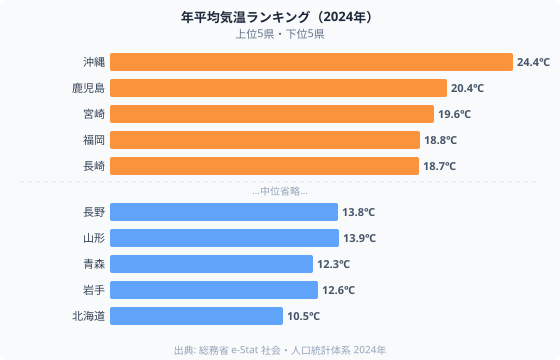
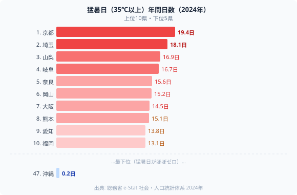
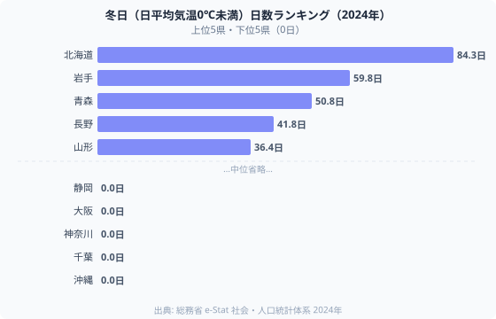
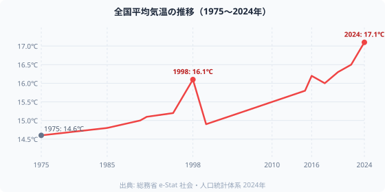

「暑い県に住みたくない」──引越し先を探すとき、多くの人が沖縄や鹿児島を避けます。ところが、**猛暑日（35℃以上の日）が最も多い都道府県は[京都府](/areas/26000)（19.4日）で、沖縄県はわずか0.2日で全国最下位**。年平均気温が最高の沖縄が「猛暑日ゼロ」に近い逆転現象が起きています。

なぜこうなるのか。2024年気象データで都道府県の気候を解剖します。[気候・気象関連の都道府県統計一覧](/category/landweather)も合わせてご覧ください。

## 年平均気温ランキング──沖縄と北海道で14℃の差

まず基本データとして、年平均気温から見ます。

上位は南から順に並びます。**[沖縄](/areas/47000)（24.4℃）が1位**、2位は鹿児島（20.4℃）、3位は宮崎（19.6℃）と九州・沖縄勢が席巻。福岡（18.8℃）、長崎・熊本（18.7℃）と続き、暖かさは地理的に素直な序列です。

下位はそのまま北側が並びます。長野（43位・13.8℃）や山形（42位・13.9℃）が内陸の冷涼さで下位に入り、**青森（45位・12.3℃）、岩手（46位・12.6℃）、[北海道](/areas/01000)（47位・10.5℃）**で最下位圏を形成。沖縄24.4℃ vs 北海道10.5℃ — 差は**13.9℃**。同じ国とは思えない開きです。

> [!NOTE]
> この気温データは各都道府県庁所在地の観測値です。同じ県内でも標高や海からの距離で大きく変わるため、県全体の平均値ではありません。

<source-link href="/ranking/average-temperature">年平均気温ランキングをもっと見る</source-link>

## 猛暑日マップ──なぜ京都が1位で沖縄が最下位なのか

年平均気温ランキングとは全く異なる顔ぶれが、猛暑日ランキングに現れます。

**トップ10はほぼ盆地・内陸の県**（京都・山梨・岐阜・奈良・埼玉）。一方、**沖縄は年中暑いのに猛暑日は0.2日**と最下位圏。上位10の中に九州・沖縄は熊本（8位・15.1日）だけが入る程度で、南方の県が軒並み中〜下位に沈みます。この逆転の原因は地形にあります。

### 盆地が猛暑日を生む3つのメカニズム

1. **昼間の熱が逃げない**: 周囲を山で囲まれた盆地では、日中に蓄積した熱が夜になっても放散されにくい
2. **フェーン現象**: 山を越えた気流が乾燥・高温になって盆地に流れ込む
3. **都市熱島効果との相乗**: 京都・大阪は都市化が進んでおり、アスファルトからの蓄熱が重なる

一方、沖縄は**海洋性気候**で海風が常に吹き、極端な高温になりにくい。年平均気温は高いが「ゆるやかに暑い」のが特徴です。35℃超えというピークの凶悪さを生み出すのは、南国の太陽よりも「熱を閉じ込める地形」の力が大きいわけです。

> [!TIP]
> 猛暑日数ランキングは「夏のピーク温度の厳しさ」を示します。一方、年平均気温は「通年の快適さ」の指標。移住先を選ぶ際は両方の指標を確認することをおすすめします。

<source-link href="/ranking/maximum-temperature">最高気温ランキングをもっと見る</source-link>

## 真夏日数で見ると順位が変わる

猛暑日（35℃超）と真夏日（30℃超）は全く異なる分布を示します。真夏日の最多は**沖縄（102.5日）**。一年のうち約3ヶ月間は日中30℃を超える日が続く計算です。熊本（80.7日）、鹿児島（78.0日）と続き、九州・沖縄が本領を発揮します。

ところが**京都は真夏日75.8日・猛暑日19.4日**で、真夏日のうち実に**25.6%が猛暑日**という過酷な比率。4日に1日は35℃超えになる計算です。大阪も真夏日74.9日・猛暑日14.5日（比率19.4%）と同様の傾向。「ただ暑い日が多い」沖縄と「少ない日数のうち猛烈に暑い日が多い」京都では、暑さの質がまったく異なります。

熱中症リスクという観点では、単純に猛暑日数が多い盆地都市（京都・埼玉・山梨）の方が短期集中でリスクが高い局面があります。一方で沖縄は夜間の最低気温も高く「暑さが持続する」点での負担が異なる形で生じます。

## 冬の厳しさ──北海道の3ヶ月間は氷点下

夏とは逆に、冬の厳しさは北日本が圧倒します。

**[北海道](/areas/01000)の冬日（日平均気温0℃未満）は84.3日**で、年間の約4分の1が氷点下。2位の岩手（59.8日）、3位の青森（50.8日）、4位の長野（41.8日）、5位の山形（36.4日）と続きますが、北海道だけが突出した多さです。

注目すべきは、内陸の長野県（4位）が海沿いの青森（3位）に迫る点。年平均気温は長野（13.8℃）より青森（12.3℃）の方が低いのに、冬日数は長野（41.8日）が青森（50.8日）より少ない。これは長野の標高の高さが年間を通じた寒さには直結しつつも、真冬日のピーク頻度では日本海側の積雪が影響する青森が上回るためです。

一方、千葉・神奈川・静岡・大阪・沖縄など**8府県は冬日ゼロ**（日平均気温が0℃を下回る日が年間0日）。太平洋岸の温暖な気候と都市の蓄熱が、冬の極端な低温を防いでいます。

<source-link href="/ranking/lowest-temperature">最低気温ランキングをもっと見る</source-link>

## 猛暑日 × 冬日で見える4タイプの気候

猛暑日数と冬日数を2軸に取ると、都道府県が4タイプに分類できます。

**「夏は地獄・冬はそこそこ」型**（猛暑日多・冬日少）: 京都・埼玉・山梨・岐阜・奈良など内陸盆地が集中。夏の猛暑が際立つ一方、緯度がそこまで高くないため冬は北日本ほど厳しくありません。ただし、京都や奈良は冬も底冷えが有名で、体感は数字以上に厳しいとも言われます。

**「夏は快適・冬は極寒」型**（猛暑日少・冬日多）: 北海道・岩手・青森・長野など北国・高標高エリア。夏は涼しく過ごしやすい半面、冬の長さと厳しさは圧倒的。北海道では暖房費が年間30〜50万円以上になるケースも珍しくありません。

**「年間穏やか」型**（猛暑日少・冬日少）: 沖縄・鹿児島・宮崎・高知など南方県。猛暑日が少なく冬も凍えない「気候的な恵み」エリア。ただし台風の通り道でもあり、気候リスクがゼロではありません。

**「夏も冬も厳しい」型**（猛暑日多・冬日多）: 注目すべきことに、**このゾーンに該当する都道府県はほぼ存在しません**。日本の都道府県には夏の猛暑と冬の極寒が同時に極端な場所がほとんどなく、気候の過酷さは「夏か冬か」に偏る傾向があります。

> [!WARNING]
> このランキングは都道府県庁所在地1地点の観測値に基づきます。同じ県内でも、山間部と沿岸部では気温が大幅に異なります。実際の生活環境では、市区町村レベルのデータを確認することを推奨します。

## 50年で2.5℃上昇した温暖化の実態

1975年から2024年にかけて、全国平均気温は**14.6℃ → 17.1℃と約2.5℃上昇**しました。

- 1990年代初頭：最初の段階的上昇（14℃台 → 15℃台）
- 1998年：エルニーニョ効果で当時最高の16.1℃
- 2016年以降：16℃超えが常態化
- **2024年：過去最高の17.1℃**

10年あたり0.5℃のペースで温暖化が進行しており、内陸盆地型都市（京都・大阪・さいたま）では猛暑日のさらなる増加が見込まれます。将来的には「猛暑日20日超え」が京都の「平均」になりうる試算もあります。

## 引越し・移住先を選ぶ4指標

気候を総合的に評価するには4指標を合わせて見ることが有効です。

1. **年平均気温**：通年の快適さ（沖縄が最高・北海道が最低）
2. **猛暑日数**：夏のピークの過酷さ（京都が最多・沖縄がほぼゼロ）
3. **冬日数**：冬の厳しさ（北海道が圧倒的）
4. **年間日照時間**：晴れの多さ（太平洋側に集中）

**愛知・静岡・神奈川**は4指標でバランスが良く、猛暑日は中程度・冬日は少ない「気候的な穴場」と言えます。**北海道**は夏が快適な分、冬の厳しさとの引き換えです。気候だけでなく、社会インフラや産業・医療アクセスなど[都道府県統計の多面的な比較](/category/landweather)を組み合わせて判断することが現実的な移住先選びの基本です。

## データ出典

- 総務省「社会・人口統計体系」e-Stat 2024年（気温・猛暑日・冬日データ）
- 気象庁 観測データ
