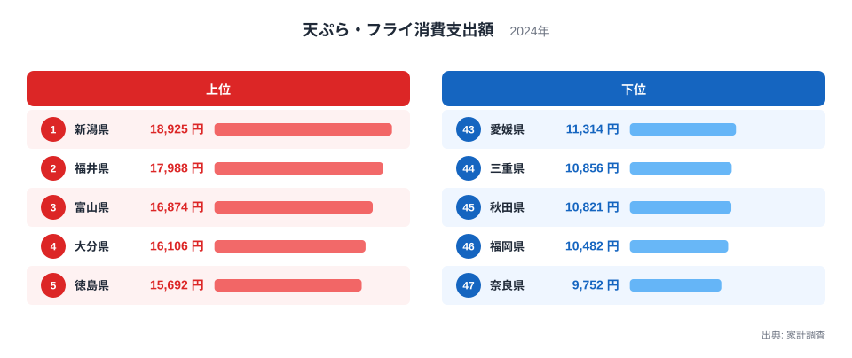
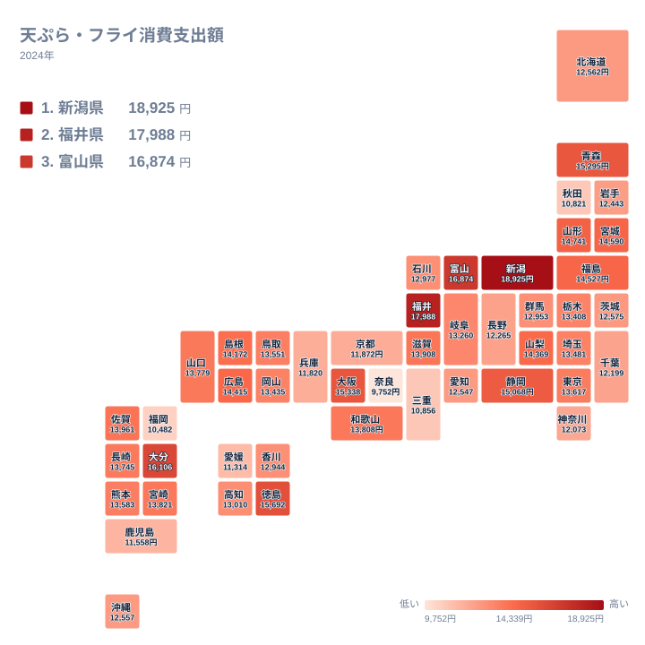

スーパーの惣菜コーナーに並ぶ天ぷらやフライは、忙しい日の食卓を助けてくれる定番の中食です。総務省の家計調査では、都道府県庁所在市に住む世帯がこの「天ぷら・フライ」にいくら支出しているかを毎年調べています。2024年のデータを見ると、同じ商品分類でありながら、支出額には想像以上の開きがあることが分かります。

もっとも支出額が多いのは新潟県で、18,925円です。もっとも少ないのは奈良県で、9,752円にとどまります。18,925円を9,752円で割ると、およそ1.94になります。つまり新潟県は奈良県のおよそ1.94倍を天ぷら・フライに使っている計算です。この記事では、上位と下位にどのような県が並ぶのか、地理的にどのような分布を描くのか、そして地域差の背景に何があるのかを、実際のランキング図と地図から確認していきます。

> [!NOTE]
> この支出額は、総務省の家計調査に基づく都道府県庁所在市に住む二人以上の世帯の平均額です。県内全域の平均ではなく、都道府県庁所在市という一部の地域の家計だけを反映した数値です。この点にご注意ください。

## 天ぷら・フライ支出額が高い県、低い県

<source-link href="/ranking/tempura-fry-consumption-expenditure">天ぷら・フライ消費支出額ランキングをもっと見る</source-link>

上位を見ると、1位の新潟県18,925円に続き、2位は福井県で17,988円、3位は富山県で16,874円です。4位は大分県で16,106円、5位は徳島県で15,692円と続きます。上位5県の顔ぶれを見ると、日本海側の北陸3県と、九州・四国の県が同時にランクインしており、単一の地域だけに支出額が偏っているわけではないことが分かります。

下位を見ると、47位の奈良県9,752円のひとつ上、46位は福岡県で10,482円です。45位は秋田県で10,821円、44位は三重県で10,856円、43位は愛媛県で11,314円という順になっています。下位5県のうち、奈良県だけが海に面していない内陸県で、残りの4県はいずれも海に面した県です。海の近さだけでは支出額の高低を単純に説明できないことが、この時点ですでに見えてきます。

[新潟県のデータ](/areas/15000)を見ると、この統計以外にも地域の特徴を確認できます。同じように[福井県のデータ](/areas/18000)も、他の指標とあわせて調べることができます。

## 地図で見る地域差

地図に色を塗って見ると、支出額が多い県は新潟県、福井県、富山県といった日本海側の北陸地方に集まっている一方で、青森県、山形県、宮城県、福島県といった東北地方の県も比較的支出額が多いことが分かります。西日本では、瀬戸内海側の大分県、徳島県、大阪府に加え、日本海側の島根県や玄界灘に面した佐賀県など、海域を問わず支出額が多い県が点在しており、東西どちらか一方に偏った分布にはなっていません。

一方で支出額が少ない県は、近畿地方の奈良県、京都府、兵庫県と、東北地方の秋田県、九州地方の福岡県、鹿児島県など、全国に分散しています。とくに秋田県は日本海に面した県でありながら支出額は下位に位置しており、福岡県も日本海に面していながら下位です。このことから、「日本海側だから支出額が多い」という単純な図式だけでは、この分布の全体を説明しきれないことが分かります。地図全体を見渡すと、支出額の高い県も低い県も、太平洋側と日本海側の両方に散らばっているのが実際の姿です。

> [!WARNING]
> 「天ぷら・フライ」という分類には、魚介類を使ったものから、鶏肉や野菜を使ったものまで幅広い種類の揚げ物が含まれています。同じ支出額であっても、中身の内訳は都道府県ごとに異なっている可能性があり、この統計だけでは「魚の天ぷらが多いか」「肉のフライが多いか」までは判別できません。

## なぜ地域差が生まれるのか

[仮説] 新潟県、福井県、富山県はいずれも日本海に面しており、甘えびやホタルイカ、白えびなど新鮮な魚介類が手に入りやすい地域として知られています。新鮮な魚介類が入手しやすい環境が、天ぷらなど揚げ物を家庭やスーパーの惣菜として買う習慣を支えている可能性があります。ただし、同じ日本海側にある秋田県や福岡県は下位にあるため、海に近いことだけが理由ではなさそうです。

[仮説] 4位の大分県には、鶏肉を天ぷらのように揚げる「とり天」という郷土料理があり、地元で親しまれてきた食文化として知られています。天ぷら・フライという分類には魚介類だけでなく鶏肉を使った揚げ物も含まれるため、こうした郷土の食文化が支出額を押し上げている可能性があります。この点は、とり天そのものの購入額を切り分けたデータがないため、あくまで仮説にとどまります。

47位の奈良県は、滋賀県と並んで近畿地方で海に面していない内陸県です。新鮮な魚介類を使った天ぷらを日常的に買う習慣が、海に面した県と比べて根付きにくかった可能性があります。ただし、鶏肉や野菜を使った天ぷら・フライという選択肢もあるため、内陸であることだけが理由と断定することはできません。

## 惣菜・中食としての「天ぷら・フライ」

家計調査における「天ぷら・フライ」は、家庭で材料から手作りする揚げ物ではなく、スーパーや惣菜店で調理済みの状態で購入する中食に分類される品目です。共働き世帯の増加や、単身世帯・高齢世帯の増加によって、家庭で揚げ物を一から作るよりも、調理済みの天ぷらやフライを買って済ませる家庭が増えている地域ほど、この支出額が高くなっている可能性があります。

[仮説] この金額は世帯当たりの支出額のため、世帯の人数や構成も影響します。同じ金額を1人世帯が使う場合と、4人世帯が使う場合とでは、1人当たりの消費量はまったく異なります。世帯構成の違いを考慮せずに都道府県間の金額だけを比べると、実際の1人当たりの消費傾向とはずれた印象を持ってしまう可能性があります。

大分県のとり天のように、天ぷら・フライという広い分類のなかに、地域ごとの郷土料理や食文化が隠れていることも見逃せません。同じランキングの中でも、上位に来る理由は県によってまったく異なる可能性があり、1つの原因にまとめて説明することは難しいテーマだと言えます。

> [!TIP]
> この支出額は世帯単位の金額です。世帯の人数や年齢構成が異なる県同士を比べるときは、金額の大小だけでなく、[同じカテゴリの統計一覧](/category/economy)にある他の指標もあわせて確認すると、より立体的に地域差を読み解くことができます。

## まとめ

- 天ぷら・フライ消費支出額の1位は新潟県で18,925円、47位は奈良県で9,752円です
- 1位の新潟県は47位の奈良県のおよそ1.94倍の支出額です
- 上位5県は新潟県、福井県、富山県、大分県、徳島県で、日本海側の北陸地方と太平洋側・瀬戸内海側の県が混在しています
- 下位5県のうち奈良県だけが内陸県で、福岡県、秋田県、三重県、愛媛県はいずれも海に面した県です
- 日本海側であることだけでは支出額の高低を説明できず、地元の食文化や世帯構成など複数の要因が関わっている可能性があります

## データ出典

家計調査(総務省統計局)、2024年のデータをもとに作成しています。
