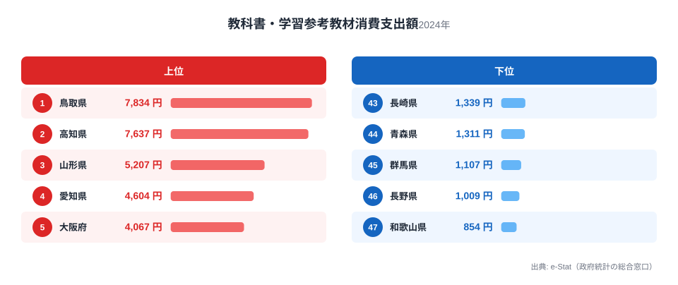
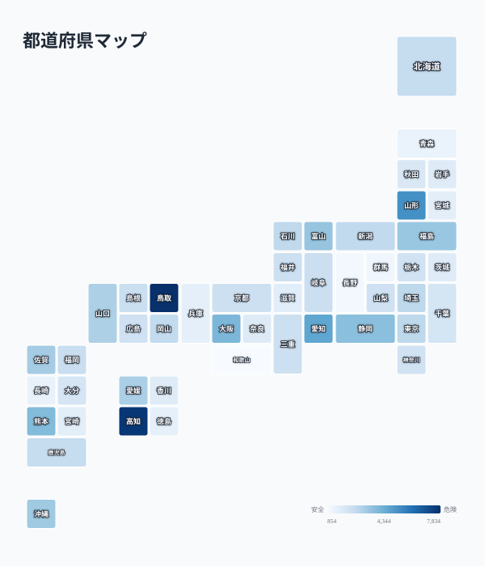

「教科書代が高い県といえば、私立中学受験が盛んな東京や大阪だろう」——そう思って統計を開くと、意外な結果が待っています。総務省の家計調査によると、教科書・学習参考教材費への1世帯あたり年間支出額が最も高いのは鳥取県の7,834円、次いで高知県の7,637円でした。東京都は14位の2,736円にとどまり、最下位の和歌山県854円との差は9.2倍に達します。

この記事では、家計調査における「教科書・学習参考教材費」の47都道府県ランキングを見ながら、なぜ都市部ではなく地方の県が上位に来るのか、その構造を探ります。

> [!NOTE]
> 家計調査の「教科書・学習参考教材費」は、学校で使用する教科書代に加えて、家庭で購入する参考書・問題集・ドリルなどの学習教材費を合算した費目です。学習塾の月謝や家庭教師費用（「補習教育費」という別費目）は含まれません。

## 上位と下位

<source-link href="/ranking/textbook-consumption-expenditure">教科書・学習参考教材費ランキングをもっと見る</source-link>

上位5県を見ると、[鳥取県](/areas/31000)7,834円、[高知県](/areas/39000)7,637円、山形県5,207円、愛知県4,604円、大阪府4,067円と続きます。1位と2位の鳥取・高知は、いずれも人口規模が小さく私立中学受験が特別盛んというわけではない県です。むしろ両県とも公立小中学校の在籍率が全国平均より高い地域として知られています。

この費目は「学校で配布・指定される教材の購入」を反映しやすい性質があります。公立学校が主体の地域では、副教材・ドリル・問題集を学校側が一律に指定し、家庭が購入する仕組みが根強く残っている場合があります。都市部のように多様な私立選択肢がある地域よりも、学校指定教材の購入率が家計調査の数字に直接反映されやすいと考えられます。

一方、上位に大阪府・愛知県という大都市圏も入っており、単純な「都市 vs 地方」の二項対立では説明しきれません。大阪府・愛知県は世帯あたりの子どもの数や教育熱心さが全国的に高い地域としても知られ、参考書・問題集の購入額が押し上げられている可能性があります。両府県とも公立小中学校に加えて中高一貫校や進学校への関心が高いエリアを抱えており、学校指定教材以外に家庭が自主的に購入する参考書・問題集の量が多いことも支出額を押し上げる一因と考えられます。

山形県5,207円も見逃せません。東北地方は全体として中位から上位にかけて分布しており、福島県3,524円も上位10県に入っています。東北は人口減少が進む地域ですが、1世帯あたりの子どもの数で見ると全国平均を上回る県もあり、少人数の学校区で教材購入が家計に集中しやすい構造がある可能性があります。

## 最下位グループ

最下位の[和歌山県](/areas/30000)854円は、1位鳥取県の約9分の1という水準です。下位には和歌山県のほか、[長野県](/areas/20000)1,009円、群馬県1,107円、青森県1,311円、長崎県1,339円が並びます。

> [!WARNING]
> この支出額の違いは「教育投資額」や「教育の質」を直接示すものではありません。世帯あたりの子どもの数、公立・私立の学校選択率、教科書の無償配布範囲の地域差、中古教材の流通状況など、複数の要因が絡み合っています。支出額が低い県が教育に消極的というわけではなく、教材の入手経路が異なる可能性があります。

下位県には、長野県・群馬県のように公立高校の進学実績が全国的にも高い県が含まれています。教科書・教材費の支出額だけで教育熱心さを測るのは早計で、学校指定教材の無償配布率や自治体の教育予算による教材補助の有無が、家計の直接負担を左右している可能性があります。

長野県・和歌山県はいずれも自治体独自の副教材補助制度や図書館・公民館での教材共有の取り組みが報告されている地域でもあります。家計調査は「世帯が実際に支払った金額」を集計する統計であるため、自治体が教材費を肩代わりしている地域ほど数値が低く出る構造的な特徴があります。支出額の低さがそのまま教育への関心の低さを意味しない点には注意が必要です。

## 発見: 東京・神奈川は中位、都市部神話は成立しない

<source-link href="/ranking/textbook-consumption-expenditure">教科書・学習参考教材費の全47都道府県を見る</source-link>

地図で見ると、上位の濃い色は鳥取・高知・山形・愛知・大阪に集中し、東京都・神奈川県・埼玉県・千葉県の首都圏は軒並み中位にとどまっていることがわかります。東京都は14位2,736円、神奈川県は29位2,194円、千葉県は31位2,075円で、いずれも1位鳥取県の半分以下です。

私立中学受験率が全国で最も高い東京都・神奈川県が上位に来ないのは、この費目が「参考書・問題集」を含む一方で、受験対策として支出が大きい「学習塾費」「家庭教師費」は別費目に計上されるためと考えられます。教科書・学習参考教材費は学校の授業に紐づく購入が中心となるため、受験競争の激しさよりも公立学校の教材指定慣行や自治体独自の学習教材配布施策が反映されやすい構造にあると言えます。[仮説] この点は自治体別の教材補助制度の有無を突き合わせないと確定できず、今後の検証課題です。

> [!TIP]
> 教育費全体の地域差を知りたい場合は、この教科書・教材費だけでなく「補習教育費」（学習塾・家庭教師）や「教育費」全体のランキングと合わせて見ると、都市部の教育支出の実態がより立体的に見えてきます。関連する指標は[教育・スポーツカテゴリ](/category/educationsports)からまとめて確認できます。

## まとめ

- 1位は鳥取県7,834円、2位は高知県7,637円で、いずれも公立学校比率の高い地方県
- 最下位は和歌山県854円で、1位との差は9.2倍
- 東京都14位・神奈川県29位・千葉県31位と、私立受験が盛んな首都圏は中位にとどまる
- 大阪府5位・愛知県4位は大都市圏でも上位に入り、地域を単純に都市/地方で割り切れない
- 支出額の低さは教育への消極性を意味せず、教材の入手経路や自治体補助の差を反映している可能性がある

## データ出典

総務省統計局「家計調査」（e-Stat経由で集計）。2024年の1世帯あたり年間支出額（教科書・学習参考教材費）を都道府県別に集計しています。
