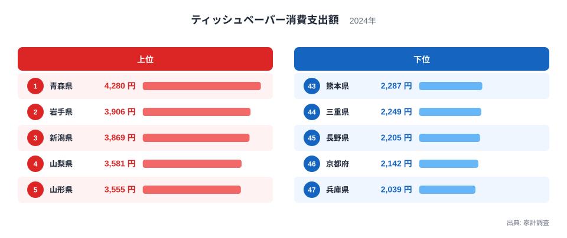
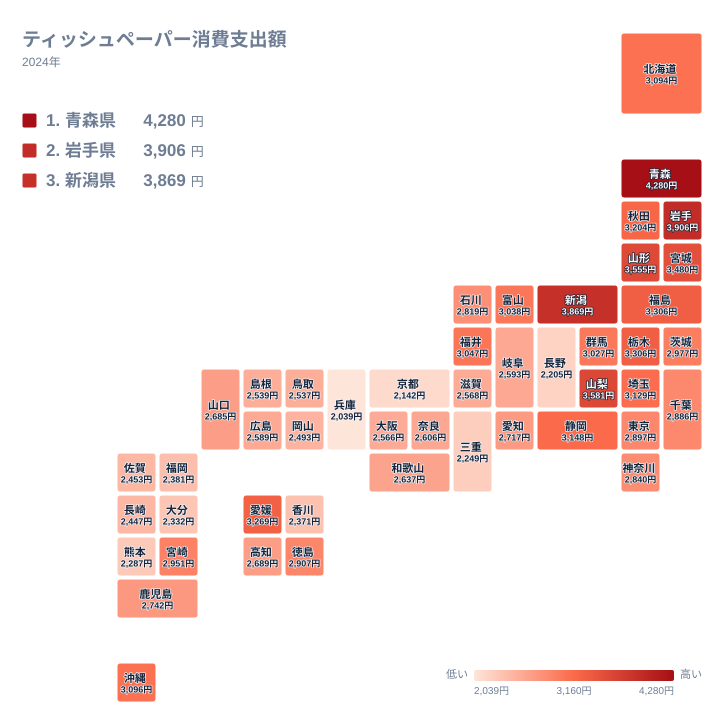

ティッシュペーパーは、どの家庭でも当たり前のように使う日用品です。それだけに地域差など無いように思えますが、総務省の家計調査から都道府県庁所在市の年間消費支出額を見ると、実際には2倍を超える開きがあります。しかも上位に並ぶ顔ぶれには、はっきりとした地域的な偏りが見られます。

この記事では、2024年の家計調査をもとにした都道府県別のティッシュペーパー消費支出額から、上位と下位の顔ぶれ、地理的な広がり、そして差が生まれる背景を読み解きます。ティッシュペーパー消費支出額を他の指標（子どもの平均体重）との相関から読み解く記事は別に用意しているため、本記事ではその関係には立ち入らず、ティッシュペーパー消費支出額そのものの地域差を、地理分布と世帯構成という単独の切り口から掘り下げます。

## 上位5県と下位5県、2倍を超える開き

<source-link href="/ranking/tissue-paper-consumption-expenditure">ティッシュペーパー消費支出額ランキングをもっと見る</source-link>

上位に並ぶのは、青森県、岩手県、新潟県、山梨県、山形県です。青森県は年間4,280円を支出して1位となり、2位の岩手県の3,906円、3位の新潟県の3,869円と続きます。4位の山梨県は3,581円、5位の山形県は3,555円で、上位5県のうち4県までが東北地方に位置しています。日用品としての性格が強いティッシュペーパーで、これほどはっきりとした地域の偏りが出るのは意外に感じられます。

下位に目を移すと、兵庫県が47位で2,039円、京都府が46位で2,142円、長野県が45位で2,205円という結果でした。1位の青森県と47位の兵庫県を比べると、年間の支出額には2倍を超える差があります。上位と下位の顔ぶれを見比べると、東北・北陸・甲信の各県が上位に集まり、近畿地方の各県が下位に集まっているという対照的な構図が浮かび上がります。

## 地理的な広がりを見る

地図で全体を見渡すと、東北から北陸、甲信にかけての一帯で支出額が高く、近畿から中国地方にかけての一帯で低いという、大きな面としての傾向が見えてきます。6位の宮城県は3,480円、7位の福島県は3,306円、10位の秋田県は3,204円と、東北6県のうち5県までが上位20位以内に入っています。北陸でも15位の福井県が3,047円、16位の富山県が3,038円と、いずれも全国平均を上回っています。

一方で、13位の沖縄県は3,096円と、温暖な気候にもかかわらず上位に食い込んでいます。さらに9位の愛媛県は3,269円で、四国からただ一県だけ東北勢の中に割り込んでいます。単純に寒冷地ほど支出額が高いという傾向だけでは説明しきれない例もあり、気候以外の要因も働いていることがうかがえます。それでも全体として見れば、寒冷で乾燥しやすい地域ほど支出額が高い傾向にあるという構図は崩れていません。

7位の福島県と8位の栃木県は、ともに3,306円という全く同じ支出額で並んでいます。両県とも東北・関東の北部に位置しており、冬季の気候条件が近いことを考えると、偶然の一致というよりは似た生活環境が似た消費水準を生んでいると見るほうが自然でしょう。こうした細部を見ていくと、地域差は単なるばらつきではなく、気候という共通の背景を持った構造的な差であることが分かります。

## なぜ東北で消費額が高くなるのか

東北地方や北陸地方は、冬季に気温が低く空気が乾燥しやすい地域です。乾燥した室内環境では鼻や喉の粘膜が刺激を受けやすく、風邪をひきやすいだけでなく、花粉やハウスダストによる鼻炎の症状も出やすくなります。こうした環境では、ティッシュペーパーを使う機会そのものが増えると考えられます。また冬場は暖房を使う期間が長く、暖房による乾燥がさらに拍車をかけている可能性もあります。

これに対して、下位に並ぶ兵庫県や京都府、長野県は、冬の寒さの厳しさという点では東北各県と大きくは変わりません。長野県が45位と下位に入っているのは、気候だけでは説明がつかない部分です。同じ寒冷地でも支出額に差が出るのは、世帯あたりの人数や、ティッシュペーパー以外の紙製品への支出配分など、複数の要因が組み合わさっているためと見るのが妥当でしょう。いずれにしても、日用品であっても地域による生活習慣の違いが、統計にはっきりと表れることが分かります。

また、都市部と郊外・地方の違いも見逃せません。下位の兵庫県、京都府に加えて、34位の大阪府は2,566円と、近畿の大都市圏が軒並み下位に沈んでいます。都市部では単身世帯や共働き世帯の割合が地方より高くなりやすく、家庭内でティッシュペーパーを使う人数そのものが少ない可能性があります。一方で東北や北陸では、三世代同居や大家族の世帯が相対的に多く残っている地域もあり、世帯人数の違いが支出額の差に上乗せされていることも考えられます。気候と世帯構成という2つの要因が重なり合うことで、これほどはっきりとした地域差が生まれているのでしょう。

## 他の紙製品の支出額とあわせて読む

ティッシュペーパーは、トイレットペーパーやキッチンペーパーといった他の紙製品と並んで、毎日の家計の中で欠かせない支出項目のひとつです。単価が安く購入頻度が高い日用品は、うなぎのような高級食材とは異なり、地域差が出にくいと考えられがちですが、実際には気候や世帯構成の違いが積み重なって、無視できない開きを生んでいます。家計調査には他にも数多くの日用品の支出額データが収録されており、[同じカテゴリの統計一覧](/category/economy)から関連する品目のランキングをたどると、地域ごとの生活パターンの違いがより見えやすくなります。ティッシュペーパー消費支出額が子どもの体重という別の指標とも似た地域分布を示すことを扱った[ティッシュペーパー消費支出額と平均体重の関係を探る記事](/blog/tissue-paper-consumption-expenditure-vs-average-weight)もあわせてご覧ください。

支出額が上位だった[青森県のデータ](/areas/02000)や、[岩手県のデータ](/areas/03000)を個別に見ると、気候だけでなく人口構成や産業構造といった他の指標との関係も浮かび上がります。日用品の消費額は、その地域の気候や暮らし方を映す小さな手がかりのひとつといえるでしょう。

> [!NOTE]
> このデータは総務省の家計調査による都道府県庁所在市の二人以上の世帯を対象にした年間消費支出額です。都道府県全体の平均ではなく、県庁所在市に住む世帯の支出を代表値として使っている点に注意が必要です。単身世帯の消費行動は含まれていません。

> [!WARNING]
> ティッシュペーパーの支出額は、その年の花粉飛散量や風邪・感染症の流行状況によって年ごとに変動しやすい品目です。単年のデータだけを見て地域の恒常的な特徴と断定するのではなく、複数年の推移とあわせて確認することをおすすめします。

> [!TIP]
> 上位と下位の顔ぶれを地図で見比べると、単に気温の高低だけでなく、冬の乾燥しやすさや世帯構成といった複数の要因が重なっていることが読み取れます。1つの指標だけで地域差の理由を決めつけず、他の生活関連データともあわせて眺めるとよいでしょう。

## まとめ

- 1位は青森県で、年間4,280円をティッシュペーパーに支出しています
- 47位は兵庫県で2,039円、46位の京都府、45位の長野県と近畿・甲信の県が下位に集まりました
- 1位と47位のあいだには2倍を超える支出額の差があります
- 上位5県のうち4県が東北地方に位置し、地域的な偏りがはっきりと見られます
- 冬の寒さや乾燥といった気候の違いが、支出額の差の一因になっていると考えられます

## データ出典

総務省統計局「家計調査」（2024年、都道府県庁所在市の二人以上の世帯を対象とした年間消費支出額）を利用しています。
