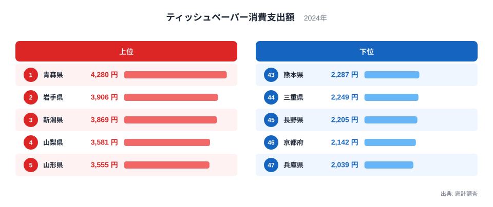
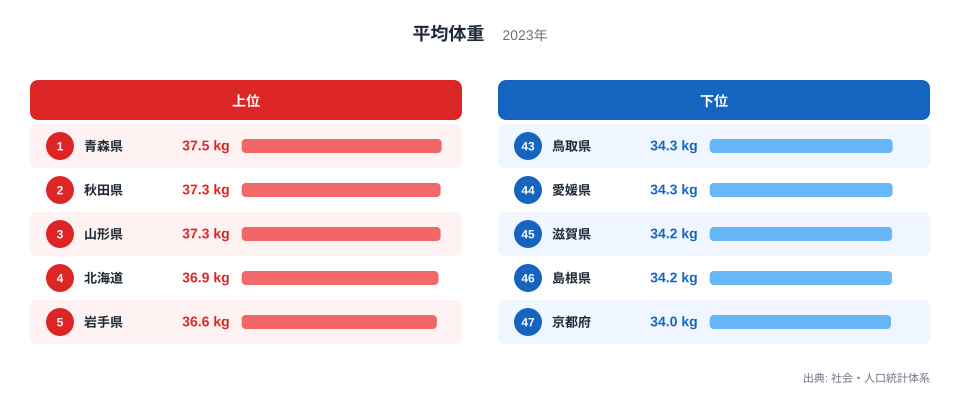
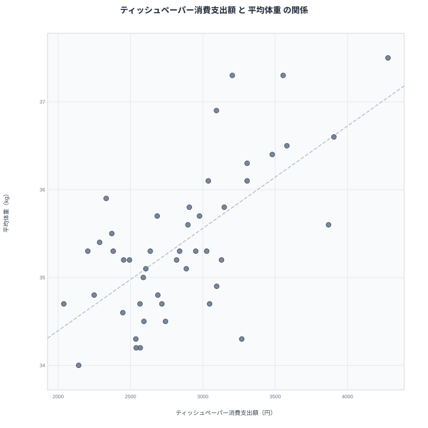

家計調査によるティッシュペーパー消費支出額のランキングと、社会・人口統計体系による小学5年生男子の平均体重のランキングを重ねてみると、上位の顔ぶれがよく似ていることに気づきます。青森県、秋田県、山形県、岩手県といった東北地方の県が、どちらのランキングでも軒並み上位に並んでいるのです。一見すると関係のなさそうな2つの指標が、なぜ同じ地域で高い数値を示すのでしょうか。47都道府県の実データをもとに、見かけの相関の裏側を探っていきます。

## ティッシュペーパー消費支出額の地域差

<source-link href="/ranking/tissue-paper-consumption-expenditure">ティッシュペーパー消費支出額ランキングをもっと見る</source-link>

家計調査によるティッシュペーパー消費支出額で全国1位となっているのは青森県で、年間4,280円を支出しています。2位は岩手県で3,906円、3位は新潟県で3,869円と続き、4位の山梨県は3,581円、5位の山形県は3,555円です。上位5県のうち4県が東北地方に集まっています。青森県の他の統計データは[青森県のデータ](/areas/02000)からも確認できます。

一方で最も支出額が少ないのは兵庫県で、2,039円にとどまっています。46位の京都府も2,142円と少なく、45位の長野県、44位の三重県、43位の熊本県も2,200円台から2,300円台で並んでいます。上位の青森県と下位の兵庫県を比べると、支出額には約2.1倍の開きがあります。この指標は都道府県庁所在市の二人以上世帯を対象にした年間支出額なので、単身世帯や県庁所在市以外に住む世帯の消費は集計に含まれていません。2位の岩手県について詳しく知りたい方は[岩手県のデータ](/areas/03000)もあわせてご覧ください。

> [!NOTE]
> ティッシュペーパー消費支出額は家計調査の都道府県庁所在市・二人以上世帯だけを対象にした年間支出額です。花粉の飛散量や風邪の流行状況など、その年ごとの事情によって数値が変動する可能性がある点にも注意が必要です。

## 平均体重の地域差

社会・人口統計体系による小学5年生男子の平均体重でも、上位に東北の県が並びます。1位は青森県で37.5kg、2位は秋田県で37.3kg、3位は山形県で37.3kg、4位は北海道で36.9kg、5位は岩手県で36.6kgとなっています。この5県のうち青森県、秋田県、山形県、岩手県の4県は、ティッシュペーパー消費支出額でも上位10位以内に入っており、両方のランキングで顔ぶれが重なり合っています。

下位を見ると、最も軽いのは京都府の34kgで、次いで島根県と滋賀県が34.2kg、鹿児島県と鳥取県が34.5kgと続きます。1位の青森県と最下位の京都府を比べると、平均体重の差は3.5kgです。この指標は小学5年生の男子児童だけを対象にしているため、成人の体格や女子児童の傾向をそのまま反映しているわけではありません。全47都道府県の順位は[平均体重ランキング](/ranking/average-weight-primary-school-fifth-grade-male)で確認できます。

> [!TIP]
> この平均体重は小学5年生の男子児童を対象にした値です。同じ都道府県でも学年や性別によって数値は変わるため、県民全体の体格を示す指標ではない点を踏まえて読み解くと誤解を避けられます。

## 見かけの相関を散布図で確認する

2つの指標を散布図に重ねると、ティッシュペーパー消費支出額が多い県ほど平均体重も重いという緩やかな右肩上がりの傾向が見て取れます。東北や北海道の県がそろって右上に集まり、近畿の府県が左下に集まる形になっています。この図だけを見ると、ティッシュペーパーの使用量が体重の増減に関係しているかのように見えるかもしれません。

> [!WARNING]
> 2つの指標が同じ方向に動いて見えても、一方がもう一方の原因であるとは限りません。ティッシュペーパーの消費量が体重を左右しているわけではなく、別の共通する要因が両方の数値を押し上げている可能性のほうが高いと考えられます。相関関係と因果関係は分けて考える必要があります。

散布図の左下に位置する京都府や滋賀県、島根県などは、いずれもティッシュペーパー消費支出額と平均体重の両方で下位に入っています。逆に右上に位置する青森県や秋田県、山形県は両方で上位です。全国に一律の傾向があるのではなく、寒冷な地域とそうでない地域とで、はっきりとした二極化が見られる点が特徴です。

## 相関の裏にある共通要因

ティッシュペーパーの消費と子どもの体重の間に直接の結びつきを想定するのは無理があります。むしろ注目すべきなのは、両方のランキングで上位に来る県に共通する気候の特徴です。東北地方や北海道は冬の寒さが厳しく、空気の乾燥や気温の低さから風邪やインフルエンザにかかりやすい時期が長くなります。鼻をかむ機会が増えれば、それだけティッシュペーパーの消費量も増えやすくなります。

体重については、寒冷な地域ほど体を温めるために消費するエネルギー量が多くなり、食事の内容もエネルギー量の高いものになりやすいという食文化の面が関係している可能性があります。また積雪の多い地域では屋外で活発に体を動かす期間が限られることも、体格に影響する要因の一つと考えられます。ティッシュペーパー消費支出額と平均体重は、どちらも「寒冷な気候」という共通の背景を映し出している可能性が高く、両者が直接つながっているわけではありません。

## まとめ

- ティッシュペーパー消費支出額の1位は青森県で4,280円、最下位は兵庫県で2,039円です。
- 平均体重の1位は青森県で37.5kg、最下位は京都府で34kgです。
- 両方のランキングで青森県、秋田県、山形県、岩手県といった東北の県が上位に並んでいます。
- 散布図では緩やかな右肩上がりの相関が見られますが、これは相関であって因果関係を示すものではありません。
- 背景には冬の寒さによる風邪の流行しやすさや、寒冷地特有の食文化・活動量の違いといった共通要因があると考えられます。[同じカテゴリの統計一覧](/category/economy)では、家計調査に基づく他の消費データも比較できます。

## データ出典

- ティッシュペーパー消費支出額: 家計調査（2024年）
- 平均体重（小学5年・男子）: 社会・人口統計体系（2023年）
