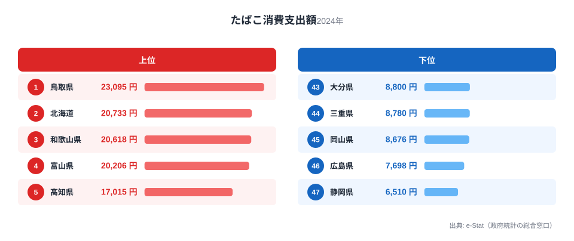

「たばこは全国どこでも同じように吸われている」——そう思っている方は多いかもしれません。しかし総務省の家計調査(都道府県庁所在市・二人以上世帯)を見ると、2024年のたばこ消費支出額は1位鳥取県23,095円、最下位静岡県6,510円と、実に3.5倍もの開きがあります。

たばこの価格は全国どこでもほぼ同じです。それでも支出額にここまで差が出るのはなぜでしょうか。この記事では上位・下位の顔ぶれと、家計消費の研究で知られる嗜好品支出の一般的な傾向を手がかりに、地域差の背景を探ります。

> [!NOTE]
> 本データは総務省「家計調査」(都道府県庁所在市・政令指定都市、二人以上世帯)の1世帯あたり年間支出額です。喫煙率そのものではなく「支出額」であることに注意してください。喫煙者数が同じでも、喫煙本数や購入銘柄の単価が違えば支出額は変わります。

## 上位と下位の顔ぶれ

<source-link href="/ranking/tobacco-consumption-expenditure">たばこ消費支出額ランキングをもっと見る</source-link>

上位を見ると、1位[鳥取県](/areas/31000)23,095円、2位北海道20,733円、3位和歌山県20,618円、4位富山県20,206円、5位高知県17,015円と、地方部の県が並んでいます。地域としては山陰・北海道・近畿・北陸・四国と広く分散しており、特定のブロックに偏ってはいません。

これらの県に共通するのは、都市部に比べて人口あたりの娯楽・サービス支出の選択肢が限られる地方部が多いという点です。家計調査を扱う研究では、可処分所得に占める「その他の消費支出」(嗜好品を含む)の構成比は、都市部よりも地方部でむしろ高く出ることが知られています。外食や交際費など代替となる消費先が都市部ほど多くない分、相対的に嗜好品への支出割合が上がりやすい、という構造的な見立てができます。ただしこれはあくまで一般的な傾向であり、鳥取・北海道が1位・2位である個別の理由を直接説明するものではありません。

> [!WARNING]
> 家計調査は都道府県庁所在市(政令指定都市含む)のみのサンプルで、県内の他地域は含まれません。「県全体の傾向」ではなく「県庁所在市の傾向」である点に注意してください。

## 最下位グループの特徴

下位を見ると、46位広島県7,698円、47位[静岡県](/areas/22000)6,510円が最下位2県で、これに続くのが45位岡山県8,676円、44位三重県8,780円、43位大分県8,800円です。地域としては東海・山陽が目立ちます。

静岡県は東京・名古屋という二大都市圏に挟まれた立地で、通勤・通学による県外への支出流出が大きい地域です。また東海地方全体は製造業を中心とした産業構造で世帯の平均所得水準が比較的高く、嗜好品よりも教育費や住宅ローンなど他の支出項目に家計が振り向けられやすいと考えられます。広島県・岡山県といった山陽地方も同様に、県庁所在市が政令指定都市級の都市機能を持つ地域が多く、外食・娯楽の選択肢が豊富なぶん、たばこへの支出割合が相対的に下がっている可能性があります。

> [!TIP]
> 家計調査の品目別ランキングは、金額だけでなく「他の支出項目との代替関係」で読むと理解が深まります。たばこ支出が低い県は、外食費や教養娯楽費が高い傾向がないか、あわせて確認してみると発見があります。

## 発見: コロナ禍に支出が増えていた

今回のランキングは2024年単年ですが、家計調査の時系列を確認すると興味深い動きがあります。全47都道府県の平均支出額は2019年10,788円から2020年12,373円、2021年13,596円と、コロナ禍の2年間で大きく増えていました。その後2022年13,310円、2023年12,710円、2024年12,629円と緩やかに減少していますが、2024年時点でもコロナ前の水準には戻っていません。

[仮説] 外出自粛による在宅時間の増加や、外食・旅行など他の支出機会が失われたことで、家庭内で完結する嗜好品への支出が一時的に増えた可能性があります。ただしこれは全国平均の時系列変化から見える傾向であり、個々の家計の行動を直接示すものではありません。検証には家計調査の品目別内訳(外食費・教養娯楽費との相関)を継続的に見る必要があります。

もう一つの発見は、上位県と下位県の間に明確な地域ブロックの偏りが見られないことです。1位鳥取・2位北海道・3位和歌山・4位富山・5位高知は、山陰・北海道・近畿・北陸・四国とそれぞれ異なる地方に属しており、「西日本だから」「地方だから」といった単純な地域区分では説明がつきません。都市規模や産業構造など、複数の要因が絡み合っていると見るべきでしょう。

嗜好品支出という切り口では、同じ家計調査から算出できる<source-link href="/ranking/beer-consumption-expenditure">ビール消費支出額ランキング</source-link>もあわせて見ると面白い発見があります。たばこと酒はどちらも「その他の消費支出」に分類される嗜好品ですが、上位県の顔ぶれが一致するかどうかを比べることで、地域の消費性向がたばこ固有のものか、嗜好品全般に共通するものかを見分けるヒントになります。

## まとめ

- 1位は鳥取県23,095円、最下位は静岡県6,510円で3.5倍の格差(2024年)
- 上位は鳥取・北海道・和歌山・富山・高知と地方部が中心、地域ブロックの偏りはない
- 下位は静岡・広島を筆頭に東海・山陽の都市圏近接県が目立つ
- コロナ禍の2020-2021年に全国平均が急増、2024年時点でもコロナ前の水準には戻っていない
- 嗜好品支出は「他の消費項目との代替関係」で地域差が生まれやすい

家計の消費支出をめぐる地域差は、たばこ以外の品目でも広く見られます。他の消費支出データは[経済カテゴリ一覧](/category/economy)からたどれます。

## データ出典

総務省統計局「家計調査」(都道府県庁所在市及び政令指定都市、二人以上世帯、2024年)をもとに、政府統計の総合窓口(e-Stat)経由で集計・整備しました。
