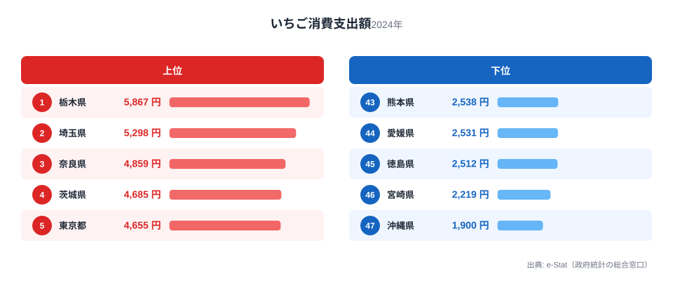
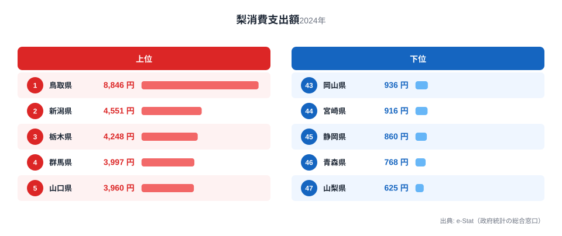
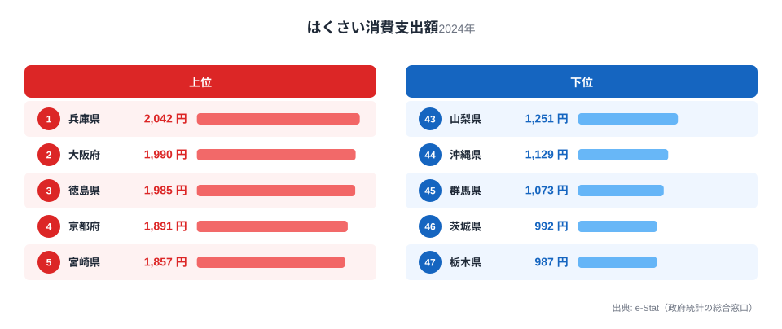

栃木県は「いちご王国」を掲げるだけあって、家計調査でもいちご消費支出額が全国1位です。しかし同じ栃木の食卓を見渡すと、はくさい消費支出額は全国最下位という対照的な結果も出てきます。同じ野菜・果物のカテゴリーなのに、なぜここまで差が開くのでしょうか。

家計調査の品目別データから栃木県庁所在市（宇都宮市）の家計を見ると、いちご・梨という果物2品目で全国上位に入る一方、葉物野菜のはくさいでは沈む、という非対称な姿が浮かび上がります。この記事では、いちご・梨・はくさいの3品目を通じて、栃木の食卓を貫く一本の軸を探ります。

> [!NOTE]
> 本記事の数値は総務省統計局「家計調査（品目別）」に基づく、都道府県庁所在市（栃木県は宇都宮市）の二人以上世帯における2024年の年間消費支出額です。実際の消費量ではなく金額ベースであるため、価格差や購入頻度の違いも反映されます。

## いちご — 全国1位5,867円、栃木ブランドの本丸

<source-link href="/ranking/strawberry-consumption-expenditure">いちご消費支出額ランキングをもっと見る</source-link>

栃木県は年間5,867円と、いちご消費支出額で全国1位です。2位の埼玉県（5,298円）や3位の奈良県（4,859円）を引き離しての首位で、最下位の沖縄県（1,900円）とは3.1倍の開きがあります。

栃木は「とちおとめ」「とちあいか」などの主力品種を生み出してきた、いちご生産量日本一の県です。産地であることが、そのまま地元での消費量の多さに直結しています。地元で採れたての果物を日常的に買い求める文化があるうえ、直売所や道の駅でいちごが手頃な価格で並ぶ環境も、消費額を押し上げる要因になっていると考えられます。

## 梨 — 全国3位4,248円、果樹王国のもう一つの顔

<source-link href="/ranking/pear-consumption-expenditure">梨消費支出額ランキングをもっと見る</source-link>

梨も栃木の得意分野です。年間4,248円で全国3位につけており、首位の鳥取県（全国1位・8,846円）、2位の新潟県（4,551円）に次ぐ水準です。最下位の山梨県（625円）とは6.8倍の差があります。

栃木県は「にっこり」という大玉品種で知られる梨の一大産地です。いちごほどの突出した首位ではありませんが、上位3県に入る安定した強さを見せています。果物全般への支出が高い背景には、栃木が首都圏に近い立地でありながら農業県としての性格を強く残しており、旬の果物を日常的に食べる習慣が根付いていることがうかがえます。いちごと梨、収穫期の異なる2つの果物で上位を確保している点は、栃木の農産物消費が特定の季節に偏らない構造を持つことを示しています。

## はくさい — 全国最下位987円、果物王国の意外な弱点

<source-link href="/ranking/chinese-cabbage-consumption-expenditure">はくさい消費支出額ランキングをもっと見る</source-link>

一転して、はくさいは栃木が全国最下位です。年間987円と、首位の兵庫県（全国1位・2,042円）の半分以下にとどまり、隣接する茨城県（46位・992円）とともに最下位グループを形成しています。

はくさいの消費が低いこと自体は栃木特有の弱点というより、関東北部に共通する傾向とも読めます。上位を占めるのは兵庫・大阪・徳島・京都といった関西圏の県が中心で、鍋文化や漬物文化の地域差が影響している可能性があります。栃木では餃子や焼きそばなど粉物・肉料理が食卓に定着しており、はくさいを主役にした鍋料理や漬物の消費機会が相対的に少ないことが、支出額を押し下げていると見られます。

> [!WARNING]
> 消費支出額は「金額」であり「消費量」ではありません。栃木ではくさいの単価が他県より安い場合、実際の消費量ほど金額差が開かない可能性があります。また、餃子の消費額のように個別に集計されていない品目もあるため、この記事で扱う3品目だけで栃木の食文化全体を語ることはできません。

## 栃木の食卓を貫くもの

いちご1位・梨3位という果物の強さと、はくさい最下位という野菜の弱さ。一見バラバラに見えるこの結果を貫くのは「産地であるかどうか」という一本の軸です。いちご・梨はどちらも栃木が全国有数の生産地であり、地元で穫れる作物を地元で消費する構造が支出額に直結しています。一方のはくさいは栃木の主要な産地ではなく、他県からの供給に頼る品目のため、地元消費を押し上げる要因が働きません。

複数の食品で全国トップクラスにランクインする県は他にもあります。福島県のように多品目で首位を独占する県と比べると、栃木は特定の得意分野（果物）に強みが集中している点が特徴です。関連記事の[福島の食卓](/blog/fukushima-food-culture)も合わせて読むと、同じ北関東・東北エリアでも、産地の得意不得意がそのまま消費構造の違いとして表れることが分かります。

## まとめ

- いちご消費支出額は栃木県が年間5,867円で全国1位、最下位の沖縄県とは3.1倍差
- 梨消費支出額は栃木県が年間4,248円で全国3位、首位の鳥取県は8,846円
- はくさい消費支出額は栃木県が年間987円で全国最下位、首位の兵庫県の半分以下
- 栃木の食卓は「地元産地の果物は強く、非産地の野菜は弱い」という産地依存型の構造を持つ
- 詳しい地域データは[栃木県の地域プロフィール](/areas/09000)、他の家計品目は[経済カテゴリ一覧](/category/economy)で確認できる

> [!TIP]
> 栃木のように「得意品目が生産地と一致する」パターンは、産地県によく見られる傾向です。ランキング上位の品目とその県の主要農産物を照らし合わせると、消費支出額の高さが「好み」ではなく「地元供給」に由来するかどうかを見分けるヒントになります。

## データ出典

総務省統計局「家計調査（品目別）」2024年、都道府県庁所在市 二人以上世帯（e-Stat経由で取得）
