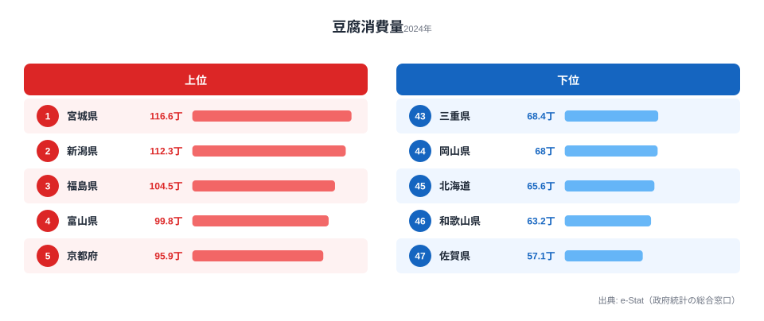

「豆腐といえば京都」「大豆食文化は西日本」——そんなイメージを持つ方は多いでしょう。しかし2024年の家計調査が示す豆腐消費量の地図は、その先入観をきれいに裏切ります。

豆腐消費量とは、都道府県庁所在市の二人以上世帯が1年間に買う豆腐の数量（丁換算）のことです。トップに立ったのは京都でも九州でもなく、**宮城県の116.57丁**でした。一方で最も少なかったのは佐賀県の57.1丁で、その差は2.04倍にのぼります。

上位を眺めると、宮城・新潟・福島・富山・岩手——東北と日本海側がずらりと並んでいます。「豆腐は西の食べ物」どころか、むしろ**北と日本海側が多く、西日本の一部はむしろ下位**という、イメージとは逆の構図が見えてきます。この記事では、その意外な分布を順位とともに読み解きます。

> [!NOTE]
> ここでの「豆腐消費量」は家計調査（総務省）の都道府県庁所在市・二人以上世帯における年間購入数量です。県全体の平均ではなく「県庁所在市の世帯」が対象である点に注意してください。外食や加工食品（厚揚げ・がんもなど別品目）は含みません。

## 豆腐消費量ランキング TOP10 と最下位

まず2024年の上位と下位の顔ぶれをチャートで確認してみましょう。

<source-link href="/ranking/tofu-consumption-quantity">豆腐消費量ランキングをもっと見る</source-link>

トップは[宮城県](https://stats47.jp/areas/04000)で116.57丁、2位が[新潟県](https://stats47.jp/areas/15000)の112.35丁、3位が[福島県](https://stats47.jp/areas/07000)の104.5丁です。4位の富山県（99.83丁）、6位の岩手県（95.64丁）を加えると、TOP10のうちちょうど半数の5県を東北・日本海側の県が占めています。

京都府は5位（95.92丁）で確かに上位に入っていますが、宮城・新潟・福島・富山という東北・日本海勢がそれを上回っているのが2024年の特徴です。7位の静岡県（95.33丁）、8位の群馬県（91.82丁）、9位の兵庫県（91.15丁）、10位の熊本県（89.61丁）と続き、比較的広い地域から上位が選出されています。

東北3県（宮城・福島・岩手）がTOP10に揃って入っているという事実は、単なる偶然ではなく、この地域における豆腐の日常的な消費習慣の厚みを示唆しています。味噌汁・鍋物・煮物といった東北の家庭料理の定番メニューで豆腐が頻繁に使われることが、年間購入数量に積み上がっているとみられます。

> [!TIP]
> 1丁はおおよそ300〜400gが目安（メーカー・地域で差があります）。116.57丁は「県庁所在市の平均的な世帯が、年間で100丁を超える豆腐を買っている」ことを意味し、ほぼ3日に1丁のペースになります。

## 最下位グループ——西日本と北海道が下位に沈む

一方の下位を見ると、最下位は[佐賀県](https://stats47.jp/areas/41000)で57.1丁です。46位が和歌山県（63.18丁）、45位が北海道（65.64丁）、44位が岡山県（68.0丁）、43位が三重県（68.44丁）と続きます。

最下位の佐賀県（57.1丁）と1位の宮城県（116.57丁）の差は2.04倍です。同じ日本の中で、県庁所在市の世帯が年間に購入する豆腐の量がほぼ倍違うというのは、食文化の地域差としてかなり大きな開きといえます。

和歌山県（46位）・岡山県（44位）・三重県（43位）と、近畿〜中国地方の一部が下位に固まっているのが目を引きます。さらに北海道が45位というのも興味深い点です。面積も人口も日本最大の都道府県が、豆腐の購入数量では下から数えた方が早い位置にいます。

北海道が下位に位置する背景としては、寒冷地の食卓でも鍋物は多いものの、ジンギスカン・北海道産農産物を使った料理など、豆腐以外の食材に食事の重心が置かれている食文化の影響が考えられます。また、広大な地域に住民が分散していることで、「県庁所在市（札幌市）」のデータが道全体を代表しにくい面もあるかもしれません。

西日本の下位グループについては、佐賀・和歌山といった地域が「豆腐ブランド」のイメージとは裏腹に、実際の日常的な購入量では少ないという逆説的な構図が浮かびます。文化的なブランドと実際の消費量は必ずしも一致しないことを、このデータは如実に示しています。

> [!WARNING]
> 家計調査は「県庁所在市の世帯が店頭で買った豆腐の数量」を捉える調査で、調査年により上位県は入れ替わりやすいです。サンプル世帯数が限られるため単年の順位は振れがあります。長期トレンドとして「東北・日本海側が相対的に多い」傾向として読むのが安全で、単年の1位を「日本一の豆腐県」と断定するのは避けたいところです。

## 発見1: 「西の豆腐」イメージは数量では裏付けられない

豆腐＝西日本という印象は、おそらく「京都の湯豆腐」「九州の濃い豆腐」といった食文化のブランドイメージに由来しています。しかし2024年の購入数量で見ると、京都府こそ5位（95.92丁）に入るものの、九州勢は熊本（10位・89.61丁）が健闘する一方で**佐賀が47位（57.1丁）**と最下位に沈み、同じ九州でも両極に割れています。

「西日本＝豆腐をたくさん食べる」という一括りの理解は、少なくとも購入数量のデータでは支持されません。上位を実際に支えているのは東北・北陸・北関東のラインであり、イメージと実態のギャップこそがこの指標の面白さです。

[経済・家計カテゴリの統計一覧](https://stats47.jp/category/economy)では、豆腐以外にも食品消費に関する多くの指標が確認できます。納豆・味噌など大豆加工食品全体の地域差と合わせて見ると、東北・日本海側の食文化の特徴がより立体的に把握できるでしょう。

> [!NOTE]
> 「ブランドとしての豆腐」と「数量としての豆腐」は別物です。湯豆腐や郷土料理として有名でも、世帯が日常的に買う丁数が多いとは限りません。逆に派手な豆腐文化が語られない県でも、味噌汁の具・煮物など日常使いで消費量が積み上がることがあります。

## 発見2: なぜ東北・日本海側で多いのか

上位の宮城・新潟・福島・富山・岩手という顔ぶれから、いくつかの仮説が立てられます。

**[仮説] 寒冷地の食卓構成**：冬が長く煮物・鍋・味噌汁の頻度が高い地域では、汁物・煮物の具として豆腐の出番が増える可能性があります。宮城（1位）・福島（3位）・岩手（6位）はいずれも積雪地帯を抱え、長い冬の食卓で温かい汁物・鍋物が日常的に登場します。検証には県別の鍋物・味噌汁関連支出（おでん材料・味噌など）との相関分析が必要です。

**[仮説] 大豆・味噌文化との近接**：味噌や納豆など大豆加工食品が日常に根付く東北・北陸で、豆腐も同じ食習慣の一部として消費が厚い可能性があります。新潟（2位・112.35丁）や富山（4位・99.83丁）は日本海側の食文化を代表する地域であり、大豆製品全般への親しみが豆腐消費量にも反映されているとみられます。検証には味噌・納豆消費量ランキングとの順位相関を確認する必要があります。

いずれも現時点では仮説であり、本データ単独で因果は断定できません。ただ「西日本で多い」という通説より、「寒冷で大豆加工食品が根付く地域で多い」という見立ての方が、実際の上位分布とは整合的です。青森県は11位（89.32丁）、山形県は15位（86.99丁）と、東北6県のうち実に5県がTOP15に入っており、この傾向の安定性がうかがえます。

## まとめ

- 2024年の豆腐消費量1位は**宮城県の116.57丁**。京都でも九州でもなく東北の県がトップに立ちました。
- 最下位は**佐賀県の57.1丁**で、1位との差は**2.04倍**です。
- 上位は宮城（1位）・新潟（2位）・福島（3位）・富山（4位）・岩手（6位）と、東北・日本海側に集中しています。
- 下位は佐賀（47位）・和歌山（46位）・北海道（45位）・岡山（44位）と、西日本の一部と北海道に固まっています。
- 「豆腐は西日本」という通説は購入数量では裏付けられず、むしろ**北・日本海側が高い**——イメージと実態の逆転がこの指標の見どころです。

## データ出典

総務省「家計調査」（都道府県庁所在市・二人以上世帯、品目別年間購入数量）。e-Stat 経由で整備した2024年の値を使用。1丁あたりの重量は地域・メーカーで差があるため、本記事の「丁」は調査上の数量区分に基づきます。
