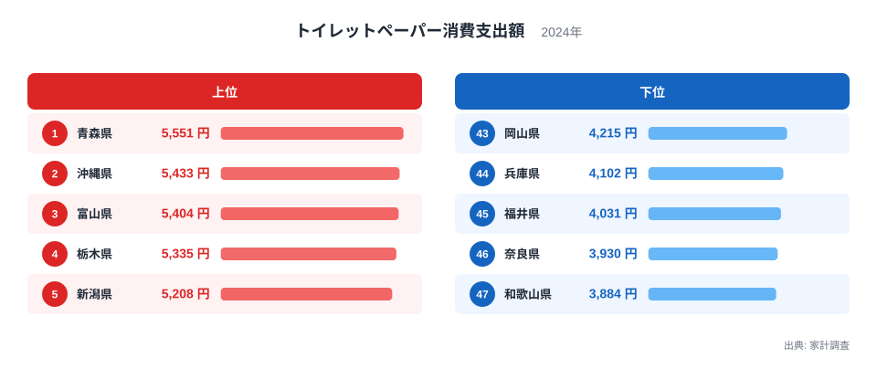
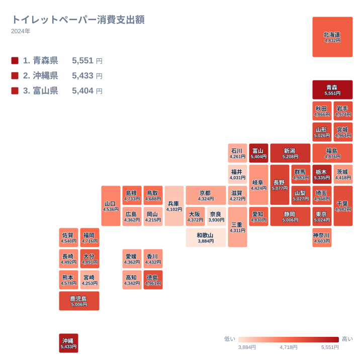

トイレットペーパーは全国どこの家庭でも使う日用品ですが、家計調査の消費支出額を見ると、県によって年間の支出額にはっきりとした差があります。同じ生活必需品でありながら、なぜここまで差が生まれるのでしょうか。この記事では、2024年の家計調査データをもとに、トイレットペーパー消費支出額が県ごとにどう違うのかを確かめます。

2024年の家計調査によると、トイレットペーパー消費支出額が最も高いのは青森県で5,551円、次いで沖縄県が5,433円、富山県が5,404円となっています。最も低いのは和歌山県の3,884円で、奈良県が3,930円、福井県が4,031円と続きます。トップと最下位の間には千円を超える開きがあり、生活必需品としては見過ごせない差になっています。

## トイレットペーパー消費支出額の上位と下位

<source-link href="/ranking/toilet-paper-consumption-expenditure">トイレットペーパー消費支出額ランキングをもっと見る</source-link>

上位を見ると、青森県が5,551円で首位、沖縄県が5,433円で2位、富山県が5,404円で3位、栃木県が5,335円で4位、新潟県が5,208円で5位と続きます。青森県や新潟県のような日本海側の県が上位に多いのは、雪国では冬場に来客の出入りが減る一方、家族が家の中で過ごす時間が長くなり、家庭内でのトイレットペーパーの使用頻度が高まりやすいことが一因として考えられます。また、まとめ買いのしやすい大容量パックが好まれる土地柄も、支出額を押し上げている可能性があります。

沖縄県が2位に入っている点は、雪国とは対照的な気候であるだけに興味深い結果です。沖縄県は湿度が高く紙製品が湿気を吸って劣化しやすいため、買い置きを控えてこまめに買い替える買い方になりやすいことが一因として考えられます。なお家計調査が集計するのは世帯の購入額だけなので、観光客の多さによる宿泊施設や飲食店での需要はこの数字には含まれていません。

下位に目を移すと、和歌山県が3,884円で最も低く、奈良県が3,930円、福井県が4,031円、兵庫県が4,102円、岡山県が4,215円と続きます。近畿地方の県が下位に集まっているのが目立ちますが、これは家庭内でのまとめ買いの習慣が薄いというより、近隣にドラッグストアなどの小売店が多く、必要な分だけをこまめに購入するスタイルが根づいているためだと考えられます。

> [!NOTE]
> 家計調査の消費支出額は、実際に購入した金額の平均であり、購入した枚数や使用量そのものを示す数字ではありません。値段の高い製品を選ぶ地域では、使用量が同じでも支出額が高く出ることがあります。

## 地理分布から見える傾向

タイルマップで全国を見渡すと、東北や北陸、甲信越といった日本海側や寒冷地の県で支出額が高く、近畿地方を中心に西日本で低い傾向が見えます。ただし沖縄県だけは南方に位置しながら上位に入っており、気候だけで説明しきれない地域差があることが分かります。

栃木県や新潟県のような内陸・日本海側の県で支出額が高い背景には、家族での同居や多世帯世帯の割合が影響している可能性もあります。世帯人数が多いほどトイレットペーパーの消費量は増えやすく、地方ではまだ二世帯・三世帯での同居が都市部より多く残っている地域があるため、これが支出額の差につながっているとも考えられます。

> [!WARNING]
> 家計調査は世帯単位の平均値であり、世帯人数の違いを調整していません。一人暮らしが多い都市部と、多世帯同居が多い地方とでは、同じ支出額でも一人あたりの消費量の意味合いが変わってきます。

トイレットペーパーは在庫を切らすと不便な品目であるため、災害への備えという観点からもまとめ買いされやすい商品です。過去に大きな災害や物流の混乱を経験した地域では、家庭内に一定量を備蓄しておく習慣が根づいていることがあり、これも地域による消費支出額の差に影響している可能性があります。

## 青森県と沖縄県、それぞれの上位入りの理由

[青森県のデータ](/areas/02000)と[沖縄県のデータ](/areas/47000)を見比べると、両県は気候も文化的背景もまったく異なるにもかかわらず、トイレットペーパー消費支出額では1位と2位を分け合っています。青森県は冬の寒さと積雪による家庭内滞在時間の長さ、沖縄県は高い湿度と観光需要という、それぞれ独立した事情が支出額を押し上げていると考えられ、単一の要因では説明しきれない指標であることが分かります。

このように同じ結果を生む理由が地域ごとに異なる指標は他にも存在します。[同じカテゴリの統計一覧](/category/economy)にある他の消費支出額のデータとあわせて見ると、生活必需品の消費パターンが地域の気候や世帯構成とどう結びついているのかをより広い視点で確認できます。

> [!TIP]
> トイレットペーパーのような日用品の消費支出額を比べるときは、気候だけでなく世帯人数や購入習慣の違いにも目を向けると、単純な地域性以上の背景が見えてきます。

## 関連する消費支出との対比

この指標で最も注意したいのは、支出額が多いことと使う量が多いことは同じではないという点です。家計調査が集計しているのは世帯が支払った金額であり、何ロール買ったかではありません。同じ量を買っても、単価の高い長巻きや高付加価値の製品を選ぶ地域では支出額が大きく出ます。逆に大容量パックを安く買える地域では、使う量が多くても支出額は抑えられます。

したがって上位の県を「たくさん使っている県」と読むことはできません。この順位から確実に言えるのは、世帯がこの品目に払っている金額の差だけです。使用量そのものを知りたい場合は、支出額ではなく数量を集計した別の統計に当たる必要があります。

## まとめ

トイレットペーパー消費支出額は、青森県と沖縄県という気候的に正反対の2県が上位を占める、一見すると読み解きにくい指標です。しかし背景を分けて見ると、寒冷地では家庭内滞在時間の長さが、沖縄県では湿度の高さと観光需要が、それぞれ独立に支出額を押し上げていることが分かります。下位に近畿地方が集まっているのも、まとめ買いより小口購入を好む地域性の表れだと考えられます。生活必需品であっても、地域ごとの気候や生活習慣の違いがはっきりと数字に表れる好例だといえます。

## データ出典

- 家計調査(2024年)
