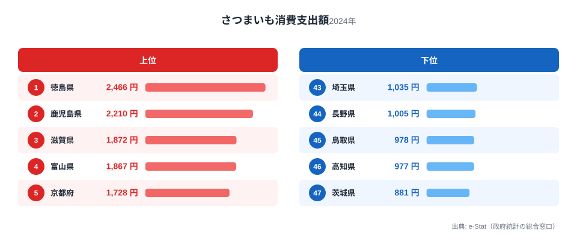
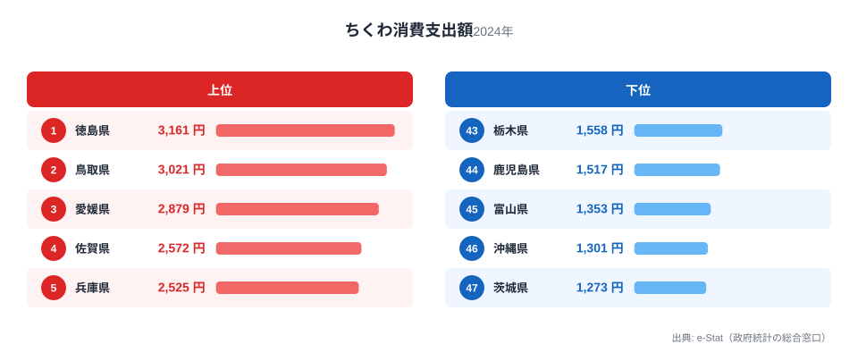
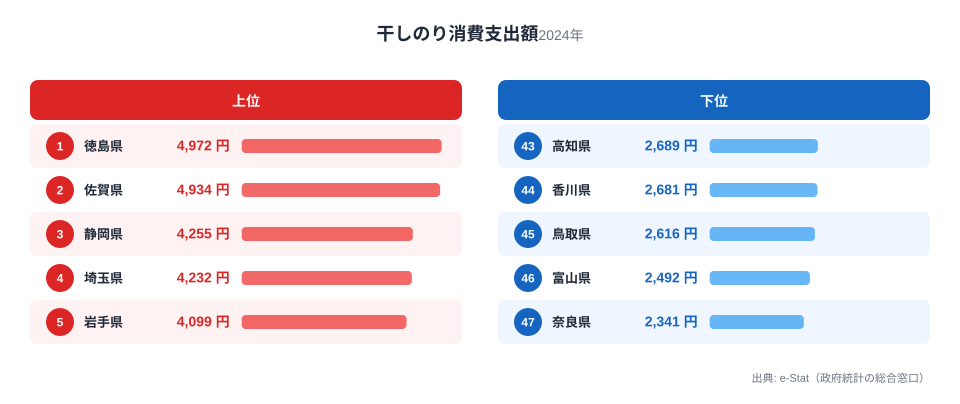

四国の東に位置する徳島県は、鳴門海峡の渦潮で知られますが、食卓の豊かさも見逃せません。総務省の家計調査（品目別）で徳島市の二人以上世帯を見ると、さつまいも・ちくわ・のりという3つの品目すべてで、徳島が全国1位に立っています。

鳴門金時のさつまいも、練り物のちくわ、そして鳴門の海苔。大地の恵みと海の幸で、徳島は「日本一」を3つ抱える食の県です。この記事では、これら3つの全国1位品目を横断しながら、徳島県民の豊かな食卓を読み解きます。

> [!NOTE]
> 家計調査の都道府県データは、県庁所在市（徳島県は徳島市）の二人以上世帯を対象にした年間支出額です。県全体ではなく徳島市在住世帯の家計簿から見た傾向であり、支出「金額」であって消費「量」そのものではない点にご注意ください。

## さつまいも — 全国1位2,466円、鳴門金時の郷

<source-link href="/ranking/sweet-potato-consumption-expenditure">さつまいも消費支出額ランキングをもっと見る</source-link>

徳島県のさつまいも消費支出額は2,466円で全国1位です。2位の鹿児島県2,210円を上回ります。徳島といえば「鳴門金時」。鳴門海峡沿いの砂地で育つ鳴門金時は、ほくほくとした食感と上品な甘さで知られる、徳島を代表する特産品です。

鳴門金時は焼き芋や天ぷら、大学芋など多彩な食べ方で親しまれ、地元では日常的に食卓へ上ります。産地であると同時に消費地でもあるという「産地=消費地」の一致が、さつまいもの全国一を支えています。[さつまいも消費支出の記事](/blog/sweet-potato-expenditure-ranking)で扱ったように、さつまいも消費は関西・四国で高い傾向があり、徳島はその頂点に立ちます。

## ちくわ — 全国1位3,161円、徳島の練り物文化

<source-link href="/ranking/chikuwa-consumption-expenditure">ちくわ消費支出額ランキングをもっと見る</source-link>

ちくわの消費支出額も徳島県が3,161円で全国1位です。2位の鳥取県3,021円を上回ります。徳島は魚のすり身を使った練り物文化が盛んな土地で、「徳島ちくわ」「竹ちくわ」といった郷土色豊かなちくわが受け継がれています。

竹に巻いて焼く「竹ちくわ」は、徳島の海岸部で生まれた素朴な郷土食で、そのまま食べたり煮物に入れたりと日常的に食卓に登場します。新鮮な魚が手に入る立地と、それを練り物として保存・加工する食文化が、ちくわの全国一の支出額を支えています。

## のり — 全国1位4,972円、鳴門の海苔

<source-link href="/ranking/dried-nori-consumption-expenditure">のり消費支出額ランキングをもっと見る</source-link>

海の幸をもう一つ。のり（干しのり）の消費支出額も徳島県が4,972円で全国1位です。2位の佐賀県4,934円と激しく首位を争っています。徳島は鳴門海峡の速い潮流に育まれた海苔の産地で、香り高い上質な海苔が生産されています。

徳島では、おにぎりや手巻き、佃煮など、海苔を使った食習慣が深く根づいています。鳴門の激しい潮流が育てる海苔と、それを日常的に食べる食文化が、のりの全国一を支えています。さつまいも・ちくわ・のりと、大地と海の両方で全国トップに立つのが徳島の食卓の特徴です。

> [!WARNING]
> 家計調査は支出金額の調査であり、消費量そのものではありません。物価や単価の違いも金額に影響します。また徳島名産のすだちやわかめの一部は、家計調査の主要品目として個別に集計されないため、順位だけでは徳島の食文化の全体像は測れない点にご注意ください。

## 徳島の食卓を貫くもの

徳島県民の食卓を貫くのは、「鳴門海峡が育む大地と海の恵み」です。砂地の鳴門金時、海の魚から作るちくわ、速い潮流が育てる海苔。鳴門という地理的条件が、大地の作物と海の幸の両方に恵みをもたらし、それぞれが全国一の消費につながっています。

鳥取（梨・かに・かれいの3冠）と並べると、同じ「3品目1位」でも徳島は「鳴門の大地と海の加工食型」、鳥取は「梨と日本海の海の幸型」と、食卓の骨格が異なります。県ごとの地理と食文化が、家計の数字にくっきり表れるのが県民の食卓比較の面白さです。

> [!TIP]
> 徳島のちくわ・のりのように「加工・保存食品」で全国1位の県は、新鮮な素材（魚・海苔）が手に入る立地に、それを加工する食文化が重なっています。生鮮品だけでなく加工食品の順位も見ると、その土地の食文化の奥行きが見えてきます。

## まとめ

- さつまいも消費支出額は徳島県が全国1位（2,466円）、鳴門金時の郷
- ちくわも全国1位（3,161円）、竹ちくわに代表される徳島の練り物文化
- のりも全国1位（4,972円）、鳴門の潮流が育てる海苔
- 鳴門海峡が育む大地と海の恵みが、徳島の3品目全国1位の豊かな食卓を支える

徳島県の他の統計は[徳島県の地域プロフィール](/areas/36000)、食品・家計消費の地域差は[経済カテゴリ一覧](/category/economy)からご覧いただけます。

## データ出典

総務省統計局「家計調査（品目別）」（2024年、都道府県庁所在市 二人以上世帯）をもとに、e-Stat（政府統計の総合窓口）経由で整備したデータを使用しています。
