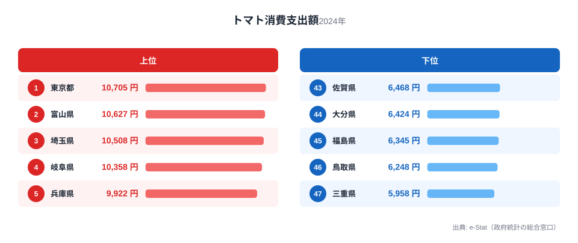
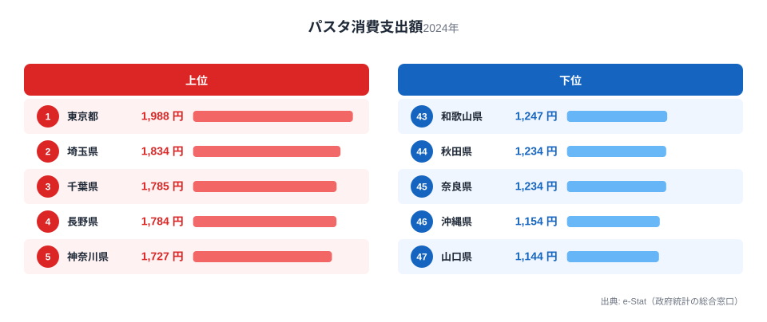
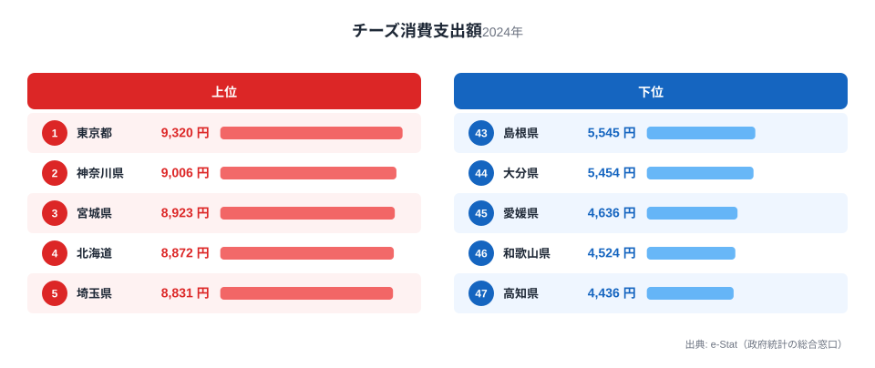
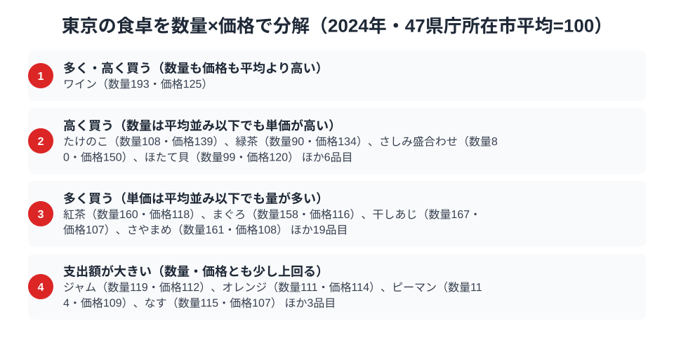

47都道府県の家計調査を見渡すと、1つの県が複数の品目で同時に全国1位になることは珍しくありません。ですが、その品目が野菜・麺類・乳製品という**性質のまったく異なる3ジャンル**にまたがるケースは多くありません。東京都はその珍しいパターンに当てはまります。

トマト消費支出額、パスタ消費支出額、チーズ消費支出額。いずれも2024年の家計調査で東京が全国1位でした。和食の定番でも郷土料理でもない、この3品目がそろって東京に集中している背景には、共働き世帯の多さと「手早く洋風」を選びやすい暮らしの構造が見えてきます。

> [!NOTE]
> 本記事の数値は総務省統計局「家計調査（品目別）」2024年、都道府県庁所在市（東京都の場合は東京都区部）の二人以上世帯における年間消費支出額です。1世帯あたりの支出額であり、消費量そのものではありません。

## トマト消費支出額 — 全国1位10,705円、野菜の中でも突出

<source-link href="/ranking/tomato-consumption-expenditure">トマト消費支出額ランキングをもっと見る</source-link>

東京は年間10,705円で全国1位でした。2位は富山県で10,627円、東京とはわずか78円差で、両者が僅差でトップを分け合う形です。一方、最下位は三重県で5,958円、東京とは1.8倍の開きがあり、東京の消費額は全国平均を大きく上回っています。

東京が上位に来る理由は、サラダ需要の高さと外食・中食産業の集積です。単身・共働き世帯が多い都市部では、火を通さずそのまま食べられる野菜への需要が根強く、コンビニやスーパーの総菜・サラダ向けにトマトが大量に流通します。世帯の食卓に直接並ぶだけでなく、外食チェーンでの消費が家計側の購入行動にも波及していると考えられます。富山・埼玉・岐阜など上位県の顔ぶれを見ると、大都市圏や大消費地に近い県が並んでおり、産地としての強さというより「消費地としての強さ」が順位を決めていることがうかがえます。

## パスタ消費支出額 — 全国1位1,988円、麺類でも洋風が優位

<source-link href="/ranking/pasta-consumption-expenditure">パスタ消費支出額ランキングをもっと見る</source-link>

東京は年間1,988円で全国1位でした。2位は埼玉県で1,834円、その差は150円以上あり、東京の突出度はトマトより明確です。最下位は山口県で1,144円、東京との差は1.7倍で、東京の消費額はほぼ倍近くになります。

パスタは日本の伝統的な麺食文化（うどん・そば・ラーメン）とは異なる系統の食品です。上位に東京・埼玉・千葉・神奈川という首都圏の県が集中している点は、トマトの構図と重なります。共働き世帯にとってパスタは、茹でるだけで主菜になり調理時間を短縮できる食材です。忙しい都市生活者が「時短で満足度の高い一皿」を求める傾向が、伝統的な麺類より洋風のパスタを選ばせている可能性があります。ただし本データは支出額であり、外食のパスタ（イタリアン店・カフェ）での消費は含まれていない点には注意が必要です。

## チーズ消費支出額 — 全国1位9,320円、乳製品でも首位

<source-link href="/ranking/cheese-consumption-expenditure">チーズ消費支出額ランキングをもっと見る</source-link>

東京は年間9,320円で全国1位でした。2位は神奈川県で9,006円、僅差で続き首都圏がツートップを形成しています。最下位は高知県で4,436円、東京との差は2.1倍あり、3品目の中では最も格差の大きいランキングです。

チーズは輸入品や高付加価値の国産品を含め、価格帯・種類ともに幅広い食品です。都市部ほど輸入食品を扱うスーパーやチーズ専門店へのアクセスが良く、ワインとの組み合わせやおつまみとしての需要も高い傾向があります。実際、本記事のデータ取得時に確認した家計調査品目一覧では、東京はワイン消費支出額でも全国1位でした。チーズとワインが同じ都市でともに首位を占めているのは偶然ではなく、選択肢の豊富さと嗜好品への支出余力が背景にあると考えられます。

> [!WARNING]
> 家計調査の品目別支出額は「購入した金額」であり、購入量（グラム数・個数）とは異なります。単価の高い高級チーズや輸入トマトを選ぶ傾向が強い地域では、消費量以上に支出額が押し上げられる可能性があります。また、外食や中食（総菜・弁当）で摂取された分は品目別支出額に含まれません。

## 東京の食卓を貫くもの

トマト・パスタ・チーズという3品目に共通するのは、**「調理の手間が少なく、洋風の食卓に馴染む食品」**という性質です。青森や秋田のように寒冷な気候と郷土料理が支出を押し上げる[東北の食文化](/blog/aomori-food-culture)とは対照的に、東京の1位は気候や産地に由来するものではありません。共働き世帯の比率が高く、時短調理への需要が強い都市生活の構造そのものが、野菜・麺類・乳製品という異なるジャンルを横断して同じ方向に消費を押し上げていると読み解けます。

これは沖縄の[食文化](/blog/okinawa-food-culture)が豚肉や独自の食材に集中するのとは異なる、「特定の食材ではなく、特定の食べ方（洋風・時短）が支出を牽引する」パターンです。東京の[地域プロフィール](/areas/13000)を見ても、共働き世帯比率や単身世帯比率の高さが他の指標にも表れており、食卓の傾向と整合的です。

> [!TIP]
> 3品目とも2位に僅差で首都圏の県（富山・埼玉・神奈川）が続いている点は、東京単独の特殊要因というより「大都市圏の消費構造」が反映されている可能性を示しています。東京だけでなく近隣県の順位も合わせて見ると、都市型消費のパターンがより鮮明になります。関心のある方は[経済カテゴリ一覧](/category/economy)から他の家計調査品目も確認してみてください。

## 数量×価格で分解する東京の食卓

<source-link href="/ranking/tomato-consumption-quantity">トマト消費量ランキングをもっと見る</source-link>

トマト・パスタ・チーズの支出額ランキングだけを見ていると、東京が1位になった理由が「たくさん食べているから」なのか「高いものを買っているから」なのかは区別できません。そこで家計調査の全品目について、数量と支出額の両方が取れるものだけを取り出し、47都道府県庁所在市の平均を100とした数量指数・価格指数に分解すると、東京の食卓には性質の異なる2つの買い方が混在していることが見えてきます。

まず「量の文化」型の品目です。紅茶消費量は東京の数量指数が160.1と平均の1.6倍に達する一方、価格指数は117.7にとどまり、単価はさほど高くありません。まぐろも同様に数量指数158.0に対し価格指数115.8で、量の多さが支出額を押し上げている典型です。単身・共働き世帯の食卓に頻繁に上る品目が、この「多く買う」グループに集まっています。

対照的に緑茶は、数量指数89.6と平均をやや下回るのに価格指数は134.3まで上がります。たけのこも数量指数108.0に対し価格指数138.8です。量は平均並みかそれ以下でも、単価の高いものを選ぶ「高価格志向」の買い方で、輸入品や専門店へのアクセスの良さ、選択肢の豊富さが支出額を押し上げていると考えられます。この基準でトマト消費量・パスタ・チーズを確認すると、トマト（数量指数127.5・価格指数103.5）、パスタ（同124.4・107.4）、チーズ（同120.1・112.6）はいずれも価格指数が120を下回り、単価の高さよりも購入量の多さで支出額を押し上げる「量で稼ぐ」グループに入ります。緑茶やたけのこのような「高価格志向」ではなく、紅茶やまぐろに近い「量の文化」型で1位を獲得していることになります。

> [!TIP]
> 支出額の順位だけでは「たくさん食べている」のか「高いものを買っている」のかを見分けられません。数量指数と価格指数に分解すると、紅茶やまぐろのように**量で稼ぐ品目**と、緑茶やたけのこのように**単価で稼ぐ品目**を切り分けられます。同じ1位でも中身はまったく違うということです。

> [!NOTE]
> ここでの基準は家計調査の全国値ではなく「47都道府県庁所在市の単純平均=100」です。価格指数は支出額÷数量から算出した相対値であり、購入する品種やブランドの違いも反映するため、純粋な店頭価格の高低とは限りません。対象は二人以上世帯の年間値で、東京都は都区部の値です。

## まとめ

- トマト消費支出額は東京が全国1位（10,705円）、2位は富山県で10,627円と僅差
- パスタ消費支出額も東京が全国1位（1,988円）、最下位は山口県で1,144円、1.7倍差
- チーズ消費支出額も東京が全国1位（9,320円）、3品目の中で最も格差が大きく最下位は高知県で4,436円、2.1倍差
- 3品目に共通するのは「調理の手間が少なく洋風の食卓に馴染む」という性質で、共働き世帯の多さが背景にあると考えられる
- 上位2位には富山・埼玉・神奈川など首都圏や近隣の大消費地が並び、産地の強さより都市型消費構造の強さが順位を決めている

## データ出典

総務省統計局「家計調査（品目別）」2024年、都道府県庁所在市（東京都区部）の二人以上世帯における年間消費支出額。e-Stat（政府統計の総合窓口）経由で取得。
