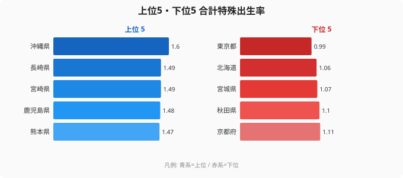

「都市に人が集まるほど、子どもが生まれなくなる」——2023年の合計特殊出生率データは、この逆説を鮮烈に示しました。

合計特殊出生率とは、1人の女性が生涯に産む子どもの数の推計値であり、人口を維持するためにはおよそ2.07が必要とされます。2023年の全国平均は1.20と過去最低水準を更新しましたが、さらに衝撃的だったのは東京都が0.99と、**都道府県として史上初めて1.0を下回った**という事実です。かつて「少子化」とは全国共通の課題と語られてきましたが、沖縄の1.60と東京の0.99という大きな開きは、少子化が「都市集中型」という極めて不均一な構造を持つことを明確に示しています。

この記事では、なぜ沖縄が首位を維持し続けるのか、なぜ九州・地方の出生率が高いのか、そして東京の0.99という数字が何を意味するのかを、地域・経済・文化の視点から読み解いていきます。

## 上位と下位の構造——九州・沖縄 vs 首都圏・近畿圏

<source-link href="/ranking/total-fertility-rate">合計特殊出生率ランキングの全件データを見る</source-link>

2023年のランキングを俯瞰すると、上位は九州・沖縄地方でほぼ占められています。首位の沖縄県（1.60）を筆頭に、長崎県と宮崎県がともに1.49で並び、鹿児島県（1.48）、熊本県（1.47）が続きます。九州7県のうち5県が全国上位に入っている計算です。対して下位5県は、京都府（1.11）、秋田県（1.10）、宮城県（1.07）、北海道（1.06）、そして最下位の東京都（0.99）と、大都市圏や人口減少が進む地域が並んでいます。

上位に九州・沖縄が集中する理由は、単一の要因では説明できません。共通して挙げられるのは「三世代同居・近居の割合が高い」「地域コミュニティの育児サポートが機能している」「住居費・教育費などの子育てコストが首都圏に比べて低い」という3点です。これらの条件が重なることで、子どもを持つことへの経済的・精神的なハードルが相対的に低く保たれていると考えられます。さらに九州・沖縄では若い世代が地元に留まりやすい傾向もあり、出産適齢期の女性人口の比率が地方に分散されていることも寄与していると見られます。

> [!NOTE]
> 合計特殊出生率は「15〜49歳の女性の年齢別出生率を合計したもの」であり、実際に1人の女性が産む子どもの数そのものではなく、ある年の年齢構成を前提にした「期間合計特殊出生率」。女性の年齢構成が若い地域ほど値が高く出やすい性質があり、沖縄の若年人口比率の高さが数値を押し上げる一因にもなっている。

## 沖縄1.60の深層——文化・若年構成・家族観

沖縄は「ユイマール（結い、互助の文化）」と呼ばれる地域共同体の相互扶助精神が今日まで根強く残る地域です。育児は家族と地域が共同で担うという文化的規範が、子どもを産み育てることへの自然な受容感を育んでいます。核家族化が進んだ都市部とは異なり、祖父母が孫の育児に日常的に関わる環境が整っており、母親一人に育児負担が集中しにくい構造があります。

加えて、沖縄の年齢構成は全国的に見ても若いという特徴があります。年齢中央値が低く、出産年齢にあたる20〜30代女性の割合が高いことは、統計的に合計特殊出生率を押し上げます。住居費についても、首都圏の家賃水準と比較すれば沖縄は依然として低く、子どもを持つことの経済的ハードルが都市部より低く抑えられています。さらに持ち家率も高く、手狭な賃貸住宅で子育てをする必要が少ない点も見逃せません。

[沖縄県の詳細データ](/areas/47000)では、人口・世帯構成の観点からも背景を確認できます。

> [!TIP]
> 出生率の高低を「子育てへの意識の違い」だけで説明しがちだが、実態は「子どもを持ちやすい構造があるか否か」の違いが大きい。沖縄の高出生率は、文化的背景に加え、三世代同居率・住居コスト・若年人口比率という複数の構造的条件が重なった結果といえる。出生率を上げたい自治体が「意識啓発」だけに頼っても効果が薄い理由がここにある。

## 東京0.99の衝撃——史上初めて1.0を下回った都市の論理

2023年、東京都の合計特殊出生率は0.99を記録しました。これは日本の都道府県として**史上初めて1.0を下回った数値**であり、少子化対策の観点からも象徴的な意味を持つ節目となりました。

なぜ東京はここまで低いのでしょうか。第一の要因は住居費と生活コストの高さです。東京23区における家賃水準は全国平均の2倍以上になることも珍しくなく、子どもが増えることで必要になる広い住居へのステップアップが経済的に困難な家庭が多くなります。第二に、東京に集まる女性は高学歴・キャリア志向の割合が高く、仕事と育児の両立が難しい職場環境では出産を後回しにするか、産まないという選択につながりやすくなります。初婚年齢の高さ（東京の女性の平均初婚年齢は全国でも最高水準です）も、結果として出産数の低下に直結します。

第三に、東京では育児の社会的コストが見えにくい形で大きくなっています。保育所の待機児童問題は改善されてきたとはいえ、希望する園に入れない、送迎の負担が重い、育休復帰後のキャリア断絶への不安といった課題が残ります。地方の三世代同居世帯と比較すれば、東京の核家族が日々の育児を乗り切るためのコストは圧倒的に高いといえます。

> [!WARNING]
> 東京の0.99という数値は「2023年単年の急落」ではなく、長年の趨勢の延長にあるもの。東京の出生率は近年一貫して低下を続けており、2023年の1.0割れは「いつかは起きる」と予測されてきた出来事である。この趨勢が続けば、今後さらに0.9台へと沈む可能性も否定できない。都市部の超少子化が全国平均を押し下げる構造が固定化しつつある。

[東京都の人口動態は、都市圏の人口移動とも連動して理解する必要があります。](/areas/13000)

## 「都市ほど少子化」という構造的矛盾と政策への含意

今回のデータが突きつけているのは、「経済的に豊かで人が集まる都市ほど子どもが生まれない」という日本固有の構造的矛盾です。GDPや産業集積という意味での「豊かさ」と、人口再生産という意味での「豊かさ」が完全に乖離しています。

この矛盾の根源には、都市型ライフスタイルの設計そのものがあります。高密度な都市で生活効率を最大化するには「少人数・高収入・高移動性」の家族構成が合理的であり、多子家庭は都市の経済論理と相性が悪くなります。住宅・教育・保育・キャリアの各コストが積み重なり、子どもを1人産むごとに経済的・時間的な余裕が削られていく構造は、個人の「産みたい気持ち」だけでは覆せません。

政策的な含意は明確です。必要なのは全国一律の少子化対策ではありません。地域の実態に応じて手段を変える差別化です。沖縄や九州型の「地域コミュニティ育児支援の強化」は地方では有効ですが、東京では「住宅支援・育児コストの直接補助・育休取得による不利益の排除」といった経済的介入のほうが効果を持ちやすいと考えられます。少子化を「意識の問題」として語る時代は終わり、コスト構造の改革こそが問われています。

[人口問題のより広い文脈は、人口カテゴリで確認できます。](/category/population)

## まとめ

- **首位は沖縄県（1.60）**：文化的な育児共同体・若年人口構成・低い住居コストが複合的に作用しています
- **最下位は東京都（0.99）**：都道府県として**史上初めて1.0を下回った**歴史的な節目となりました
- **沖縄と東京で大きな開き**：少子化は全国均一の問題というより、「都市集中型少子化」という構造的格差として現れています
- **九州勢が上位を独占**：長崎・宮崎・鹿児島・熊本など、三世代同居・近居率の高さ、地域コミュニティの育児サポート、子育てコストの低さが共通要因です
- **全国平均1.20は過去最低**：東京の1.0割れは個別の現象というより、都市型少子化の趨勢が臨界点に達したサインといえます

## データ出典

厚生労働省「人口動態統計」2023年（令和5年）。合計特殊出生率は15〜49歳の女性の年齢別出生率の合計（期間合計特殊出生率）。都道府県別集計はe-Stat経由で整備。
