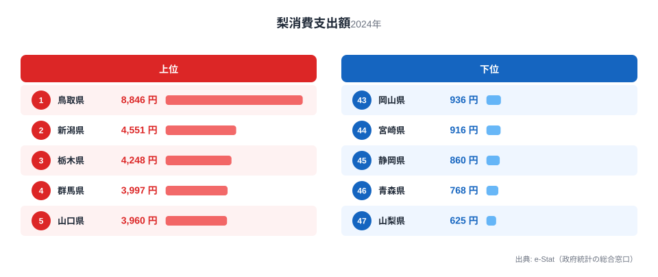
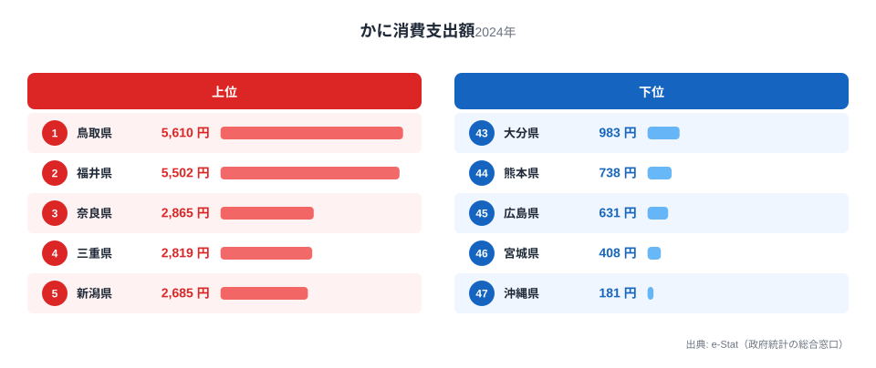
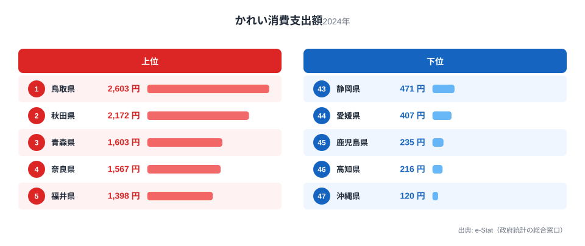
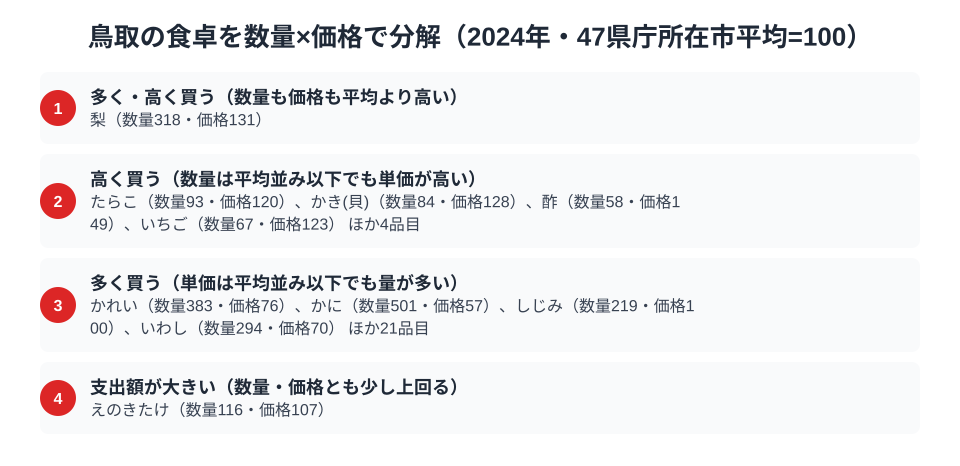

日本一人口の少ない県として知られる鳥取県ですが、食卓の豊かさは全国トップクラスです。総務省の家計調査（品目別）で鳥取市の二人以上世帯を見ると、梨・かに・かれいという3つの品目すべてで、鳥取が全国1位に立っています。

二十世紀梨、松葉ガニ、そして日本海のかれい。大地の果実と海の幸で、鳥取は「日本一」を3つも抱える食の県なのです。この記事では、これら3つの全国1位品目を横断しながら、鳥取県民の豊かな食卓を読み解きます。

> [!NOTE]
> 家計調査の都道府県データは、県庁所在市（鳥取県は鳥取市）の二人以上世帯を対象にした年間支出額です。県全体ではなく鳥取市在住世帯の家計簿から見た傾向であり、支出「金額」であって消費「量」そのものではない点にご注意ください。

## 梨 — 全国1位8,846円、二十世紀梨の郷

<source-link href="/ranking/pear-consumption-expenditure">梨消費支出額ランキングをもっと見る</source-link>

鳥取県の梨消費支出額は8,846円で全国1位です。2位の新潟県4,551円のほぼ2倍という、圧倒的な首位です。鳥取といえば「二十世紀梨」。みずみずしく上品な甘さの青梨は、鳥取を代表する特産品であり、県のシンボルとも言える存在です。

鳥取では、秋になると家庭でも二十世紀梨を箱で買い求め、贈答用としてもやり取りする文化が根づいています。梨狩り観光や梨をテーマにした施設もあり、梨が生活と観光の両面で県民に親しまれています。産地であると同時に、地元でよく食べる消費地でもあるという「産地=消費地」の一致が、梨の全国一を支えています。

## かに — 全国1位5,610円、松葉ガニの冬

<source-link href="/ranking/crab-consumption-expenditure">かに消費支出額ランキングをもっと見る</source-link>

かにの消費支出額も鳥取県が5,610円で全国1位です。2位の福井県5,502円と激しく首位を争っています。鳥取県境港市は、松葉ガニ（ズワイガニ）の水揚げ量で全国トップクラスを誇る漁港です。冬になると松葉ガニ漁が解禁され、県内はかに一色になります。

日本海側の産地県がかに消費の上位を占めるのは[かに消費支出の記事](/blog/crab-expenditure-ranking)でも扱った典型的な構図で、鳥取はその頂点に立ちます。年末年始のハレの食材として、また地元で新鮮なかにが手に入る環境が、全国一の支出額を支えています。福井（越前がに）とともに、日本海のかに文化を代表する県です。

## かれい — 全国1位2,603円、日本海の底魚

<source-link href="/ranking/flounder-consumption-expenditure">かれい消費支出額ランキングをもっと見る</source-link>

海の幸をもう一つ。かれいの消費支出額も鳥取県が2,603円で全国1位です。2位の秋田県2,172円を上回ります。かれいは日本海の砂地に生息する底魚で、鳥取沖は好漁場として知られています。

鳥取では、かれいの煮付けや干物が家庭料理として親しまれ、地元で獲れる新鮮なかれいが食卓に日常的に上ります。松葉ガニのような華やかさはないものの、かれいのような大衆的な底魚でも全国一という点に、鳥取の「日本海の海の幸への支出が全般に厚い」という食卓の性格が表れています。

> [!WARNING]
> 家計調査は支出金額の調査であり、消費量そのものではありません。物価や単価の違いも金額に影響します。特に松葉ガニのように単価の高い食材は、購入頻度が少なくても支出額が大きく出やすい点にご注意ください。

## 鳥取の食卓を貫くもの

鳥取県民の食卓を貫くのは、「大地の果実と日本海の海の幸への厚い支出」です。二十世紀梨という大地の恵み、松葉ガニという冬のハレの味覚、かれいという日常の底魚。華やかな高級食材から大衆的な魚まで、鳥取は地元でとれるものに惜しみなくお金をかけています。

ぶり・いか・昆布・餅の4冠を誇る富山と並べると、同じ日本海側でも鳥取は「梨＋かに・かれいの海の幸型」、富山は「富山湾の多冠型」と、食卓の骨格が異なります。人口は日本一少なくとも、食の豊かさでは全国トップクラスというのが、数字から見える鳥取の姿です。

> [!TIP]
> 鳥取のように「大衆魚（かれい）でも全国1位」という県は、その海域の魚介への支出が全般に厚い証拠です。高級食材（松葉ガニ）だけでなく日常の食材（かれい）の順位もあわせて見ると、その県が本当に「海の幸を日常的に食べる県」かどうかが分かります。

## 数量×価格で分解する鳥取市の食卓

<source-link href="/ranking/freshwater-clam-consumption-quantity">しじみ消費量ランキングをもっと見る</source-link>

ここまで見てきた3品目の「支出額全国1位」は、実は中身が一様ではありません。家計調査には支出額（円）だけでなく購入数量（g）のデータもあり、品目ごとに47都道府県庁所在市の平均を100とした指数へ直すと、「たくさん買っているのか」「単価が高いのか」を分けて読むことができます。かにを分解すると、購入数量の指数は平均の5倍前後まで跳ね上がる一方、単価にあたる価格指数はむしろ平均を下回ります。かれいも同じ傾向で、数量指数は平均の3倍以上、価格指数は平均以下です。つまりこの2品目の支出額1位は、単価の高さではなく購入量の圧倒的な多さによって押し上げられています。松葉ガニというと高級食材のイメージが先行しますが、鳥取市の家計簿からは「高いものを少し買う」ではなく「地元で獲れるものをたくさん食べる」という日常の姿が浮かび上がります。いわしとしじみ消費量も同じ型に入り、購入量は平均の2〜3倍と多く価格は平均並みかそれ以下で、東郷池や日本海の恵みを日常的に食べる文化が広く根づいていることがうかがえます。

一方、梨は数量指数・価格指数のどちらも平均を上回る、いわば「多く・高く買う」品目です。二十世紀梨は鳥取が産地であると同時に消費地でもあるため、たくさん買われる点はかにと共通しますが、単価も平均より高いところが異なります。贈答用の等級品を含め、品質を重視した買い方が価格指数を押し上げていると読めます。反対に、たらこ・かき（貝）・酢・いちごは、購入量は平均以下なのに単価だけが平均を上回る品目です。地元で大量に生産される食材ではないぶん、流通量の少なさや輸送コストが小売価格に反映されやすいのだと考えられます。同じ「支出額が多い」でも、量で稼ぐ品目と単価で稼ぐ品目があることが、数量と価格を分けて見て初めて分かります。

> [!TIP]
> 支出額の順位だけを見ると「かにや梨にお金をかける県」という印象で終わってしまいます。数量指数と価格指数に分解すると、かに・かれい・しじみ・いわしは「たくさん食べているから支出額が大きい」品目、梨は「たくさん食べたうえに単価も高い」品目というように、同じ1位でも中身が違うことが見えてきます。品目ごとの数量指数・価格指数をあわせて見ると、その県の食文化が「量の文化」なのか「高級化した消費行動」なのかを読み分けられます。

> [!NOTE]
> 基準となる「指数100」は、家計調査（品目別）の全国値ではなく、47都道府県庁所在市の二人以上世帯における単純平均です。価格指数は支出額を購入数量で割った金額を平均と比べた相対値であり、購入する品種やブランドの違いも反映するため、純粋な物価水準そのものではありません。数量・支出額とも、鳥取市の二人以上世帯における2024年の年間値です。

## まとめ

- 梨消費支出額は鳥取県が全国1位（8,846円）、2位新潟県のほぼ2倍で二十世紀梨の郷
- かにも全国1位（5,610円）、境港の松葉ガニに代表される冬の味覚
- かれいも全国1位（2,603円）、日本海の底魚を日常的に食べる食文化
- 大地の果実と日本海の海の幸への厚い支出が、人口最少県・鳥取の豊かな食卓を支える

鳥取県の他の統計は[鳥取県の地域プロフィール](/areas/31000)、食品・家計消費の地域差は[経済カテゴリ一覧](/category/economy)からご覧いただけます。

## データ出典

総務省統計局「家計調査（品目別）」（2024年、都道府県庁所在市 二人以上世帯）をもとに、e-Stat（政府統計の総合窓口）経由で整備したデータを使用しています。
