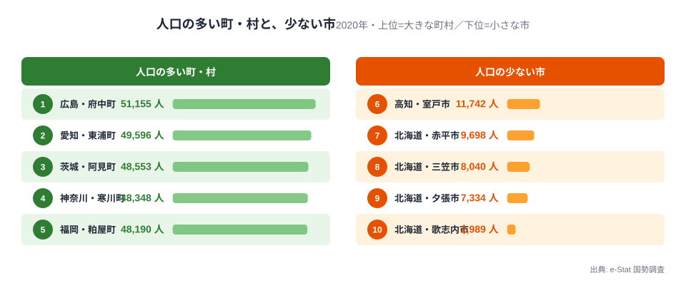
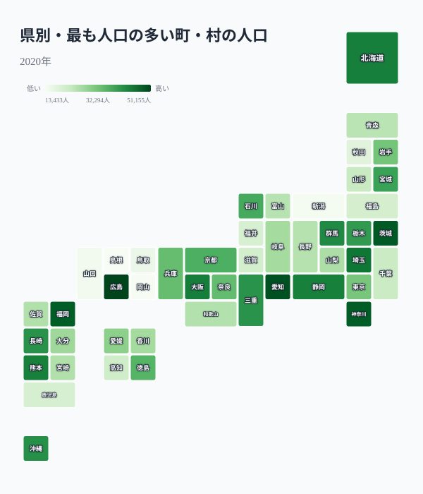
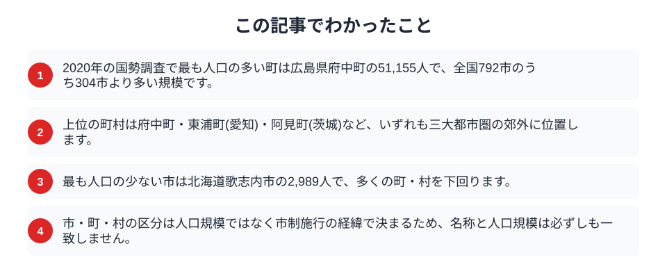

「市」と「町」と「村」。この順に人口が多いと考えるのが自然な感覚です。ところが実際の人口を並べてみると、その順序はあっさり崩れます。2020年の国勢調査で最も人口の多い町は5万人を超え、全国792ある市のうち300以上を上回っていました。逆に、最も人口の少ない市は3千人に届きません。市・町・村という呼び名は、人口の大小をそのまま表しているわけではないのです。

## 最大の町は300以上の市より大きい

まず、人口の多い町・村と、人口の少ない市を並べて比べてみます。

<data-source label="e-Stat 国勢調査" note="市区町村別人口（2020年）"></data-source>

最も人口の多い町は広島県府中町の51,155人です。続く愛知県東浦町が49,596人、茨城県阿見町が48,553人、神奈川県寒川町が48,348人、福岡県粕屋町が48,190人と、5万人前後の町が並びます。一方、市のなかで最も人口が少ないのは歌志内市の2,989人でした。夕張市（7,334人）や三笠市（8,040人）など、1万人に満たない市が続きます。府中町の5万人は、全国792市のうち304市を上回る規模です。つまり「町だから小さい」「市だから大きい」という思い込みは、上位と下位が入り混じるこの一覧の前ではまったく通用しません。都市への人口集中が進むなか、[埼玉が昼夜人口比率で最下位](/blog/population-density-urbanization)になるような郊外の膨張が、町を大きく育ててきました。

<source-link href="/ranking/total-population">都道府県別の総人口ランキングを見る</source-link>

## 大きな町は大都市圏の周りにある

次に、各県で最も人口の多い町・村がどれくらいの規模かを地図で見ます。

<data-source label="e-Stat 国勢調査" note="市区町村別人口（2020年）"></data-source>

色が濃いのは広島・愛知・茨城・神奈川・福岡・埼玉といった、大都市圏を抱える県です。府中町は広島市に、東浦町や東郷町は名古屋圏に、寒川町は横浜・藤沢の近くにと、いずれも中心都市のすぐ隣で人口を増やしてきました。大きな町の正体は、都市のベッドタウンとして発展した「町のままの郊外」です。反対に、地方の県では最も大きな町でも数千人から1万人台にとどまり、地図の色は薄くなります。町の人口規模は、その町がどれだけ大都市圏に近いかを映しているのです。

<source-link href="/ranking/total-population">総人口の都道府県ランキングを見る</source-link>

## なぜ町のまま大きくなったのか

人口が5万人近くあっても市にならないのには、理由があります。

> [!NOTE]
> 市になるには一般に人口5万人以上などの要件を満たす必要がありますが、市制の施行は自治体自身の選択でもあります。府中町のように、財政や行政サービスの都合から、あえて町のままでいることを選ぶ自治体もあります。単独では要件を満たしても、周辺との合併に至らなかった町も少なくありません。

つまり大きな町は、要件を満たせなかったのではなく、市になる必要や機会がなかった町です。隣が大きな市であれば、生活圏はその市と一体化しており、独立した市になる実益が乏しいという事情もあります。名称は歴史と選択の結果であって、都市としての規模や機能を直接示すものではありません。

## 小さな市はかつての大都市

一方、人口が数千人しかない市の多くには、共通の背景があります。

> [!TIP]
> 最も人口の少ない歌志内市や、夕張市・三笠市・赤平市は、いずれもかつて石炭産業で栄えた北海道の旧炭鉱都市です。炭鉱がにぎわった時代には数万人を抱え、市制を施行しました。その後の閉山で人口が激減しても、市の地位はそのまま残りました。

これらの市は「小さいのに市」なのではなく、「かつて大きかった名残として市」なのです。市という名称は、その自治体がもっとも栄えた時代の記録でもあります。人口の少ない市を見るときは、現在の規模だけでなく、そこにたどり着くまでの歴史を重ねて読むと、地域の歩みが見えてきます。大都市圏の郊外で人口を増やした町と、産業を失って縮んだ市。この二つが人口の順位で交わるところに、日本の地域の栄枯盛衰が凝縮されています。同じ国のなかで、片方では町が市の規模に育ち、もう片方では市が村ほどの人口に縮む。人口の動きは、行政の区分よりもずっと速く地域の姿を変えていきます。

## 数字を読むときの注意

市・町・村の名称を、そのまま都市の格や便利さと結びつけるのは早計です。

> [!WARNING]
> 同じ「市」でも、政令指定都市から人口3千人の市までその幅は極めて大きく、「町」も5万人から数百人までさまざまです。自治体の名称は制度上の区分であり、人口規模・都市機能・生活の便利さを一律に表すものではありません。

町か市かではなく、実際の人口や産業、大都市圏との距離で地域を見ることが、統計を正しく読む姿勢につながります。名称の思い込みを一度外すと、日本の自治体の姿はより立体的に見えてきます。

## まとめ

この記事でわかったことを整理します。

人口で並べると、最大の町は5万人を超えて多くの市を上回り、最小の市は3千人を切ります。大きな町は大都市圏の郊外で育った「町のままの街」であり、小さな市はかつて栄えた時代の名残でした。市・町・村という区分は人口規模ではなく制度と歴史の産物です。人口がこれからどう動くかは[2050年に人口が4割減る県](/blog/future-population-disappearing-prefectures)や[人口動態のテーマページ](/themes/population-dynamics)からも確認できます。名称の奥にある人口の実像を知ることは、地域を正しく理解する第一歩です。

## データ出典

- e-Stat（政府統計の総合窓口）国勢調査「市区町村別人口」（2020年）
- 市区町村（県名を除いた市・町・村・特別区）単位で集計し、政令指定都市の行政区は市に含めています。
