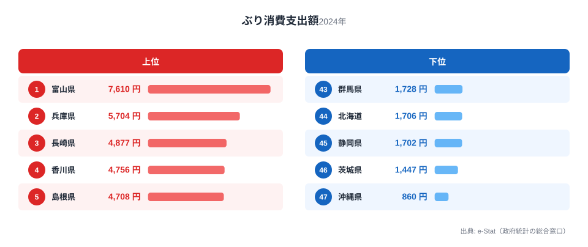
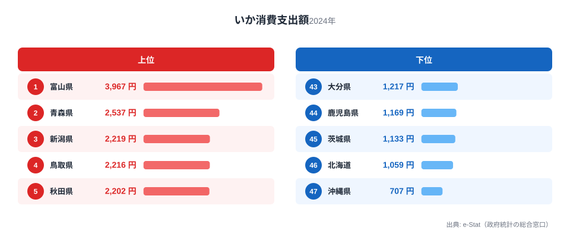
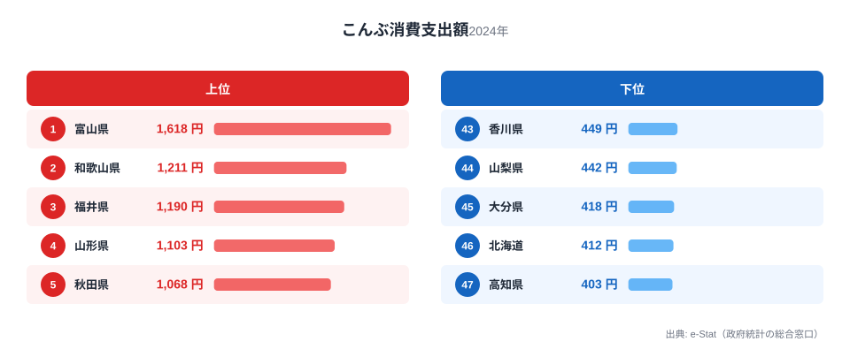
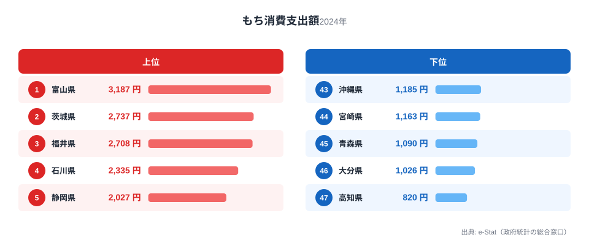
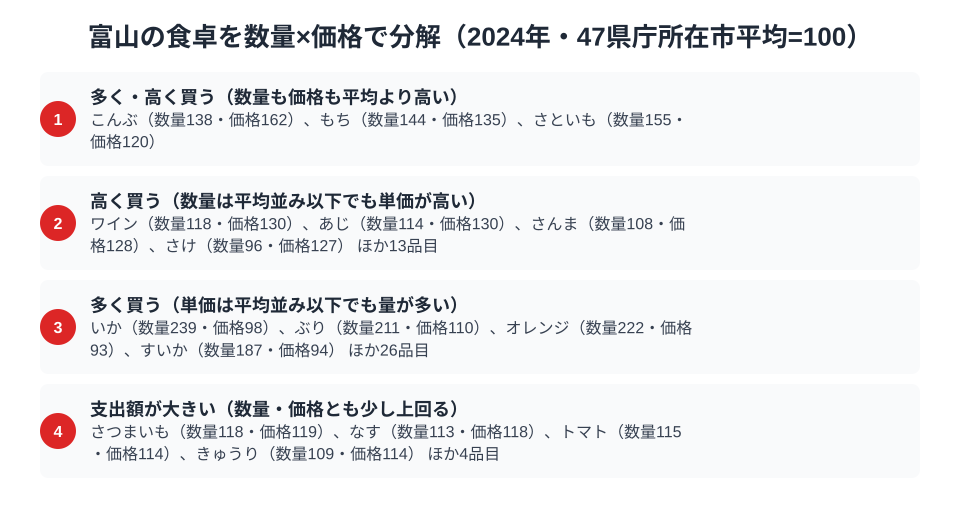

富山県は、家計調査の食品ランキングで驚くほど多くの品目が全国1位に並ぶ「食の王国」です。総務省の家計調査（品目別）で富山市の二人以上世帯を見ると、ぶり・いか・昆布・餅という性格の異なる4つの品目すべてで、富山が全国1位に立っています。

「富山湾は天然のいけす」と呼ばれるほど豊かな海の幸に恵まれ、加えて昆布や餅といった独自の食文化も色濃く残る富山。この記事では、4つの全国1位品目を横断しながら、なぜ富山がこれほど「日本一だらけ」なのかを読み解きます。

> [!NOTE]
> 家計調査の都道府県データは、県庁所在市（富山県は富山市）の二人以上世帯を対象にした年間支出額です。県全体ではなく富山市在住世帯の家計簿から見た傾向であり、支出「金額」であって消費「量」そのものではない点にご注意ください。

## ぶり — 全国1位7,610円、富山湾の寒ぶり

<source-link href="/ranking/yellowtail-consumption-expenditure">ぶり消費支出額ランキングをもっと見る</source-link>

富山県のぶり消費支出額は7,610円で全国1位です。2位の兵庫県5,704円を引き離す、堂々の首位です。富山湾で獲れる「ひみ寒ぶり」は全国的なブランドで、脂の乗った冬の寒ぶりは富山の食文化を象徴する存在です。

富山では、年末年始に嫁ぎ先へぶりを贈る「嫁ぶり」の習慣が今も残るなど、ぶりは単なる食材を超えた特別な魚として扱われてきました。刺身・照り焼き・ぶり大根と食べ方も多彩で、冬になると一本まるごと買い求める家庭も珍しくありません。富山湾という恵まれた漁場と、ぶりを尊ぶ食文化が、全国一の支出額を支えています。

## いか — 全国1位3,967円、ホタルイカと白えびの海

<source-link href="/ranking/squid-consumption-expenditure">いか消費支出額ランキングをもっと見る</source-link>

いかの消費支出額も富山県が3,967円で全国1位です。2位の青森県2,537円を上回ります。富山湾は春になるとホタルイカが押し寄せる名所として知られ、生きたまま光るホタルイカは富山の春の風物詩です。

ホタルイカの沖漬けや酢味噌和え、素干しといった加工品まで、いかは富山の食卓に季節を通じて登場します。富山湾の深い海が育む豊かないか資源が、地元の日常的な消費を支えていると考えられます。ぶりといい、いかといい、「富山湾は天然のいけす」という表現がそのまま家計の数字に表れているのです。

## 昆布 — 全国1位1,618円、北前船が運んだ昆布文化

<source-link href="/ranking/konbu-consumption-expenditure">昆布消費支出額ランキングをもっと見る</source-link>

昆布の消費支出額も富山県が1,618円で全国1位です。2位の和歌山県1,211円を上回ります。富山は昆布の産地ではありませんが、江戸時代の北前船交易で北海道の昆布が富山に運ばれ、独自の昆布食文化が花開きました。

昆布〆（刺身を昆布で挟んで締める料理）、とろろ昆布のおにぎり、昆布巻きなど、富山には昆布を使った郷土料理が数多くあります。産地から遠いにもかかわらず消費が全国一という点は、[沖縄県の食卓](/blog/okinawa-food-culture)（昆布2位）と同じく、北前船・交易の歴史が食文化を定着させた好例です。

## 餅 — 全国1位3,187円、米どころの餅文化

<source-link href="/ranking/mochi-consumption-expenditure">餅消費支出額ランキングをもっと見る</source-link>

海の幸だけでなく、餅の消費支出額も富山県が3,187円で全国1位です。2位の茨城県2,737円を上回ります。富山は良質な米の産地であり、餅を日常的に食べる習慣が根づいています。行事や来客のたびに餅をつく文化が残り、正月以外にも餅が食卓に上る機会が多いことが、全国一の支出額につながっていると考えられます。

> [!WARNING]
> 家計調査は支出金額の調査であり、消費量そのものではありません。物価や単価の違いも金額に影響します。富山のように多品目で全国1位が並ぶ場合でも、「支出額の順位＝食べている量の順位」と単純には読めない点にご注意ください。

## 富山の食卓を貫くもの

富山県民の食卓を貫くのは、「富山湾の海の幸」と「交易・米どころが育んだ食文化」の二本柱です。ぶり・いかは富山湾という天然の漁場が生み、昆布は北前船交易が運び、餅は米どころの伝統が支える。海の恵みと歴史・産業が重なって、4品目すべてで全国1位という稀有な食卓が生まれています。

高知の「黒潮のかつお特化」、宮崎の「南九州の飲みもの文化」と並べると、富山は「富山湾の海の幸＋交易・米文化の多冠型」。ひとつの県でこれほど多くの品目が全国トップに立つ例は珍しく、富山が日本有数の「食の豊かな県」であることが数字からも見えてきます。

> [!TIP]
> 富山の昆布のように「産地ではないのに消費が全国一」という品目は、その背後に交易や歴史が隠れています。家計調査で意外な全国1位を見つけたら、「なぜこの県で?」と産地以外の理由（北前船・行事食・地元の習慣）を探ると、その土地の食文化の奥行きが見えてきます。

## 数量×価格で分解する富山市の食卓

<source-link href="/ranking/konbu-consumption-quantity">昆布消費量ランキングをもっと見る</source-link>

支出額のランキングだけを見ると、ぶり・いか・昆布・餅はどれも「全国1位」という同じ結果に並びます。しかし支出額は数量と価格のかけ算なので、47都道府県庁所在市の平均を100とした数量指数と価格指数に分解すると、品目ごとの性格の違いが見えてきます。まず、いかとぶりは数量指数がそれぞれ239.3と211.3ときわだって高いのに対し、価格指数は97.5と109.7とほぼ平均並みです。つまり、いかとぶりが全国1位になっているのは単価が高いからではなく、平均の2倍以上という量をふだんから買っているからだとわかります。富山湾で水揚げされる寒ぶりやホタルイカが手頃な値段のまま食卓に上りやすいという地の利が、そのまま数字に表れている形です。

一方、昆布と餅は量に加えて単価でも平均を上回っています。昆布の数量指数は138.0で平均よりやや多い程度ですが、価格指数は162.4に達し、今回調べた家計調査の食料品目のうち富山でもっとも高い価格指数を記録した品目です。餅も数量指数143.8・価格指数134.7と、どちらも平均を大きく超えています。昆布は富山湾で獲れる魚介と違い、北海道から北前船で運ばれてきた食材なので、単に量が多いだけでは全国一の座は説明できません。ふだん使いの安価な昆布ではなく、昆布〆に向く上質な昆布を選んで買っている可能性がうかがえます。米どころならではの餅も、量だけでなく単価の面での「こだわり」が支出額を押し上げていると考えられます。

> [!TIP]
> 支出額の順位だけでは、「たくさん食べているのか」「高いものを買っているのか」を区別できません。数量指数と価格指数に分解すると、いか・ぶりのように量で稼ぐ品目と、昆布・餅のように単価でも稼ぐ品目に分かれることが見えてきます。気になる品目があれば、家計調査で数量と支出額の両方が公表されている品目を同じ方法で比較してみると、その土地の食文化の性格がより具体的に見えてきます。

> [!NOTE]
> ここでの数量指数・価格指数は、家計調査で数量と支出額の両方が公表されている食料品目について、47都道府県庁所在市の単純平均を100とした相対値です。総務省が公表する全国平均そのものではありません。また価格指数は支出額を数量で割った単価の相対値なので、購入する品種やブランドの違いも反映されており、純粋な物価水準を表すものではない点にご注意ください。数値はいずれも富山市の二人以上世帯・2024年の年間値です。

## まとめ

- ぶり消費支出額は富山県が全国1位（7,610円）、富山湾の寒ぶり文化
- いかも全国1位（3,967円）、ホタルイカに代表される富山湾の恵み
- 昆布も全国1位（1,618円）、北前船交易が運んだ昆布〆などの食文化
- 餅も全国1位（3,187円）、米どころの餅文化
- 富山湾の海の幸と交易・米文化が重なり、4品目すべてで全国トップに立つ食の王国

富山県の他の統計は[富山県の地域プロフィール](/areas/16000)、食品・家計消費の地域差は[経済カテゴリ一覧](/category/economy)からご覧いただけます。

## データ出典

総務省統計局「家計調査（品目別）」（2024年、都道府県庁所在市 二人以上世帯）をもとに、e-Stat（政府統計の総合窓口）経由で整備したデータを使用しています。
