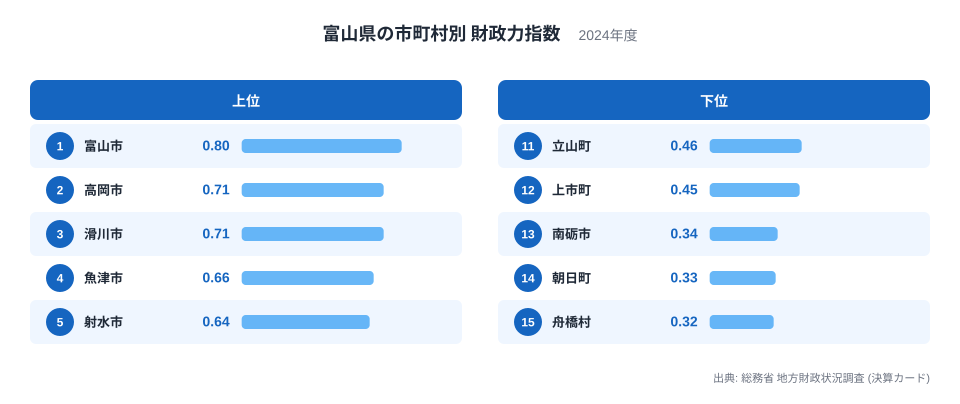
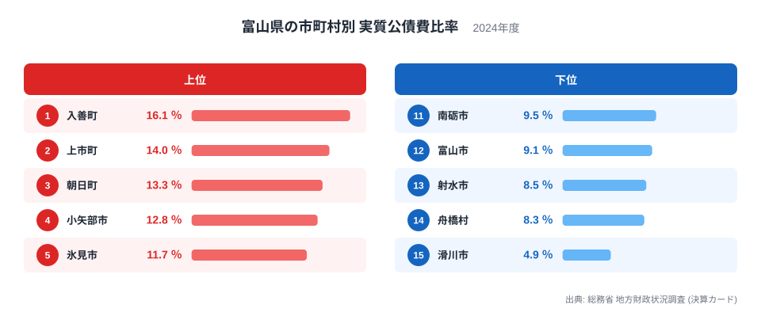
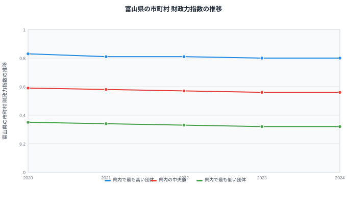

## 富山県15市町村を財政の面から見る

富山県には15の市町村があります。市町村の数が15と少ないため、それぞれの規模や事情も比較的つかみやすい県です。ここでは総務省の地方財政状況調査から、財政力指数と実質公債費比率という2つの指標を使い、県内15市町村のあいだにある財政の差を見ていきます。

財政力指数は、自分の力でどれだけの行政需要をまかなえるかを示す指標です。実質公債費比率は、借入金の返済がどれだけ財政の重荷になっているかを示す指標です。この2つは測っているものが違うため、片方だけを見ていては見落とす組み合わせがあります。富山県の15市町村を並べると、その組み合わせの違いがはっきり見えてきます。

富山県は北陸地方に位置し、富山湾に面した平野部の市と、県東部の山あいに位置する町村が同じ県内に共存しています。市町村の数が15と少ないぶん、1つの自治体の財政の姿が県全体の印象に与える影響も相対的に大きくなります。以下では、財政力指数と実質公債費比率の両方を確認しながら、県内の自治体ごとの位置づけを見ていきます。

## 財政力指数で見る富山市と山間部の町村の差

財政力指数の1位は富山市で、0.8です。県庁所在地として行政機能や商業施設が集まり、税収の基盤が県内でもっとも厚い自治体になっています。2位は高岡市で0.71、3位は滑川市も同じく0.71です。4位以下も魚津市が0.66、射水市が0.64、黒部市が0.62と、富山湾に面した市が上位に並んでいます。

一方、下位に目を向けると、舟橋村が0.32でもっとも低く、朝日町が0.33、南砺市が0.34と続きます。舟橋村は県内でもっとも人口の少ない自治体で、税収の基盤となる産業や事業所も限られているため、自分の力でまかなえる財政需要の割合がどうしても小さくなります。財政力指数は基準財政収入額を基準財政需要額で割って算出する指数のため、人口規模が小さく税源が乏しい自治体ほど数値が低く出やすい仕組みになっています。

## 実質公債費比率で見る借金返済の重さと財政力の食い違い

実質公債費比率がもっとも高いのは入善町で、16.1％です。次いで上市町が14％、朝日町が13.3％と続きます。ここで目を引くのは、朝日町は財政力指数でも下位2番目に位置しており、財政力が弱く借金返済の負担も重いという分かりやすい組み合わせになっている点です。こうした自治体では、道路や除雪といった生活基盤の維持に一定の投資が必要になり、そのことが過去の借入金の返済負担の重さにつながっていると考えられます。

もっとも低いのは滑川市で、4.9％です。滑川市は財政力指数でも3位に入っており、財政力が強く借金返済の負担も軽いという、こちらも分かりやすい組み合わせです。

ただし、この2つの指標がつねに同じ方向を向くわけではありません。実質公債費比率が県内でもっとも高い入善町は、財政力指数では0.51で9位と、決して県内で最も弱い自治体ではありません。逆に、財政力指数が県内でもっとも低い舟橋村は、実質公債費比率では8.3％で14位と、県内で2番目に借金返済の負担が軽い自治体です。財政力の弱さと借金返済の重さが必ずしも重ならないことが、この2つの図を並べることで見えてきます。

富山市についても見ておくと、財政力指数は1位でありながら、実質公債費比率は9.1％で12位と、県内では借金返済の負担が軽い側に入っています。財政力の強い自治体が同時に借金返済の負担も軽い側にいるとは限らない一方で、富山市のように両方の面で良い位置にある自治体もあり、市町村ごとの姿はさまざまです。

## 財政力指数の推移から見える変化の少なさ

2020年から2024年までの5年間で、県内でもっとも高い団体の財政力指数は0.83から0.8へとゆるやかに下がってきました。中央値も0.59から0.56へと同じように下がっています。もっとも低い団体は0.35から0.32へと、こちらもゆるやかに下がっています。

いずれの系列も5年間で急に大きく動いてはおらず、高い団体・中央値・低い団体のすべてが少しずつ下がる方向で推移している点が特徴です。財政力指数は基準財政収入額と基準財政需要額から算出される指数で、単年度の景気変動だけでなく人口や産業構造といった長期的な要因に左右されます。そのため短期間で急に変わることは少なく、今回のようにゆるやかな低下が続く推移は、指標の性質からしても自然な姿といえます。

## 富山県の財政をさらに見るには

この記事で見てきたように、15の市町村を財政力指数と実質公債費比率の2つの軸で見ると、両方の面で良い位置にある富山市や滑川市のような自治体がある一方で、朝日町のように両方の面で厳しい自治体もあり、さらに入善町や舟橋村のように片方だけが際立つ自治体もあります。単純に一方の指標だけで自治体の財政状況を判断するのは避けたいところです。

同じ「財政力が弱い自治体」でも、朝日町のように借金返済の負担も重い自治体と、舟橋村のように借金返済の負担はむしろ軽い自治体があるという事実は、財政力指数だけを見て自治体の課題を推測することの限界を示しています。県内15市町村という比較的少ない数の自治体でも、これだけ組み合わせのパターンが分かれることは、財政の姿を1つの指標だけで語ることの難しさを物語っています。2つの指標をあわせて見ることで、それぞれの市町村がどのような立ち位置にあるのかが、より具体的に見えてきます。

富山県全体の財政や他の指標については[富山県のデータ](/areas/16000)で確認できます。市町村を横断した地方財政のテーマは[地方財政のテーマ](/themes/local-finance)にまとまっており、行財政に関する他の統計は[行財政の統計一覧](/category/administrativefinancial)から探せます。都道府県単位での財政力の違いを見たい場合は[都道府県別の財政力指数](/ranking/fiscal-strength-index-prefecture)も参考になります。

> [!NOTE]
> 財政力指数は、自分の力でまかなえる行政需要の割合を示す指数で、1に近いほど独自の財源が豊かなことを意味します。1を下回っても財政が破綻しているわけではなく、地方交付税によって不足分が補われる仕組みが前提になっています。

> [!WARNING]
> 実質公債費比率が高い自治体が、必ずしも財政力指数の低い自治体と一致するわけではありません。この記事の入善町のように、借金返済の負担は県内でもっとも重くても、財政力指数では県内の中位に位置する自治体もあります。片方の指標だけで自治体の財政状況を判断しないことが大切です。

> [!TIP]
> 15市町村を比べるときは、富山市や高岡市のような都市部の自治体と、舟橋村のような人口の少ない自治体を同じ物差しで単純比較しないことが大切です。同じ人口規模の自治体どうしで比べると、それぞれの町村が抱える事情がより見えやすくなります。

## データ出典

総務省 地方財政状況調査（決算カード）、2024年度
