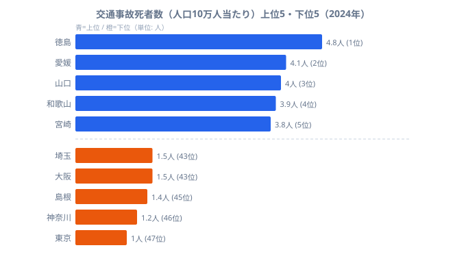
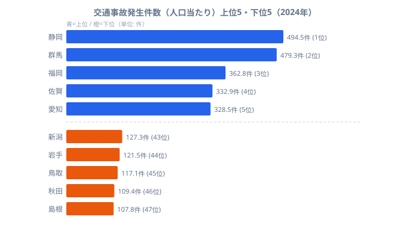
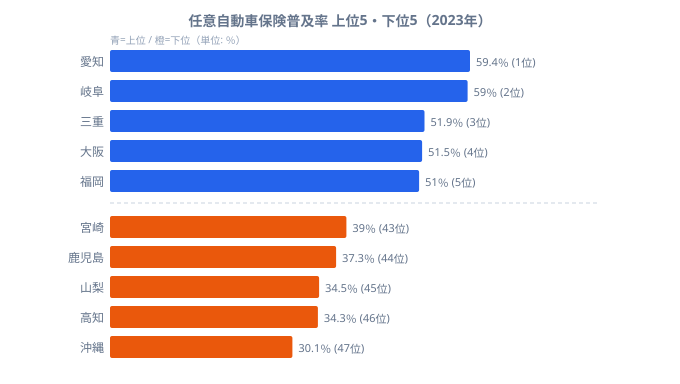

**令和6年（2024年）、交通事故で亡くなった人は2,663人でした。** 1日あたり約7人──毎日どこかで、誰かが帰らぬ人になっています。

「自分の県って、交通事故的にどうなんだろう？」と気になったことはありませんか。「田舎のほうが安全そう」「都会は危なそう」──なんとなくそんなイメージを持っている人も多いと思います。

ところが、データを見るとそのイメージは意外なほどひっくり返ります。人口10万人当たりの交通事故死者数は、最少の東京が1.0人なのに対し、最多の徳島は4.8人。同じ人口規模で比べると、地方ほど命を落とす確率が高いのです。しかも面白いのは、事故の「件数」が多いのはむしろ都市部だという点です。この記事では、e-Statの都道府県別データと令和6年度版の**交通安全白書**をもとに、「件数が少ないのに死者が多い」という逆転がなぜ起きるのかを読み解いていきます。

## 都道府県別「交通事故死者数」ランキング

まず押さえておきたいのが、比較の「ものさし」です。使うのは[人口10万人当たりの交通事故死者数](/ranking/traffic-accident-deaths-per-100k)です。単純に死者数の多い県を並べると、どうしても人口の多い東京や大阪が上位に来てしまいます。同じ10万人のなかで何人が亡くなったか──そこを揃えて初めて、地域ごとの「本当のリスク」が見えてきます。

> [!NOTE]
> ここで使う「人口10万人当たり交通事故死者数」は、実数の死者数を人口で割って規格化した指標です（2024年）。実数では人口の多い都府県が上位になりますが、規格化すると人口規模の影響が消え、純粋な「住んでいる人にとってのリスク」を都道府県間で比べられます。順位の意味が実数ランキングとは逆になる点に注意してください。

<source-link href="/ranking/traffic-accident-deaths-per-100k">交通事故死者数ランキングをもっと見る</source-link>

上位は徳島（4.8人）・愛媛（4.1人）・山口（4.0人）・和歌山（3.9人）・宮崎（3.8人）と、地方の県が占める結果になりました。車なしでは生活できない地域では走行距離が自然と長くなりますし、高速道路や幹線道路を長時間走る機会も増えます。その積み重ねが、命に関わる事故のリスクとして現れてくるのです。

一方、下位は東京（1.0人）・神奈川（1.2人）・島根（1.4人）・大阪（1.5人）・埼玉（1.5人）と大都市圏が中心です。最多の徳島は最少の東京の約4.8倍にあたり、住む場所が違うだけでリスクがこれだけ開きます。電車やバスが充実している大都市圏では車に頼る場面が少なく、走るとしても渋滞だらけの市街地が中心で速度が出にくいことが死者数を押し下げているとみられます。注目したいのは、下位5県のうち下から3番目に島根（1.4人）が入っている点です。島根は人口が少なく車社会である典型的な地方県ですが、それでも全国でも有数の少なさという結果は、「地方だから必ず危険」とは言い切れないことを示しています。

#### 【コラム】対策次第で変えられる──佐賀県の10年

ランキング上位（危険）の県が、政策によって大きく改善した例も存在します。実は佐賀県は、2012〜2016年に5年連続で「人口10万人当たり死者数 全国最多」でした。この不名誉な記録を機に、官民一体の改善プロジェクトを展開しました。

- **意識改革**──交通ルール遵守とマナー向上を促す広報・教育の集中実施（「よかろうもん運転」撲滅キャンペーン等）
- **ハード面の対策**──事故多発交差点のカラー舗装・右折レーンの延伸・反射材の設置・街頭指導の強化
- **企業・団体との連携**──「事故を起こさなければ景品が当たる」などインセンティブを組み込んだ独自の活動（「みっつの3運動」）

その結果、2017年に最多を脱却しました。2024年時点では全国18位（人口10万人当たり3.0人）と中間水準まで改善しており、現在もランキング上位に苦しむ県にとって希望の事例になっています。

## 事故の「件数」と「死者数」は別モノ

ちょっと待ってください。**「事故件数が多い県＝危険な県」かというと、じつはそうでもないのです。** 都市部は車と人が多い分、接触事故や軽い追突は日常茶飯事です。でも死亡事故になるケースは多くありません。一方、地方では事故件数そのものは少ないのに、ひとたび事故が起きると命に関わる確率がぐっと上がります。この「件数と死者数のねじれ」を確かめるため、まずは人口当たりの発生件数で都道府県を並べてみましょう。

<source-link href="/ranking/traffic-accident-count-per-population">交通事故発生件数ランキングをもっと見る</source-link>

件数上位は静岡（494.5件）・群馬（479.3件）・福岡（362.8件）・佐賀（332.9件）・愛知（328.5件）と、車社会の県や大都市圏が占めます。人口が密集し、車と歩行者が入り混じる市街地では、軽微な接触事故が頻発するためです。

一方、件数下位は島根（107.8件）・秋田（109.4件）・鳥取（117.1件）・岩手（121.5件）・新潟（127.3件）と、人口の少ない地方県が並びます。「件数が少ない＝安全」に見えますが、ここで先ほどの死者数ランキングを思い出してください。件数最少の島根は死者数でも下から3番目でしたが、それ以外──秋田・鳥取をはじめとする地方県の多くは死者数では上位寄りに位置しています。事故そのものは滅多に起きないのに、起きたときの致命性が高い。これが地方に共通する構造です。

> [!WARNING]
> 件数ランキングと死者数ランキングは、上位・下位の顔ぶれがほぼ反転します。件数が少ない県を見て「安全」と早合点すると判断を誤ります。読むべきは「1件起きたときにどれだけ死につながるか」という致死性で、件数の多寡だけでは安全性を語れません。

この致死性の差を生む正体が、地方の道路環境です。交通安全白書（令和6年度）によると、死亡事故の類型でいちばん多いのが「正面衝突等」だといいます。地方の片側1車線の幹線道路を制限速度ギリギリで走るシーンを想像してみてください。信号も少なく対向車もまばらだと、自然とアクセルが踏み込まれます。もし80〜100km/hで走る国道で正面衝突が起きたら、取り返しがつきません。実際、[道路密度（km²当たり道路延長）](/ranking/road-length-per-km2)が低い県ほど[致死率（100件当たり死者数）](/ranking/traffic-accident-deaths-per-100-accidents)が高い傾向があり、公表データでの相関係数はr = −0.60と報告されています。同様の傾向は[道路平均交通量](/ranking/average-road-traffic-volume)でも見られ（r = −0.63）、「空いている道ほどスピードが出やすく事故の致死性が高い」という構造が一貫しています。一方、[主要道路舗装率](/ranking/main-road-paving-rate)との相関はr = −0.30と弱く、致死率を主に左右しているのは道路の密度と交通量だと考えられます。

> [!TIP]
> 相関係数（r）はあくまで関連の強さを示すもので、因果を直接証明するものではありません。道路が空いていること「そのもの」が人を殺すのではなく、それが速度を上げやすくし、正面衝突を増やすという経路が背後にあります。インフラの「量」だけでなくドライバーの速度管理が問われている、と読むのが正確です。

<ad-slot></ad-slot>

## 高齢化が「致死率の高さ」をさらに押し上げる

交通安全白書のデータに、思わず目が止まる数字があります。

> 令和6年の交通事故死者2,663人のうち、65歳以上が1,513人（56.8%）を占める

半数以上が高齢者、という事実です。さらに驚くのが、80歳以上の歩行中死者数は全年齢平均の約3.9倍（人口10万人当たり）にのぼるという点です。交通事故は「若者が起こすもの」というイメージは、今やまったく通用しません。高齢者の安全をどう守るかが、現代日本の交通安全における最大のテーマになっています。

そして地方ほど[65歳以上人口比率](/ranking/ratio-65-plus)が高いという事実が、地方の致死率の高さと重なります。高齢者の交通リスクが高い理由は、大きく3つに整理できます。

1. **歩行者として**──判断速度や歩行速度が落ちるため、横断中の事故に巻き込まれやすくなります
2. **ドライバーとして**──認知機能・反射速度の低下が事故につながりやすくなります
3. **受傷の深刻さ**──同じ事故でも、高齢者は重症・死亡に至りやすいのです

地方が死者数上位に名を連ねる背景には、走行距離の長さ・道路環境・高齢化という3つの要因が複合的に絡み合っています。超高齢社会へと向かう日本で、この問題がすぐに改善する見込みは薄い状況です。データが示す現実として、ぜひ頭に入れておいてください。

<ad-slot></ad-slot>

## 「危険な県」ほど備えが薄いという二重リスク

最後に、「もしものとき」の備えについても見ておきましょう。[任意自動車保険の普及率](/ranking/private-auto-insurance-penetration-rate-vehicle)です。任意保険は強制加入ではありませんが、事故で加害者になったとき、相手の治療費や車の修理代を賄う「命綱」になります。普及率が低い地域では、被害者側が泣き寝入りを強いられるリスクも現実としてあります。

<source-link href="/ranking/private-auto-insurance-penetration-rate-vehicle">任意自動車保険普及率ランキングをもっと見る</source-link>

普及率が高いのは愛知（59.4%）・岐阜（59.0%）・三重（51.9%）・大阪（51.5%）・福岡（51.0%）で、低いのは沖縄（30.1%）・高知（34.3%）・山梨（34.5%）・鹿児島（37.3%）・宮崎（39.0%）です。最多の愛知と最少の沖縄では29.3ポイントもの開きがあり、同じ国内とは思えないほどの差になっています。

気になるのは、死者数ランキングで「危険」とされた県が、保険普及率でも低い傾向にある点です。たとえば普及率が低い宮崎（普及率39.0%）は死者数で全国5位、和歌山は死者数4位、山梨と鹿児島はいずれも死者数8位タイです。いずれも「事故で命を落とすリスクは高いのに、いざというときの金銭的な備えは薄い」という二重のリスクを抱えていることになります。死者数ランキングで気になる順位だった県に住んでいる方は、一度だけ保険の証書を引っ張り出して補償内容を確認してみてはいかがでしょうか。とくに配送業や運送業で黒ナンバー車両を使っている方は走行距離が長い分リスクも高くなるため、業務用車両に特化した保険も選択肢に入れておくと安心です。

## まとめ

交通事故死者数の地域差には、走行距離・道路環境・高齢化・保険普及率が複合的に絡んでいます。最後に要点を整理します。

- 人口10万人当たり死者数の最多は徳島（4.8人）、最少は東京（1.0人）で、その差は約4.8倍です
- 事故「件数」が多いのは都市部（静岡・群馬など）、「致死性」が高いのは地方という逆転構造があります
- 死亡事故の56.8%は65歳以上が占め、地方の高齢化が致死率の高さを押し上げています
- 道路が空いている県ほど致死率が高く（r = −0.60）、速度管理が安全のカギになります
- 死者数上位の県は任意保険普及率が低い傾向があり、リスクと備えの両面で課題を抱えています

あなたの県は何位でしたか。「思ったより危険で驚いた」という方も、「意外と安全でひと安心」という方もいるかもしれません。どちらにせよ、一度データで自分の地元を見つめ直してみるのは、悪くない経験だと思います。

## データ出典

- 交通事故死者数・発生件数・任意保険普及率: e-Stat 社会・人口統計体系（[ソース](https://www.e-stat.go.jp/dbview?sid=0000010211)）
- 高齢者死者数・死亡事故類型: 令和6年度版 交通安全白書（内閣府）
- 死者数・発生件数は2024年、任意保険普及率は2023年の公表値。相関係数は公表データに基づく集計値
