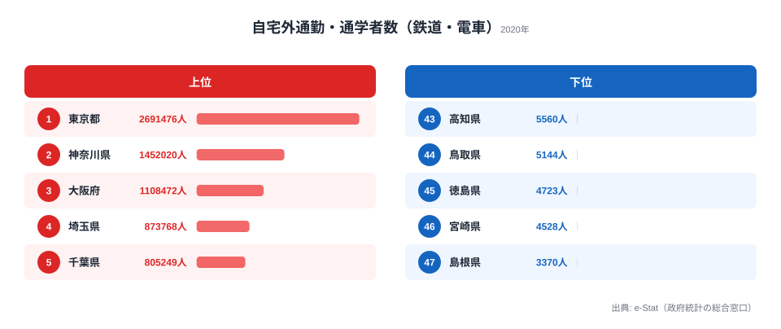

2020年国勢調査によると、自宅外で鉄道・電車を利用して通勤・通学する人の数は、1位の東京都が約269万人なのに対し、47位の島根県はわずか3,370人にとどまっています。**その差は799倍**に達します。さらに首都圏4県(東京・神奈川・埼玉・千葉)を合計すると約580万人にのぼり、世界でも類を見ない首都圏鉄道網の規模感が浮かび上がってきます。

なぜこれほど極端な差が生まれるのでしょうか。本記事では、鉄道通勤者数の都道府県格差から、日本の都市インフラと地方のマイカー社会という二極構造を読み解いていきます。結論を先に述べると、この799倍という数字は人口の多寡ではなく、**地下鉄・私鉄ネットワークの有無**という質的な断絶を映し出しています。

> [!NOTE]
> 本記事の「鉄道通勤・通学者数」は、2020年国勢調査で「自宅外で従業・通学する者」のうち、利用交通機関を「鉄道・電車」と回答した人の実数です。自宅で働く人や、徒歩・自家用車のみで移動する人は含まれません。複数の交通機関を乗り継ぐ人は主要な手段で集計されるため、バス併用の鉄道利用がやや過小に出る点に注意してください。

## 上位5県と下位5県 — 首都圏と地方の二極構造

上位は明確に首都圏と関西に集中しています。1位の東京都が約269万人で群を抜き、2位神奈川県(約145万人)、3位大阪府(約111万人)、4位埼玉県(約87万人)、5位千葉県(約81万人)と続きます。**首都圏4県(東京・神奈川・埼玉・千葉)だけで計約582万人**にのぼり、世界でも有数の鉄道通勤圏を形成しています。これらの県では、JR・私鉄・地下鉄が幾重にも重なる稠密なネットワークが整備され、都心への通勤・通学を鉄道が担う構造が定着しているためです。神奈川・埼玉・千葉のように、自県内よりも東京都心への越県通勤が鉄道利用を押し上げている点も特徴です。

一方、下位5県はいずれも鉄道通勤者数が1万人を下回ります。43位高知県5,560人、44位鳥取県5,144人、45位徳島県4,723人、46位宮崎県4,528人、そして47位島根県は3,370人と、東京都の約800分の1にとどまります。山陰(島根・鳥取)、四国(徳島・高知)、南九州(宮崎)に共通するのは、**県内に大都市圏路線や地下鉄が存在せず、JR路線も本数が少ない**という点です。これらの地域では通勤の中心がマイカーであり、鉄道は日常の足として選ばれにくい環境にあります。鉄道通勤者数の少なさは、人口規模だけでなく交通インフラの構造そのものを反映しているのです。図の青いバー(上位5県)と橙のバー(下位5県)を見比べると、両者の間には連続的な差ではなく、桁が変わるほどの断絶があることが一目でわかります。

> [!TIP]
> このランキングは「実数」のため、人口の多い都道府県が上位に来やすい指標です。読み解くときは、人口規模に対して鉄道通勤者がどれだけ多い(少ない)かという観点も合わせると理解が深まります。たとえば後述の愛知県は人口規模のわりに鉄道通勤者が控えめで、マイカー通勤の比率が高い土地柄が透けて見えます。

<source-link href="/ranking/commute-by-train">鉄道通勤者数ランキングをもっと見る</source-link>

## 中間層を分ける「都市鉄道網の密度」

上位5県の下にも、第二・第三の鉄道通勤圏が広がっています。6位兵庫県(約54万人)、7位愛知県(約51万人)を加えると、関西3府県(大阪・兵庫・京都)で計約185万人となり、首都圏に次ぐ第二の鉄道通勤圏を形成しています。JR・私鉄・地下鉄の多層ネットワークが、関西でも鉄道通勤を支えている構図です。

8位福岡県(約26万人)と9位北海道(約22万人)は、政令市である福岡市・札幌市の地下鉄とJR近郊路線が中核となり、地方ブロックでありながら20万人台の鉄道通勤者を抱えています。10位の京都府(約20万人)も、観光都市というイメージとは別に、市内の鉄道網が日常の通勤・通学を担っています。

ここで興味深いのが愛知県の位置づけです。人口規模で見れば全国上位に入る愛知が、鉄道通勤者数では7位の約51万人にとどまり、福岡(約26万人)の2倍ほどしかありません。人口で大きく上回るはずの愛知が、鉄道通勤では福岡との差を広げきれていないのです。これは、自動車産業都市らしくマイカー通勤の比率が高く、鉄道利用の上限が都市鉄道網の密度によって規定されている可能性を示しています。鉄道通勤者数は単純な人口の関数ではなく、地下鉄や私鉄をどれだけ張り巡らせているかという「都市インフラの密度」に強く左右されるのです。

> [!WARNING]
> このランキングは実数のため、最下位だからといって「その県では鉄道がまったく使われていない」という意味ではありません。山陰・四国・南九州の各県では通勤の主役がマイカーに移っており、別途公開している自動車通勤の指標ではむしろ上位に位置します。鉄道通勤者数の少なさは「鉄道が不便」というより「鉄道に頼らなくても移動できる地理・人口構造」の裏返しと読むのが正確です。

## 799倍という不連続性が意味するもの

最後に、東京と島根の799倍という数字そのものを掘り下げます。人口だけで見れば、東京(約1,400万人)と鳥取(約55万人)の差はおよそ25倍です。ところが鉄道通勤者数の格差は799倍に達し、人口比をはるかに超えています。この差を生んでいるのは、単純な人口の多寡ではありません。

決定的なのは、地下鉄や私鉄を含む都市鉄道ネットワークが整備されているかどうかという、インフラの「有無」です。ネットワークが張り巡らされた首都圏や関西では、通勤・通学のほとんどが鉄道に流れ込みます。一方、大都市圏路線を持たない地方では、そもそも鉄道に乗るという選択肢が日常の動線に入りにくい構造です。つまり799倍という格差は、人口の連続的なグラデーションではなく、鉄道インフラがある県とない県の間に横たわる**質的な断絶**を映し出しています。上位5県と下位5県の間に「中間がほとんど存在しない」という事実が、この不連続性を端的に物語っています。

## まとめ

- 2020年国勢調査の鉄道通勤・通学者数は東京都269万人がトップ、最下位の島根県3,370人と**799倍の格差**があります
- 首都圏4県(東京・神奈川・埼玉・千葉)で計約580万人と圧倒的な規模を誇り、鉄道通勤の中心になっています
- 関西3府県(大阪・兵庫・京都)で計185万人と、首都圏に次ぐ第二の鉄道通勤圏を形成しています
- 8位福岡・9位北海道は政令市の地下鉄とJRが中核で、地方ブロックでも20万人台の存在感があります
- 山陰・四国・南九州はマイカー通勤社会で、鉄道通勤者数は5,000人前後と極小にとどまっています

## データ出典

- 総務省「国勢調査」2020年(e-Stat 政府統計の総合窓口)
- 自宅外で従業・通学する者のうち、利用交通機関が「鉄道・電車」の人数を集計

---

関連する地域・カテゴリ: [運輸・観光カテゴリ](https://stats47.jp/category/tourism) / [東京都プロフィール](https://stats47.jp/areas/13000) / [流入人口比率1位東京の構造](https://stats47.jp/blog/inflow-population-ratio-prefecture-gap)
