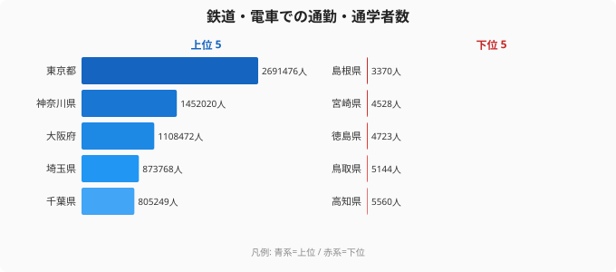
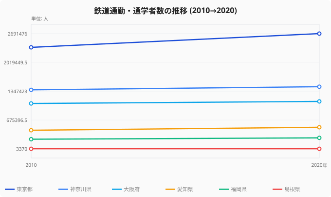

東京都と島根県の人口差は、ざっと25倍です。ところが2020年国勢調査で「鉄道・電車を使って自宅外へ通勤・通学する人」の数を比べると、その差は **799倍** にまで開きます。1位の東京都が約269万人なのに対し、47位の島根県はわずか3,370人。人口の差をはるかに超えるこの不連続は、単なる「都会と田舎」では説明がつきません。

カギを握るのは、人口でも面積でもなく **都市鉄道網の有無そのもの** です。地下鉄や私鉄が張りめぐらされた県と、JRの普通列車が1時間に1本走る県の間には、量ではなく質の断絶があります。本記事では、この799倍という開きがどこから生まれるのかを上位・下位の構造から読み解いていきます。

> [!NOTE]
> この指標は「自宅外で従業・通学する人のうち、利用交通機関が鉄道・電車の人数」です(2020年国勢調査)。同じ人がバスと鉄道を乗り継ぐ場合は複数交通機関に計上されるため、各交通手段の合計は通勤者総数より多くなります。鉄道「だけ」を使う人に限った数字ではない点に注意してください。

## 上位5県と下位5県 — 799倍が一目でわかる

まず全体像です。鉄道通勤の世界は、上位と下位でまったく別の風景になっています。

上位5県は **首都圏と関西の中核** で占められます。1位東京都が269万人で頭ひとつ抜け、2位神奈川県145万人、3位大阪府111万人、4位埼玉県87万人、5位千葉県81万人と続きます。いずれも地下鉄・JR・大手私鉄が何重にも重なる多層ネットワークを抱える地域で、鉄道がそもそも「通勤の標準手段」になっています。

対して下位5県は、43位高知県5,560人、44位鳥取県5,144人、45位徳島県4,723人、46位宮崎県4,528人、そして47位島根県3,370人。いずれも1万人を大きく下回ります。共通するのは山陰(島根・鳥取)、四国(徳島・高知)、南九州(宮崎)という、**県内に大都市圏路線も地下鉄も持たない地域** だという点です。鉄道はあっても本数が少なく、通勤の主役はマイカーに譲られています。

なぜ人口差25倍が799倍にまで膨らむのか。答えは「鉄道に乗るかどうかが、人口ではなく路線網の濃さで決まる」からです。東京の住民は通勤者の多くが鉄道を選びますが、島根の住民は鉄道という選択肢自体が日常的に成立しにくい。利用率の差と人口の差が掛け算で効くため、格差は人口比を大きく上回ります。

<source-link href="/ranking/commute-by-train">鉄道・電車通勤通学者数ランキングの全47都道府県を見る</source-link>

## 上位の三層構造 — 首都圏・関西・地方政令市

上位10県を細かく見ると、規模の異なる3つの層に分かれます。

最大の層が **首都圏4県(東京・神奈川・埼玉・千葉)** です。合計すると約582万人。これは上位10県の合計(約866万人)の67%を占め、47都道府県の合計(約978万人)で見ても **59.5%、つまり全国のほぼ6割が首都圏に集中** しています。世界でも例の少ない首都圏鉄道網の規模が、数字にそのまま表れています。1位の[東京都のプロフィール](/areas/13000)を見ると、人口集中と交通インフラの密度が他県と桁違いであることがわかります。なお、こうした県境を越えた鉄道通勤の流れは[流入人口比率1位東京の構造](/blog/inflow-population-ratio-prefecture-gap)とも重なります。

第二の層が **関西3府県(大阪・兵庫・京都)** で、合計約185万人。全国シェアは18.9%です。JR西日本・阪急・阪神・近鉄・南海・京阪に加え、大阪・京都・神戸の地下鉄が重なる多層構造が、首都圏に次ぐ鉄道通勤圏を形づくっています。

第三の層が **地方政令市を抱える県** です。8位福岡県258,055人、9位北海道222,484人が代表で、福岡市・札幌市の地下鉄とJR近郊路線が中核となり、地方ブロックでありながら20万人台を確保しています。

愛知が鉄道通勤で控えめなのは、自動車という別の通勤手段が地域に根づいているからです。実際、鉄道通勤の下位県の多くは[自動車に依存する社会構造](/blog/gasoline-car-society-map)を持ち、通勤の主役がクルマに移っています。

> [!TIP]
> 7位愛知県(505,533人)は人口で全国4位ですが、鉄道通勤では7位にとどまります。トヨタを筆頭とする自動車産業が集積する地域柄、通勤手段としてマイカーが選ばれやすい構造があります。「人口が多い＝鉄道通勤が多い」とは限らず、産業構造と路線網が順位を左右します。

## 下位グループ — マイカー社会という別の通勤文化

下位の5県は、単に人口が少ないから鉄道通勤が少ないわけではありません。

たとえば47位島根県(3,370人)と45位徳島県(4,723人)は、いずれも県庁所在地に鉄道は通っているものの、地下鉄はなく、JR路線も日中は1時間に1〜2本という地域が大半です。通勤時間帯に「電車で会社へ行く」という行動様式そのものが、生活の中に組み込まれていません。代わりに自家用車が通勤の中心を担い、駐車場付きのロードサイド型オフィスが当たり前になっています。

つまり下位県の少なさは「鉄道インフラの有無」が生む構造的なもので、人口の多寡だけでは測れません。鳥取県(5,144人)より人口の少ない県もありますが、路線網の濃さしだいで順位は前後します。最下位の[島根県のプロフィール](/areas/32000)を見ると、人口規模に対して鉄道網が限られている地域の特徴が読み取れます。鉄道通勤者数は、その地域がどんな交通インフラの上に成り立っているかを映す鏡なのです。マイカー社会では[長距離通勤とテレワークの潜在力](/blog/long-commute-telework-potential)も、鉄道圏とは異なる文脈で語られます。

> [!WARNING]
> この数字を「地方は鉄道を使わない」と単純に読むのは誤りです。あくまで通勤・通学に限った利用で、観光や買い物での鉄道利用、貨物輸送は含みません。また内陸の小規模県では母数(就業者・通学者)自体が小さいため、絶対数の比較は人口規模の影響も受けます。利用率(通勤者に占める鉄道利用の割合)で見ると、また違った順位になります。

## 10年でわかる、格差は縮まらず開いている

格差は固定されたものではありません。2010年と2020年を比べると、上位と下位で正反対の動きが起きています。

上位県は軒並み増えています。東京都は2010年の約237万人から2020年の約269万人へと **+13.5%**、愛知県は43.6万人から50.6万人へ **+15.9%**、福岡県も22.6万人から25.8万人へ **+14.2%** と伸びました。都市部への人口流入と沿線開発が、鉄道通勤者をさらに押し上げています。

一方、47位の島根県は3,675人から3,370人へと **−8.3%** 減少しました。人口減少と高齢化が進み、もともと小さい鉄道通勤の母数がさらに細っています。上位が伸び、下位が縮むのですから、799倍という格差は今後も開き続ける可能性が高いと言えます。鉄道インフラの有無が、通勤の地理を10年単位で固定化しているのです。

<source-link href="/ranking/commute-by-train">年次推移を含むランキング詳細を見る</source-link>

## まとめ

- 2020年国勢調査の鉄道・電車通勤通学者数は、1位東京都269万人・最下位島根県3,370人で **799倍** の格差
- 人口差はわずか25倍。鉄道利用率の差と人口差が掛け算で効くため、格差が人口比を大きく上回ります
- 首都圏4県(東京・神奈川・埼玉・千葉)で計約582万人、**全国の約6割** が首都圏に集中
- 関西3府県で185万人(全国の18.9%)が第二の鉄道通勤圏、福岡・北海道は地方政令市の地下鉄が中核
- 2010→2020で上位は+13〜16%伸び、島根は−8.3%減と、格差は縮まらず開いています

## データ出典

- 総務省「国勢調査」2020年・2010年(e-Stat 政府統計の総合窓口経由で整備)
- 自宅外で従業・通学する者のうち、利用交通機関が「鉄道・電車」の人数を集計
